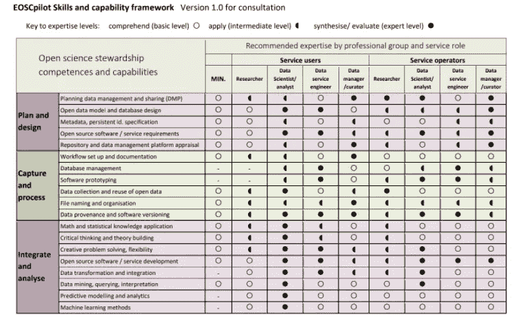

# 在欧洲，现在是成为数据科学家或数据管家的最佳时机

> 原文：<https://towardsdatascience.com/now-is-the-best-time-to-be-a-data-scientist-or-a-data-steward-in-europe-618143a80dd0?source=collection_archive---------33----------------------->

## 为什么欧盟计划培训 50 多万数据科学家和数据管理员

【Pexels.com 的 皮沙贝拍摄的照片

内容

1.  **简介**
2.  **什么是公平数据？**
3.  **在科学和研究领域，对数据科学家的期望是什么？**
4.  **数据管家是做什么的？**
5.  **两个角色如何比较和交集？**
6.  **结论**

# 介绍

2016 年，一组欧盟高级专家估计，欧洲将需要在十年内使开放科学成为可能 [**超过 50 万“核心数据专家”**](https://ec.europa.eu/research/openscience/pdf/realising_the_european_open_science_cloud_2016.pdf) 。

在他们看来，这些“核心数据专家”将在整个研究生命周期中支持 170 万研究人员和 7000 万科学技术专业人员，确保良好的数据管理，帮助数据捕获(格式、元数据、标准、出处、发布)，以及数据分析。

两年后，在 2018 年，这一想法得到了加强，并且“核心数据专家”被确定为**数据科学家和数据管家** ( [将公平变为现实最终报告](https://ec.europa.eu/info/sites/info/files/turning_fair_into_reality_1.pdf)和行动计划)，他们除了技术专业知识外，还需要拥有他们将从事的研究和创新领域的领域知识。

在研究的背景下，这两种技能组合定义如下:

*   **数据科学** — *“处理、加工和分析数据，从中得出真知灼见的能力”*；所需技能包括:计算机科学、软件开发、统计学、数据可视化、机器学习以及计算基础设施。
*   **数据管理** — *“一套确保数据在整个研究生命周期和长期保存过程中得到正确管理、共享和保存的技能”*。提到的技能的一些例子是:信息管理、数据清理、数据管理。

鉴于这些确定的需求，该报告呼吁制定新的正式或不太正式的教育和培训计划，帮助培养实现公平数据所需的大量数据科学家和数据管理员。

有趣的是，该报告还呼吁研究人员精通数据，以便他们能够更好地利用现有的数据和技术。

# 什么是公平数据？

从哲学的角度来看，公平数据的原则，以及整个开放科学运动，都与科学和研究数据一样可以被视为全球公共产品的理念有关。尤其是当它们是由公共资金资助的时候。

关于开放数据作为公共产品的更多信息，以及关于免费开放数据来源的信息可以在我之前的文章中找到:

 [## 用于社会公益的数据科学:免费开放数据的最佳来源

### 类型、优势以及在哪里可以找到它们

towardsdatascience.com](/data-science-for-social-good-best-sources-for-free-open-data-5120070caf02) 

每年，科学和其他领域产生的数据量都呈指数级增长。这为我们如何在科学中使用这些数据、制定商业决策或制定基于证据的政策带来了巨大的机遇。但在利用产生的数据方面也存在巨大挑战，比如数据的质量及其长期保存。

按照这种逻辑，我们必须能够将数据转化为知识，然后付诸行动。

那么，公平代表什么？([公平数据原则](https://www.go-fair.org/fair-principles/)

*   **可查找的** —人类和计算机都应该能够很容易地找到数据及其元数据。为此，元数据应该是机器可读的，允许自动发现数据集和服务。
*   **可访问** —数据应该带有关于如何访问的明确信息，即使这涉及认证或授权。此外，即使数据不再可用，也应该可以访问相应的元数据。
*   **可互操作** —数据需要与应用程序(如 API)或工作流互操作，以便进行分析、存储和处理。
*   **可重用** —该原则指的是 FAIR 的主要目标，即优化和促进数据的重用。为此，元数据和数据需要被很好地描述，以包括关于使用许可的信息，以及出处。

公平数据不等于开放数据。例如，从可访问性原则中可以注意到，有时它可能涉及授权或认证。

据欧盟委员会公平数据专家组主席西蒙·哈德森(Simon Hudson)称，没有“数据科学和数据管理技能的显著和广泛提高”，公平就不可能实现。在数字技能方面，欧洲并不是真正的最佳实践范例，平均 42%的人口缺乏这方面的技能。

[数字经济与社会指数 2](https://ec.europa.eu/digital-single-market/en/desi) 0 [2](https://ec.europa.eu/digital-single-market/en/desi) 0

# **在科学和研究领域，对数据科学家的期望是什么？**

与数据管家一起，数据科学家将被要求在整个研究生命周期中支持研究人员，并将被嵌入机构层面的研究项目或每个领域的专业服务中。

在许多情况下，数据科学职位由已经有研究背景或受过信息专业培训的人担任。前者尤其重要，因为数据科学家在这一领域的大部分工作都是特定学科的，需要对监管和研究有深刻的理解。

在查看了一些由研究执行组织提供的数据科学家的工作描述后，我注意到，除了与机器学习、统计学、Python、数据可视化、有时高性能计算或云计算相关的常见要求之外，一些未来的员工还应该了解与研究学科相关的软件工具，为科学期刊文章和博客撰写内容，或者参加国家和国际会议并在会上发言。在教育方面，该领域的数据科学家需要拥有天文学、物理学、统计学或计算机科学等领域的硕士或博士学位(根据研究学科的不同而不同)。

对于那些来自计算机科学或其他相关学科，而不是来自特定研究领域的人来说，一个潜在的缺点是要求至少是第一阶段的研究人员(R1)。在这种情况下，最好先成为该领域的研究人员，然后再学习数据科学技能。然而，并非在所有情况下都是如此。

另一方面，在研究执行组织中担任数据科学家的一个优势可能是，它可能会对社会影响做出贡献。例如，该领域的一些工作需要将数据科学应用于社会技术主题，如流行病、假新闻、公民参与或可再生能源。

 [## 造福社会的数据科学

### 超越我们想看什么类型的电影，到我们想生活在什么类型的世界。资源、示例和…

towardsdatascience.com](/data-science-for-social-good-a88838bc8ed0) 

# **数据管家是做什么的？**

**在业务领域**，数据管理与提高数据质量、处理敏感和机密数据、数据清理、定义政策和监控系统、定义标准、添加元数据以及数据生命周期中的整个数据管理流程(从监管到废弃)相关联。

[数据仓库信息图](https://www.data-vault.co.uk/what-is-data-stewardship-infographic/)

[Adobe](https://www.data-vault.co.uk/what-is-data-stewardship-infographic/) 的数据治理角色

在 Adobe，数据管理员特别负责解释法规、任何合同限制和政策，并将其应用于数据。因此，他们的职责包括:创建数据策略并将其应用于数据集；审查数据、数据集和数据样本，以应用和管理元数据使用标记等。

从 Adobe 的例子和其他例子中我们可以看出，在某些情况下，数据管理更多地与数据策略和处理敏感和机密数据相关。接下来我们将会看到，在欧洲开放科学的背景下，数据管理是如何围绕实施公平原则展开的。

**在研究**的背景下，数据管理员可以负责数据清理、消除不一致、组织和构建数据、处理元数据、确保数据的可重用性、可访问性和长期保存(即使在技术发生变化时)，以及其他数据管理操作。根据他们的经验和专业水平，在某些情况下，数据管理员可能还需要处理定义标准、最佳实践和互操作性框架。

然而，无论是公共部门还是私营部门，数据管理不仅仅是数据管理，因为它还包括数据收集或捕获、处理、长期保存及其再利用。

在代尔夫特理工大学 关于 [**数据管理的演示中，提到数据管理人员应该能够回答特定研究领域中所有与数据相关的问题。一些问题可能涉及数据存储、数据恢复和备份、如何处理机密和敏感数据、在申请专利的情况下共享数据、帮助制定数据管理计划和跟踪数据、确保数据的长期保存。**](https://www.youtube.com/watch?v=WmG3ItcIaSE&ab_channel=DataStewardshipTUDelft)

此外，在代尔夫特大学，数据管理员的工作规范包括数据管理员预期工作的研究领域的核心要求知识。

数据管理员与工作相关的职责示例(摘自 [EURAXESS](https://euraxess.ec.europa.eu/jobs/search?keywords=Data%20Steward) )包括:在整个研究生命周期中支持研究人员和管理人员，开发研究数据管理工作流程和最佳实践，研究项目的数据管理规划，研究数据监管，为研究人员开发和举办培训和研讨会，数据管理，确保数据有效性、保护和安全性，确保符合有关格式、元数据的国际标准，监控数据管理，维护词汇表，实施公平数据原则，开发特定领域的词汇、本体和元数据模式，参与研究活动和编写出版物。

# 这两个角色是如何相互比较和交叉的？

**2020 年美国平均年薪**:

*   数据管家—**$**67982([Payscale.com](https://www.payscale.com/research/US/Job=Data_Steward/Salary))
*   数据科学家—**$**96101([Payscale.com](https://www.payscale.com/research/US/Job=Data_Scientist/Salary))

**热门技能**(按此顺序，在 Payscale.com 上):

*   数据管家:数据分析、数据管理、数据质量、Microsoft Excel、SQL
*   数据科学家:机器学习，Python，数据分析，统计分析，R

**欧洲研究人员专用平台**[**EURAXESS**](https://euraxess.ec.europa.eu/)上的工作列表数量:

*   数据管家:只有 3 个，在荷兰、德国和卢森堡
*   数据科学家:488 人，但这个数字并不完全准确，因为这个名单还包括其他类型的工作，比如 UI/UX 设计师、软件开发员

当谈到研究执行组织的工作职责时，两者在一定程度上是重叠的。数据科学家角色还包括与数据管理或处理公平数据原则相关的任务。

[将公平变为现实报告](https://ec.europa.eu/info/sites/info/files/turning_fair_into_reality_1.pdf)的作者认为，数据科学和数据管理通常可以在同一个人身上结合，但最好是在这两个领域推动更大的专业化。在某些情况下，这可能取决于可用的预算和研究机构的数据导向程度。对于许多这样的组织来说，在这方面可能很难有两种不同的立场。

下面是一个与[欧洲开放科学云](https://www.eosc-portal.eu/)相关的试点项目如何详细描述数据管理技能和能力框架的示例。在这种情况下，数据科学是更大的数据管理概念的一部分。整个框架请见[报告](https://drive.google.com/file/d/1QjKsjcpi2JqznWTzSDCGK1viD7u52tuh/view)。

[EOSC 飞行员技能和能力框架](https://drive.google.com/file/d/1QjKsjcpi2JqznWTzSDCGK1viD7u52tuh/view)

其他定义数据科学和数据管理的欧洲计划可在以下页面查阅:

*   [爱迪生计划](https://edison-project.eu/) —数据科学专业的加速和创造
*   数字策展的课程框架

# 结论

鉴于目前数据管事没有太多的职位空缺，这似乎可能不是最好的职业。然而，空缺数量少也可能是因为该角色有时被整合在数据科学家的角色中，因为后者还涉及处理研究数据管理和数据的公平原则(至少在欧洲)。

当这两个角色分开时，数据管家对于数据的重用可能是极其重要的，即使它与私有或公共部门有关。数据具有更大的价值，当它可以被重用和构建时，可以产生更好的结果和影响。为了完成他们的工作，数据科学家需要获得良好、可靠的数据，并且，随着时间的推移，数据管理员可以在这方面提供帮助。

数据管理可以解决数据科学中的垃圾入、垃圾出(GIGO)问题。如果你一开始就没有高质量的数据，那么一个数据科学家再好也没用。正如我的一个朋友曾经说过的，我们需要**从如何和收集什么类型的数据开始，然后转移到处理和从中提取洞察力**。

无论如何，欧洲对数据专家的需求很高，预计还会增加，因为欧盟机构希望在创新和技术竞赛中赶上美国和中国。如果不拥抱新技术，不在人力资源方面加强竞争，这是不可能的。

如果您希望尝试开放的研究数据集，请查看以下存储库:

 [## 芝诺多——研究。分享。

### 2020 年 8 月 12 日(1.0 版)数据集开放存取 Bardi，Alessia 库奇马、伊里纳；波波罗夫、叶夫根尼；伊万娜·特鲁科洛；蒙泰罗…

zenodo.org](https://zenodo.org/)  [## 领域知识在数据科学中到底有多重要？

### 看看来自美国的招聘信息，不仅仅是。

towardsdatascience.com](/how-important-domain-knowledge-really-is-in-data-science-19d833d98698)