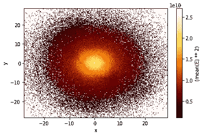
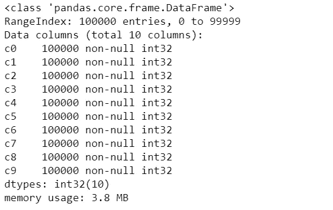
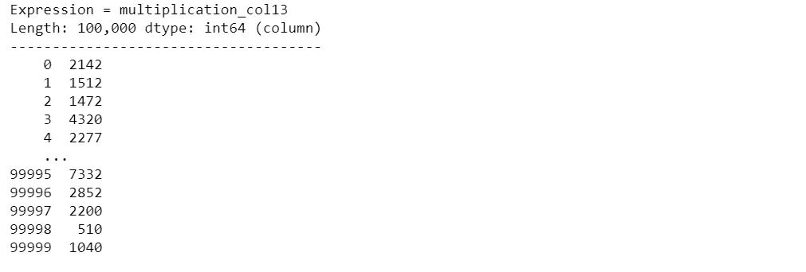

# 现在，使用惰性计算在一秒钟内加载巨大的数据集😴用 Python？

> 原文：<https://towardsdatascience.com/now-load-huge-datasets-within-a-second-using-lazy-computation-in-python-2698bdb02250?source=collection_archive---------51----------------------->

## 厌倦了用 pandas 加载数据集…了解 Vaex 如何通过 Python 实现在几秒钟内加载大量数据。



来源:https://vaex.readthedocs.io/en/latest/tutorial.html

本文简要介绍了如何使用 Vaex 将大数据集加载到 Python 内核中，并给出了实际的实现。让我们开始吧。在深入真正的实现之前，让我们了解一下什么是 Vaex。

## Vaex 是什么？

1.  Vaex 是一个高性能的 Python 库，用于懒惰的核外数据帧(类似于 Pandas)，以可视化和探索大型表格数据集。
2.  它在一个 n 维网格上每秒计算超过 10 亿(10⁹)个样本/行的统计数据，如平均值、总和、计数、标准偏差等。
3.  可视化是使用直方图、密度图和 3d 体绘制完成的，允许对大数据进行交互式探索。Vaex 使用内存映射、零内存复制策略和惰性计算来获得最佳性能(不浪费内存)。

看完这篇文章，我建议你去这里 看看 Vaex[T3 的文档](https://vaex.readthedocs.io/en/latest/)

## 下载和安装包

第一步是使用任何包管理器如 **pip** 或 **conda** 下载并安装 **vaex** 库。

```
pip install vaex
```

或者

```
conda install -c conda-forge vaex
```

> 记得用“！”如果您直接将它输入到 iPython 环境中，请在命令之前。

## 导入包

现在，我们需要使用下面的命令将这个库导入到我们的工作环境中。我们将导入 **pandas** 来计算两个库的执行时间。

```
import vaex
import pandas as pd
```

## 资料组

现在，在本演示中，让我们创建一个包含 100 万行 100 列的大型数据集，这确实是一个大型数据集。

```
n_rows = 100000
n_cols = 10
df = pd.DataFrame(np.random.randint(0, 100, size=(n_rows, n_cols)), columns=['c**%d**' % i **for** i **in** range(n_cols)]) 
```

现在，让我们检查一些关于加载的数据集的信息。

```
df.info(memory_usage='deep')
```



## 创造。csv 文件

我们将把上面创建的演示数据帧保存为**的形式。csv** 文件实现加载。

```
file_path = 'main_dataset.csv'
df.to_csv(file_path, index=**False**)
```

## 创建 Hdf5 文件

我们需要以 **hdf5** 格式存储数据集，作为 vaex 负载的输入。

> 请注意，所有这些过程只是为了创建演示数据集，用于演示目的，在实际项目中，我们会有一些数据，而实现基于 vaex 的数据加载只是一行代码。

```
vaex_df = vaex.from_csv(file_path, 
                        convert=**True**, 
                        chunk_size=5_000_000)
```

在检查我们得到的这个数据帧的类型时，

```
type(vaex_df)
```


## 使用 Vaex 库读取 Hdf5 文件

现在，我们终于到了演示中最重要的一步，所以请注意。使用 Vaex 加载 Hdf5 格式的数据集。

```
vaex_df = vaex.open('main_dataset.csv.hdf5')
vaex_df.head()
```


## 表达系统

现在让我们看看 Vaex 的计算速度有多快。我们实现了两列的乘法，并将它们存储在数据帧中的一个新列中，并估计了这个过程所花费的时间。结果可以忽略不计。

```
%%time
vaex_df['multiplication_col13']=vaex_df.c1*vaex_df.c3
```

看到这一列中的内容，我们得到一个 vaex 定义的表达式**类似于熊猫数据框中的一列。**

```
vaex_df['multiplication_col13']
```



## 核外数据帧

坚持 Vaex 开发背后的主要概念，我们需要记住以下注意事项，

> "筛选和计算表达式不会因为复制而浪费内存；数据在磁盘上保持不变，仅在需要时进行流式传输。在需要集群之前延迟时间。”

比如…

```
vaex_df[vaex_df.c2>70]
```

> 所有的算法都在内核之外工作，极限是你的硬盘驱动器的大小

比如…

```
dff.c2.minmax(progress='widget')
```

> Vaex 实现了并行、高性能的 groupby 操作，尤其是在使用类别(> 10 亿/秒)时。

实现为…

```
%%time
vaex_df_group = vaex_df.groupby(vaex_df.c1,
                                agg = vaex.agg.mean(vaex_df.c4))
vaex_df_group
```


```
%%time
vaex_df.groupby(vaex_df.c1,agg='count')
```


## 参考

【https://vaex.readthedocs.io/en/latest 号

关于这次演示的完整代码，请从我的 [Github](https://github.com/blurred-machine) 中获取 [Jupyter 笔记本](https://github.com/blurred-machine/Data-Science/blob/master/VAEX%20Implementation/Vaex%20Implementation.ipynb)。

**谢谢！**