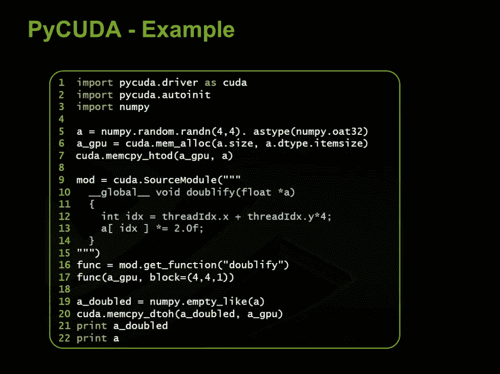
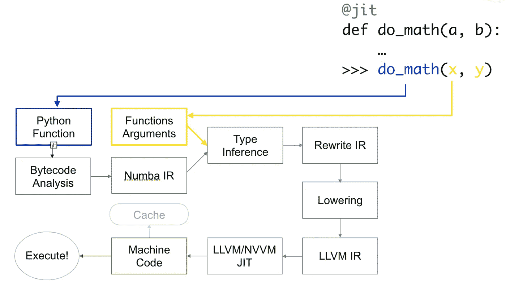
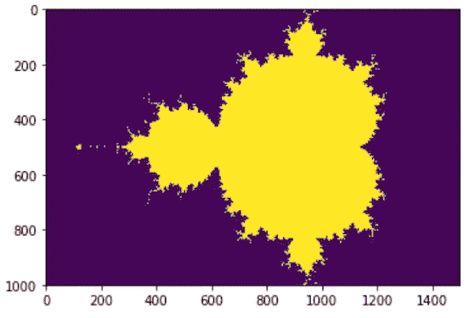

# Numba:“大规模优化的武器”

> 原文：<https://towardsdatascience.com/numba-weapon-of-mass-optimization-43cdeb76c7da?source=collection_archive---------9----------------------->

## Numba 如何节省您的时间并加速您的代码


Numba 是一个 Python 编译器，专门针对数字函数，允许您使用直接用 Python 编写的高性能函数来加速应用程序。

Numba 使用 LLVM 生成从纯 Python 代码优化的机器码。通过几处简单的修改，我们的 Python 代码(面向函数的)可以“实时”优化，获得类似于 C、C++的性能，而不必改变语言。

你可以在我的 [GitHub](https://github.com/alejandrods/Numba) 中找到完整的代码！:)

# 索引

1.  什么是 Numba？
2.  第一步:为 CPU 编译
3.  GPU 的 Numba
4.  结论

# 什么是 Numba？

Numba 是一个编译器，允许您为 CPU 和 GPU 加速 Python 代码(数值函数):

1.  ***函数编译器:*** Numba 编译 Python 函数，而不是整个应用或部分应用。基本上，Numba 是另一个提高函数性能的 Python 模块。
2.  ***Just-in-time:*** (动态翻译)Numba 将字节码(比机器码更抽象的中间代码)在其执行前立即翻译成机器码，以提高执行速度。
3.  ***数值型:*** Numba 关注的是数值型数据，比如`int`、`float`、`complex`。目前，对字符串数据使用它有一些限制。

Numba 不是 CUDA 唯一的编程方式，通常是直接用 C/C ++为它编程。但是 Numba 允许你直接用 Python 编程，并对 CPU 和 GPU 进行优化，只需对我们的代码做很少的修改。关于 Python，还有其他替代方案，如 pyCUDA，下面是它们之间的比较:

**CUDA C/C++:**

1.  这是 CUDA 中最常见和最灵活的编程方式
2.  加速 C、C ++中的应用程序。

**pyCUDA**

1.  这是 Python 最有效的 CUDA 形式
2.  它需要用我们的 Python 代码进行 C 编程，一般来说，还需要许多代码修改。



PyCUDA 示例

**数字巴**

1.  效率不如 pyCUDA
2.  它允许您用 Python 编写代码，并通过少量修改对其进行优化
3.  它还为 CPU 优化了 Python 代码

# 目标

本次会谈的目标如下:

*   使用 Numba 在 CPU 上编译函数
*   了解 Numba 是如何工作的
*   在 GPU 中加速 Numpy ufuncs
*   使用 Numba 编写内核*(下一个教程)*

# 第一步:为 CPU 编译

Numba 除了能够加速 GPU 中的函数之外，还可以用来优化 CPU 中的函数。为此，使用了 Python decorators(函数修饰符)。

首先我们要开始评估函数`hypot`来试试 Numba 是怎么工作的。我们需要在函数中使用装饰器`@jit`。

```
>>> # Numba function
>>> hypot(3.0, 4.0)
**5.0**>>> # Python function
>>> hypot.py_func(3.0, 4.0)
**5.0**
```

Numba 中的结果与 Python 函数中的结果相同，因为 Numba 将函数的原始实现保存在`.py_func`中。

## 标杆管理

自然，测量我们代码的性能，检查 Numba 是否真的工作良好，并观察 Python 实现和 Numba 实现之间的差异是很重要的。此外，库`math`已经包含了`hypot`函数，我们也可以对其进行评估。

```
>>> # Python function
>>> %timeit hypot.py_func(3.0, 4.0)**The slowest run took 17.62 times longer than the fastest. This could mean that an intermediate result is being cached. 1000000 loops, best of 3: 260 ns per loop**>>> # Numba function
>>> %timeit hypot(3.0, 4.0)**The slowest run took 33.89 times longer than the fastest. This could mean that an intermediate result is being cached. 1000000 loops, best of 3: 216 ns per loop**>>> # math function
>>> %timeit math.hypot(3.0, 4.0)**The slowest run took 105.55 times longer than the fastest. This could mean that an intermediate result is being cached. 10000000 loops, best of 3: 133 ns per loop**
```

**`math.hypot`**功能甚至比 Numba 还快！！**这是因为 Numba 为每个函数调用引入了一定的开销，这比 Python 函数调用的开销要大，非常快的函数(就像上一个)会受此影响。**

**(但是，如果从另一个函数调用 Numba 函数，开销很小，如果编译器将该函数集成到另一个函数中，开销有时甚至为零。总之用 Numba 检查一下功能是不是真的在加速)。**

 **[## 1.14.性能提示-Numba 0 . 48 . 0 . dev 0+134 . g 709967 b-py 3.7-Linux-x86 _ 64 . egg 文档

### 这是一个简短的指南，介绍 Numba 中的一些特性，这些特性有助于从代码中获得最佳性能。二…

numba.pydata.org](https://numba.pydata.org/numba-doc/dev/user/performance-tips.html#performance-tips)** 

## **Numba 是如何工作的？**

**当我们初始化`hypot`函数时:**

****

**Numba 如何工作**

*   **中间表示法**
*   ****字节码分析**中间代码比机器码更抽象**
*   **LLVM 低级虚拟机，开发编译器的基础设施**
*   **NVVM 是一个基于 LLVM 的 IR 编译器，它被设计用来表示 GPU 内核**

**python 的每一行前面都有几行 Numba IR 代码。最有用的是查看向我们展示 Numba 如何处理变量的类型注释，例如，在“pyobject”中，它表明 Numba 不知道`np.sin`函数，他应该从 Python 中调用它。我们可以使用`.inspect_types()`检查`hypot`的过程。**

```
>>> @jit
>>> def foo_np(x):
>>>     return np.sin(x)>>> foo_np(2)
>>> foo_np.inspect_types()**foo_np (int64,)
----------------------------
# File: <ipython-input-18-02574ac7ba04> 
# --- LINE 1 ---  
# label 0** **@jit** **# --- LINE 2 ---   
def foo_np(x):    
# --- LINE 3 ---    
#   x = arg(0, name=x)  :: int64   
#   $0.1 = global(np: <module 'numpy' from '/usr/local/lib/python3.6/dist-packages/numpy/__init__.py'>)  :: Module(<module 'numpy' from '/usr/local/lib/python3.6/dist-packages/numpy/__init__.py'>)  

#   $0.2 = getattr(value=$0.1, attr=sin)  :: Function(<ufunc 'sin'>)   #   del $0.1   
#   $0.4 = call $0.2(x, func=$0.2, args=[Var(x, <ipython-input-18-02574ac7ba04> (3))], kws=(), vararg=None)  :: (int64,) -> float64** **#   del x   
#   del $0.2   
#   $0.5 = cast(value=$0.4)  :: float64   
#   del $0.4   
#   return $0.5    return np.sin(x)   ==============================================**
```

## **示例:创建分形**

**我们将使用 **Mandelbrot 集合**来测量创建分形的性能，我们将看到 Numba 如何帮助我们提高性能。**

```
**1 loop, best of 3: 4.62 s per loop
<matplotlib.image.AxesImage at 0x7f986ce23780>**
```

****

**使用 Mandelbrot 集合生成一个分形大约需要 **4.62 秒**，现在我们将使用 Numba 来提高性能，我们只需添加`@jit`装饰器。**

```
**The slowest run took 4.17 times longer than the fastest. This could mean that an intermediate result is being cached. 1 loop, best of 3: 52.4 ms per loop**
```

**我们可以观察到我们是如何实现将构建分形的时间从 **4.62 秒减少到 52.4 毫秒…** 并且这是通过**添加装饰器实现的！！****

## **一些常见错误**

**我们说过 Numba **只对数字函数**有效，虽然 Numba 可以编译和运行任何 Python 代码，但是有些类型的数据它还不能编译(比如字典)，而且编译它们也没有意义。**

```
>>> @jit
>>> def dictionary(dict_test):
>>>    return dict_test['house']dictionary({'house': 2, 'car': 35})
**2**
```

****但它并没有失败！！**我们说过 Numba 不编译字典…这里的重点是 Numba 创建了两个函数，一个用 Python，另一个用 Numba。这里我们看到的是 python 解决方案，我们可以通过做`nopython = True`来验证这一点。**

> **`*jit(nopython = True)*`相当于`njit`**

```
>>> @jit(nopython = True)
>>> def dictionary(dict_test):
>>>    return dict_test['house']dictionary({'house': 2, 'car': 35})**-----------------------------------------
TypingError                Traceback (most recent call last)****<ipython-input-31-14d1c8683c01> in <module>()
      3   return dict_test['house']
      4 
----> 5 dictionary({'house': 245, 'car': 350})2 frames****/usr/local/lib/python3.6/dist-packages/numba/six.py in reraise(tp, value, tb)
    656             value = tp()
    657         if value.__traceback__ is not tb:
--> 658             raise value.with_traceback(tb)
    659         raise value
    660****TypingError: Failed in nopython mode pipeline (step: nopython frontend)
Internal error at <numba.typeinfer.ArgConstraint object at 0x7f986c1bed68>:
--%<-----------------------------------------**
```

# **GPU 的 Numba**

**使用 Numba 在 GPU 中编程有两种方式:**

****1。** ufuncs/gufuncs__**

****2。** CUDA Python 内核*(下一个教程)***

## **函数 ufunc**

****GPU 的主要设计特性之一是并行处理数据的能力**，因此 numpy (ufunc)的通用函数是在 GPU 编程中实现它们的理想候选。**

*****注*** : ufunc 是对 numpy 数组的每个元素执行相同操作的函数。例如:**

## **实践:为 GPU 创建函数**

**正如我们之前说过的，ufunc 函数是将它们与 GPU 一起使用的理想选择，因为它们具有并行性。因此，Numba 有能力在不使用 c 的情况下创建编译的 ufunc 函数，要做到这一点，我们必须使用 decorator `@vectorize`。**

**让我们从一个使用`@vectorize`编译和优化 CPU ufunc 的例子开始。**

```
**array([ 24, 343,  15,   9])**
```

**我们将在 GPU 中使用 CUDA，而不是使用 CPU 来编译和执行前面的函数，为此我们必须使用“目标属性”。我们将指出每个变量的类型(参数和返回值)。**

**`return_value_type(argument1_value_type, argument2_value_type, ...)`**

**为此，我们将使用前面的函数，该函数需要 2 个 int64 值并返回另一个 int64 值。我们将指定`target = 'cuda'`能够在 GPU 中执行它。**

```
**array([ 24, 343,  15,   9])**
```

**我们可以检查它在 CPU 或 GPU 上运行的速度:**

```
>>> %timeit np.add(a, b)   # Numpy en CPU**The slowest run took 38.66 times longer than the fastest. This could mean that an intermediate result is being cached. 1000000 loops, best of 3: 511 ns per loop**>>> %timeit add_ufunc_gpu(a, b)   # Numpy en GPU**The slowest run took 4.01 times longer than the fastest. This could mean that an intermediate result is being cached. 1000 loops, best of 3: 755 µs per loop**
```

****GPU 比 CPU 慢！！！安静，这有一个解释…但是首先让我们看看当我们调用那个函数时会发生什么…****

**当我们执行这个函数时，Numba 产生:**

1.  *****编译 CUDA 内核，对输入数组*** 的所有元素并行执行 ufunc 函数**
2.  *****将输入和输出分配给 GPU 内存*****
3.  *****将输入复制到 GPU*****
4.  *****运行 CUDA 内核*****
5.  *****将结果从 GPU 复制回 CPU*****
6.  *****以 numpy 数组的形式返回结果*****

**与 C 中的实现相比，Numba 允许您以更简洁的方式执行这些类型的任务。**

****为什么 GPU 比 CPU 慢？****

*   **我们的输入太小:GPU 使用并行性一次对数千个值进行操作来实现更好的性能。我们的输入是 4 或 64 维，我们需要更大的阵列来保持 GPU 被占用。**
*   **非常简单的计算:与调用 CPU 函数相比，将计算结果发送到 GPU 需要很多“努力”。如果我们的函数不需要过多的数学计算(这通常被称为*算术强度*)，那么 GPU 可能会比 CPU 花费更长的时间。**
*   **Numba 将数据复制到 GPU。**
*   **我们输入的变量类型比需要的大:我们的例子使用 int64，我们可能不需要它们。实际上，在 CPU 中，32 位和 64 位具有相同的计算速度，但在 GPU 中，64 位的计算速度略有增加(它可以分别比 32 位慢 24 倍)。因此，在 GPU 中执行函数时，记住这一点非常重要。**

****考虑到这一点，我们将尝试应用前面几点学到的东西，看看在 GPU 上运行是否真的比 CPU 快。**我们将计算一个密度函数，对于较大的数组，这是一个稍微复杂一点的操作。**

**给定平均值和 sigma，让我们计算`x`中高斯密度函数的值:**

```
>>> %timeit norm_pdf.pdf(x, loc=mean, scale=sigma)  # CPU function
**10 loops, best of 3: 60.8 ms per loop**>>> %timeit gaussian_dens_gpu(x, mean, sigma) # GPU function
**100 loops, best of 3: 6.88 ms per loop**
```

# **耶啊！**

**我们甚至可以使用 Numba 定义在 CPU 中执行的函数。**

```
>>> %timeit gaussian_dens_cpu(x, mean, sigma) # CPU
**10 loops, best of 3: 23.6 ms per loop**
```

**它甚至比用 Python 编写的函数还要快，但比在 GPU 中执行的函数要慢。**

**不幸的是，有几个函数不在 ufunc 的定义范围内，因此，为了在 GPU 中执行不满足该要求的函数，我们使用`cuda.jit`。我们可以使用运行在 GPU 上的“设备功能”。**

*****注*** :“设备函数”是只能从内核或另一个“设备”函数调用的函数。**

```
>>> %timeit polar_distance(rho1, theta1, rho2, theta2)
**The slowest run took 23.16 times longer than the fastest. This could mean that an intermediate result is being cached. 1 loop, best of 3: 10.2 ms per loop**
```

# **结论**

**总而言之，Numba 是一个 Python 编译器，专门针对数值函数，允许您使用直接用 Python 编写的高性能函数来加速应用程序。**

**它是一个稳定的工具，允许您优化面向数组操作的代码。感谢它的易用性**(只是一个装修工！！)**为我们提供了一个非常强大的工具来提高我们代码的性能。**

**欢迎建议和评论。关注我，感谢你的阅读！:)**