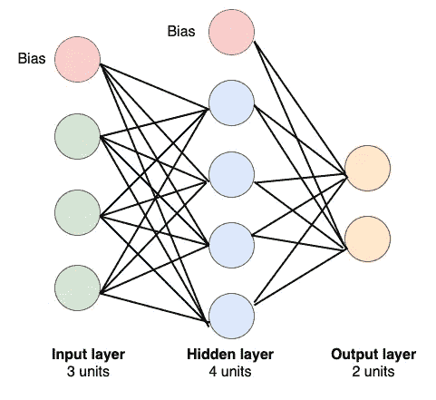
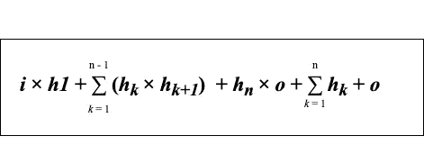

# 前馈神经网络中的参数数量

> 原文：<https://towardsdatascience.com/number-of-parameters-in-a-feed-forward-neural-network-4e4e33a53655?source=collection_archive---------3----------------------->

## 手动计算前馈神经网络中可训练参数的总数

今天，机器学习正在解决如此大量的复杂问题，看起来就像魔术一样。但是机器学习没有任何魔力，相反它有很强的数学和统计基础。

在试图理解机器学习的重要且有些困难的概念时，我们有时甚至不会考虑一些琐碎的概念。也许你会想到这些，但是我知道我经常忽略很多简单的事情。原因是令人惊叹的机器学习和深度学习库，它们具有为我们快速做到这一点的功能和方法。😍

一个这样的小问题是手动找出前馈神经网络中可训练参数的总数。我在一次考试中遇到的一个问题，它让我对所提供的选项感到困惑。这个问题也被很多机器学习的从业者在很多不同的论坛上问过。🙋🏻

照片由[普里西拉](https://unsplash.com/@priscilladupreez)在 [Unsplash](https://unsplash.com/photos/vDzeKnPBPLM) 上拍摄

*本帖讨论的问题是:*

# 如何求一个前馈神经网络中可训练参数的总数？

你一定想知道为什么这是一个需要讨论的重要问题。的确是！训练一个模型所需的时间取决于要训练的参数的数量，因此这些知识有时真的可以帮助我们。

通过查看一个简单的网络，您可以很容易地计算并说出参数的数量。最坏的情况，你可以画出图，说出参数个数。但是当你遇到一个问题，一个神经网络有 7 层，每层的神经元数量不同，比如说 8，10，12，15，15，12，6，会怎么样呢？你怎么知道总共有多少个参数？

让我们一起找到一个数学公式来得到计数。但是在开始计算之前，让我们先了解一下什么是前馈神经网络，它具有什么特征。这将帮助我们找到参数的总数。

> **前馈神经网络是最简单的人工神经网络，其中感知机之间的连接不形成循环。**

尽管是最简单的神经网络，但它们对机器学习实践者来说极其重要，因为它们构成了当今使用的许多重要和高级应用的基础。🤘

前馈神经网络的特性；

1.  感知器是分层排列的。第一层接收输入，最后一层给出输出。中间层被称为隐藏层，因为它们对外部世界是隐藏的。
2.  一层中的每个感知器都连接到下一层的每个感知器。这就是信息不断从一层流向下一层的原因，因此得名前馈神经网络。
3.  同一层的感知器之间没有联系。
4.  从当前层到前一层没有向后连接(称为反馈连接)。

***注:*** *感知器是计算输入值加权和的神经网络的基本单元。*

数学上，前馈神经网络定义了映射**y = f(x；θ)** 并学习有助于找到最佳函数近似的参数 ***θ*** 的值。

***注:*** *前馈神经网络中除输出层外的所有层中也有一个偏置单元。通过将激活功能向左或向右移动，偏差对成功学习非常有帮助。迷茫？*🤔*简单来说，bias 类似于直线的线性方程 y = mx + c 中的截距(常数)，有助于预测线更好地拟合数据，而不是一条总是经过原点(0，0)的线(y = mx 的情况)。*

现在让我们利用这一知识来找出参数的个数。

***场景一:*** 一个只有一个隐层的前馈神经网络。输入层、隐藏层和输出层中的单元数分别为 3、4 和 2。

一个前馈神经网络(图片由作者提供)

**假设:**

***i*** =输入层的神经元数量

***h*** =隐含层神经元的数量

***o*** =输出层神经元数

从图中，我们有 *i* = 3， *h* = 4， *o* = 2。请注意，红色神经元是该层的偏差。一层的每一个偏置都连接到下一层除了下一层偏置以外的所有神经元。

数学上:

1.  第一层和第二层的连接数:3 × 4 = 12，无非是 *i* 和 *h* 的乘积。
2.  第二层和第三层的连接数:4 × 2 = 8，无非是 *h* 和 *o* 的乘积。
3.  层与层之间也有通过偏置的连接。第一层的 bias 和第二层的神经元之间的连接数(第二层的 bias 除外):1 × 4，无非就是 *h* 。
4.  第二层偏置与第三层神经元的连接个数:1 × 2，无非是 *o* 。

总结所有:

3 × 4 + 4 × 2 + 1 × 4 + 1 × 2

= 12 + 8 + 4 + 2

= 26

因此，这个前馈神经网络总共有 26 个连接，因此将有 26 个可训练参数。

让我们试着用这个等式来概括，找出一个公式。

3 × 4 + 4 × 2 + 1 × 4 + 1 × 2

= 3 × 4 + 4 × 2 + 4 + 2

=*I*×*h*+*h*×*o*+*h*+*o*

**因此，具有一个隐藏层的前馈神经网络中的参数总数由下式给出:**

**(*I*×*h*+*h*×*o*)*+*h*+*o****

*由于该网络是一个小型网络，因此也可以通过计算图中的连接数来得出总数。但是，如果层数更多呢？让我们再研究一个场景，看看这个公式是否有效，或者我们需要对它进行扩展。*

****场景一:*** 一个具有三个隐层的前馈神经网络。输入层、第一隐藏层、第二隐藏层、第三隐藏层和输出层中的单元数分别为 3、5、6、4 和 2。*

***假设:***

****i*** =输入层的神经元数*

****h1*** =第一个隐藏层的神经元数量*

****h2*** =第二个隐藏层的神经元数量*

****h3*** =第三隐藏层的神经元数量*

****o*** =输出层的神经元数量*

1.  *第一层和第二层的连接数:3 × 5 = 15，无非是 *i* 和 *h1* 的乘积。*
2.  *第二层和第三层的连接数:5 × 6 = 30，无非是 *h1* 和 *h2* 的乘积。*
3.  *第三层和第四层的连接数:6 × 4 = 24，无非是 *h2* 和 h3 的乘积。*
4.  *第四层和第五层的连接数:4 × 2= 8，无非是 *h3* 和 *o* 的乘积。*
5.  *第一层的 bias 和第二层的神经元(第二层的 bias 除外)的连接个数:1 × 5 = 5，无非就是 *h1* 。*
6.  *第二层偏置与第三层神经元的连接个数:1 × 6 = 6，无非是 *h2* 。*
7.  *第三层偏置与第四层神经元的连接个数:1 × 4 = 4，无非是 *h3* 。*
8.  *第四层偏置与第五层神经元的连接个数:1 × 2 = 2，无非是 *o* 。*

*总结所有:*

*3 × 5 + 5 × 6 + 6 × 4 + 4 × 2 + 1 × 5 + 1 × 6 + 1 × 4 + 1 × 2*

*= 15 + 30 + 24 + 8 + 5 + 6 + 4 + 2*

*= 94*

*因此，这个前馈神经网络总共有 94 个连接，因此有 94 个可训练参数。*

*让我们试着用这个等式来概括，找出一个公式。*

*3 × 5 + 5 × 6 + 6 × 4 + 4 × 2 + 1 × 5 + 1 × 6 + 1 × 4 + 1 × 2*

*= 3 × 5 + 5 × 6 + 6 × 4 + 4 × 2 + 5 + 6 + 4 + 2*

**= I*×*h1*+*h1*×*H2+H2*×*H3*+*H3*×*o*+*h1+H2+H3*+*o**

***因此，具有三个隐藏层的前馈神经网络中的参数总数由下式给出:***

***(*I*×*h1*+*h1*×*H2+H2*×*H3*+*H3*×*o*+*h1+H2+H3*+*o****

## *T 因此，找到具有 *n* 个隐藏层的前馈神经网络中可训练参数总数的公式由下式给出:*

**

*计算前馈神经网络中参数总数的公式(图片由作者提供)*

*如果这个公式听起来有点让人不知所措😳，别担心，没必要背这个公式🙅。请记住，为了找到参数的总数，我们需要总结以下内容:*

1.  *输入层和第一个隐藏层中神经元数量的乘积*
2.  *两个连续隐藏层之间神经元数量的乘积之和*
3.  *最后一个隐藏层和输出层中神经元数量的乘积*
4.  *所有隐藏层和输出层中神经元数量的总和*

*现在，我希望你可以应用这种方法，即使不使用库，也可以找到具有任意数量的隐藏层和神经元的前馈神经网络中的参数总数。🙃*

***参考:***

*[https://cs . Stanford . edu/people/eroberts/courses/soco/projects/neural-networks/Architecture/前馈. html](https://cs.stanford.edu/people/eroberts/courses/soco/projects/neural-networks/Architecture/feedforward.html)*

*谢谢大家！如果你对这篇文章有任何反馈或建议，请留下你的评论！*

*[领英](https://www.linkedin.com/in/chetna-khanna/)*