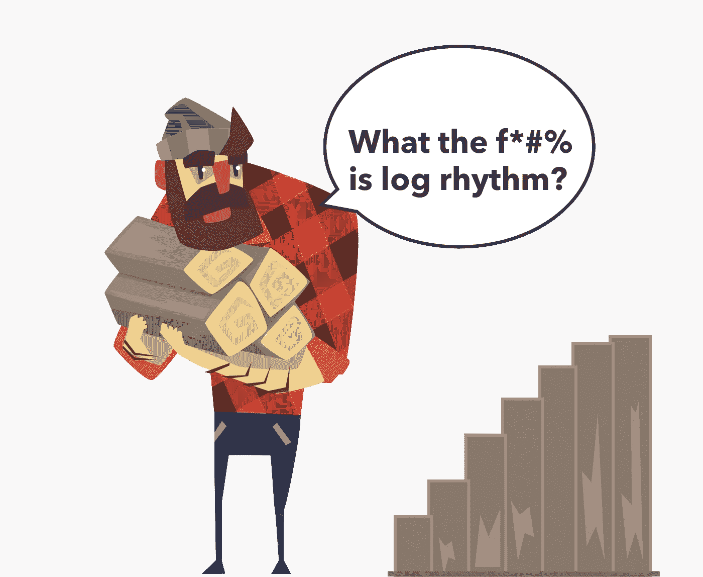
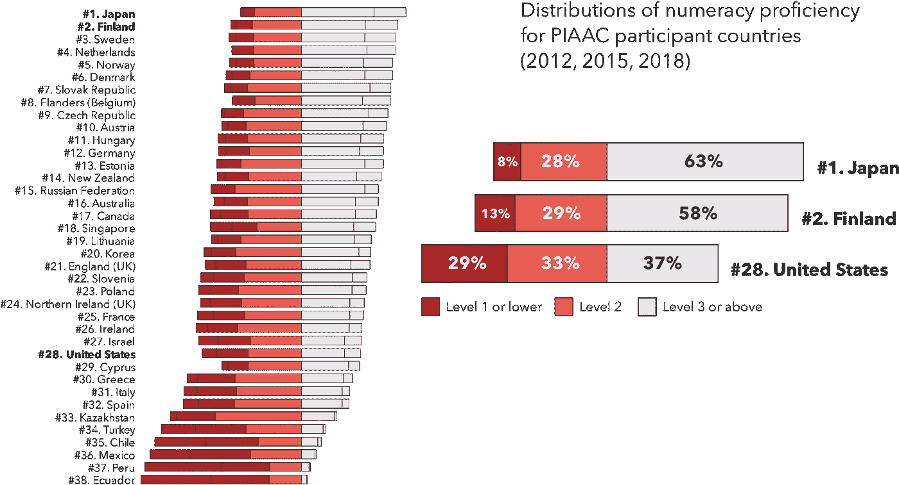
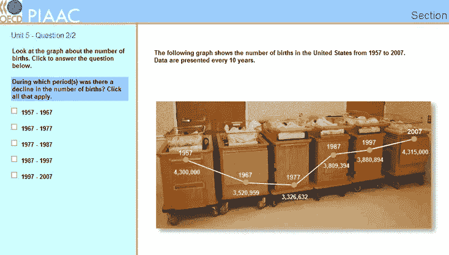
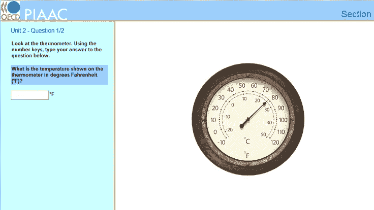
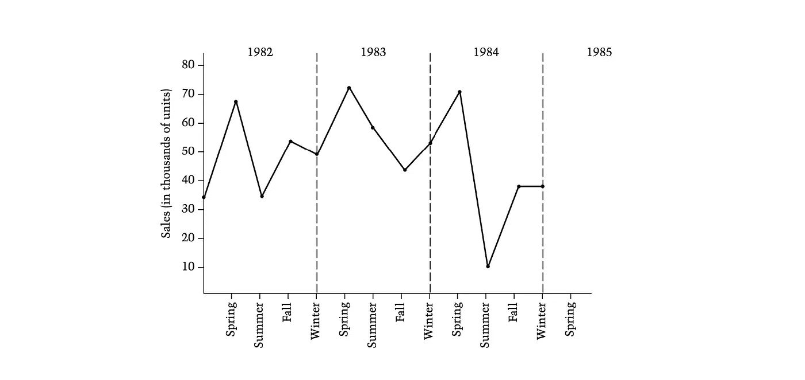
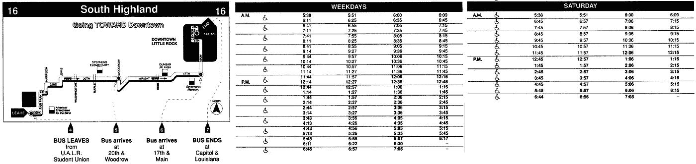
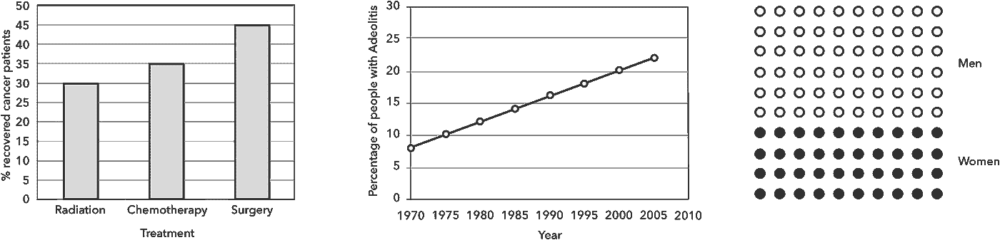

# 美国人纠结于图表

> 原文：<https://towardsdatascience.com/numeracy-and-graph-literacy-in-the-united-states-ea2a11251739?source=collection_archive---------56----------------------->

## 新的研究显示对数标度的 y 轴混淆。但是当与“公众”交流数据时，需要有多简单呢？人们能处理多少复杂性？

(图片来自作者+ [VectorStock](https://www.vectorstock.com/royalty-free-vector/cartoon-man-character-holding-stack-of-logs-funny-vector-19646350) )

上个月，亚历山德罗·罗马诺、基亚拉·索蒂斯、戈兰·多米尼奥尼和塞巴斯蒂安·圭迪对 2000 人进行了调查，证明“[公众不理解用来描绘新冠肺炎的对数图。](https://blogs.lse.ac.uk/covid19/2020/05/19/the-public-doesnt-understand-logarithmic-graphs-often-used-to-portray-covid-19/#comments)

他们发现，只有 41%的参与者能够正确回答关于对数标度图的基本问题(线性标度的准确率为 84%)。

但是这个问题比对数秤更难。正如您将在下面看到的，许多“公众”甚至连最基本的图表都难以理解，更不用说复杂的可视化了。

**知识的诅咒**

评论中有一条引起了我的注意:

> “作为一家大报的前信息图表编辑，我一直认为我的优势之一是缺乏数学技能。如果我能理解图表，也许读者也能。是的，我从来没有用过对数图表。”——罗伯特·b

这引发了更多的问题:有多少数据记者像罗伯特·b 一样思考？或者，正如 Romano & friends 建议的那样，大众媒体中的人们是否“习惯性地”假设对数标度轴是广泛可理解的？如果是后者，他们高估了世界的量化能力，那么普通观众会忽略多少其他重要的数据故事？

我从个人经验中知道，这是一个容易犯的错误。如果您一天中的大部分时间都花在 python 笔记本上，或者您的午餐谈话经常转向 arXiv 上的新内容，那么您可能也是如此。

斯坦福/杜克大学的教授丹/奇普·希斯称之为“知识的诅咒”。

> “一旦我们知道了一些事情，我们很难想象不知道它是什么样子。我们的知识“诅咒”了我们。我们很难与他人分享我们的知识，因为我们不能轻易地重现听众的心理状态。”—奇普&丹希斯，[制成贴](https://www.amazon.com/Made-Stick-Ideas-Survive-Others/dp/1400064287)

也就是说，如果你有很高的计算能力，通常很难和没有计算能力的人交流。

为了治愈“诅咒定量知识”，并通过更典型、更不了解的观众的眼睛来看待数据世界，**我们将关注三项不同的研究**，这些研究大规模地测量了计算能力和图形读写能力。

他们的一般发现是有帮助的，但为了使其具体化，**我们还将看看这些研究中的 10 个具体问题**,我将提供 1)一个典型用户可能解释它们的准确程度，以及 2)我们成年人能够正确可靠地解释它们的百分比。

有了这些基准，希望你能有一个更直观的感觉，一个故事需要简化到什么程度，才能被更广泛的读者所理解。

当用数据讲故事时，如果你想让你的(来之不易的)见解变得平易近人，没有太简单这一说。

**tldr/外卖:**

*   美国的基线计算能力不是很好。
*   图形理解依赖于计算能力和“阅读”的复杂性。
*   有一些令人惊讶的基本解释让许多人纠结。

# 算术问题

## 计算能力不是天生的。

显然，婴儿和啮齿动物天生就能区分简单的数量。如果在两堆饼干中做出选择，婴儿知道要选择较大的那一个( [src](https://www.cell.com/trends/cognitive-sciences/fulltext/S1364-6613(04)00131-7) )。老鼠可以学会按 8 次或 16 次杆来接收零食( [src](https://doi.org/10.1016/j.tics.2004.05.002) )。

但这大概是我们与生俱来的数字能力的极限。剩下的，包括比率、负数等基本概念都是学的。

## PIAAC 研究 38 个国家的“计算能力”。

每隔几年，经济合作与发展组织都会进行一项名为“国际成人能力评估项目”的大型研究。它考察了世界各地成年人的基本技能，其中之一是计算能力。

研究人员与来自 38 个国家的约 24.5 万人坐下来，每人约一小时，并对他们进行测试。他们在 1-500 的范围内计算自己的分数，其中 500 是满分。然后将这些分数分成 5 个等级，其中 1 级最不熟练，5 级最熟练。

3 级似乎是一个重要的门槛。典型的“3 级”人员得分在 276-326 分之间( [src](http://www.oecd.org/skills/piaac/The_Survey%20_of_Adult_Skills_Reader's_companion_Second_Edition.pdf) ，第 71 页)。他们可以在 67%的情况下回答“3 级”问题。我们稍后将探讨示例问题，但 PIAAC 将 3 级问题描述为:

> 这一级别的任务要求回答者理解可能不太明确的数学信息，嵌入在不总是熟悉的上下文中，并以更复杂的方式表示。任务需要几个步骤，可能涉及解决问题的策略和相关过程的选择。任务倾向于要求数感和空间感的应用；认识并运用以口头或数字形式表达的数学关系、模式和比例；以及**对文本、表格、图表中的数据和统计数据的解读和基本分析**。( [src](http://www.oecd.org/skills/piaac/The_Survey%20_of_Adult_Skills_Reader's_companion_Second_Edition.pdf) ，第 71 页)

## **根据 PIAAC，我们成年人的计算能力如何？**

在接受调查的 38 个国家中，美国在 3 级或 3 级以上的成人比例方面排名第 28 位。(转载自[技能很重要:美国成人技能调查的额外结果](https://www.oecd.org/skills/piaac/publications/countryspecificmaterial/PIAAC_Country_Note_USA.pdf)和[2017 年美国 PIAAC 结果网络报告的亮点](https://nces.ed.gov/surveys/piaac/current_results.asp))

美国在接受调查的 38 个国家中排名第 28 位。美国成年人的平均分数为 255 分( [src](https://nces.ed.gov/surveys/piaac/current_results.asp) )，这让他们稳稳地处于 2 级范围(226-276 分)( [src](http://www.oecd.org/skills/piaac/The_Survey%20_of_Adult_Skills_Reader's_companion_Second_Edition.pdf) ，第 71 页)。只有 37%的美国成年人达到 3 级或以上，日本为 63%，芬兰为 58%。

因此，如果 10 个美国成年人中只有 4 个表现在 3 级以上，那么 10 个中就有 6 个会努力“识别和运用以口头或数字形式表达的数学关系、模式和比例；并能对文本、表格和图表中的数据和统计数字进行解释和基本分析

“这些结果是另一个信号，表明许多美国人在最基本的数学技能上挣扎，”NCES 副专员佩吉·卡尔说。

# “但我的观众很聪明”

这是一个很好的实践，坦率地说，假设一个聪明的、善意的观众是值得尊敬的，但是仅仅因为某人受过良好的教育，并不意味着他们精通数量。

计算能力和教育之间有很大的关系，但也有例外。例如，即使在高中以上学历的人群中，47%的人在 PIAAC ( [src](https://nces.ed.gov/surveys/piaac/current_results.asp) )中的表现仍为 2 级或以下。

2008 年，莎拉·霍利(& friends)发现，即使在至少拥有学士学位的参与者中，也有 33%的人被归类为低算术水平( [src](https://www.sciencedirect.com/science/article/abs/pii/S0738399108003431) )。在 2001 年对“高学历者”的一项研究中，艾萨克·利普库斯(&朋友)发现，16-20%的参与者错误地回答了与风险大小相关的非常基本的问题(例如*“哪一个代表更大的风险:1%、5%还是 10%？”* ) ( [src](https://journals.sagepub.com/doi/abs/10.1177/0272989x0102100105) )。

Goutham Rao 在 2008 年的评论表明，即使是医生也在挣扎。一项对家庭医生的调查显示，尽管 95%的参与者肯定了理解生物统计学的重要性，但只有 25%的人表示对该学科有信心。根据他们的测试结果，缺乏信心是有根据的:他们平均只有 41%的正确答案。诚然，生物统计学是一个更高的门槛，但希望这表明，即使是先进的观众也不总是像他们希望的那样先进。

# 图形理解

## 算术和交流数据有什么关系？

Mirta Galesic 和 Rocio Garcia-Retamero 表明，低计算能力不仅限制了一个人的数学能力，还与他们的“图形素养”或解释图表的能力密切相关。

根据 Galesic 和 Garcia-Retamero 的说法:*“导致高计算分数的相同的元认知能力也培养良好的图形读写技能。”*反之亦然:在 261 名“低计算能力”的美国成年参与者中，只有 89 人(34%)表现出高图形读写能力。

## 用户将如何“读取”数据？

Galesic 和 Garcia-Retamero 的另一个聪明见解是:图形理解不仅仅基于读者的能力，它还取决于他们需要如何解释数据。他们提出了三种人们“阅读”图表的方式。用户可以:

1.  “读取数据”——识别图表上的特定值
2.  “在数据之间读取”——识别图表数据中的关系
3.  “阅读数据之外的内容”——从图表数据中做出推论

这些水平中的每一个都越来越难，这反映在他们的结果中。美国参与者可以在 86%的回答中正确“阅读数据”，在 67%的回答中正确“阅读之间”，在 63%的回答中正确“阅读之外”。

请注意，这些结果似乎比 PIAAC 建议的更积极。为了更好地理解数据读者实际能处理什么，让我们来看看这两项研究中的一些潜在问题。

# 人们能处理多少复杂性？

为了说明这一点，让我们看看一些图形理解问题&来自 PIAAC、国家成人识字调查问题和 Galesic/Garcia-Retamero 的“图形识字”研究的结果。

## **PIAAC 样题**

我们将从第三级开始，即“中等难度”

一个“3 级”问题。只有 37%的美国成年人会定期正确回答这个问题。(图片来自 NCES， [src](https://nces.ed.gov/surveys/piaac/figures/sample_num2.asp) )

级别 3:对于时间序列折线图:**“在哪个(些)时期出生人数有所下降？”**

美国成年人 PIAAC 计算能力的平均分数是 255/500。因此，美国成年人平均有大约 26%的机会正确回答 3 级问题。一个得分在 276-326 分之间的“3 级”的人，在 50-80%的时间里回答正确。由于 37%的美国成年人得分在 3 级以上，我们可以说，只有十分之四的美国成年人能够可靠地回答这样的问题。

一个“1 级”问题。92%的美国成年人会定期正确回答这个问题。(图片来自 NCES， [src](https://nces.ed.gov/surveys/piaac/figures/sample_num2.asp) )。

对于刻度盘温度计:

*   级别 1: **“温度计上显示的温度是多少华氏度(F)？”**
*   级别 2: **“如果显示的温度降低了 30 摄氏度，那么温度是多少摄氏度？”**

这些似乎是 1 级和 2 级问题。一个典型的美国成年人在 89%的情况下会正确回答 1 级问题(92%的美国成年人是 1 级，并且在大多数情况下会正确回答)。他们会在 66%的情况下正确回答第二级问题(70%的美国成年人是第二级，大多数情况下会正确回答)。

(注:NCES 网站将这些问题列为 3 级，但读者指南将类似的问题列为“低难度”或 1/2 级)

一个“二级”问题。70%的美国成年人会正确回答这个问题(通过国家教育研究中心)

对于表格和条形图:**“哪两个条形是不正确的？”**

这是一个“二级”问题。一个典型的美国成年人在 66%的情况下会正确回答这个问题(70%的美国成年人在大多数情况下会正确回答这个问题)。

## 全国成人识字调查问题

美国的一项早期研究“全国成人识字调查”表明，普通美国成年人只能在大约 50%的时间里“从描述能源和年份的条形图中识别信息”。他们只能在大约 25%的时间里“使用信息表来确定多年的石油出口模式”( [src](https://nces.ed.gov/pubs93/93275.pdf) )。

提示“2 级”问题。(图片来自 NCES， [src](https://nces.ed.gov/pubs93/93275.pdf) )

第 2 级:**“你是一家小型制造公司的营销经理。这张图表显示了贵公司过去三年的销售额。根据图中所示的季节模式，在图上画一个“x”来预测 1985 年春季的销售额(以千计)**

一个普通的美国成年人在 60-80%的时间里回答正确。( [src](https://nces.ed.gov/pubs93/93275.pdf) ，第 102 页)

提示 3 级问题。(图片来自 NCES， [src](https://nces.ed.gov/pubs93/93275.pdf) )

第三级:**“假设你在一个周六乘坐下午 12:45 的公交车从 U.A.L.R .学生会到第 17 大街。按照时间表，大巴要坐几分钟？”**

一个普通的美国成年人在 35-65%的时间里回答正确。

## “图形素养:跨文化比较”问题

在《图形素养:跨文化比较》中，Galesic 和 Garcia-Retamero 告诉我们“即使是最简单的图形对许多人来说也可能难以理解”( [src](https://journals.sagepub.com/doi/10.1177/0272989X10373805) )。

3 个不同的图表，提示了以下来自 Galesic 和 Garcia-Retamero“图形素养”研究的问题。(转载自 [src](https://journals.sagepub.com/doi/10.1177/0272989X10373805) )

一些示例问题和预期结果:

*   读出柱状图上的一个点(左图):**“化疗后痊愈的患者比例是多少？”**——85%的美国成年人回答正确。
*   确定两个条形图之间的差异(中图):**“手术后康复的患者百分比与放射治疗后康复的患者百分比之间的差异是什么？”** — 70%的美国成年人回答正确。
*   比较一条线的两个区间的斜率(中图):**“什么时候患支气管炎的人的百分比增加得更高？(1)从 1975 年到 1980 年，(2)从 2000 年到 2005 年，(3)在这两个时间间隔内的增长是相同的，(4)不知道“**——62%的美国成年人回答正确。
*   确定两组图标之间的差异(右图):**“100 名 X 病患者中，男性比女性多多少？”** — 59%的美国成年人回答正确。

一个也许会计算的伐木工人考虑简单的木材分配。

# 外卖:

在交流数据时，上述问题提供了有用的基准，用于根据可视化或数据故事的复杂性确定您的目标受众规模:

*   如果它大致像识别和减去两个值一样复杂(例如，“手术后康复的患者百分比和放射治疗后康复的患者百分比之间的差异是什么？”)，你在和 10 个人中的 7 个人说话。
*   如果它和识别线图上的趋势一样复杂(例如，“在哪个(些)时期出生人数下降了？”)，你只能和 10 个人中的 4 个人说话

基于这些，您可以相应地调整数据的显示。如果你知道你只是在和一群高级观众说话，你就可以开始了。但是如果你想获得更广泛的受众，想办法简化。

# 我们能做得更好吗？

记住我们的观众比以往任何时候都重要。新冠肺炎是一场数字概念和条件的龙卷风，人们在与之斗争(例如，大数、指数曲线、政治/情感等)。此外，受病毒影响最严重的社区在算术教育方面也是最缺乏服务的。这两者都提高了传播者的门槛，使他们的见解更容易被人接受。

那么，我们能做些什么来解决“[定量]知识的诅咒？”

*   不要假设普遍的计算能力。意识到你的观众对复杂性的偏好。
*   在真人身上测试你的作品。没有什么比用户对表面区域的反馈更简单的了。
*   当大多数人(至少是我们成年人)需要访问数据时，问问自己:这比在条形图上减去 2 个值复杂还是不复杂？
*   注释一切。只要有可能，就提供如何解释你的视觉化图像的书面说明，并用关键要点的叙述性描述来补充视觉化图像。
*   如果你知道像对数标度轴这样的东西不会被广泛理解，无论如何都要去做。许多人认为，接触更难的图形实际上有助于提高图形素养，所以也许团队需要一个？

我是谁？不，不，*你是谁？！*

我是伊莱。我的[数据可视化咨询](https://3iap.com/data-visualization-consulting)公司帮助客户使用数据(可视化)创造积极的变化，不仅通过理性地吸引受众，还通过情感和文化吸引受众。变化发生在头脑*和*心里。

如果你对用户测试数据感兴趣，或者如果你是在数据、设计和用户心理学的交叉领域工作的创始人、制造者、讲故事者或商业领袖，我很乐意联系和交换故事。

你可以给我发电子邮件，地址是[eli@3iap.co](mailto:eli@3iap.co)或者关注我的[推特](https://twitter.com/elibryan)。

参考

*   A.Romano，C. Sotis，G . Dominioni，s .圭迪，[新冠肺炎数据:对数标度误导公众并影响政策偏好](https://papers.ssrn.com/sol3/papers.cfm?abstract_id=3588511) (2020)
*   C.Heath，D. Heath，[《坚持到底:为什么一些想法存活而另一些想法消亡》](https://www.amazon.com/Made-Stick-Ideas-Survive-Others/dp/1400064287) (2007)
*   长度 Feigenson，S. Dehaene，E. Spelke，[数的核心系统](https://www.cell.com/trends/cognitive-sciences/fulltext/S1364-6613(04)00131-7?_returnURL=https%3A%2F%2Flinkinghub.elsevier.com%2Fretrieve%2Fpii%2FS1364661304001317%3Fshowall%3Dtrue) (2004)
*   经合组织，[成人技能调查:读者指南，第二版，经合组织技能研究](http://www.oecd.org/skills/piaac/The_Survey%20_of_Adult_Skills_Reader's_companion_Second_Edition.pdf) (2016)
*   美国教育部。国家教育统计中心教育科学研究所，[2017 年美国 PIAAC 结果网络报告亮点](https://nces.ed.gov/surveys/piaac/current_results.asp) (2020)
*   经合组织，[技能很重要:美国成人技能调查的补充结果](https://www.oecd.org/skills/piaac/publications/countryspecificmaterial/PIAAC_Country_Note_USA.pdf) (2019)
*   南 Hawley，B. Zikmund-Fisher，P. Ubel，A. Jancovic，T. Lucas，A. Fagarlin，[图形呈现格式对健康相关知识和治疗选择的影响](https://www.sciencedirect.com/science/article/abs/pii/S0738399108003431) (2008)
*   I. Lipkus，G. Samsa，B. Rimer，[高学历样本在计算能力方面的一般表现](https://journals.sagepub.com/doi/abs/10.1177/0272989x0102100105) (2001 年)
*   G.饶，[医师计算能力:循证医学实践的基本技能](https://www.researchgate.net/publication/5386938_Physician_numeracy_Essential_skills_for_practicing_evidence-based_medicine) (2008)
*   米（meter 的缩写））Galesic，R. Garcia-Retamero，[图形素养:跨文化比较](https://journals.sagepub.com/doi/10.1177/0272989X10373805) (2010)
*   I. Kirsch，A. Jungeblut，L. Jenkins，A. Kolstad，[美国的成人扫盲:国家成人扫盲调查结果的初步观察](https://nces.ed.gov/pubs93/93275.pdf) (2002 年)