# 数字锦标赛:融合传统量化方法和现代机器学习

> 原文：<https://towardsdatascience.com/numerai-tournament-blending-traditional-quantitative-approach-modern-machine-learning-67ebbb69e00c?source=collection_archive---------17----------------------->

## 如何提高金融机器学习的智能

Erol Ahmed 在 [Unsplash](https://unsplash.com?utm_source=medium&utm_medium=referral) 上拍摄的照片

# 介绍

## 数字锦标赛

Numerai 是一个众包基金，一个对冲基金，它根据不特定数量的人做出的股价预测结果进行操作。Numerai 举办比赛，参与者为预测业绩而竞争。锦标赛参与者将根据 Numerai 提供的加密数据集建立一个预测模型，然后使用它来创建一个提交。参与者将根据他们的预测表现进行排名并获得报酬(有时会被封杀)。Numerai 的支持者包括复兴科技的联合创始人霍华德·摩根(Howard Morgan)、保罗·都铎-琼斯(Paul Tudor-Jones)、联合广场风险投资公司(Union Square Ventures)和其他知名风险投资家以及具有丰富对冲基金经验的人士。数字数据集由专门从事金融机器学习的顾问监督。迄今为止，支付给参与者的奖金总额已超过 3400 万美元，该项目可能进展良好。

*图片由*[*numeri*](https://numer.ai/)提供

## 关于作者

作者使用市场中性方法投资日本股票市场。市场中性旨在通过结合买入和卖出(多头和空头)，预测宇宙(要投资的一组股票)中股票价格的相对涨跌，获得独立于市场价格运动的绝对回报。在传统的定量方法和统计学的基础上，作者通过机器学习建立了该预测模型。结果一直不错，收益率在 40%左右。

## 本文的目的

在这篇文章中，我将分享在建立作者模型的过程中获得的见解。我首先解释了传统定量方法的概念，并讨论了如何将其与机器学习相结合，以建立一个现代预测模型。

## 笔记

Numerai 的数据集是加密的，作者对此一无所知。这篇文章仅仅是作者投资和建模经验的观点。

# 传统定量方法

预测股票收益的研究由来已久。让我们从解释什么是传统的定量方法及其起源开始。

## 巴拉风险模型

现在的 quants 的原型很可能就是 Barr Rosenberg 提出的风险模型[1]。关于这一点有很多理论，但是对于华尔街这方面的历史，你绝对应该读一读彼得·伯恩斯坦的书《资本理念》[2]。

在 20 世纪 60 年代，基于 Markowitz 的协方差模型，Rosenberg 设计了一种方法，使用各种因素来解释单个公司的风险。他还发现这些风险因素与股票价格的超额收益(风险溢价)相关。1975 年，罗森博格成立了一家咨询公司，Barr Rosenberg Associates，Inc .这家公司被全世界的管理公司称为 BARRA。

目前，BARRA 模型是最知名的风险模型，MSCI 作为供应商提供。其他风险模型包括公理。虽然有各种类型的 BARRA 模型，但 BARRA 全球股票模型(GEM)是全球主要股票市场股票的风险模型[3]。该模型将股票收益分解为国家因素、行业因素、风险因素和个人因素，如下所示。

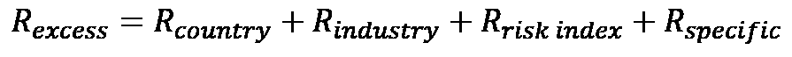

这可以用多元回归模型描述如下。Rn 是股票 n 的超额收益(相对于无风险利率)，x 是股票 n 对每个因子(k，j，I)的因子敞口，f 是因子收益，en 是具体收益。这里的关键是要素收益的概念。

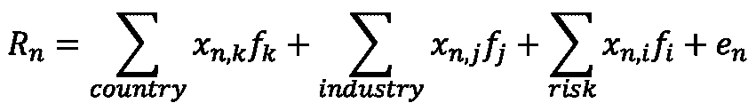

## 因子回报

为简单起见，我将用单因素模型而不是多因素模型来解释。我还将把数字数据集结构作为一个具体的例子。因子收益是以下横截面回归中的回归系数 f。这里 r 是 eraX 中的目标向量，x 是 eraX 中 featureA 的向量。

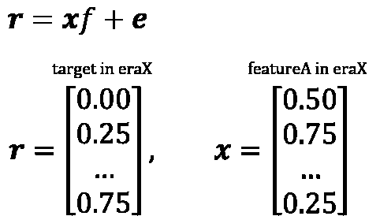

因子回报是通过对宇宙中的风险因子下注来衡量预期的回报。因子暴露是股票暴露于该风险因子的程度，暴露越大，因子回报的收益越大。从上面的等式可以看出，回归模型是一个特定时间段(eraX)的横截面模型，在实际测试过程中，我们在一段时间内(如每月)对其进行累积，并观察其特征。

以下是 BARRA GEM 文档中的因子回报示例。如果一个因子收益明显向右，说明只要赌上那个因子，就能获得稳定的收益。如果价格明显下跌，那么你可以赌这个因素无效(转换多头和空头)。在当前的 2020 年，很少有一个方向的要素回报是显著的。因此，我们应该考虑每只股票的因素敞口，构建一个分散于各种因素的投资组合。

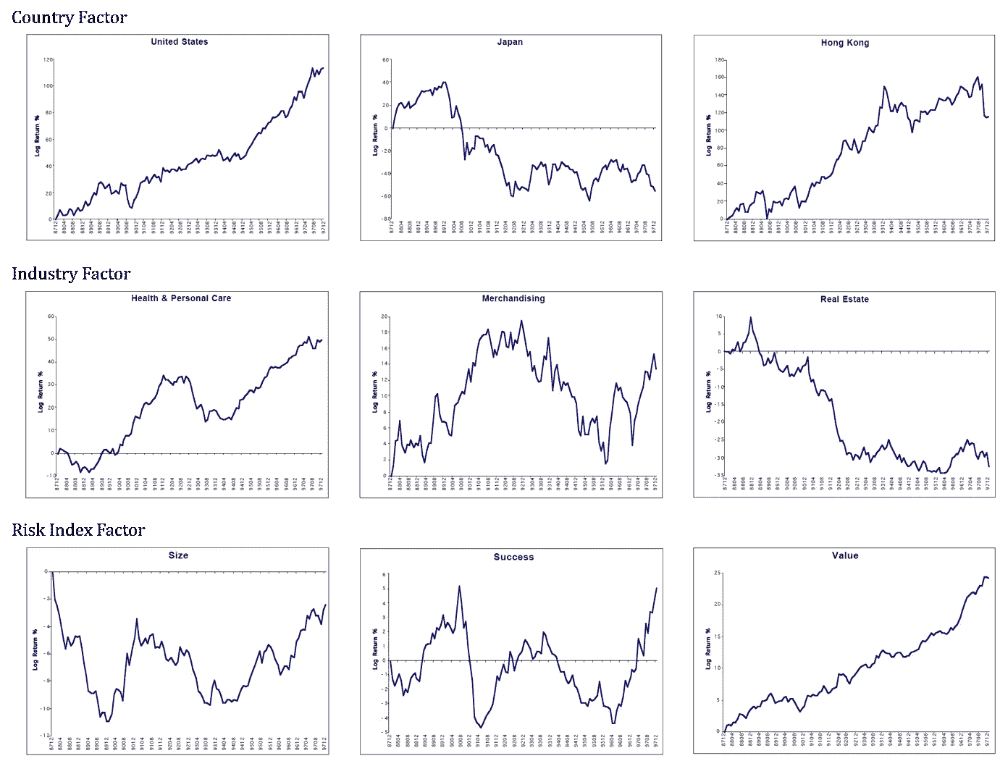

各种风险因子的因子收益。来源:[3]

## 因素回报和相关性

由于因子收益是回归系数，因此可以使用目标变量和解释变量的波动性将它们转换为相关性。在下面的等式中，b 是解释变量 x 对目标变量 y 的回归系数，σxy 是 x 和 y 的协方差，σx 和σy 分别是 x 和 y 的标准差。相关性，可以这么说，是标准化在-1 和 1 之间的因子收益，用波动性修正。

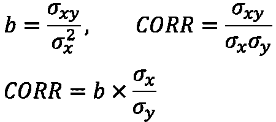

相关性在风险模型中是一个非常重要的指标，因此在主动投资组合管理理论中也是如此。在主动投资组合管理理论中，相关性被称为信息系数，它是基金经理技能的一个指标。我将不详细解释这一领域。有兴趣可以参考最著名的主动管理理论的书[4]。

在这里，我描述了每个数字特征的因子回报(通过相关性计算)。计算简单地通过单因素模型来完成。从这个图中，我们可以一目了然的看出哪些特征有哪些特点，它们本身有多大的解释力。

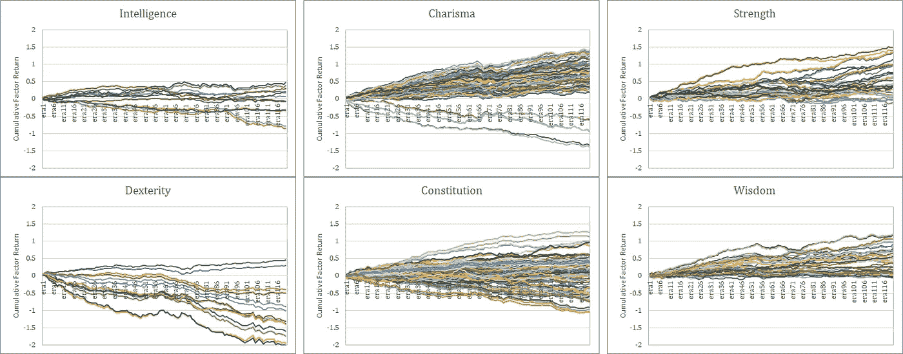

数字特征的因子收益。来源:作者

应该注意的是，这些因素回报包括由于随机性引起的变化。以下是相关性=0.0 和相关性=0.005 (100 次试验)情况下的蒙特卡罗模拟。我们应该始终记住，这种程度的可变性可能是由于随机性而产生的。在 120 左右的样本期内确定统计显著性是一个非常困难的问题。我们可以看到最重要的因素回报是由敏捷 4 和 7 获得的。

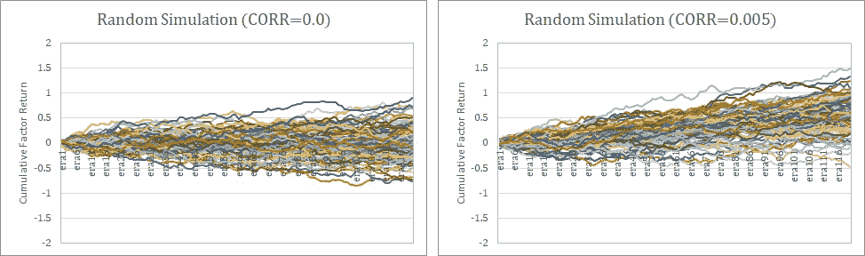

随机因子回报。来源:作者

## 相关性评估

当我们这样想的时候，我们就能明白为什么 Numerai 使用相关性来评估。每个锦标赛参与者提交的预测本身就是一个丰富的超级因子——一个包含比典型因子更多信息的信号。Numerai 随后从这些由参与者独立产生的超级因素中寻求高额回报。如果因子回报很好，Numerai 可以简单地通过组合它们来操作，或者在某些情况下，可以从收集的单个因子中实现进一步的学习，以提高它们的性能。

# 风险因素作为一个特征

在这一章中，我们讨论如何将传统的风险因素作为机器学习的特征。首先，国别特征和行业特征很重要。

## 国家特色

Numerai 被认为在全球所有主要市场都有股票。在数字锦标赛的数据集中，个股的 id 是加密的，我们无从得知。不过，由于 Numerai Signals 公布了一份目标股票清单，我整理了一下。从股票总数来看，我怀疑它与当前的数字锦标赛相同。在数字信号列表中有 41 个国家，美国拥有最多的股票，其次是日本、韩国和英国。

这些可能不是简单地按国家合并，而是按地区(北美、南美、太平洋等)合并。).

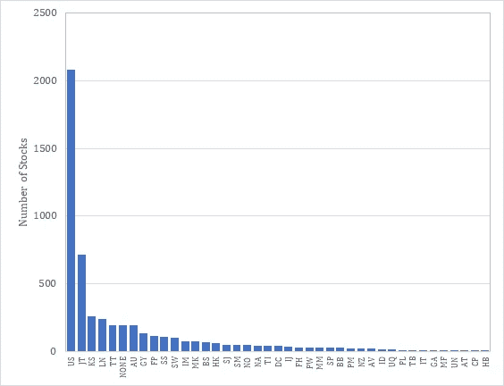

每个市场的股票数量。来源:作者

在通常的风险模型中，国家特征被作为 0/1 分类变量引入。然而，数字数据集基本上是一个 5 分位数，并且每个分位数的数量在大多数特征中是相同的。因此，如果我以这种方式创建一个特性，我将对每个国家(或每个地区)的指数进行多元回归，然后使用 beta 作为该特性的分位数。

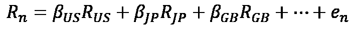

例如，如果我们这样做，日本股票相对于东京市场指数将具有更高的 beta，并且将被聚集在该特征的更大(或更小，取决于分类符号)分位数中。然后，如果 Numerai 中有一个国家特征，最大的分位数只提供信息，其余的没有信息。Numerai 的 analysis_and_tips 报道了某些特征在特征值为 0 或 1 时具有显著的特征，我认为可能就是这种情况。

作为参考，我展示了自 2010 年以来每个国家的相对回报率趋势。

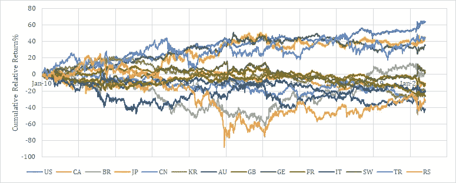

每个国家的累积相对收益。来源:作者

## 行业特征

其次，行业特色很重要。在《股市奇才》中，史蒂夫·科恩指出，40%的股票价格变动是由市场决定的，30%是由行业决定的，剩下的 30%是由个人原因决定的。没有理由不包含这一行业特征。行业的定义各不相同，但 BARRA GEM 定义了 38 个行业。此外，GICS 定义了 60 个部门，FactSet 的 RBICS 定义了 12 个经济体、31 个部门和 89 个子部门。作为参考，美国市场按经济体划分的股票数量如下所示。

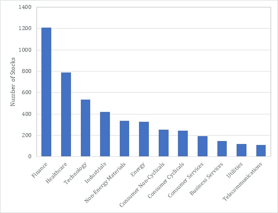

美国市场各行业股票数量。来源:作者

行业特征也可以用行业指数上的多元回归贝塔进行量化，就像国家特征的情况一样。同样在这种情况下，只有最大的分位数是有信息的，其余的没有信息。

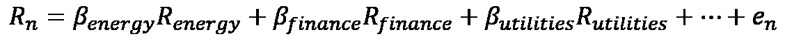

作为参考，我展示了自 2010 年以来美国市场各行业的相对回报率趋势。

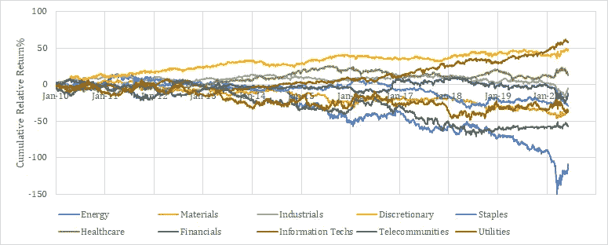

各行业累计相对收益。来源:作者

## 风险指数特征

风险指数很可能包含 BARRA 中使用的那些指标。它们是规模、价值、成功(势头)和波动性。这些可以简单地合并，但考虑到国家和行业的偏差，通常按类别进行标准化。

对于规模指数，可以考虑诸如销售额、总资产和雇员人数以及市场资本总额等因素。对于价值指数，可以考虑市净率、市盈率、现金流比。其他风险指数包括流动性、增长、股息和财务杠杆。除了这些传统的风险指数之外，还可以纳入其他变量，如从新闻中提取的分析师修正值和情绪指数。

作为参考，我展示了 2010 年以来美国市场各风险指数的相对收益趋势。

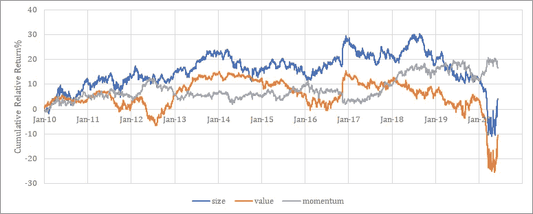

每个风险因素的累积相对回报。来源:作者

# 融合传统定量方法和现代机器学习

在这一章中，我们将讨论如何使用机器学习来提高传统量化指标的性能。

## 树形模型

BARRA 模型只是单个风险因素的加权组合。有一种简单易行的方法可以改善这种情况。即考虑个体风险因素之间的相互作用。

举个简单的例子，有些行业更有可能是价值导向的，有些则不是。如果我们看股票的大小，有一个因素最适合大盘股，也有一个因素最适合小盘股。此外，不同的行业在不同的国家表现出色。

为了考虑这种相互作用，线性模型是不够的。在线性模型中，交互变量必须由人指定并设置为特征。在基于树的模型的情况下，模型可以在没有任何特定意图的情况下自己学习交互。另一方面，基于树的模型不善于理解原始 BARRA 模型的风险溢价，因为由于网格状划分，它们不善于线性分类。

对此的解决方案是线性和树模型的集合或堆叠。事实上，在 Kaggle 举行的两次适马金融竞赛中，岭回归和 ExtraTrees 的组合获得了好奖[5]。

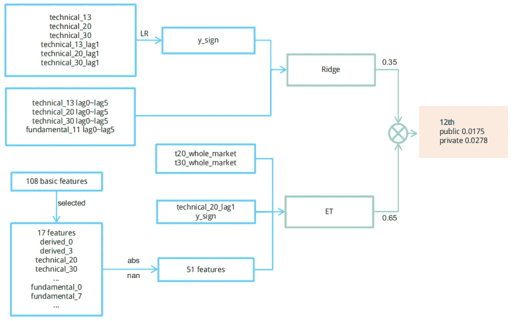

在 Kaggle 举行的双西格玛金融挑战赛中获得第五名。来源:[5]

## 深层因素模型

另一方面，也有在模型中使用深度学习的情况。这是一种叫做深度因子模型的技术[6]。在常规的量化管理中，基金经理根据他或她的经验创建和选择因素，但深度因素模型旨在通过用深度学习取代人类判断来消除人类判断，从而捕捉单个因素的非线性。

该方法使用 80 个因素来预测月度回报，并已被证实能够优于线性模型和其他机器学习方法(SVR 和随机森林)做出的预测。

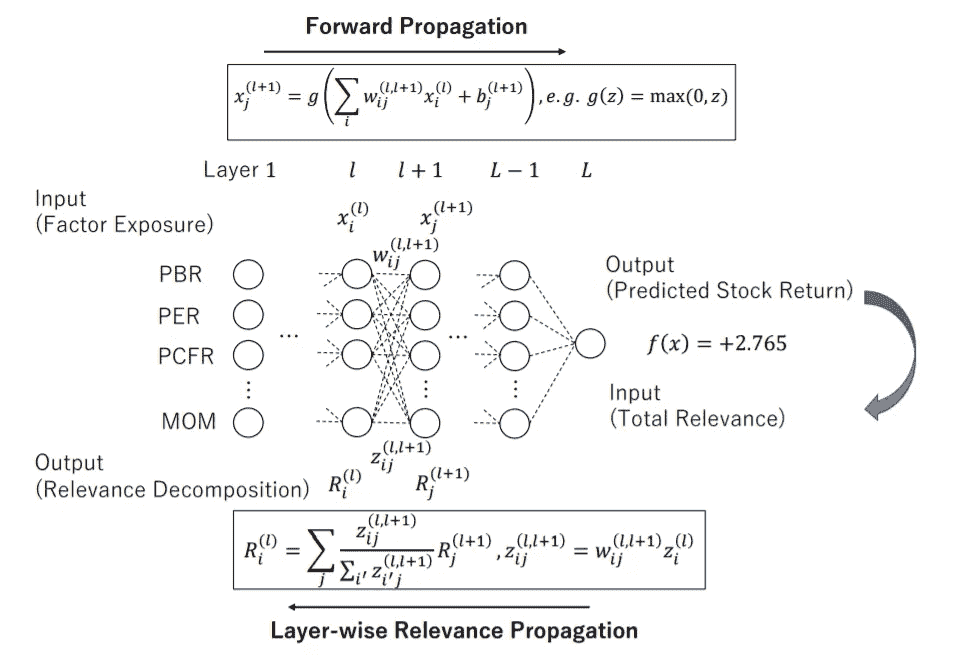

深度因子模型。来源:[6]

我认为，通过这种方式混合机器学习，相对容易胜过传统的量化模型。但另一方面，模型的复杂性可能会降低其可解释性，可能存在过学习和窥探偏差等陷阱，因此机器学习模型的构建需要金融领域特有的知识和直觉。关于这方面的更多技术技巧，我们应该参考 Numerai 首席科学顾问 Prado 的《金融机器学习》一书[7]。

# 结论

在本文中，我解释了传统定量方法的概念，然后描述了一种将传统风险因素作为一种特征的方法，并展示了如何将传统定量方法和现代机器学习融合在一起。这样，显著提高预测性能是可行的。

我也希望读者通过了解如何在传统的量化方法的基础上观察市场，对实际的市场更感兴趣，这将使对数字的分析更加愉快。

希望这篇文章能激发读者的好奇心，启发读者的预测模型。谢谢你看完。

UKI

# 参考

[1]巴尔·罗森博格、马拉泰·维奈，《投资风险的预测:系统性和剩余风险》，1975 年
[2]彼得·伯恩斯坦，《资本理念:现代华尔街的不可思议的起源》，1992 年
[3]巴拉全球股票模型手册
[4]理查德·格林诺德、罗纳德·卡恩，《主动投资组合管理》，1995 年
[5]团队最佳拟合，《两次适马金融建模代码竞赛，第 5 名获奖者访谈》，2017 年
[6]中川圭佑