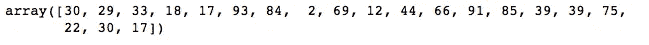

# 数字阵列—您想知道的一切

> 原文：<https://towardsdatascience.com/numpy-array-all-you-want-to-know-d3f8503a2f8f?source=collection_archive---------49----------------------->

## 如果您对 NumPy 数组有问题，请从阅读本文开始。

对于任何数据科学家来说，最具挑战性的步骤之一是理解如何使用和修改 NumPy 数组。今天，您将从库的角度学习关于数组的核心概念。我们一起潜水吧！

图片由 [Pixabay](https://www.pexels.com/pt-br/foto/acreditar-batalha-borrao-branco-260024/) — Pexels 提供

# 目录

*   **什么是 NumPy 数组**
*   **关于异次元**
*   **如何创建 NumPy 数组？**
*   **用整形修改**
*   **使用 NumPy 的操作**
*   **转置你的数组**
*   **带 NumPy 的条件**
*   **额外的**

# 什么是 NumPy 数组？

> 相同类型的数字表，由非负整数元组索引，也称为多维数组。

**NumPy 的数组和标准数组的主要区别**是后者只处理一维数组，提供的功能较少。

# 关于不同的维度

在我们开始讨论 NumPy 数组之前，有必要知道我们有哪些类型的维度。是的，他们有不同的名字，以后会引起一些误解。首先，让我们从**标量**开始。

图片由雷南·洛里科拍摄——中号

## 1.数量

也称为零阶张量；例如，它可以是任何有/没有单位、数量的数字，甚至是向量的函数。**有量，无维度。**

## 2.矢量

一阶张量；通常是单个数字的有序数组，表示为矩阵的一行(或一列)。**只需要一个尺寸**。

*   从向量及其以外，**都将有大小和维度**；

## 3.[数]矩阵

二阶张量；就是一个由多行(或多列)数字组成的矩形数组。为了简单起见，矩阵是由几个向量组成的。

## 4.张量

封装标量、向量和矩阵。它们可以代表从零到 N 维的任何东西，这使得它们在深度学习中非常有用。张量可以是不同阶的，但通常我们用三阶或四阶；最后一个更复杂。

# 如何创建 NumPy 数组？

有几种方法可以创建数组。您可以从头开始生成数据，并使用生成的数据填充您的列，或者使用您已经拥有的数据，并将其转换为 NumPy 数组。让我们逐一讨论。

## 当你已经有了数据

这非常简单:只需将数据转换成一个数组。对于这个例子，我将创建一个熊猫系列。让我们检查一下。

图片由雷南·洛里科拍摄——中号

多好啊！我们把我们的系列变成了 ndarray！现在我们可以开始将我们的数学工具应用于这些数据了！还有一点:如果你不知道什么是系列， [**点击这里**](https://pandas.pydata.org/pandas-docs/stable/reference/api/pandas.Series.html) 学习。

## 从头开始生成数据

当您需要处理操作、条件和循环时，创建新数据非常有用。不用生成完整的数字列表，只需将开始、停止和步进参数传递给 NumPy 数组。有些函数甚至不需要这些参数！我们去看看。

## 1) np.arange()

你想用**生成一个具有均匀间隔值的元素数组**吗？所以试试 np.arange()函数。当你需要创建快速列表时，这是非常有用的。让我们检查代码。

来自 [NumPy 文档](https://numpy.org/doc/stable/index.html):

*   对于整数参数，该函数相当于 Python 内置的 range 函数，但是**返回的是 ndarray 而不是 list** 。
*   当使用非整数步长时，如 0.1，**结果通常不一致。**这些情况最好使用 numpy.linspace。

## 2) np.linspace()

这与上面描述的非常相似，但有一个具体的区别:当在这里处理非常小的数字时，你不会受到影响，有更多的参数要定义，并且你**不需要定义任何步骤，只需要在你的数组上有多少个数字，**让我们看看。

## 3) np.random()

这是一个非常大的模块，每个案例都有许多特定的功能；当需要随机创建数字时，它被广泛使用。我将集中讨论最常用的方法。

## **numpy.random.randint()**

> 从“半开”区间[ *低*，*高*]中指定数据类型的“离散均匀”分布中返回随机整数。如果*高*为 None(缺省)，那么结果是从【0，】低)”。[来自文档](https://numpy.org/doc/stable/reference/random/generated/numpy.random.randint.html?highlight=random)。

图片由雷南·洛里科拍摄——中号

## 纪念

*   如果尺寸参数大于高值，将重复**输出。**

## numpy.random.random()

> “返回半开区间[0.0，1.0]内的随机浮点数”。[来自文档](https://numpy.org/doc/stable/reference/random/generated/numpy.random.randint.html?highlight=random)。

图片由雷南·洛里科拍摄——中号

## 纪念

*   值的范围从 0.0 到小于 1.0。

## numpy.random .指数()

> “从指数分布中抽取样本”。[来自文档](https://numpy.org/doc/stable/reference/random/generated/numpy.random.randint.html?highlight=random)。

图片由雷南·洛里科拍摄——中号

还有更多值得探索的地方！想看看吗？ [**点击这里**](https://numpy.org/doc/stable/search.html?q=random&check_keywords=yes&area=default) 查看随机模块。

## 4 ) np.ones()和 np.zeros()

在你的任务中，可能需要创建只有 1 或 0 的 n 维数组，谁知道呢？NumPy 有这方面的函数，我们来看看. np.eye()

输出将是只有 1 或 0 的数组，如下所示。

图片由雷南·洛里科拍摄——中号

## 5) np.eye()

创建一个 0 和 1 的数组(数字 1 创建一条对角线)；您可以毫不费力地找到该函数的实用程序。

图片由雷南·洛里科拍摄——中号

# **用整形修改 NumPy 数组**

这是任何使用 NumPy 的人都必须知道的。在使用神经网络和深度学习时，重塑我们的阵列是一个至关重要的过程。

在调整形状期间，您可以修改阵列的格式，即行数、列数和维数。让我们用代码试试。

随着整形改变了数组的形状，我们将检查输出。

图片由雷南·洛里科拍摄——中号

## 别忘了

> 如果乘法产生的元素数量与之前不同，则不能修改尺寸。如果你有 20 个元素，你可以改造成(4，5)，(5，4)，(2，2，5)，等等。

# **使用 NumPy 的操作**

看看你的学习变得多么优秀！我们现在学到了很多东西，但是还有更多隐藏的东西！我们需要学习如何使用一些数字操作功能。

例如，因为你是数据科学家，所以没有理由解释 sum 函数是做什么的。因此，我将创建一个包含一些非常重要的操作的代码片段，并讨论输出。

图片由雷南·洛里科拍摄——中号

我们有两个每 5 列 2 行的矩阵。上面，你可以查看每个操作的输出。这里没有什么玄机，但是如果你是新手，我会解释元素式乘法和点积的区别。

## 元素式产品

图片来自维基百科— [哈达玛产品](https://en.wikipedia.org/wiki/Hadamard_product_(matrices))

也称为哈达玛乘积，是一种二元运算，它采用两个维数相同的矩阵，并生成另一个维数相同的矩阵作为操作数。每个元素都是原始两个矩阵元素的乘积。看看下面的例子。

图像通过[矩阵乘法](http://matrixmultiplication.xyz)

## 点积

简单来说，点积就是两个数列对应项的乘积之和。没有比这更简单的方法了。用一个数字来理解吧。

图片由[可汗学院](https://www.khanacademy.org/math/precalculus/x9e81a4f98389efdf:matrices/x9e81a4f98389efdf:multiplying-matrices-by-matrices/a/multiplying-matrices)

当我们需要直接处理数组时，点积广泛用于机器学习；通常当我们使用梯度下降法时。由于是高级内容，我推荐你去看看 [**这篇可汗学院关于矩阵乘法的文章**](https://www.khanacademy.org/math/precalculus/x9e81a4f98389efdf:matrices/x9e81a4f98389efdf:multiplying-matrices-by-matrices/a/multiplying-matrices) 。

# **转置你的数组**

转置矩阵是使用点积非常必要的功能，但它并不止于此:

*   熊猫图书馆允许你的数据框架使用转置；
*   您可以使用它来快速反转您的数组的列和行，用于任何您想要的目的；

因此，您将翻转您的行与列！

图片由雷南·洛里科拍摄——中号

# **有条件带 NumPy**

最后，我想和大家分享两个用 NumPy 进行条件选择的有用函数:np.where()和 np.select()。**两者都广泛用于熊猫，是本馆必备。**

## np.where()

> **np.where** (条件，真则返回，假则返回)

首先，您传递您的布尔条件；然后，需要加上条件结果为真时要返回的值；最后，相反(如果假)。通过代码你会更好地理解它。

图片由雷南·洛里科拍摄——中号

> 别忘了:np.where()只有在需要用条件返回一两个值的时候才有用。如果有更多的值，请使用 np.select()。

## np.select()

> ***NP . select****(cond list，choicelist，default)*

选择功能可以处理两个以上的条件，例如，当您需要应用 [**数据宁滨**](/feature-transformation-for-data-scientists-3a9eed562752) 时，它非常有用。在这里，您将一个条件列表传递给选项列表；两者将一起填充新列表。默认参数是不满足条件时使用的值。

图片由雷南·洛里科拍摄——中号

# 额外的

如果不先教你如何洗牌，我还是无法完成这篇文章。在训练机器学习算法时，这是一个非常重要的过程，以避免过度调整。还可以找到其他很棒的资源！

## numpy.random.shuffle()

> "通过混洗其内容来就地修改序列。这个函数只沿着多维数组的第一个轴打乱数组。子数组的顺序改变了，但它们的内容保持不变”。[来自文档](https://numpy.org/doc/stable/reference/random/generated/numpy.random.randint.html?highlight=random)。

图片由雷南·洛里科拍摄——中号

## 纪念

*   shuffle 函数返回 None，它只是打乱原始数组，给值分配一个新的顺序。

# 就这样，伙计们！

我希望你喜欢这个内容，并能熟练运用你的新知识！如果你**想每天学习有趣的东西**，我很乐意与你分享精彩内容！

另外，你可以在 Github 上查看我的个人资料。我从事一些数据科学项目已经有一段时间了。所有的关键概念都可以学习和重用！

 [## 雷南·洛利科-吉图布

### 在 GitHub 上注册你自己的个人资料，这是托管代码、管理项目和构建软件的最佳地方…

github.com](https://github.com/renfelo) 

# 文献学

*   [快速 ML 概念:张量](https://mc.ai/quick-ml-concepts-tensors/)
*   [标量、向量、矩阵和张量——深度学习的线性代数(第一部分)](https://www.quantstart.com/articles/scalars-vectors-matrices-and-tensors-linear-algebra-for-deep-learning-part-1/)
*   [ML 词汇表:微积分](https://ml-cheatsheet.readthedocs.io/en/latest/linear_algebra.html)
*   [可汗学院:矩阵乘法](https://www.khanacademy.org/math/precalculus/x9e81a4f98389efdf:matrices/x9e81a4f98389efdf:multiplying-matrices-by-matrices/a/multiplying-matrices)