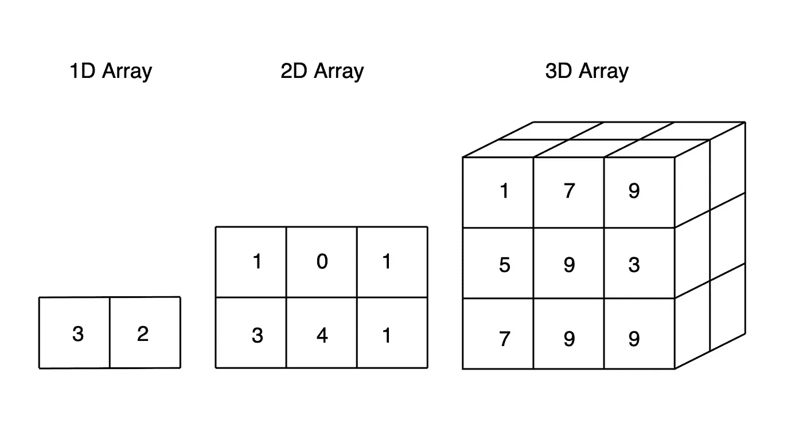

# Numpy 数组指南:在 Python 中生成和操作数组

> 原文：<https://towardsdatascience.com/numpy-array-cookbook-generating-and-manipulating-arrays-in-python-2195c3988b09?source=collection_archive---------10----------------------->

## 我的 numpy 数组清单



我曾经作为一名数据科学家毫无准备地走进一家公司。虽然我期望成为训练模型，但我的角色却是软件工程，这个应用程序使用了我所见过的最大量的 numpy。

虽然我已经多次使用`np.array()`将一个列表转换成一个数组，但我并没有为一行又一行的`linspace`、`meshgrid`和`vsplit`做好准备。

如果我想能够读写代码，我需要尽快熟悉 numpy。

这是我为自己构建的 numpy 数组函数和示例的精选列表。

我们将在第一部分介绍数组的背景信息，然后讨论一些高级函数，这些函数将帮助您更快地处理数据。

**目录:**1。阵列概述
2。生成数组
3。操纵数组

# 1)阵列概述

## 什么是数组？

数组是存储同类数据的数据结构。这意味着所有的元素都是同一类型。

Numpy 的数组类是`ndarray`，意思是“N 维数组”。

```
import numpy as nparr = np.array([[1,2],[3,4]])
type(arr)#=> numpy.ndarray
```

它是 n 维的，因为它允许根据初始化时传递的形状创建几乎无限维的数组。

**例如:** `np.zeros((2))`生成一个 1D 数组。`np.zeros((2,2))`生成一个 2D 数组。`np.zeros((2,2,2))`生成一个 3D 数组。`np.zeros((2,2,2,2))`生成一个 4D 数组。诸如此类…

```
**np.zeros((2))**
#=> array([0., 0.])**np.zeros((2,2))**
#=> array([[0., 0.],
#=>        [0., 0.]])**np.zeros((2,2,2))**
#=> array([[[0., 0.],
#=>         [0., 0.]],
#=> 
#=>        [[0., 0.],
#=>         [0., 0.]]])
...
```

## 数组与列表

*   数组比列表使用更少的内存
*   阵列有更多的功能
*   数组要求数据是同质的；列表不
*   数组上的算术运算类似于矩阵乘法

## 重要参数

**shape:** 表示数组维数的元组。形状为`(2,3,2)`的数组是一个 2×3×2 的数组。看起来像下面。

```
np.zeros((2,3,2))#=> array([[[0., 0.],
#=>         [0., 0.],
#=>         [0., 0.]],
#=> 
#=>        [[0., 0.],
#=>         [0., 0.],
#=>         [0., 0.]]])
```

**dtype:** 存储在数组中的值的类型。数组是同质的，所以我们不能混合多种数据类型，如字符串和整数。`dtype`的值可以是`np.float64`、`np.int8`、`int`、`str`或[几种其他类型](https://docs.scipy.org/doc/numpy/reference/arrays.dtypes.html)中的一种。

# 2)生成数组

## **零点**

生成具有指定形状的零数组。

当您希望在开始训练之前将 ML 模型中的权重初始化为 0 时，这很有用。这也常用于初始化一个具有特定形状的数组，然后用您自己的值覆盖它。

```
np.zeros((2,3))
#=> array([[0., 0., 0.],
#=>        [0., 0., 0.]])
```

## **一念之差**

生成具有指定形状的一个数组。

如果您需要在增量相减之前将值初始化为 1，这很有用。

```
np.ones((2,3))
#=> array([[1., 1., 1.],
#=>        [1., 1., 1.]])
```

## 空的

`np.empty()`与 0 和 1 略有不同，因为它没有在数组中预设任何值。有些人说初始化稍微快一点，但这可以忽略不计。

为了代码可读，在用数据填充数组之前初始化数组时，有时会用到这种方法。

```
arr = np.empty((2,2))
arr
#=> array([[1.00000000e+000, 1.49166815e-154],
#=>        [4.44659081e-323, 0.00000000e+000]])
```

## 全部

用给定值初始化数组。

下面我们用`10`初始化一个数组。然后是另一个有`['a','b']`对的数组。

```
**np.full((3,2), 10)**
#=> array([[10, 10],
#=>        [10, 10],
#=>        [10, 10]])**np.full((3,2), ['a','b'])**
#=> array([['a', 'b'],
#=>        ['a', 'b'],
#=>        ['a', 'b']], dtype='<U1')
```

## 排列

这可能是你在现实生活中见过最多的。它从一个“类数组”对象初始化一个数组。

如果您将数据存储在另一种数据结构中，但需要将其转换为 numpy 对象以便传递给 sklearn，这将非常有用。

```
li = ['a','b','c']
np.array(li)#=> array(['a', 'b', 'c'], dtype='<U1')
```

*注意:* `*np.array*` *还有一个参数叫做* `*copy*` *，可以设置为* `*True*` *来保证生成一个新的数组对象，而不是指向一个已有的对象。*

## _ 喜欢

有几个`_like`函数对应于我们已经讨论过的函数:`empty_like`、`ones_like`、`zeros_like`和`full_like`。

它们生成的数组与传入的数组形状相同，但具有自己的值。所以`ones_like`生成一个 1 的数组，但是你传递给它一个现有的数组，它取那个数组的形状，而不是你直接指定形状。

```
a1 = np.array([[1,2],[3,4]])
#=> array([[1, 2],
#=>        [3, 4]])np.ones_like(a1)
#=> array([[1, 1],
#=>        [1, 1]])
```

请注意第二个 1 的数组是如何呈现第一个数组的形状的。

## 边缘

用随机值生成一个数组。

当您希望将模型中预先训练的权重初始化为随机值时，这很有用，这可能比将它们初始化为零更常见。

```
np.random.rand(3,2)
#=> array([[0.94664048, 0.76616114],
#=>        [0.395549  , 0.84680126],
#=>        [0.42873   , 0.77736086]])
```

## 阿萨瑞

`np.asarray`是`np.array`的包装器，设置参数`copy=False`。参见上面的`np.array`。

## 阿兰格

生成一个值数组，其间隔设置在上限和下限之间。这是 numpy 版本的`list(range(50,60,2))`列表。

下面我们生成一个 50 到 60 之间的每秒值的数组。

```
np.arange(50,60,2)
#=> array([50, 52, 54, 56, 58])
```

## 林空间

生成两个其他数字之间间隔相等的数字数组。我们不是像`arange`那样直接指定区间，而是指定在上限和下限之间生成多少个数。

下面我们返回一个由 10 到 20 之间的 6 个数字和 0 到 2 之间的 5 个数字组成的数组。

```
np.linspace(10, 20, 6)
#=> array([10., 12., 14., 16., 18., 20.])np.linspace(0, 2, 5)
#=> array([0\. , 0.5, 1\. , 1.5, 2\. ])
```

请注意，我们是如何指定数组中元素的数量，而不是指定区间本身的。

## 网格

基于两个输入数组生成坐标矩阵。

这可能有点棘手。让我们看一个例子。生成 2 个数组并将它们传递给`np.meshgrid`。

```
x = np.array([1,2,3])
y = np.array([-3,-2,-1])

xcors, ycors = np.meshgrid(x, y) xcors
#=> [[1 2 3]
#=> [1 2 3]
#=> [1 2 3]]ycors
#=> [[-3 -3 -3]
#=> [-2 -2 -2]
#=> [-1 -1 -1]]
```

在这里，我们可以看到两个不同的矩阵输出，基于输入数组的值和形状。

但是不要把它想象成两个独立的矩阵。这些实际上是一对(x，y)坐标，代表平面上的点。下面我把它们组合起来了。

```
[[(1, -3), (2, -3), (3, -3)]
 [(1, -2), (2, -2), (3, -2)],
 [(1, -1), (2, -1), (3, -1)]]
```

# 3)操纵数组

## 复制

制作现有阵列的副本。

将一个数组赋给一个新的变量名将会指向原来的数组。你需要**小心**这种行为，这样你就不会无意中修改现有的变量。

考虑这个例子。虽然我们修改了`a2`，但是`a1`的值也会改变。

```
a1 = np.array([1,2,3])
a2 = a1a2[0] = 10
a1
#=> array([10,  2,  3])
```

现在比较一下这个。我们修改了`a2`但是`a1`没有改变…因为我们做了一个拷贝！

```
a1 = np.array([1,2,3])
a2 = a1.copy()a2[0] = 10
a1
#=> array([1, 2, 3])
```

## 形状

获取数组的形状。

在处理大规模多维数组时非常有用，因为无法观察维度。

```
a = np.array([[1,2],[3,4],[5,6]])
a.shape
#=> (3, 2)
```

## 使再成形

重塑数组。

这非常有用，我无法想象没有它会使用像 Keras 这样的库。让我们看一个创建和整形数组的例子。

生成一个数组。

```
a = np.array([[1,2],[3,4],[5,6]])
a
#=> array([[1, 2],
#=>        [3, 4],
#=>        [5, 6]])
```

检查它的形状。

```
a.shape
#=> (3, 2)
```

将阵列从 3x3 调整为 2x3。

```
a.reshape(2,3)
#=> array([[1, 2, 3],
#=>        [4, 5, 6]])
```

将数组展平为一维。

```
a.reshape(6)
#=> array([1, 2, 3, 4, 5, 6])
```

将阵列重新整形为 6x1 矩阵。

```
a.reshape(6,1)
#=>array([[1],
#=>       [2],
#=>       [3],
#=>       [4],
#=>       [5],
#=>       [6]])
```

将数组重塑为 3 维，2x3x1。

```
a.reshape(2,3,1)
#=> array([[[1],
#=>         [2],
#=>         [3]],
#=> 
#=>        [[4],
#=>         [5],
#=>         [6]]])
```

## 调整大小

类似于`reshape`但是它改变了原来的数组。

```
a = np.array([['a','b'],['c','d']])
a
#=>array([['a', 'b'],
#=>       ['c', 'd']], dtype='<U1')a.reshape(1,4)
#=> array([['a', 'b', 'c', 'd']], dtype='<U1')a
#=>array([['a', 'b'],
#=>       ['c', 'd']], dtype='<U1')a.resize(1,4)
a
#=> array([['a', 'b', 'c', 'd']], dtype='<U1')
```

注意调用`reshape`并没有改变`a`，但是调用`resize`却永久地改变了它的形状。

## 移项

转置一个数组。

在生成 pandas 数据框或进行计数或求和等聚合计算之前，我们可以交换行和列吗？

```
a = np.array([['s','t','u'],['x','y','z']])
a
#=> array([['s', 't', 'u'],
#=>        ['x', 'y', 'z']], dtype='<U1')a.T
#=> array([['s', 'x'],
#=>        ['t', 'y'],
#=>        ['u', 'z']], dtype='<U1')
```

注意所有的东西是如何在`s`和`z`之间的对角线上翻转的。

## 变平

将数组展平为一维并返回一个副本。

这实现了与下面的`reshape(6)`相同的结果。但是当您事先不知道数组的大小时,`flatten`会很有用。

```
a = np.array([[1,2,3],['a','b','c']])
a.flatten()
#=> array(['1', '2', '3', 'a', 'b', 'c'], dtype='<U21')a.reshape(6)
#=> array(['1', '2', '3', 'a', 'b', 'c'], dtype='<U21')
```

## 解开…的纠结

将类似数组的对象展平为一维。类似于`flatten`，但是它返回数组的视图而不是副本。

最大的好处是它可以用在非数组上，比如列表，而在列表中`flatten`会失败。

```
np.ravel([[1,2,3],[4,5,6]])
#=> array([1, 2, 3, 4, 5, 6])np.flatten([[1,2,3],[4,5,6]])
#=> AttributeError: module 'numpy' has no attribute 'flatten'
```

## hsplit

将数组水平分割成子数组。

您可以将这想象成将矩阵中的每一列拆分成自己的数组。

如果每一列描述一个对象，每一行是这些对象的一个时间段，则在 ML 中用于拆分时间序列数据。

```
a = np.array(
    [[1,2,3],
     [4,5,6]])
a
#=> array([[1, 2, 3],
#=>        [4, 5, 6]])np.hsplit(a,3)# #=> [array([[1],[4]]), 
# #=>  array([[2],[5]]), 
# #=>  array([[3],[6]])]
```

## vsplit

将数组垂直拆分成子数组。

您可以将这想象成将每一行拆分成自己的列。

如果每一行代表一个对象，每一列是这些对象的一个不同的特性，那么在 ML 中就很有用。

```
a = np.array(
    [[1,2,3],
     [4,5,6]])
a
#=> array([[1, 2, 3],
#=>        [4, 5, 6]])np.vsplit(a,2)#=> [array([[1, 2, 3]]), 
#=> array([[4, 5, 6]])]
```

## 堆

连接轴上的数组。

这本质上与`vsplit`和`hsplit`相反，它将独立的数组组合成一个数组。

沿着`axis=0`

```
a = np.array(['a', 'b', 'c'])
b = np.array(['d', 'e', 'f'])np.stack((a, b), axis=0)
#=> array([['a', 'b', 'c'],
#=>       ['d', 'e', 'f']], dtype='<U1')
```

沿着`axis=1`

```
a = np.array(['a', 'b', 'c'])
b = np.array(['d', 'e', 'f'])np.stack((a, b), axis=1)
#=> array([['a', 'd'],
#=>        ['b', 'e'],
#=>        ['c', 'f']], dtype='<U1')
```

# 结论

我认为这是 numpy 的基础。当您在工作中阅读现有代码或在线学习教程时，您会反复遇到这些函数。

熟悉以上内容意味着你不会陷入理解如何使用`meshgrid`来生成 matplotlib 图表的困境。或者如何快速添加维度，使您的数据符合 Keras 模型的输入要求。

有哪些你离不开的 numpy 函数？