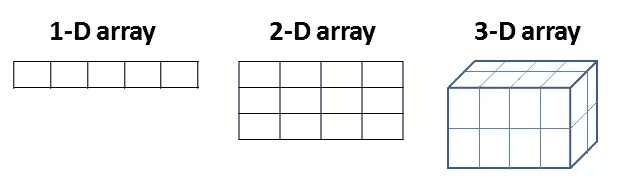

# NumPy 数组操作

> 原文：<https://towardsdatascience.com/numpy-array-manipulation-5d2b42354688?source=collection_archive---------26----------------------->

## 修改数组形状的实用指南

数据科学的一切都始于数据，数据有多种格式。数字、图像、文本、x 光、声音和视频记录只是数据源的一些例子。无论数据以何种格式传入，都需要转换成数字数组进行分析。复杂的计算机视觉模型无法像人类一样看到或处理图像。在分析之前，图像被转换成一组数字。因此，在数据科学中有效地存储和修改数字数组是至关重要的。NumPy(数字 Python)是一个科学计算包，它提供了非常实用的方法来创建和操作数字数组。


由[阿里·耶尔马兹](https://unsplash.com/@zamansizturk?utm_source=unsplash&utm_medium=referral&utm_content=creditCopyText)在 [Unsplash](https://unsplash.com/s/photos/calculation?utm_source=unsplash&utm_medium=referral&utm_content=creditCopyText) 拍摄的照片

在这篇文章中，我将介绍在 NumPy 中使用以下操作来操作数组形状的方法:

*   使再成形
*   扩展 _ 变暗
*   散开并弄平

如果你想了解 NumPy 的基础知识，你可以访问下面的帖子:

[](/the-most-underrated-tool-in-data-science-numpy-68d8fcbde524) [## 数据科学中最被低估的工具:NumPy

### NumPy 的强大功能以及如何有效地使用它

towardsdatascience.com](/the-most-underrated-tool-in-data-science-numpy-68d8fcbde524) 

让我们从导入 NumPy 开始:

```
import numpy as np
```

> 提示:就存储和处理而言，NumPy 数组比列表有效得多。

# **重塑**

Numpy 提供了灵活的工具来改变数组的维数。在更改维度之前，最好记住数组的维度是什么意思，以及不同维度的数组是什么样子:

```
a = np.random.randint(10, size=5)
a
array([9, 7, 3, 7, 5])a.ndim
1a.shape
(5,0)
```

我们还可以用 numpy 创建多维数组:

```
# 2-dimensional
b = np.zeros((3,4))b
array([[0., 0., 0., 0.],        
       [0., 0., 0., 0.],        
       [0., 0., 0., 0.]])b.ndim
2# 3-dimensional
c = np.ones((2,2,2))c
array([[[1., 1.],         
        [1., 1.]],

        [[1., 1.],         
         [1., 1.]]])c.ndim
3
```



有不同的方法来改变数组的维数。 **Reshape** 函数通常用于修改数组的形状和维度。我们只需要将新形状作为参数传递给 shape 函数:

> 提示:举例来说，我在创建数组时使用了不同的方法，这样您也可以熟悉如何创建数组。

```
np.arange(6)
array([0, 1, 2, 3, 4, 5])np.arange(6).reshape(2,3)
array([[0, 1, 2],        
       [3, 4, 5]])
```

shape (2，3)返回一个 2 行 3 列的二维新数组。因此，我们应用 reshape(2，3)的数组必须是 6 个元素。

让我们也使用 reshape 创建一个三维数组:

```
np.arange(8).reshape(2,2,2)array([[[0, 1],         
        [2, 3]],                 [[4, 5],         
         [6, 7]]])
```

reshape 函数的一个非常有用的特性是，如果不知道原始数组中元素的数量，可以将其中一个维度指定为“-1”。

因为我们几乎总是使用非常大的数组，所以键入(-1，1)而不是(100000，1)也很方便。

> 提示:调整数组形状时，新形状需要与原始形状兼容。

```
np.arange(6).reshape(-1,2)
array([[0, 1],        
       [2, 3],        
       [4, 5]])np.arange(6).reshape(-1,3)
array([[0, 1, 2],        
       [3, 4, 5]])
```

也可以在不改变元素顺序的情况下增加维度。我们可以通过整形(-1，1)或(1，-1)来实现:

```
np.random.normal(0,1,3)
array([-0.14788456,  0.01909406,  0.88659889])np.random.normal(0,1,3).reshape(-1,1)
array([[-0.14588167],        
       [ 0.06871804],        
       [ 2.32699261]])np.random.normal(0,1,3).reshape(1,-1)
array([[ 1.46812451,  0.48818206, -0.80228877]])
```

# **Expand_dims**

顾名思义， **expand_dims** 扩展一个数组的形状。

```
a = np.array([1,2,3])np.expand_dims(a, axis=0)
array([[1, 2, 3]])np.expand_dims(a, axis=1)
array([[1],        
       [2],        
       [3]])
```

轴参数允许选择通过哪个轴进行扩展。

axis=1 的 expand_dims 等效于 shape(-1，1)。

```
np.expand_dims(a, axis=1)
array([[1],        
       [2],        
       [3]])np.expand_dims(a, axis=1)
array([[1],        
       [2],        
       [3]])
```

# **拆卷压平**

Ravel 返回一个扁平数组。如果你熟悉卷积神经网络(CNN)，汇集的特征映射在馈送到完全连接的层之前被展平。该操作将二维数组转换为一维数组。

```
a = np.random.randint(10, size=(2,3))
aarray([[6, 8, 2],        
       [5, 1, 8]])np.ravel(a)
array([6, 8, 2, 5, 1, 8])
```

第二行连接在第一行的末尾。Ravel 函数还允许使用**顺序**参数进行列级连接:

```
np.ravel(a, order='F')
array([6, 5, 8, 1, 2, 8])
```

展平也执行相同的操作:

```
array([[3, 5, 2],        
       [6, 7, 8]])a.flatten()
array([3, 5, 2, 6, 7, 8])
```

松散和展平的区别:

*   Ravel:尽可能返回原始数组的视图。
*   Flatten:总是返回原始数组的副本。

因此，您在 flatten 返回的数组上所做的更改将永远不会在原始数组上进行。但是，如果通过 ravel 修改返回的数组，也可能会改变原始数组。让我们看一个例子来说明这一点:

```
array([[3, 5, 2],        
       [6, 7, 8]])a.flatten()[0] = 10
a
array([[3, 5, 2],        
       [6, 7, 8]])np.ravel(a)[0] = 10
a
array([[**10**,  5,  2],        
       [ 6,  7,  8]])
```

如你所见，我们在 ravel 上所做的改变也改变了原始数组。

感谢您的阅读。如果您有任何反馈，请告诉我。