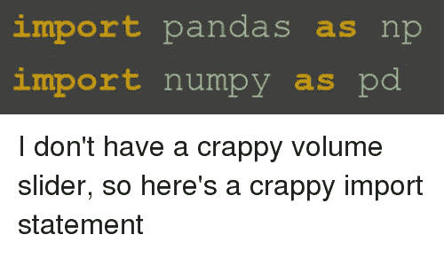
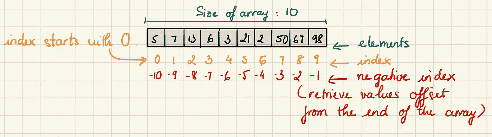
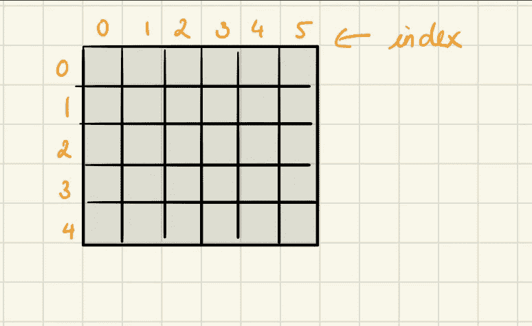
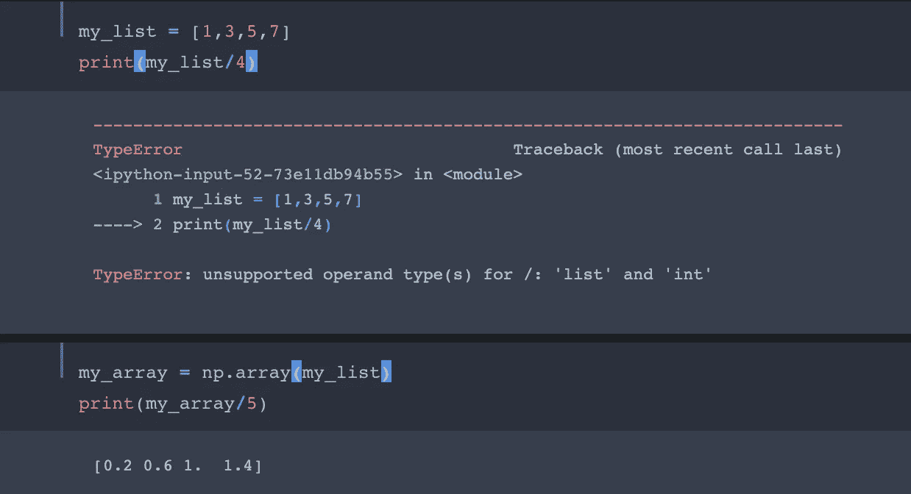
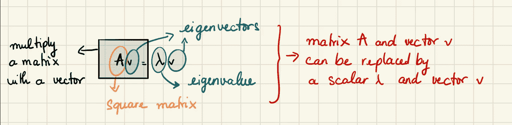
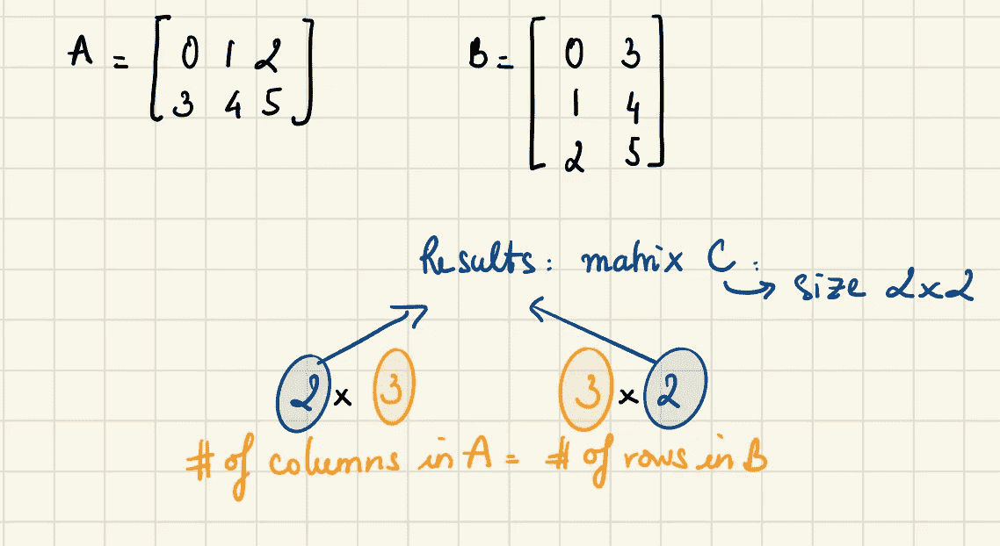
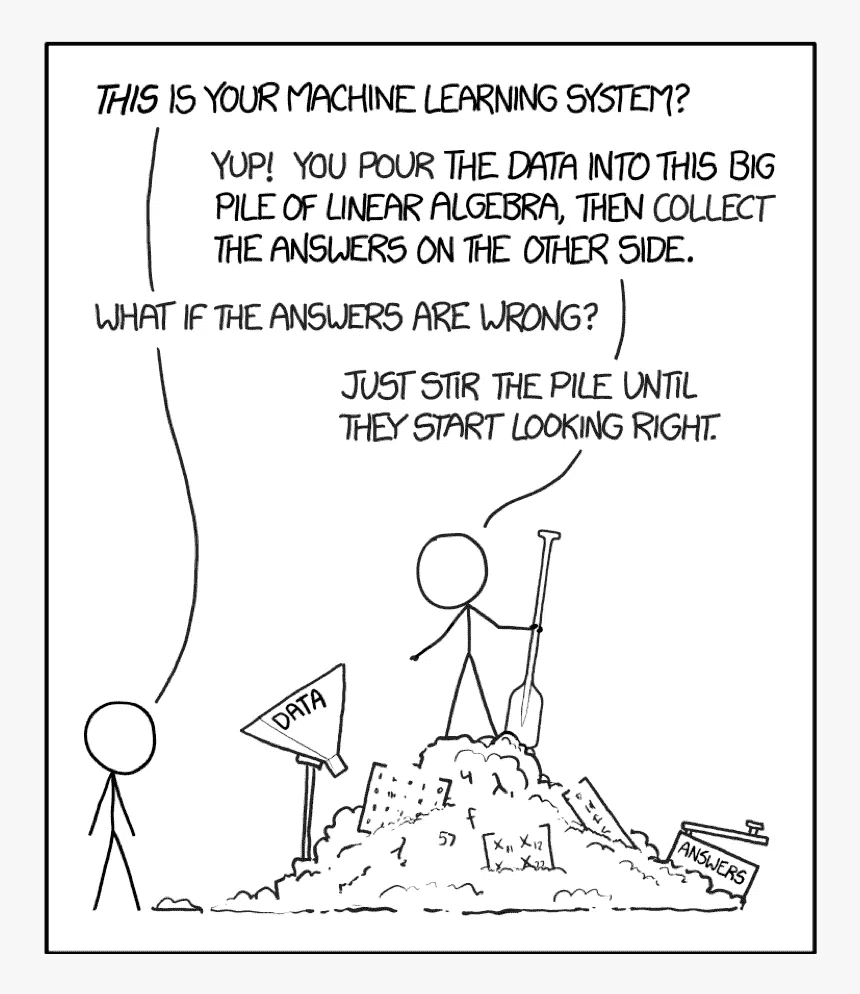

# Numpy 备忘单

> 原文：<https://towardsdatascience.com/numpy-cheat-sheet-4e3858d0ff0e?source=collection_archive---------9----------------------->

## Python Numpy 库基础的快速指南，包括代码示例。


查尔斯·德鲁维奥在 [Unsplash](https://unsplash.com?utm_source=medium&utm_medium=referral) 上的照片

NumPy 是一个库，它赋予 Python 快速处理数据的能力。与数据清理和操作相比，Numpy 有几个优点。它允许对机器学习中经常使用的数据结构进行有效的操作:向量、矩阵和张量。

当我第一次学习 NumPy 时，我很难记住所有需要的函数和方法。所以我把最常用的 Numpy 操作放在一起。我有时会回过头来看看这张便条，以唤起我的记忆。如果这对你的旅程有所帮助，我也很高兴。

这张纸条的结构是:

1.  n 维数组
2.  阵列形状操作
3.  数组上的数值运算
4.  数组操作例程(选择和分割)
5.  统计操作

这是一封长信，给自己泡杯茶，我们开始吧！

和往常一样，我们需要导入 NumPy 库:

```
import numpy as np
```



来源: [me.me](https://me.me/i/import-pandas-as-np-import-numpy-as-p-15191942)

# 1.n 维数组

## 什么是数组？

[数组](https://en.wikipedia.org/wiki/Array_data_structure)是存储相同类型元素的数据结构。存储在数组中的每一项称为一个元素。数组中元素的每个位置都有一个数字索引，用于标识元素。

## 1D vs 2D 阵列

1D 数组(即一维数组)存储同一数据类型的变量列表。使用索引可以访问每个变量。



1D 阵列

2D 数组(即多维数组)以由行和列组成的格式存储数据。



2D 阵列

## 数组与列表

*   数组比列表使用更少的内存
*   阵列有更多的功能
*   数组要求数据是同质的；列表不
*   数组上的算术运算类似于矩阵乘法

NumPy 用于处理数组。NumPy 中的数组对象叫做`ndarray`。

## 创建一个向量

要创建一个[向量](https://www.mathsisfun.com/algebra/vectors.html)，我们只需创建一个一维数组。就像向量一样，这些数组可以水平(即行)或垂直(即列)表示。

```
# Create 1 dimensional array (vector)
vector_row = np.array([1,2,3]) # Create vector as a row
>>> array([1, 2, 3])vector_column = np.array([[1],[2],[3]]) #Create vector as a column
>>> array([[1],
           [2],  
           [3]])
```

## 创建矩阵

为了创建一个[矩阵](https://en.wikipedia.org/wiki/Matrix_(mathematics))，我们可以使用一个 NumPy 二维数组。在我们的解决方案中，矩阵包含三行和两列。

```
matrix = np.array([(1,2,3),(4,5,6)]) # Two dimensional array
>>> array([[1, 2, 3],
          [4, 5, 6]])
```

## 创建稀疏矩阵

[稀疏矩阵](https://en.wikipedia.org/wiki/Sparse_matrix)是大部分元素为零的矩阵。稀疏矩阵只存储非零元素，并假设所有其他值为零，从而节省大量计算资源。

想象一个矩阵，其中列是媒体上的每篇文章，行是每个媒体读者，值是一个人阅读该特定文章的时间(分钟)。这个矩阵会有数万列和数百万行！然而，由于大多数读者不会阅读所有文章，因此绝大多数元素都是零。

比方说，我们想创建一个有两个非零值的 NumPy 数组，然后把它转换成一个稀疏矩阵。如果我们查看稀疏矩阵，我们可以看到只有非零值被存储:

```
from scipy import sparse
matrix_large = np.array([[0, 0, 0, 0, 0, 0, 0, 0, 0, 0],
                         [0, 1, 0, 0, 0, 0, 0, 0, 0, 0],
                         [3, 0, 0, 0, 0, 0, 0, 0, 0, 0]])# Create compressed sparse row (CSR) matrix
matrix_large_sparse = sparse.csr_matrix(matrix_large)
print(matrix_large_sparse)
>>>   (1, 1)	1
      (2, 0)	3
```

在上面的例子中，`(1, 1)`和`(2, 0)`分别代表非零值`1`和`3`的索引。例如，元素`1`位于第二行第二列。

## 创建特殊数组

`**np.zeros()**`函数返回给定形状和类型的新数组，用零填充。

```
# Create  1d array of zeros, length 3
np.zeros(3) 
>>> array([0., 0., 0.])# 2x3 array of zeros
np.zeros((2,3))
>>>array([[0., 0., 0.],
         [0., 0., 0.]])
```

函数返回一个给定形状和类型的新数组，用 1 填充。

```
# Create 3x4 array of ones
np.ones((3,4)) 
>>> array([[1., 1., 1., 1.],
           [1., 1., 1., 1.],
           [1., 1., 1., 1.]])
```

`**np.eye()**`函数返回对角线上有 1 而其他地方有 0 的矩阵。

```
# Create 5x5 array of 0 with 1 on diagonal (Identity matrix)
np.eye(5) 
>>> array([[1., 0., 0., 0., 0.],
           [0., 1., 0., 0., 0.],
           [0., 0., 1., 0., 0.],
           [0., 0., 0., 1., 0.],
           [0., 0., 0., 0., 1.]])
```

`**np.linspace()**`函数返回指定间隔内均匀分布的序列。

```
# Create an array of 6 evenly divided values from 0 to 100
np.linspace(0,100,6) 
>>> array([  0.,  20.,  40.,  60.,  80., 100.])
```

`**np.arange(start, stop, step)**`函数返回在给定范围内包含均匀间隔值的`ndarray`对象。

这些参数决定了值的范围:

1.  `start`定义数组中的第一个值。
2.  `stop`定义数组的结尾，不包含在数组中。
3.  `step`是定义数组中每两个连续值之间的间距(差)的数字，默认为`1`。

N 注:`step`不能为零。否则我们会得到一个`ZeroDivisionError`。如果增量或减量是`0`，我们就不能离开`start`任何地方。

```
# Array of values from 0 to less than 10 with step 3 
np.arange(0,10,3)
>>> array([0, 3, 6, 9])
```

`**np.full(shape, fill_value)**`函数返回一个指定形状的新数组，用`fill_value`填充。

```
# 2x3 array with all values 5
np.full((2,3),5)
>>> array([[5, 5, 5],
           [5, 5, 5]])
```

`**np.random.rand()**`函数返回指定形状的数组，并用随机值填充。

```
# 2x3 array of random floats between 0–1
np.random.rand(2,3)
>>> array([[0.37174775, 0.59954596, 0.50488967],
           [0.22703386, 0.59914441, 0.68547572]])# 2x3 array of random floats between 0–100
np.random.rand(2,3)*100
>>> array([[23.17345972, 98.62743214, 21.40831291],
           [87.08603104, 84.23376262, 63.90231179]])# 2x3 array with random ints between 0–4
np.random.randint(5,size=(2,3))
>>> array([[2, 3, 4],
           [4, 4, 0]])
```

# 2.阵列形状操作

## 形状

检查一个数组的形状和大小对于进一步的计算和简单地在一些操作后进行检查是有价值的。

NumPy 数组有一个名为`shape`的属性，它返回一个元组，每个索引都有相应元素的数量。

```
arr = np.array([(1,2,3),(4,5,6)])
arr.shape # Returns dimensions of arr (rows,columns)
>>> (2, 3)
```

在上面的例子中，`(2, 3)`表示数组有 2 个维度，每个维度有 3 个元素。

## 使再成形

了解如何重塑 NumPy 数组很重要，这样我们的数据才能满足特定 Python 库的期望。例如，Scikit- learn 要求输出变量`y`的一维数组的形状像一个二维数组，其中一列和每行的结果。

一些算法，如 Keras 中的长短期记忆递归神经网络，需要将输入指定为由样本、时间步长和特征组成的三维数组。

`reshape()`允许我们重新构建一个数组，这样我们可以维护相同的数据，但是它被组织成不同数量的行和列。

N 注:原矩阵和新矩阵的形状包含相同数量的元素(即相同的大小)

```
arr1 = np.arange(1, 11)  # numbers 1 to 10
>>> array([ 1,  2,  3,  4,  5,  6,  7,  8,  9, 10])print(arr1.shape) # Prints a tuple for the one dimension.
>>> (10,)
```

我们可以使用`reshape()`方法将我们的数组整形为一个 2 乘 5 维的数组。

```
arr1_2d = arr1.reshape(2, 5)print(arr1_2d)
>>> array([[ 1,  2,  3,  4,  5],
           [ 6,  7,  8,  9, 10]])
```

如果我们希望 NumPy 自动确定特定维度的大小/长度，那么将维度指定为-1，这实际上意味着“需要多少就有多少”例如，`reshape(2, -1)`表示两行和任意多列。

```
arr1.reshape(2, 5)
arr1.reshape(-1, 5)  # same as above: arr1.reshape(2, 5)
arr1.reshape(2, -1)  # same as above: arr1.reshape(2, 5)
```

## 移项

[转置](https://en.wikipedia.org/wiki/Transpose)是线性代数中的常见操作，其中每个元素的列和行索引被交换。

在最后一个例子中，`arr1_2d`是一个 2×5 维的数组，我们希望用它的列来交换它的行。

```
arr1_2d.T
>>> array([[ 1,  6],
          [ 2,  7],
          [ 3,  8],
          [ 4,  9],
          [ 5, 10]])
```

## 展平矩阵

`flatten()`是将一个矩阵转换成一维数组的简单方法。

```
arr1_2d.flatten()
>>> array([ 1,  2,  3,  4,  5,  6,  7,  8,  9, 10])
```

## 调整矩阵大小

`**resize(arr, new_shape)**`函数返回指定形状的新数组。
如果新数组比原数组大，那么新数组用`arr`的重复副本填充。

```
# Resize arr1_2d to 3 rows, 4 columns 
resize_arr = np.resize(arr1_2d, (3,4))
resize_arr
>>> array([[ 1,  2,  3,  4],
           [ 5,  6,  7,  8],
           [ 9, 10,  1,  2]])
```

## 矩阵求逆

矩阵 A 的[逆](https://en.wikipedia.org/wiki/Invertible_matrix)是这样一个矩阵，当乘以 A 时得到恒等式。一个很好的例子是在线性回归中寻找系数值的向量。

使用 NumPy 的线性代数`inv`方法:

```
matrix = np.array([[1, 2],
                   [3, 4]])# Calculate inverse of matrix
np.linalg.inv(matrix)
>>> array([[-2\. ,  1\. ],
          [ 1.5, -0.5]])
```

## 将数组转换为列表，反之亦然

当我第一次学习 Python 时，我经常遇到的一个错误——有时现在仍然会遇到——是这样的:



数组需要声明，而列表不需要声明，因为它们是 Python 语法的一部分。这就是列表比数组更常用的原因。但是在对我们的列表执行一些算术函数的情况下，我们应该用数组来代替。

如果我们想要存储大量数据，我们应该考虑数组，因为它们可以非常紧凑和高效地存储数据。

```
arr = np.array([(1,2,3),(4,5,6)])
>>> array([[1, 2, 3],
          [4, 5, 6]])arr_to_list = arr.tolist() # Convert arr to a Python list
>>> [[1, 2, 3], [4, 5, 6]]np.array(arr_to_list) # Convert list to array 
>>> array([[1, 2, 3],
          [4, 5, 6]])
```

描述阵列的其他有用函数:

```
arr.size # Return number of elements in arr
len(arr) #Length of arrayarr.ndim # Number of array dimension
arr.dtype # Return type of elements in arr
arr.dtype.name # Name of data type
arr.astype(int) # Convert an array to a different type
arr.astype(dtype) # Convert arr elements to type dtype
np.info(np.eye) # View documentation for np.eye
```

# 3.数组上的数值运算

## 迹(线性代数)

[轨迹](https://en.wikipedia.org/wiki/Trace_(linear_algebra))是一个方阵的所有对角元素的总和。

```
arr = np.array([[2, 0, 0], [0, 2, 0], [0, 0, 2]])
np.trace(arr)
>>> 6
```

## 决定因素

[行列式](https://www.mathsisfun.com/algebra/matrix-determinant.html)矩阵是一种特殊的数，可以从方阵中计算出来。计算矩阵的行列式有时会很有用。NumPy 用`det()`让这变得简单。

```
matrix = np.array([[1, 2, 3],
                   [2, 4, 6],
                   [3, 8, 9]])# Return determinant of matrix
np.linalg.det(matrix)
>>> 0.0
```

## 求矩阵的秩

矩阵的秩是矩阵中线性无关的行或列的数量的估计。知道矩阵的秩很重要。在解线性方程组时，秩可以告诉我们`Ax = 0`是有一个解还是多个解。

```
matrix = np.array([[1, 1, 3],
                   [1, 2, 4],
                   [1, 3, 0]])# Return matrix rank
np.linalg.matrix_rank(matrix)
>>> 3
```

## 求特征值和特征向量

许多机器学习问题可以用线性代数建模，其解来自[特征值和特征向量](https://en.wikipedia.org/wiki/Eigenvalues_and_eigenvectors)。



特征值和特征向量

在 NumPy 的线性代数工具集中，`eig`让我们计算任何方阵的特征值和特征向量。

```
matrix = np.array([[0, 1, 2],
                   [3, 4, 5],
                   [6, 7, 8]])# Calculate eigenvalues and eigenvectors
eigenvalues, eigenvectors = np.linalg.eig(matrix)
eigenvalues
>>> array([ 1.33484692e+01, -1.34846923e+00, -2.48477279e-16])
eigenvectors
>>> array([[ 0.16476382,  0.79969966,  0.40824829],
           [ 0.50577448,  0.10420579, -0.81649658],
           [ 0.84678513, -0.59128809,  0.40824829]])
```

## 标量运算

当我们对一个矩阵加、减、乘或除一个数时，这就叫做标量运算。在标量操作期间，标量值应用于数组中的每个元素，因此，该函数返回一个具有相同行数和列数的新矩阵。

```
new_arr = np.arange(1,10)
>>> array([1, 2, 3, 4, 5, 6, 7, 8, 9])# Add 1 to each array element
np.add(new_arr,1)
>>> array([ 2,  3,  4,  5,  6,  7,  8,  9, 10])
```

同样，我们可以使用下面的函数对矩阵进行减法、乘法或除法运算:

```
np.subtract(arr,2) # Subtract 2 from each array element
np.multiply(arr,3) # Multiply each array element by 3
np.divide(arr,4) # Divide each array element by 4 (returns np.nan for division by zero)
np.power(arr,5) # Raise each array element to the 5th power
```

## 矩阵运算

如果两个矩阵具有相同的维数，即它们必须具有相同的行数和列数，则只能将一个矩阵与另一个矩阵相加(或相减)。

矩阵相乘时，我们取第一个矩阵的行，乘以第二个矩阵对应的列。

注意:记住“行优先，列第二”



乘法矩阵

了解矩阵的形状是很重要的。然后矩阵操作使用 NumPy 库是简单的。

```
np.add(arr1,arr2) # Elementwise add arr2 to arr1
np.subtract(arr1,arr2) # Elementwise subtract arr2 from arr1
np.multiply(arr1,arr2) # Elementwise multiply arr1 by arr2
np.divide(arr1,arr2) # Elementwise divide arr1 by arr2
np.power(arr1,arr2) # Elementwise raise arr1 raised to the power of arr2
np.array_equal(arr1,arr2) # Returns True if the arrays have the same elements and shape
```

其他数学运算:

```
np.sqrt(arr) # Square root of each element in the array
np.sin(arr) # Sine of each element in the array
np.log(arr) # Natural log of each element in the array
np.abs(arr) # Absolute value of each element in the array
np.ceil(arr) # Rounds up to the nearest int
np.floor(arr) # Rounds down to the nearest int
np.round(arr) # Rounds to the nearest int
```

# 4.数组操作例程

## 添加/删除元素

`**append()**`函数用于将值追加到给定数组的末尾。

```
np.append ([0, 1, 2], [[3, 4, 5], [6, 7, 8]])
>>> array([0, 1, 2, 3, 4, 5, 6, 7, 8])np.append([[0, 1, 2], [3, 4, 5]],[[6, 7, 8]], axis=0)
>>> array([[0, 1, 2],
           [3, 4, 5],
           [6, 7, 8]])
```

沿其追加值的轴。如果没有给定轴，数组和值在使用前都被展平。

`**insert()**`:用于在数组的给定索引前插入元素。

```
arr = np.arange(1,6)
np.insert(arr,2,10) # Inserts 10 into arr before index 2
>>>array([ 1,  2, 10,  3,  4,  5])
```

`**delete()**`我们可以从`ndarray`中删除任何行和列

```
arr = np.arange(12).reshape(3, 4)
>>> [[ 0  1  2  3]
     [ 4  5  6  7]
     [ 8  9 10 11]]np.delete(arr,2,axis=0) # Deletes row on index 2 of arr
>>> array([[0, 1, 2, 3],
           [4, 5, 6, 7]])np.delete(arr,3,axis=1) # Deletes column on index 3 of arr
>>> array([[ 0,  1,  2],
           [ 4,  5,  6],
           [ 8,  9, 10]])
```

`**sort()**`函数可以用来对列表进行升序和降序排序。

```
oned_arr = np.array([3,8,5,1])
np.sort(oned_arr)
>>> array([1, 3, 5, 8])arr = np.array([[5, 4, 6, 8],
                [1, 2, 4, 8],
                [1, 5, 2, 4]])# sort each column of arr
np.sort(arr, axis=0)
>>> array([[1, 2, 2, 4],
           [1, 4, 4, 8],
          [5, 5, 6, 8]])# sort each row of X
np.sort(arr, axis=1)
>>> array([[4, 5, 6, 8],
          [1, 2, 4, 8],
          [1, 2, 4, 5]])
```

## 加入 NumPy 数组

连接意味着将两个或多个数组的内容放在一个数组中。在 NumPy 中，我们通过轴连接数组。我们传递一系列我们想要加入到`concatenate()`函数中的数组，以及轴。如果没有显式传递该轴，则该轴被视为 0。

```
# Adds arr2 as rows to the end of arr1
arr1 = np.array([1, 2, 3])
arr2 = np.array([4, 5, 6])
arr = np.concatenate((arr1, arr2), axis=0)
>>> array([1, 2, 3, 4, 5, 6])# Adds arr2 as columns to end of arr1
arr1 = np.array([[1, 2, 3],[4, 5, 6]])
arr2 = np.array([[7, 8, 9],[10, 11, 12]])
arr = np.concatenate((arr1,arr2),axis=1)
>>> array([[ 1,  2,  3,  7,  8,  9],
           [ 4,  5,  6, 10, 11, 12]])
```

## 拆分 NumPy 数组

酷，现在我们知道如何将多个阵列合并成一个。如何把一个数组拆成多个？我们使用`array_split()`来分割数组，我们传递给它我们想要分割的数组和分割的数目。

N 注意:如果数组的元素比要求的少，它将从末尾进行相应的调整。

```
# Splits arr into 4 sub-arrays
arr = np.array([1, 2, 3, 4, 5, 6])
new_arr = np.array_split(arr, 4) 
>>> [array([1, 2]), array([3, 4]), array([5]), array([6])]# Splits arr horizontally on the 2nd index
arr = np.array([1, 2, 3, 4, 5, 6])
new_arr = np.hsplit(arr, 2)
>>> [array([1, 2, 3]), array([4, 5, 6])]
```

## 选择元素

NumPy 为索引和分割数组中的元素或元素组提供了多种方法。

注意:NumPy 数组是零索引的，这意味着第一个元素的索引是 0，而不是 1。

假设我们有两个数组，一个包含 user_name，另一个存储这个人阅读的文章数量。

```
user_name = np.array(['Katie','Bob','Scott','Liz','Sam'])
articles = np.array([100, 38, 91, 7, 25])user_name[4] # Return the element at index 4
>>> 'Sam'articles[3] = 17 # Assign array element on index 1 the value 4
>>>array([100,  38,  91,  17,  25])user_name[0:3] # Return the elements at indices 0,1,2
>>> array(['Katie', 'Bob', 'Scott'], dtype='<U5')user_name[:2] # Return the elements at indices 0,1
>>> array(['Katie', 'Bob'], dtype='<U5')articles<50 # Return an array with boolean values
>>> array([False,  True, False,  True,  True])articles[articles < 50] # Return the element values
array([38,  7, 25])# Return the user_name that read more than 50 articles but less than 100 articles
user_name[(articles < 100 ) & (articles >50)]
>>> array(['Scott'], dtype='<U5')
```

我们使用类似的方法来选择多维数组中的元素:

```
arr[2,5] # Returns the 2D array element on index [2][5]
arr[1,3]=10 # Assigns array element on index [1][3] the value 10
arr[0:3] # Returns rows 0,1,2
arr[0:3,4] # Returns the elements on rows 0,1,2 at column 4
arr[:2] # Returns returns rows 0,1
arr[:,1] # Returns the elements at index 1 on all rows
```

# 5.统计操作

## 求最大值和最小值

通常我们想知道数组或数组子集的最大值和最小值。这可以通过`max`和`min`方法完成。使用`axis`参数，我们也可以沿某个轴进行操作:

假设我们将一个人每月的文章数量存储在一个数组中。

```
articles = np.array([[10, 23, 17],
                   [41, 54, 65],
                   [71, 18, 89]])# Return maximum element
np.max(articles)
>>> 89
np.max(articles, axis=0) *# Find maximum element in each column
>>>* array([71, 54, 89])
np.max(articles, axis=1) # Find maximum element in each row
>>> array([23, 65, 89])
```

我们可以用类似的方法找到最小元素:

```
np.min(arr) # Return minimum element
np.min(arr,exis=0)# Find minimum element in each column
np.min(arr,axis=1)# Find minimum element in each row
```

## 计算平均值、方差和标准差

就像使用`max()`和`min()`一样，我们可以很容易地获得整个矩阵的描述性统计数据，或者沿着单个轴进行计算。

```
np.mean(arr,axis=0) # Return mean along specific axis
arr.sum() # Return sum of arr
b.cumsum(axis=1) # Cumulative sum of the elements
np.var(arr) # Return the variance of array
np.std(arr,axis=1) # Return the standard deviation of specific axis
arr.corrcoef() # Return correlation coefficient of array
```

本笔记中的代码可在 [Github](https://github.com/Nothingaholic/Python-Cheat-Sheet/blob/master/numpy.ipynb) 上获得。

# 就是这样！

我认为这个音符是 NumPy 的基础。在工作中阅读现有代码或在线学习教程时，您可能会反复遇到这些函数。当我发现更多有用的 Numpy 函数时，我会不断更新它。

所有的学习活动都是在时间和经历中进行的。在几个小时内学会 Python 是不可能的。记住，任何努力最困难的部分是开始，你已经度过了，继续努力，继续努力！！！



来源:[模因](https://www.kindpng.com/imgv/TJTwob_meme-linear-algebra-funny-hd-png-download/)

# 资源

Numpy 是一个非常重要的库，几乎每个数据科学或机器学习 Python 包(如 SciPy、Matplotlib、Scikit-learn)都在一定程度上依赖于它。对基本面有很强的理解是很重要的。方便的是，有一些很棒的资源可以帮助完成这项任务。下面我列出了一些我最喜欢的，其中一些深入到线性代数的各个方面；如果您渴望了解更多信息，请查看它们！

1.  [线性代数，麻省理工](https://ocw.mit.edu/courses/mathematics/18-06-linear-algebra-spring-2010/)
2.  [深度学习的基础线性代数](/linear-algebra-for-deep-learning-f21d7e7d7f23)
3.  【NumPy 数组和 matrics 的区别
4.  [稀疏矩阵，SciPy 文档](https://docs.scipy.org/doc/scipy/reference/sparse.html)
5.  [NP . shape()一步一步来](/reshaping-numpy-arrays-in-python-a-step-by-step-pictorial-tutorial-aed5f471cf0b)
6.  [机器学习—特征值和特征向量](https://medium.com/fintechexplained/what-are-eigenvalues-and-eigenvectors-a-must-know-concept-for-machine-learning-80d0fd330e47)