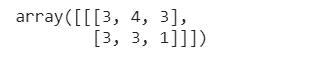
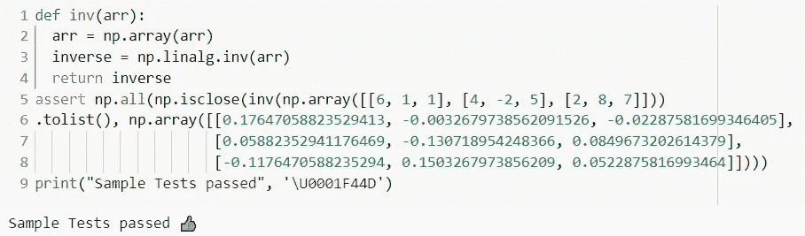
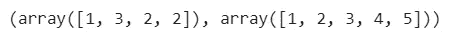

# NumPy 的备忘单:基本功能和鲜为人知的功能

> 原文：<https://towardsdatascience.com/numpy-cheatsheet-for-essential-functions-python-2e7d8618d688?source=collection_archive---------40----------------------->


(照片由[克里斯·利维拉尼](https://unsplash.com/@chrisliverani?utm_source=unsplash&utm_medium=referral&utm_content=creditCopyText)在 [Unsplash](https://unsplash.com/s/photos/mathematics?utm_source=unsplash&utm_medium=referral&utm_content=creditCopyText) 上拍摄)

## 终极指南

## 学习你可能不知道的 NumPy 的各种基本功能(用代码)

Numpy ( **代表数值 Python** )是 Python 编程语言中可用的库，支持矩阵数据结构和多维数组对象。这是我们需要学习的最基本的科学计算库，以开始我们在数据科学领域的旅程。

Numpy 可以计算**基本数学计算**以使创建高级机器学习和人工智能应用程序的过程更容易(通过使用库中可用的综合数学函数)。Numpy 允许我们**毫不费力地进行各种复杂的数学计算**以及几个补充库(如 matplotlib、pandas、scikit-learn 等)。)建在它上面。

这个库是每个数据科学专业人员高效处理和分析数据的一个很好的工具。此外，与 python 的 list 相比，使用 numpy 数组执行数学运算要容易得多。

Numpy 库中有各种可用的函数。在本文中，我们将学习本库的一些**基本**和**鲜为人知的函数，以及如何高效地实现它们。**

> **注意:在本文中，我们将使用** [**谷歌合作实验室**](https://colab.research.google.com/) **来执行我们的代码。**

## 导入数字

Numpy 可以通过使用以下代码简单地导入到笔记本中:

```
import **numpy** as **np**
```

***在这里，numpy 写成 np 是为了节省编码时的时间，也是数据科学界的事实。***

现在，让我们从 numpy 函数开始吧！

## 使用 numpy 创建 n 维数组

数组是 numpy 库中的一种数据结构，它就像一个可以存储值的**列表**，但不同之处在于，我们可以指定数组元素的数据类型(`dtype`函数)，数组速度更快，存储数据占用的内存更少，允许代码进一步优化。

要创建一个**一维数组**我们可以使用下面的代码:

```
import numpy as np
array = **np.array(**[1,2,3,4,5]**)**
```

创建**多维**数组的过程类似，我们只需在`[]`括号中添加更多的值:

```
array = **np.array(**[[1.1,2.2,3.0,4.6,5.0],[6.4,7.3,8.5,9.1,10.2]**)**
```

## numpy.linsapce()函数

这个`numpy.linspace()`函数用于在给定的区间内创建一个均匀分布的数组。我们还可以确定我们想要生成的样本数(但是，它是一个可选参数，缺省值设置为五十个样本)。我们可以添加到该函数的另一个可选参数是`restep`，如果`True`将返回`space`，即样本与列表之间的间距。功能是:`numpy.linspace(start, stop)`。让我们在一个例子中应用这个函数:

```
import numpy as np
import matplotlib.pyplot as plt
x = **np.linspace(0,10,10,dtype = int, retstep=True)**
print(x)
x = np.linspace(0,10,100)
y = np.sin(x)
plt.plot(x,y,color = 'orange')
plt.show()
```

正如我们在这里看到的，即使是计算数学函数，我们也在使用`numpy`库。我们使用`linspace()`函数生成等距值，并使用该数组绘制`sine`函数图。


(图片由[作者](https://medium.com/@beginningofthefuture) ) **正弦函数图使用 linspace()函数生成数值**

## 随机抽样函数

在这里，`numpy.random`函数帮助我们以各种方式计算随机值，比如以给定的形状生成随机值，通过从给定的 1D 数组中随机选择值来生成数组，或者随机置换给定数组或范围的序列。

*   **numpy . rand():**使用此函数，我们可以在给定的输入形状上创建一个均匀分布的值数组，范围为[0，1](即不包括“1”)。例如:

```
**np.random.rand**(3,4)
```

正如我们在本例中所看到的，shape (3，4)的数组是用范围在[0，1]内的所有值生成的。


(图片由[作者](https://medium.com/@beginningofthefuture) ) **生成随机值**

*   **numpy.random.choice():** 这个随机函数从给定的输入数组中返回一个随机样本数组。我们可以定义的其他可选参数是- `size`即数组的输出形状，`replace`即我们是否希望输出数组中有重复值，以及`p`即输入数组的每个给定样本的概率。看看下面的例子:

```
**np.random.choice**([1,2,3,4],(1,2,3),replace=True,p=[0.2,0.1,0.4,0.3])
```

这里，我们已经给函数提供了以下输入参数——一个具有四个元素的输入数组，输出数组的形状(上面代码中的`1`是我们想要作为输出的数组的编号，`2,3`是输出形状)，值的重复是`True`和每个样本的概率(其中值的总和应该等于 1)。



(图片由[作者](https://medium.com/@beginningofthefuture) ) **随机抽样使用 numpy.random.choice()**

*   **NP . random . permutation():**此函数返回一个随机排列的序列(对于输入数组)或排列的范围(对于单输入)。

```
arr = np.random.permutation(5)
print('Permutation of a range: ' + str(arr))
arr_ = np.random.permutation([1,2,3,4,5,6,7,8,9])
print('Permutation of elements of input array: ' + str(arr_))
```

在第一种情况下，我们返回了一个输入范围内的置换数组，在第二种情况下，我们返回了一个输入数组内的置换数组。


(图片由[作者](https://medium.com/@beginningofthefuture) ) **使用 numpy** 随机排列

> `***numpy.random***`中可用的功能不仅仅限于这些，您还可以在这里找到完整详尽的功能列表: [numpy 文档页面](https://docs.scipy.org/doc/numpy-1.14.0/reference/routines.random.html)。

## 数组的索引和切片

为了访问和修改数组的对象，我们使用索引和切片方法。长度为`**n**`的数组中第一个元素的索引值，从`**0**`值开始，数组最后一个元素的索引将为`**n-1**`。

```
a = [1,2,3,4,5,6]
b = a[3]
#output = 4
```

在上面的例子中，这个索引方法将返回数组的第四个元素`a.`

对于数组的基本切片(即，简单地说，拆分数组)，我们使用`**[start:stop:step_size]**`符号。

```
arr = np.array([0, 1, 2, 3, 4, 5, 6, 7, 8, 9, 10]
**arr[1:7:2]**
#output array([1, 3, 5])
```

**高级索引和切片:**对于多维数组，我们可以通过输入特定的行和列值(以`**[rows,column]**`格式)来索引和切片数组。为了更好地理解，请看下面的例子:

```
x = np.array([[ 0,  1,  2],
[ 3,  4,  5],
[ 6,  7,  8]])
**x[0:2,1:2]**
```

这里，我们选择了前两行的索引(即代码中的`0:2`)和索引为`1`(即代码中的`1:2`)的单列。


(图片由[作者](https://medium.com/@beginningofthefuture) ) **高级索引和切片**

## numpy.ravel()和 numpy.flatten()函数

这些函数返回输入数组的 1D 展平形式。

```
arr = np.array([[1,2], [3,4],[5,6]])
x = arr.flatten()
print(x)
y = arr.ravel()
print(y)
```


(图片由[作者](https://medium.com/@beginningofthefuture) ) **输出上面的代码**

您可能会观察到两个函数的输出是相同的！现在你可能想知道**这两个函数**有什么不同，因为它们的输出结果是一样的。很简单，在`numpy.flatten()`中创建原始数组的副本，而在`numpy.ravel()`中改变原始数组。此外，`numpy.ravel()`功能比`numpy.flatten()`快，因为它不占用任何内存。

## numpy.isclose()函数

此函数用于检查两个数组在容差范围内的元素是否相等，并返回一个布尔数组。`.isclose`函数数组可以用来`assert`(验证)你的代码。

```
def inv(arr):
  arr = np.array(arr)
  inverse = **np.linalg.inv**(arr)
  return inverse**assert** np.all(**np.isclose**(inv(np.array([[6, 1, 1], [4, -2, 5], [2, 8, 7]])).tolist(),np.array([[0.17647058823529413,-0.0032679738562091526, -0.02287581699346405],[0.05882352941176469, -0.130718954248366, 0.0849673202614379],[-0.1176470588235294, 0.1503267973856209, 0.0522875816993464]])))print("Sample Tests passed", '\U0001F44D')
```

在上面的例子中，我们正在使用另一个 numpy 函数`numpy.linalg.inv()`寻找给定矩阵的逆矩阵。之后，我们使用`assert`函数验证结果，并使用`numpy.isclose()`函数检查输出值是否接近真实值。只有当所有的值都是`True`时`assert` 函数才会起作用，否则它会给出一个断言错误。



(图片由[作者](https://medium.com/@beginningofthefuture) ) **实施。isclose()函数**

## numpy 中的堆栈数组

numpy 中有两个函数可用于堆叠不同的数组。

*   **numpy.hstack():** 此函数按列(即水平)堆叠数组，类似于沿第二个轴串联数组(除了 1D 数组，它沿第一个轴串联)。对于这个函数，输入数组应该是相同的形状(1D 数组除外，它可以是任意长度)。

```
a = np.array([[1,2],[3,4],[5,6]])
b = np.array([[7,8],[9,10],[11,12]])
**np.hstack**((a,b))
```


(图片由[作者](https://medium.com/@beginningofthefuture) ) **水平堆叠的数组使用。hstack()函数**

**numpy.vstack():** 这个函数按行(即垂直)堆叠数组，类似于 shape (N，)的一维数组被重新整形为(1，N)后沿第一个轴的数组的串联。对于这个函数，输入数组应该具有相同的形状(1D 数组必须具有相同的长度)。

```
a = np.array([[1,2],[3,4],[5,6]])
b = np.array([[7,8],[9,10],[11,12]])
**np.vstack**((a,b))
```


(图片由[作者](https://medium.com/@beginningofthefuture) ) **垂直堆叠的数组使用。vstack()函数**

## numpy 的统计功能

Numpy 库有一些有用的功能，可以用来发现见解和统计分析数据。我们可以计算平均值、中值、方差、标准差，计算一组数据的直方图，等等。

*   **numpy.mean():** 使用这个函数，我们可以计算给定数组的算术平均值，我们还可以指定轴。

```
arr = a = np.array([[1, 2], [3, 4]])
np.mean(a,axis=1)
**#output:** 
array([1.5, 3.5])
```

*   这个函数帮助我们计算一组数据的直方图。这里，我们必须输入一个我们想要计算直方图的数据的展平数组，我们还可以定义`bins`的数量(即给定范围内等宽面元的数量(可选))，以及面元上限和限制的`range`(可选)。

```
arr = np.array([1,2,3,2,2,3,4,5])
np.histogram(arr, bins= [1,2,3,4,5])
```



(图片由[作者](https://medium.com/@beginningofthefuture) ) **使用 numpy** 计算直方图

您也可以使用 matplotlib 库在绘图上显示直方图值。

> 你可以在这里找到其他的 numpy 统计函数: [numpy 文档页面](https://numpy.org/doc/stable/reference/routines.statistics.html)。

## 结论

我希望通过这篇文章，您一定已经了解了这个库的一些基本的和新的功能。为了更好地理解，我建议您尝试自己实现这些功能。

在日常使用中贯彻这些技巧，作为数据科学专业人士，一定会让你受益匪浅！

如果你有任何问题或意见，请发表在评论区。

如果你想了解如何可视化数据，并从中找到直观的见解，那么看看我们的另一篇文章:

[](/data-visualization-with-python-8bc988e44f22) [## 用 Python 实现数据可视化

### Master python 的数据可视化库

towardsdatascience.com](/data-visualization-with-python-8bc988e44f22) 

***最初发表于:***[](http://www.patataeater.blogspot.com/)

```
*Resources:
[https://numpy.org/](https://numpy.org/)
[https://numpy.org/doc/stable/](https://numpy.org/doc/stable/)*
```