# 数据科学的数字基础

> 原文：<https://towardsdatascience.com/numpy-essentials-for-data-science-25dc39fae39?source=collection_archive---------26----------------------->

## 帮助您掌握正确的 Numpy 主题以开始数据科学的参考指南


[https://images.app.goo.gl/zdDB2fSETvpprWok8](https://images.app.goo.gl/zdDB2fSETvpprWok8)

这是关于 NumPy 的两部分系列，第二部分将于 5 月 5 日出版。

数据科学爱好者最常见也是最重要的问题之一是关于数学先决条件以及如何对涉及矩阵和向量的方程进行编码。

嗯，我们有幸拥有一个核心科学计算 python 库，它消除了这种开销— [**NumPy**](https://numpy.org/) 是一个强大的开源科学包，它为我们提供了:

*   方法来处理 N 维数组和矩阵数据结构。
*   执行复杂数学运算的方法，包括统计、三角和代数函数。
*   测试线性代数、傅立叶级数和随机数生成能力的类和函数。

# Numpy 为什么这么重要？

下一个问题是，如果我们已经掌握了 python 中的列表，那么为什么还要使用 NumPy 呢？NumPy 在计算矩阵上的复杂数学方程时脱颖而出有几个原因:

*   NumPy 在 Python 中集成了 C/C++和 Fortran 代码，与 Python 相比执行速度更快。
*   Python list 是元素的异构集合，而 Numpy 数组是存储在连续内存位置的元素的同构集合，这导致了更快的访问和执行。
*   与 python 列表相比，使用 Numpy 数组执行简单的算术运算要容易得多。
*   对大型任务的子任务进行并行处理，从而以超快的速度执行大型数据阵列。

他的帖子涵盖了作为数据科学家/分析师应该练习的数字基础知识，让你的生活变得更轻松。

涵盖的主题:

*   安装和导入
*   Numpy 数组创建(1D 或多维)
*   索引和切片
*   NumPy 数组的属性
*   基本数学运算
*   数组操作函数

## 安装和导入

在我们开始讨论具体概念之前，请确保您已经将软件包安装在[您的环境](https://www.youtube.com/watch?v=t8AUwTDtno8&t=61s)中，她:

```
conda install numpy
```

或者可以用`pip install numpy`。

一旦包在[虚拟环境](/ideal-python-environment-setup-for-data-science-cdb03a447de8)中可用，我们必须使用以下语句将其导入我们的工作区(这里是 [jupyter notebook](/the-complete-guide-to-jupyter-notebooks-for-data-science-8ff3591f69a4) ):

```
import numpy as np
```

# Numpy 数组创建(N 维)

我们有许多数据类型可以作为 NumPy 对象使用，但主要关注点可能是:

## 一维数组

在关于 [Python 数据科学基础](/python-fundamentals-for-data-science-6c7f9901e1c8)的博客中，我们已经了解了 Python 列表是如何工作的，现在我们可以将我们的学习扩展到 NumPy 数组。我们可以选择创建称为`ndarray`的 N 维数组。

现在，与列表不同，numpy 数组只能有一种数据类型(int、float、strings 等)。这就是如何使用`np.array()`函数将 python 列表转换成 NumPy 数组。

```
arr = np.array([1,3,5.5,6,7])
```

检查这个数组`arr`的类型会给我们`numpy.ndarray`类对象。

## 多维数组

类似地，我们也可以使用下面的代码片段将 2D 列表转换为 2D numpy 数组:

```
md_arr = np.array([[1,2,3],[4,5,6]])
```

或者，您可以使用列表理解，并根据您的需要自动完成这一过程:

```
md_arr = np.array([[2*i +j **for** j **in** range(4)] **for** i **in** range(3)]) # creates the following md_arr array:
array([[0, 1, 2, 3],
       [2, 3, 4, 5],
       [4, 5, 6, 7]])
```

除了使用列表，我们还有一些内置的占位符函数，包括:

*   `np.zeros((3,4))` —创建一个形状为 3×4 的 2D 零数组
*   `d = np.arange(5, 20, 4` —创建一个等间距值的数组(步长值)
*   `np.linspace(0,2,9)` —创建一个等间距值(样本数)的数组
*   `np.full((2,2),7)` —创建一个 2 × 2 形状的 7 的常量数组
*   `np.eye(2)` —创建一个 2×2 单位矩阵
*   `np.random.random((2,2))` —用形状为 2×2 的随机值创建一个数组。
*   `np.empty((2,4))` —创建形状为 2×4 的空数组。

# 索引和切片

创建之后，您需要以不同的形式访问数组的元素。NumPy 数组从 0 开始遵循相同的索引样式。

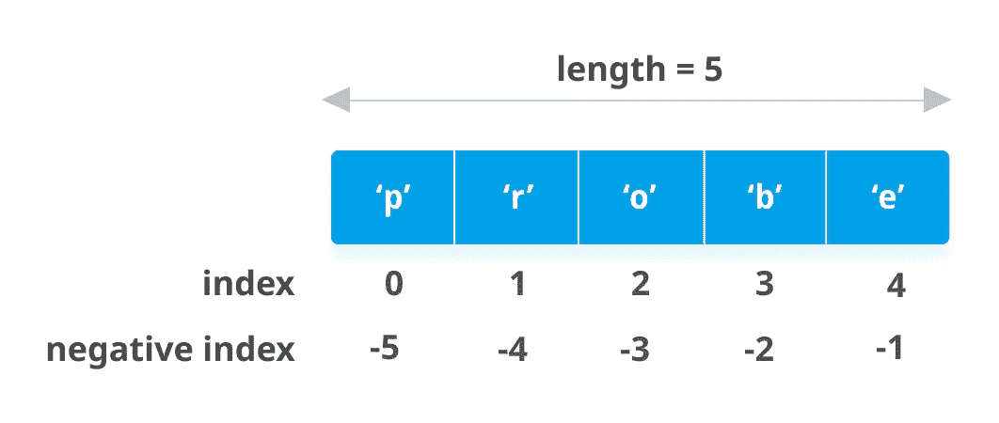

[https://images.app.goo.gl/8qVFZULxw7HLRejs7](https://images.app.goo.gl/8qVFZULxw7HLRejs7)

要访问数组的第 n 个元素，必须使用第(n-1)个索引。

```
arr = np.array([1,3,5,6,7])# to access the 3rd element i.e. 5, you writearr[2]
```

切片的工作方式也和 Python 列表中的一样。

```
arr = np.array([1,3,5,6,7])arr[1:3]
# this would return [3,5]
```

# 公共属性

有一个属性列表可用于检查您的阵列并了解其形状、大小、长度和其他方面。以下是您应该尝试的常见属性列表:

*   `shape` —告诉我们数组的形状。

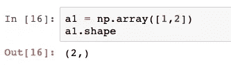

*   `len()` —返回数组的长度

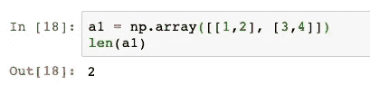

*   `ndim` —返回数组维数

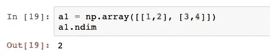

*   `astype()` —将值的数据类型转换为指定的类型

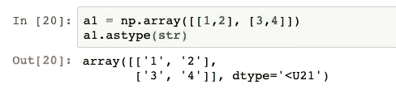

*   `dtype` —告诉我们数组中值的数据类型

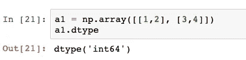

*   `size` —给出数组中元素的数量。

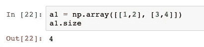

# 基本数学运算

为了计算数据列上的各种数学方程，这种操作非常方便。这里有几个非常重要的方法来计算 N-D 数组上的表达式

*   **矢量加法:**

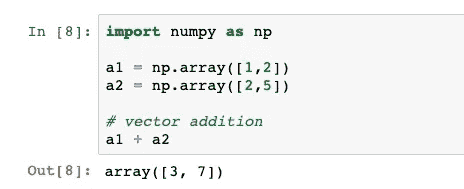

*   **向数组中添加一个标量**将反映在所有元素中，如下所示:

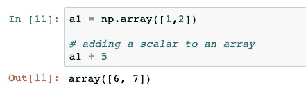

*   **两个数组的乘积**将两个数组的对应元素相乘:

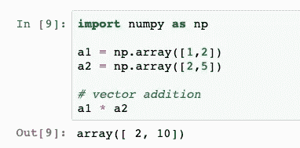

*   **使用`dot()`功能的两个矢量**的点积:

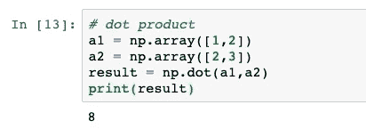

同样，您应该尝试其他算术运算，如`/`、`—`和**通用函数**，如`np.add()`、`np.subtract`、`np.divide()`等。

NumPy 还提供了创建一个数学序列的方法，该序列通常用于用遵循特定模式的随机数来测试一个假设。例如，如果我们需要遵循对数函数的一系列数字，我们可以使用`np.log()`方法:


我们可以利用的其他功能:

*   `np.cos()` —返回数组的余弦值。
*   `np.sqrt()` —返回数组中每个元素的平方根
*   `np.exp` —取幂函数

以及这里的许多其他人。

**统计聚合函数:**

*   `a.sum()` —数组中所有元素的总和。
*   `a.min()` —数组的最小值。
*   `b.max(axis=0)` —数组行的最大值
*   `b.cumsum(axis=1)` —元素的累积和
*   `a.mean()` —数组的均值。
*   `b.median()` —数组的中间值。

# 数组操作函数

在处理 N 维数组时，您经常需要处理矩阵或数组中的数据。您可能需要追加、删除、整形或拆分数组。NumPy 提供了以下功能，您一定要练习和理解:

*   使用`resize()`和`reshape()`方法改变阵列的形状:

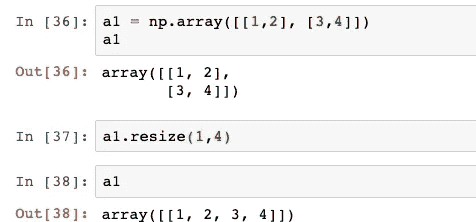

使用 resize 方法更改原始数组

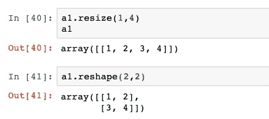

使用 reshape 不会改变原始数组 a1

*   使用`append()`、`insert()`和`delete()`方法追加和删除数组元素:

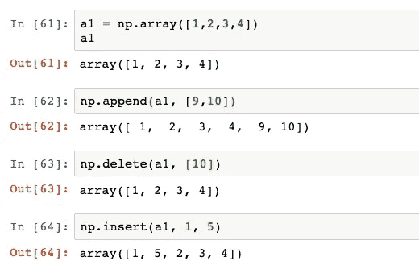

*   **转置数组**

转置被定义为通过选择用矩阵或 2D 阵列的列交换行来改变矩阵的形状。

这是一种重要的操作方法，当我们编写数学方程来寻找各种算法方程的解时，这种方法会派上用场。

我们可以使用返回输入数组转置的`transpose()`函数或者快捷方式`T` 属性方法。

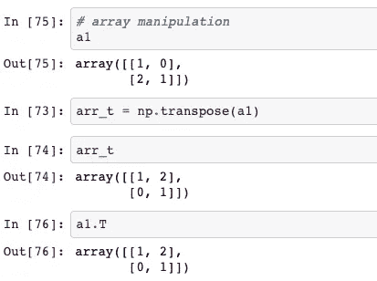

你可以在我的 GitHub 资源库中学习和实践[笔记本中的所有概念。](https://github.com/dswh/python_fundamentals/blob/master/Notebooks/Numpy_fundamentals.ipynb)

# 摘要

你应该从这篇文章中得到的要点是:

*   什么是 NumPy，在您的数据科学项目中轻松使用它是否重要？
*   为什么 NumPy 比使用简单的 python 列表更好。
*   编码机器学习算法和复杂分析项目中常用的重要数据结构、属性、运算和数学函数。
*   使用拆分、整形和转置函数操作多维数组的不同方式。

# Harshit 的数据科学

通过这个渠道，我计划推出几个涵盖整个数据科学领域的系列。以下是您应该订阅[频道](https://www.youtube.com/channel/UCH-xwLTKQaABNs2QmGxK2bQ)的原因:

*   该系列将涵盖每个主题和副主题的所有必需/要求的高质量教程。
*   解释了为什么我们在 ML 和深度学习中做这些事情的数学和推导。
*   与谷歌、微软、亚马逊等公司的数据科学家和工程师以及大数据驱动型公司的首席执行官的播客。
*   项目和说明，以实现迄今为止所学的主题。

你可以在 [LinkedIn](https://www.linkedin.com/in/tyagiharshit/) 、 [Twitter](https://twitter.com/tyagi_harshit24) 或 [Instagram](https://www.instagram.com/upgradewithharshit/?hl=en) 上与我联系(在那里我谈论健康和福祉。)