# 数据科学的 NumPy:第 1 部分

> 原文：<https://towardsdatascience.com/numpy-for-data-science-part-1-21e2c5ddbbd3?source=collection_archive---------25----------------------->

## NumPy 基础和数组创建

**作者图片**

**NumPy** 代表*数字 Python* 是 Python 中最重要的库(=包或模块)之一。本教程解释了 NumPy 的基础知识和数组创建的各种方法。它是为那些想学习 NumPy 的基础知识和各种功能的人编写的。为了充分利用本教程，您应该熟悉 Python 编程语言和面向对象编程(OOP)的概念。

## 话题讨论

*   **NumPy 基础:**导入 NumPy，ndarray，轴，秩，Ndarray 类的属性
*   **数组创建:** *array()* 函数，1d 数组，2d 数组，3d 数组， *arange()* 函数， *ones()* 函数， *zeros()* 函数， *identity()* 函数， *eye()* 函数， *full()* 函数，*randn()*函数
*   **创建向量:**行向量，列向量

# 导入 NumPy 库

为了使用 NumPy 库，您需要在您的程序中导入它，如下所示:

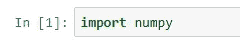

或者，您可以使用以下语法导入 NumPy 库。

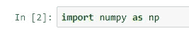

*按照惯例*，NumPy 库以别名 **np** 导入。通过这样做，您可以使用 ***np.namespace*** 访问 NumPy 库中的函数、类和子程序包。【例: ***np.array()*** ，***NP . random . randn()***]

# 恩达雷

NumPy 的主要对象是 **ndarray** (代表 **N 维数组**)。这个对象是同质数据的多维数组。 ***同构*** 是指数组中的所有元素都具有相同的数据类型。

**n array 对象**是从**n array 类**中创建的，后者有许多属性和方法。

# 斧头和等级

在 NumPy 中，一个数组的维数称为 ***轴*** ，维数称为 ***秩*** 。

# NumPy ndarray 类的基本属性(特性)

下面的列表显示了 ndarray 类的基本属性。ndarray docstring 中提供了带有描述的完整属性列表，可通过在 Python 解释器中调用***help(NP . ndarray)***来访问。

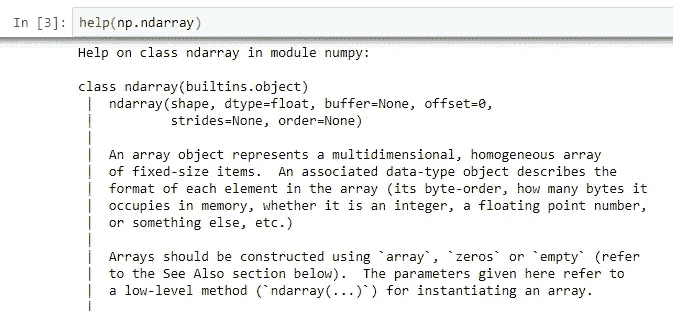

在 NumPy 库中获得关于 ndarray 类的帮助(图片由作者提供)

## 性能

*   **ndarray.ndim:** 数组的维数(轴数)。
*   **ndarray . shape:**N 个正整数的元组，指定每个维度的大小(元素个数)。对于具有 **m** 行和 **n** 列的矩阵，**形状**将为 **(m，n)** 。因此，**形状**元组的长度就是维数 **ndim** 。
*   **ndarray.size:** 数组中元素的总数。这等于**形状**的元素的乘积。
*   **ndarray.dtype:** 数组中元素的数据类型。

要获得 NumPy 中**n array 类**的特定属性的帮助，可以执行以下类型的命令。

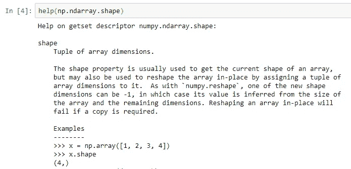

获取 NumPy 中 ndarray 类的 shape 属性的帮助(图片由作者提供)

# 使用 NumPy 的 Array()函数创建数组

您可以使用 NumPy 的 *array()* 函数从 Python 列表或 tuple 创建一个数组(ndarray 类的一个实例)。这个 *array()* 函数返回一个 ndarray 对象。

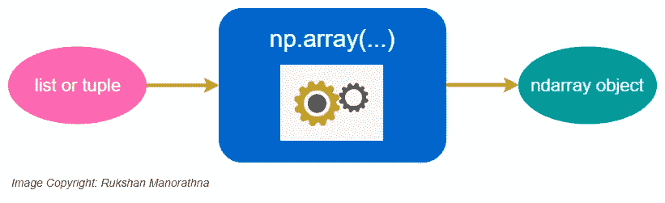

作者图片

要获得关于 NumPy *array()* 函数的帮助，可以执行以下命令。

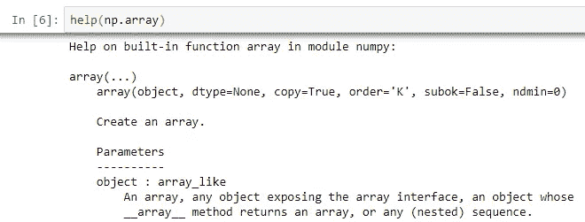

获取 NumPy array()函数的帮助(图片由作者提供)

**注意:**使用 NumPy 时，ndarray 中的数据被简单地称为*数组*。

## **创建 1D 数组**

顾名思义，1D 数组是一维的。

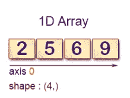

1D 数组的示例(图片由作者提供)

我们可以通过向 NumPy 的 *array()* 函数传递一个列表来创建一个 1D 数组。*一维数组作为行返回。*

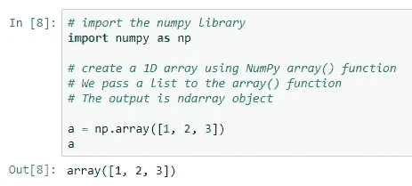

我们可以得到这个 ndarray 对象的属性:

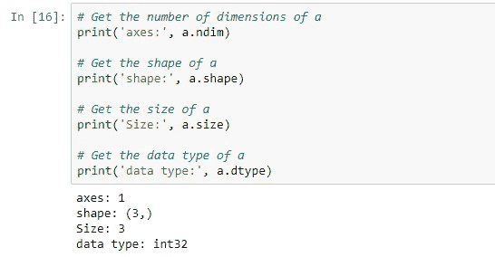

## **创建 2D 数组**

顾名思义，2D 数组是二维的。

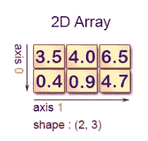

2D 数组的示例(图片由作者提供)

我们可以通过向 NumPy 的 *array()* 函数传递一个列表来创建一个 2D 数组。注意，这一次，列表的元素也是列表。*二维数组作为矩阵返回*。

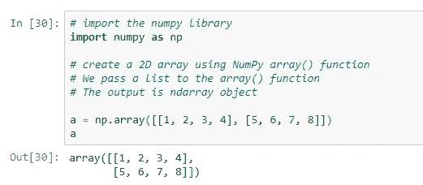

我们可以得到这个 ndarray 对象的属性:

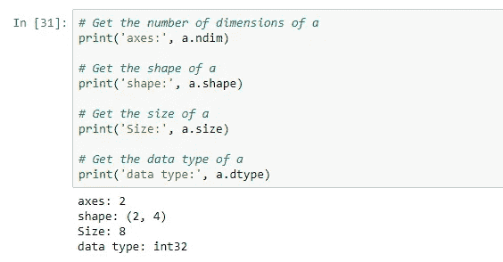

## 创建 3D 阵列

顾名思义，3D 阵列有三个维度。

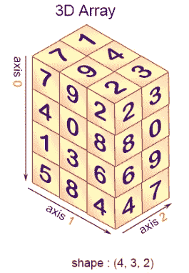

3D 数组示例(图片由作者提供)

我们可以通过向 NumPy 的 *array()* 函数传递一个列表来创建一个 3D 数组。*三维数组作为矩阵列表返回。*

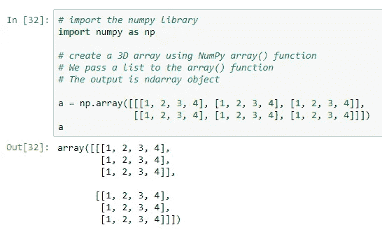

我们可以得到这个 ndarray 对象的属性:

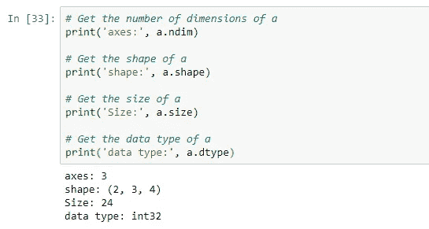

**注:***array()*函数将序列转换为一维数组，将序列的序列转换为二维数组，将序列的序列转换为三维数组，以此类推。

# 其他数组创建函数

除了 NumPy *array()* 函数之外，还有许多其他函数用于创建新数组。例如，*0()*和*1()*分别创建具有给定长度或形状的 0 或 1 的数组。

## arange()函数

*arange()* 是内置 Python 范围函数的数组值版本。

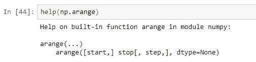

获取 NumPy arange()函数的帮助(图片由作者提供)

**参数**

*   **开始:**这是可选的，表示间隔的开始。间隔包括该值。默认值为 0。
*   **停止:**这是强制性的，表示间隔结束。间隔不包括该值。
*   **步骤:**这是可选的，表示值之间的间距。默认步长为 1。如果*步骤*被指定为位置参数，则*开始*也必须给出。

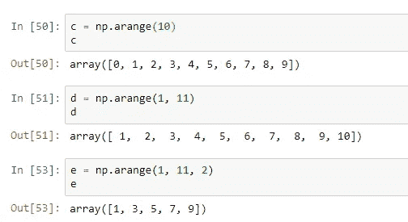

## ones()函数

返回一个给定形状和类型的数组，用 1 填充。默认情况下，创建的数组的 *dtype* 为 **np.float64** 。要创建一个一维数组，只需为形状参数传递一个正整数。要用 *ones()* 创建一个高维数组，可以为*形状*传递一个元组。

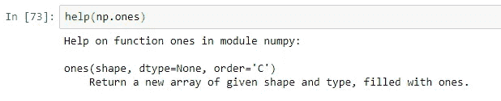

获取 NumPy ones()函数的帮助(图片由作者提供)

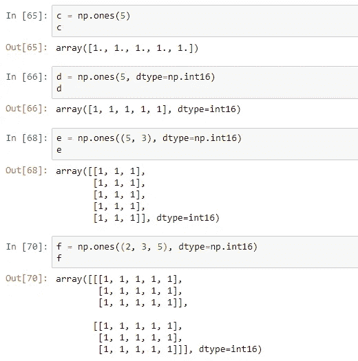

## zeros()函数

这与 *ones()* 完全相同，但创建了一个充满零的数组。

## identity()函数

*identity()* 返回一个主对角线上为 1，其他位置为 0 的正方形数组。 *dtype* 参数默认为浮点型。

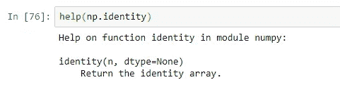

获取关于 NumPy identity()函数的帮助(图片由作者提供)

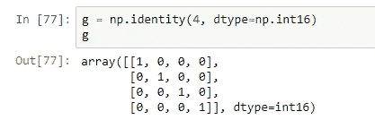

## eye()函数

*eye()* 返回一个 2D 数组，其中所有元素都等于零，除了第 ***k*** 条对角线的值等于一。 **N** 是行数。 **M** 是列数。如果不指定 **M** ，则默认为 **N** 。 **k** 是对角线的指数。 **0** (默认)指主对角线。正值表示上对角线，负值表示下对角线。

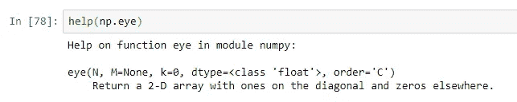

获取 NumPy eye()函数的帮助(图片由作者提供)

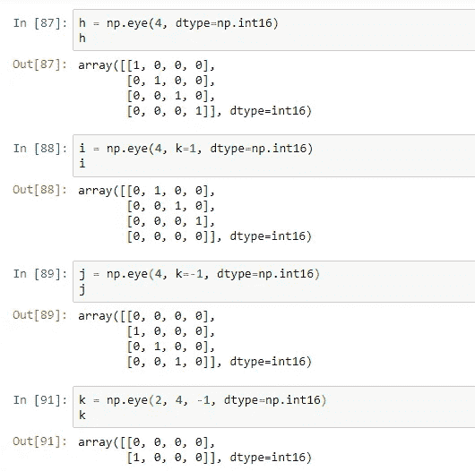

## 完整的()函数

*full()* 函数返回一个给定形状和类型的数组，用 *fill_value* 填充。对于一维数组， *shape* 只是一个整数。要用 *ful* l *()* 创建一个高维数组，可以为 *shape* 传递一个 tuple。

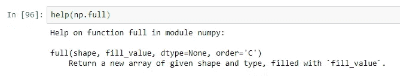

获取关于 NumPy full()函数的帮助(图片由作者提供)

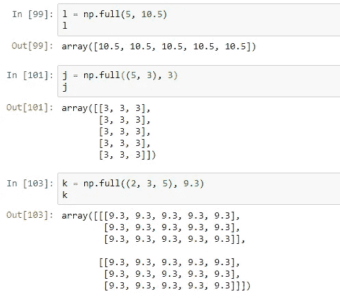

## random.randn()函数

NumPy *random* 子包的 *randn()* 函数返回一个数组，数组中的元素来自标准正态分布。返回数组的维数应该都是正数。如果没有给定参数，则返回一个 Python 浮点数。

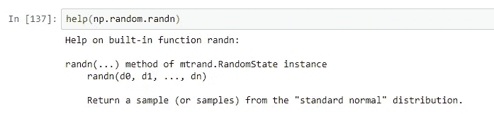

获得关于 NumPy 随机子包的 randn()函数的帮助(图片由作者提供)

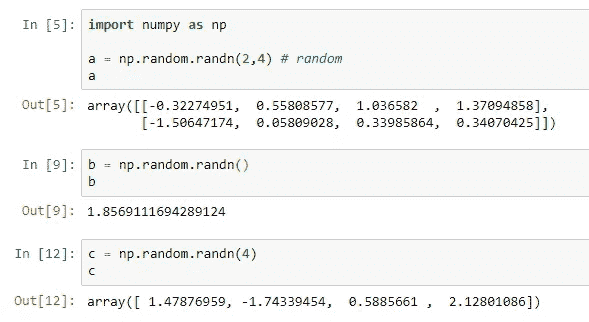

# 创建向量

## 单行矩阵

要创建行向量，我们只需创建一个包含一行的一维数组。

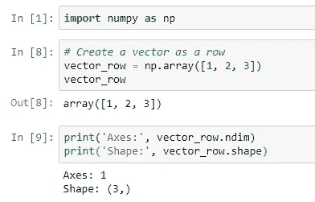

## 列向量

为了创建一个列向量，我们需要创建一个只有一列的二维数组。

**注意:**列向量是二维的，不是一维的。我们可以使用 ndarray.ndim 和 ndarray.shape 属性对此进行检查。

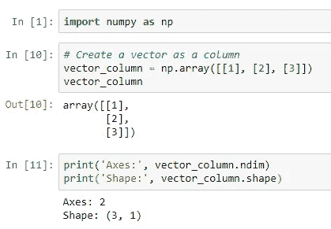

本教程由[*Rukshan Pramoditha*](https://www.linkedin.com/in/rukshan-manorathna-700a3916b/)*，*数据科学 365 博客作者设计创作。

## 本教程中使用的技术

*   计算机编程语言
*   NumPy
*   Jupyter 笔记本

2020–05–03