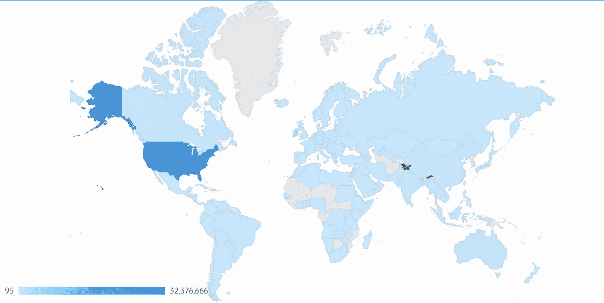

# 数字中的数字

> 原文：<https://towardsdatascience.com/numpy-in-numbers-1d235138e177?source=collection_archive---------38----------------------->

马库斯·斯皮斯克在 [Unsplash](https://unsplash.com?utm_source=medium&utm_medium=referral) 上的照片

关于最常用的 Python 库之一的统计数据

从计算机科学毕业生到数学专业学生，从数据科学家到软件工程师，从机械工程师到建筑学学生，Numpy 是典型的 Python 库。几乎每个人都知道这件事。我们都知道它很有名。但是在谷歌上搜索了几天后，我发现很难了解 Numpy 社区有多大。

所以，这里尝试用数字来捕获 **Numpy。**

Numpy 是一个 Python 包，存储在 PyPi 上。PyPi 通常被称为奶酪店，代表 Python 包索引。它是 Python 编程语言的软件仓库(还记得吗:Dockerhub，Maven？)

估计项目影响范围的一个好方法是去它的源头，知道有多少人下载了它。现在，有很多其他方法来计算社区(活跃用户数)。查看 PyPi 下载也有缺点(并不是所有的 PyPi 下载都转化为“用户”)。但是考虑到我能够收集的数据，这似乎是一个公平的评估。

## 30 天下载次数最多的 PyPi 包

排名 15: numpy(过去 30 天下载 45000 次)

## 30 天按类别付费下载

在过去的 30 天里，哪个类别对 ***numpy*** 下载量的贡献最大。

下面的 SQL 查询就是这样做的！

*   Pip 是 ***Numpy PyPi*** 下载使用最多的项目(43M)
*   家酿软件以 2.5 万的下载量屈居第 11 位
*   直到今天，我知道班德纳斯奇是

谷歌搜索

*   今天，我发现 bandersnatch 也是一个 *PyPi 镜像客户端。*

`pip install bandersnatch`

带有热图的表格(左)|树形图(右)

## Python 版本每周 Numpy 下载量

Python2 于 2019 年 12 月达到其 EOL(生命周期结束)时正式停产。更多信息—[https://www.python.org/doc/sunset-python-2/](https://www.python.org/doc/sunset-python-2/)

话虽如此，在过去的 4 周里，我们将继续跟踪 python 3+的其他版本。令人惊讶的是，2020 年 1 月仍有大量 py2.7 numpy(每周 400 万以上)。

*   Python 2.7 仍在使用中(徘徊在 450 万左右)
*   Python 3.6 是 Python 3 版本的标准。

堆积柱形图

## Numpy 下载的地理分布

为了了解各个国家的 ***Numpy*** 下载量，使用了这个查询。它揭示了有趣的事情

*   美国下载量为 3200 万次，其次是 IE(爱尔兰)300 万次。日德(各 1M)封顶 ***Numpy 国家*** 的 ***独角兽。***
*   澳大利亚、中国、印度、新加坡(亚太地区)在 50 万到 100 万之间。

> 我不得不承认，我很惊讶地看到爱尔兰排在第二，而中国和印度只有 50 万，远远低于美国的 3200 万。

地理地图|数字地图

谷歌数据工作室的积极方面是它能够使用国家代码检测国家，并将其转换为地理地图的值。然而，谷歌数据工作室的一个很大的限制是有限的功能和对阴影的限制。另一方面，Tableau 功能更强大，有很多定制和增强功能。

## Numpy 下载的时间分布

为了捕获随时间分布的 ***numpy*** 下载，使用了 SQL 的 group by 构造。

*   截至 1 月 19 日的数据显示，12 月是 Numpy 下载量最高的月份，下载量为 4600 万次。
*   由于一月份只有 19 天，它有望打破 12 月份的数字，因为目前它已经达到 3000 万(还差 1600 万)。
*   过去 6 个月的数据显示出积极(增长)的趋势

条形图(左)|圆环图(右)

感谢 Google 的 BigQuery，Data Studio & [分析 PyPi 包下载](https://packaging.python.org/guides/analyzing-pypi-package-downloads/)文章。