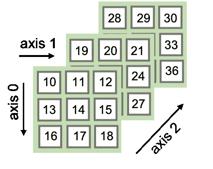
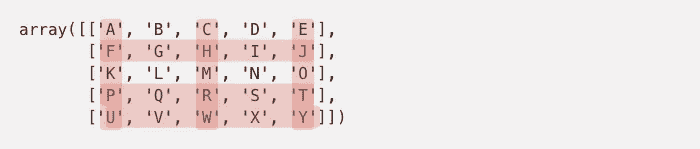
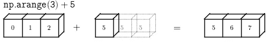
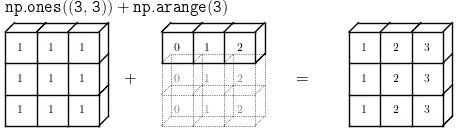
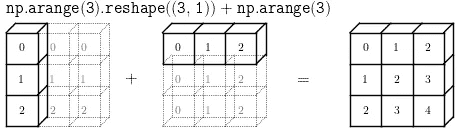
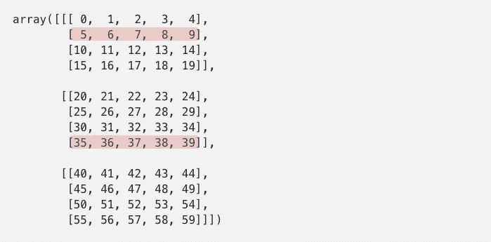
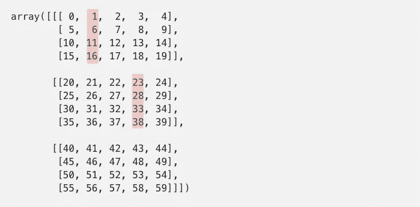

# NumPy 索引解释

> 原文：<https://towardsdatascience.com/numpy-indexing-explained-c376abb2440d?source=collection_archive---------15----------------------->

## 数字索引及其方法综合指南


让-路易·波林在 [Unsplash](https://unsplash.com/s/photos/rubik?utm_source=unsplash&utm_medium=referral&utm_content=creditCopyText) 上拍摄的照片

**NumPy** 是在 **Py** thon 中处理**Num**Eric 数据的通用标准。多维 NumPy 数组广泛用于 Pandas、SciPy、Scikit-Learn、scikit-image，它们是一些主要的数据科学和科学 Python 包。因此，如果我们使用这些工具**，那么很好地理解 NumPy 是至关重要的！**因此，要理解它的索引方法，我们将在本帖中讨论。

请注意，使用 NumPy 的一个关键方面或动机是，它能够以一种*向量化*的方式操作大量的数字数据，也就是说，避免使用低效的 python 循环。向量化你的代码的巨大优势是你把所有的循环都推到了 C 级，这要快得多。

现在让我们进入文章的主题，即**索引 NumPy 数组**。如果没有很好地理解 NumPy 的基本规则，那么使用 NumPy 进行索引可能会有点困难，而且有悖常理。在这里，我们将深入探讨可以使用的不同索引方法，它们是:

> - [基本切片和索引](https://docs.scipy.org/doc/numpy/reference/arrays.indexing.html#basic-slicing-and-indexing)
> 
> - [高级索引](https://docs.scipy.org/doc/numpy/reference/arrays.indexing.html#advanced-indexing)(包括整数和布尔数组索引)

**在这里** 找到这篇文章的笔记本版本以及所有解释 [**。**](https://github.com/AlexanderNixon/Machine-learning-reads/blob/master/NumPy-indexing-explained.ipynb)

# 基本切片

NumPy 的基本切片是 Python 的基本切片概念扩展到 *N* 维的延伸。

它基本上允许你使用基本的切片符号，即 **start:stop:step，沿着数组的维度对数组进行*切片*。**如果你不太熟悉 Python 的基本切片符号，你可以查看[这个](https://stackoverflow.com/a/509295/9698684)在堆栈溢出中的帖子，这就很清楚了。让我们看一个例子:

```
array([['A', 'B', 'C', 'D', 'E'],
       ['F', 'G', 'H', 'I', 'J'],
       ['K', 'L', 'M', 'N', 'O'],
       ['P', 'Q', 'R', 'S', 'T'],
       ['U', 'V', 'W', 'X', 'Y']])
```

是的，我知道 **z** 这个示例数组有一个形状为 **(5，5)，**的二维数组。我们可以沿着它的维度(我将使用等价术语*轴*)进行切片，例如:

```
a[:2, 1:4]array([['B', 'C', 'D'],
       ['G', 'H', 'I']])
```

到目前为止一切顺利。我们基本上已经沿着第一个轴对数组进行了切片，直到从索引 0 开始的第二行(注意*停止索引*不包括在内！)，并沿第二条得到第一到第三列。把坐标轴想象成矩阵的维度( *x，y，z* )。其中第三维可以简单地认为是将多个 2D 阵列堆叠在一起:



好了，现在我们知道我们可以使用 python 的切片符号对 n 维*数组进行切片。但是，如果您必须使用一个索引列表从给定的轴**中获取值，该怎么办呢？***

这就是高级索引发挥作用的地方↓

# 高级索引

让我们举一个直观的例子:

```
a_indexed = a[[4,3,1], [2,4,0]]
```

好的，按照与基本切片相同的逻辑，我们可以得到沿着 ndarray 的不同轴落入上述索引中的所有值。即*第 2、4、0 列的第 4、3、1 行的所有*值，所以下面突出显示的相交值:



是这样吗？让我们检查一下:

```
print(a_indexed)
array(['W', 'T', 'F'])
```

显然不是…(这个例子来自海梅·费尔南德斯的非常有启发性的演讲:)那里发生了什么？为什么我们得到的是一维的结果？

这是因为*高级步进遵循一套不同的规则。*考虑这个问题的一个好方法是，当使用基本切片时，我们在一个**网格**上建立索引，该网格由我们在每个维度上获取的切片定义。而使用高级索引可以被认为是指定一组我们想要检索的值的( *x，y* ) **坐标**。

在上述情况下，使用`[4,3,1],[2,4,0]`进行步进，将分别在`(4,2)`、`(3,4)`和`(1,0)`上进行步进。因此，我们在每个维度中指定的每个索引都将与其他维度中的相应索引相结合。

更一般地说，当使用高级索引时，我们必须考虑这两个主要方面(来自[文档](https://docs.scipy.org/doc/numpy/reference/arrays.indexing.html#advanced-indexing)):

*   ***索引数组表示该维度中的多个索引***

这基本上意味着我们将从一个给定的轴中检索与索引数组中指定的索引一样多的元素。在上面的例子中，我们已经检索了长度为 3 的索引数组指定的 3 个元素。

*   ***结果形状与(广播)步进阵列形状*** 相同

为了理解以上内容，我们需要深入了解一下**广播** …

深入广播很容易导致另一个完整的博客帖子，所以我将试图涵盖非常重要的内容…来自[文档](https://docs.scipy.org/doc/numpy/user/basics.broadcasting.html):

> 广播被定义为一个描述 NumPy 在算术运算过程中如何处理不同形状的数组的术语。受某些约束，较小的阵列在较大的阵列上“广播”,以便它们具有兼容的形状

所以基本上，当一些涉及不同形状的数组的操作被执行时，NumPy 试图在操作发生之前*使它们的形状兼容。*让我们来看一些直观的例子:



[图源](https://jakevdp.github.io/PythonDataScienceHandbook/02.05-computation-on-arrays-broadcasting.html)

例如，在第一种情况下，一维 NumPy 数组被添加到一个整数上。因此，在添加发生之前，NumPy 将*在较大的数组中广播*较小形状的数组，也就是说，它将复制其值，直到其形状与较大数组的形状兼容。

我们如何知道两种形状是否兼容？

我们可以在文档中找到[通用广播规则](https://docs.scipy.org/doc/numpy/user/basics.broadcasting.html#general-broadcasting-rules)。据说两个维度在下列情况下是相容的

*   *它们相等，或者说*
*   *其中一个是 1*

好的，那么所有这些和高级索引有什么关系呢？提醒第二点，高级索引*产生的形状与(广播)索引数组形状相同。*这基本上意味着在执行索引操作之前，NumPy 将尝试使索引数组中的图形兼容。检查结果形状的一个简单方法是使用`np.broadcast`(在数组可以广播的情况下)。让我们看看与上面相同的例子:

```
a = array([['A', 'B', 'C', 'D', 'E'],
           ['F', 'G', 'H', 'I', 'J'],
           ['K', 'L', 'M', 'N', 'O'],
           ['P', 'Q', 'R', 'S', 'T'],
           ['U', 'V', 'W', 'X', 'Y']])
```

假设我们现在想用以下内容索引数组:

```
rows = np.array([0,2,1])
cols = np.array([2])
```

因此，使用上面的索引，我们将得到一个形状如下的数组:

```
ix = np.broadcast(rows, cols)print(ix.shape)
(3,)
```

我们可以看到，上图中第一种情况下的广播正在发生。该阵列将在以下 *(x，y)* 坐标上进行索引:

```
print(*ix)
(0, 2), (2, 2), (1, 2)
```

因此我们得到:

```
a[rows, cols]
array(['C', 'M', 'H'])
```

其中，由于两个数组都被广播，所以上述内容相当于:

```
a[[0, 2, 1], [2, 2, 2]]
array(['C', 'M', 'H'])
```

因此，为了索引整数数组，我们只需确保它们的形状可以一起广播，然后让 NumPy 处理剩下的事情。

好了，现在我们知道了如何使用整数索引来索引一个数组…

[giff 来自 giphy](https://i.embed.ly/1/image?url=https%3A%2F%2Fmedia.giphy.com%2Fmedia%2FSU8uW4rBMMfR2Y3Dnh%2Fgiphy.gif&key=a19fcc184b9711e1b4764040d3dc5c07)

所以随之而来的问题是…

**如果我想让索引像基本切片**那样运行，该怎么办？也就是说，我们如何获得我们在第一种情况下所期望的，而不是`array(['W', 'T', 'F'])`？

让我们回到那个例子…我们使用了索引:

```
rows = np.array([4,3,1])
cols = np.array([2,4,0])
```

在这种情况下，正如我们之前所验证的，我们得到了一个一维数组，结果是:

```
ix = np.broadcast(rows, cols)print(*ix)
(4, 2) (3, 4) (1, 0)
```

所以我们必须找到一种方法让 NumPy 明白我们想要检索一个包含所有值的**网格**。如何做到这一点…？

[giff 来自 giphy](https://giphy.com/gifs/reaction-BmmfETghGOPrW)

答案是……要**用广播！！**

考虑到广播正在做的是*拉伸*较小的阵列，以便所有阵列形状都兼容，我们可以利用这个想法来获得我们预期的结果。

我们可以做的是给其中一个数组添加一个轴，这样 NumPy *就可以传播较小的数组来适应较大数组的大小(这里是指较小的数组)。这可以通过以下方式实现:*

```
rows[:,np.newaxis]
array([[4],
       [3],
       [1]])
```

或者我们可以等效地使用`rows[:,None]`。现在，两个索引数组可以一起广播，并可用于索引数组:

```
ix = np.broadcast(rows[:,None], cols)
print(*ix)
(4, 2) (4, 4) (4, 0) (3, 2) (3, 4) (3, 0) (1, 2) (1, 4) (1, 0)
```

我们可以认为这是生成索引列表的 [*笛卡尔积*](https://en.wikipedia.org/wiki/Cartesian_product) ，以便从数组中检索所有的索引。我们实际上可以用`[itertools.product](https://docs.python.org/3/library/itertools.html#itertools.product)`来复制这个:

```
print(*product(rows, cols))
(4, 2) (4, 4) (4, 0) (3, 2) (3, 4) (3, 0) (1, 2) (1, 4) (1, 0)
```

因此，现在通过用*广播*索引来索引数组，我们得到:

```
a[rows[:,None], cols]array([['W', 'Y', 'U'],
       ['R', 'T', 'P'],
       ['H', 'J', 'F']])
```

该广播也可以使用功能`np.ix_` **:** 来实现

```
a[np.ix_(rows, cols)]array([['W', 'Y', 'U'],
       ['R', 'T', 'P'],
       ['H', 'J', 'F']])
```

因此，正如我们所见，整数索引是一个非常有用的工具，我们只需要了解它是如何工作的。一个非常常见的应用是当我们有一个数组或嵌套的索引列表时，例如:

```
cols = [[3,4], [0,2], [0,1], [1,2], [3,3]]
```

我们想沿着第一轴分别取这些列，所以第一行的第 3 列和第 4 列，第二行的第 0 列和第 2 列，依此类推。我们如何做到这一点？你为什么不试一试…？

【giphy 的 gif

如前所述，在整数索引中，维度上的索引通过广播规则进行组合。因此，利用广播，我们想要获得一组索引，其组合形状是*可广播的*到期望的输出形状。这在本例中非常简单，因为每行都有一个子列表。因此，很明显，我们需要一个包含与第一个轴上索引的行数一样多的值的范围。

所以一个显而易见的方法是:

```
rows = np.arange(a.shape[0])
a[rows, cols]
```

然而，这将产生:

```
IndexError: shape mismatch: indexing arrays could not be broadcast together with shapes (5,) (5,2)
```

正如我们所看到的，错误是显而易见的，索引数组不能一起广播。这是因为沿相应轴的形状不兼容，因为我们有:

```
cols (2d array): 5 x 2
rows (1d array):     5 
```

从上面的草图可以清楚地看出，为了使形状兼容，我们必须向`rows`添加一个新轴，这样两个数组上的第二个轴具有相同的形状，并且行的第一个轴是 1，这满足广播的第二个规则:

```
cols         (2d array): 5 x 2
rows[:,None] (1d array): 5 x 1
```

现在我们会得到预期的结果:

```
a[rows[:,None], cols]array([['D', 'E'],
       ['F', 'H'],
       ['K', 'L'],
       ['Q', 'R'],
       ['X', 'X']])
```

现在，对于最后一部分… **是否有可能结合两种类型的索引**？

警告…！(这最后一部分变得有点复杂，并且您已经浏览了最相关和最有用的内容，所以可以休息一下，或者如果您认为现在已经看够了，就把它留在这里:)

【GIPHY 的 gif

# 结合高级索引和基本切片

也可以将基本切片和高级索引结合起来。这将导致整数数组索引以与我们之前看到的相同方式一起广播，并且切片的行为与我们在*基本切片*部分看到的一样。然而，在某些情况下，这可能会导致意想不到的结果。

让我们以下面的例子作为参考来更好地解释这一点:

```
a = np.arange(60).reshape(3,4,5)print(a)
array([[[ 0,  1,  2,  3,  4],
        [ 5,  6,  7,  8,  9],
        [10, 11, 12, 13, 14],
        [15, 16, 17, 18, 19]],

       [[20, 21, 22, 23, 24],
        [25, 26, 27, 28, 29],
        [30, 31, 32, 33, 34],
        [35, 36, 37, 38, 39]],

       [[40, 41, 42, 43, 44],
        [45, 46, 47, 48, 49],
        [50, 51, 52, 53, 54],
        [55, 56, 57, 58, 59]]])
```

对于组合索引，我们需要考虑以下指导规则:

*   ***整数数组索引规则仅在引入两个或更多非切片对象时适用***

这意味着如果我们只使用一个整数数组来索引，比如:

```
a_s = a[:2, [0, 1]]a_s.shape
(2, 2, 5)print(a_s)
array([[[ 0,  1,  2,  3,  4],
        [ 5,  6,  7,  8,  9]],

       [[20, 21, 22, 23, 24],
        [25, 26, 27, 28, 29]]])
```

因此，因为*基本切片*规则在这里适用，所以上述规则将等同于`a[:2,:2]`。

然而，一旦我们有了一个以上的索引数组，*高级索引*规则将适用:

```
a_s = a[:2, [0, 1], [2, 4]]a_s.shape
(2, 2)print(a_s)
array([[ 2,  9],
       [22, 29]])
```

我们可以看到，为最后一个轴添加一个索引数组，导致输出的形状取决于两个索引数组的广播形状，即(2，2)。

*   ***数组索引引入的结果轴在前面，除非它们是连续的***

让我们看一些例子来更清楚地了解这一点。以下面的索引对为例:

```
ix1 = np.array([0,1])
ix2 = np.array([1,3])
```

例如，我们可以分别使用`ix1`和`ix2`沿着前两个轴进行索引，并沿着最后一个轴进行完整的切片。在这种情况下，我们将得到 2D 数组 0 和1，分别为第 1 行和第 3 行，并且对于这两种情况都得到沿着最后一个轴的完整切片:

```
a_s = a[ix1, ix2, :]a_s.shape
(2, 5)print(a_s)
array([[ 5,  6,  7,  8,  9],
       [35, 36, 37, 38, 39]])
```

所以我们选择了这些元素:



注意，如前所述，这里两个*不同方法的规则*按预期工作并被组合。沿着最后一个轴的基本切片遵循第一节中提到的*基本切片*的规则，所以如果你用一个数组代替索引，你会得到:

```
ix3 = np.array([1,2])a[ix1, ix2, ix3]
array([ 6, 37])
```

我们也可以用以下方式索引:

```
a_s = a[:, ix1, ix2]a_s.shape
(3, 2)print(a_s)
array([[ 1,  8],
       [21, 28],
       [41, 48]])
```

所以在第一个轴上选择所有 2D 阵列的完整切片，然后分别选择行 0 和 1 以及列 1 和 3，所以:


因此，最后如果我们使用索引数组在第一个和最后一个轴上建立索引，如`a[ix1, :, ix2]`，我们将期望在前两个 2D *-* 数组上建立索引，在第二个轴(所有行)上取一个完整的切片，分别在第 1 列和第 3 列上。所以:



有了(4，2) **、**的最终形状，让我们检查一下:

```
a_s = a[ix1, :, ix2]s_s.shape
(2,4)print(a_s)
array([[ 1,  6, 11, 16],
       [23, 28, 33, 38]])
```

为什么这个案例不一样… **？？**

回到第二个规则:*由数组索引引入的结果轴在前面，除非它们是连续的。*因此，因为这里的索引数组不是连续的，所以使用它们的结果轴将在前面，切片维度在后面。

虽然用一维数组做索引看起来很奇怪，但是要考虑到也可以用任意维数的数组做索引。假设我们用 3d 数组在第一个和最后一个轴上索引同一个示例数组，两个数组的形状都是`(3,4,2)`。所以我们知道最终的数组在某个地方也会有形状`(3,4,2)`，因为两个索引数组传播到同一个形状。现在的问题是，*我们在第一个轴和最后一个轴*之间取一个完整的切片放在哪里？

鉴于不再清楚是否应该放在中间，在这些情况下有一个惯例，即切片维度放在最后*。*

因此，在这种情况下，我们的任务是重新排列数组的维数，以匹配我们的预期输出。在上面的例子中，我们可以交换最后两个轴，得到我们期望的结果:

```
a[ix1, :, ix2].swapaxes(0,1)array([[ 1, 23],
       [ 6, 28],
       [11, 33],
       [16, 38]])
```

这种情况下基本和移调一样，`a[ix1, :, ix2].T`。

因此，作为最后一节的**收获**，我们在组合两种索引方法时必须小心，因为我们可能不总是得到我们期望的。最安全的方法是牢记组合索引的注意事项，以确保它的行为符合我们的预期。

非常感谢你花时间阅读这篇文章，希望你喜欢:)