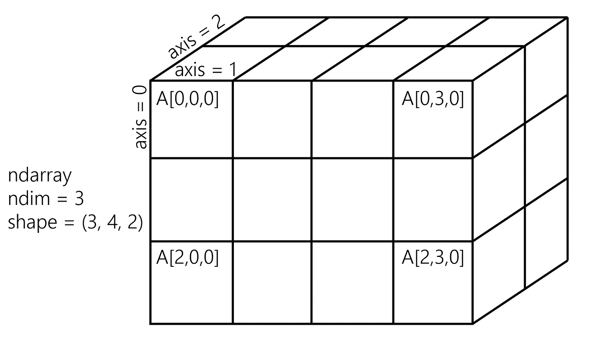
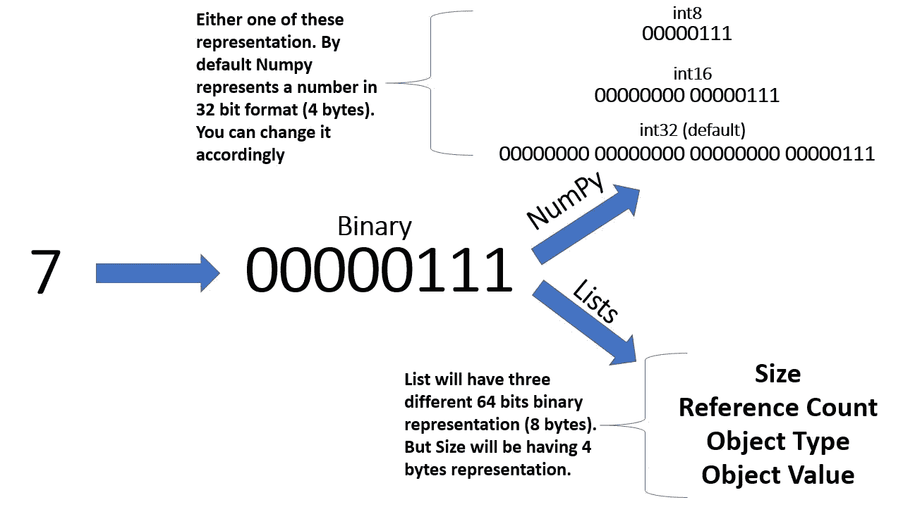
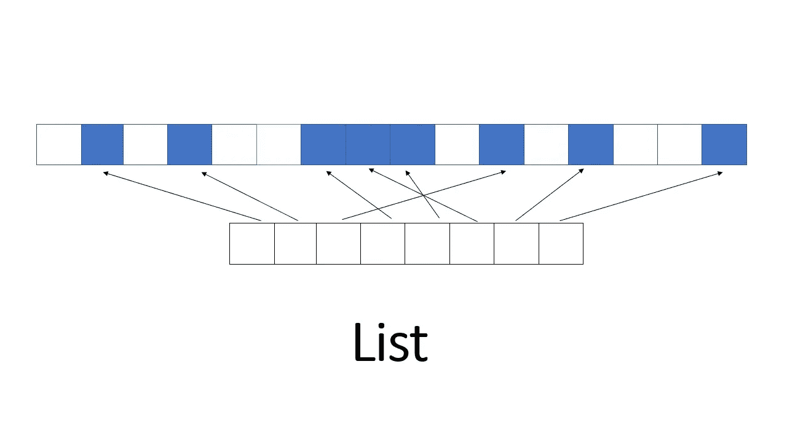
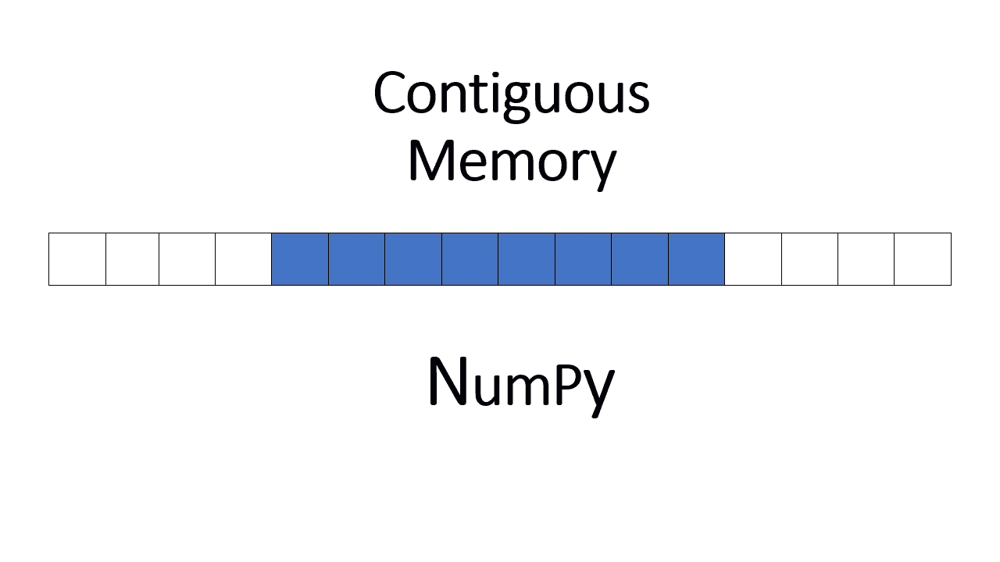

# NumPy——Python 的科学计算之王

> 原文：<https://towardsdatascience.com/numpy-the-king-of-scientific-computing-with-python-d1de680b811d?source=collection_archive---------50----------------------->

## 用于数据科学和机器学习的 Python

## NumPy 入门综合指南


Dilyara Garifullina 在 [Unsplash](https://unsplash.com?utm_source=medium&utm_medium=referral) 上拍摄的照片

ython 是我最喜欢的编程语言之一(我也喜欢 cpp)。由于其对初学者友好的语法，它非常容易学习。使它从其他编程语言中脱颖而出的是它令人敬畏的开发者社区。它预装了如此多的工具&库。并且是数据科学&机器学习领域最首选的语言之一。

> 在本文中，我将向您介绍 Python 中一个如此强大的库，名为 **NumPy。**
> 
> 享受旅程！！

# 内容:

1.  [什么是 NumPy？](#cef9)
2.  [数字对比列表](#e7cc)
3.  [安装](#ca14)
4.  [让我们从 NumPy 数组开始](#931b)
5.  [下面我们来盘点一下 NumPy](#71bb)
    a)[arange](#47a4)
    b)[零和一](#3784)
    c)[linspace](#a330)
    d)[eye](#d48e)
    e)[Random](#f5c7)
6.  [数组属性和方法](#cafe)
    a) [整形](#0799)
    b) [max，min，argmax，argmin](#08a6)
    c) [形状](#6582)
    d)[d 类型](#1d11)
7.  [数字索引和选择](#d946)
8.  [广播](#346e)
9.  [索引 2D 阵列(矩阵)](#ac02)
10.  [选择](#688c)
11.  [NumPy 运算](#2d38)
    a) [算术](#ca9c)
    b) [通用数组函数](#f2a8)
12.  [矢量化](#303b)
13.  [结论](#9059)
14.  [Github 资源库](#a0f4)
15.  [参考文献](#1790)
16.  [建议阅读](#3461)

# 1.什么是 NumPy

来源:[https://giphy.com/gifs/maths-DHqth0hVQoIzS](https://giphy.com/gifs/maths-DHqth0hVQoIzS)

> NumPy 是 python 的线性代数库。

1.  它是 python 中科学计算的核心库。
2.  它非常快，因为它绑定到 C 库。
3.  它提供了一个高性能的多维数组对象和工具来处理这些数组。



**多维数组**(来源:[https://ipython-books.github.io/](https://ipython-books.github.io/pages/chapter01_basic/images/numpy.png))

# 2.数字与列表

> 谁是赢家？


图片来自 [Pixabay](https://pixabay.com/?utm_source=link-attribution&utm_medium=referral&utm_campaign=image&utm_content=1424831) 的 [GraphicMama-team](https://pixabay.com/users/GraphicMama-team-2641041/?utm_source=link-attribution&utm_medium=referral&utm_campaign=image&utm_content=1424831)

> 让我们看看不同之处

*   **NumPy** 有固定的自然类型。NumPy 用于创建**同构** n 维数组。**列举了**可以是自然界中的异类。
*   在遍历 **NumPy** 数组时，我们不需要进行类型检查。另一方面，**列表中的**对象可以是类型 *int* 、 *boolean* 、 *string* 等。

***如果我们明确地提到 dtype，这段代码会给出一个错误:***

```
#heterogenous 1D array 
#gives an error in numpy
np_arr = np.array([1,2,"a",3,"b"], dtype=np.int32)
```

***这是一个有效的 python 代码列表:***

```
#heterogenous 1D array
arr = [1,2,"a",3,"b"]
```

> 数学运算不能在异构数据上执行。这就是为什么建议使用同构 **NumPy** 阵列的原因

让我们再举一个例子:

***这段代码会在 python 列表中给出一个错误:***

```
x = [1,2,3]
y = [4,5,6]#this will give an error,
#not possible in Lists
x*y
```

***但是这一个有效的代码为 NumPy:***

```
x = np.array([1,2,3])
y = np.array([4,5,6])x*y#Output
np.array([4,10,18])
```

在接下来的章节中，我们将了解更多关于 NumPy 的一些令人敬畏的特性。

> 假设我们有一个矩阵:

```
[[1,2,3],
 [4,5,6],
 [7,8,9]]
```

我们将分析矩阵中的数字`7`。

计算机读取二进制信息。

默认情况下 **Numpy** 将`7`存储在 4 字节的总存储空间中。

另一方面在**列表**中，需要为整数`7`存储大量信息。

列表使用 python 内置的`int`类型。

内置的`int`型由四种不同的东西组成:

## 大小

描述该特定整数值的大小。

## 引用计数

它告诉我们这个特定的整数(这里是`7`)被指向了多少次。

> Python 中的每个变量都只是一个对象的引用(指针)。不是实际值本身。
> 
> 因此，为了跟踪引用，每个对象(偶数)都有一个额外的字段，称为**引用计数**，当创建或删除指向该对象的指针时，引用计数会增加或减少。

## 对象类型

它告诉对象是否是 int，boolean，string 等。

## 目标值

它有自己的二进制表示

> 高达 64 位……..000000000000000111(8 字节)
> 
> 像这样，我们也有二进制表示的**大小**、**引用计数**、**对象类型。**

> 所以基本上读取更少字节的内存会更快。
> 
> 我们可以清楚地看到，对于单个整数存储，Numpy 比 Lists 占用更少的内存！！

> 请看这幅插图



作者图片

我们清单上的数据将分散在计算机的内存中。它没有连续的内存块。该列表将只包含指向这 8 个内存块的指针。



作者图片

另一方面，NumPy 数组在计算机中有连续的内存块。所有 8 个街区都紧挨着。



作者图片

> 所以从上面的分析中可以看出，列表非常慢，而 NumPy 非常快！！
> 
> NumPy 拥有猎豹般的速度；)

资料来源:https://giphy.com/gifs/animal-running-7lz6nPd56aHh6

# 3.装置

我将推荐您使用 Anaconda 发行版安装 Python，以确保所有底层依赖项(如线性代数库)与 conda install 的使用同步。

> 请参考此链接了解更多关于 anaconda 安装的信息:

[安装— Anaconda 文档](https://docs.anaconda.com/anaconda/install/)

如果您有 Anaconda，请在您的终端或命令提示符下安装 NumPy，并开始键入:

```
conda install numpy
```

如果您没有 Anaconda 发行版，也可以使用:

```
pip install numpy
```

# 4.让我们从 NumPy 数组开始:

我们将讨论向量和矩阵。

> **向量是严格的一维数组，矩阵是二维数组**
> 
> **注意:矩阵仍然只能有一行或一列**

> 首次进口数量

```
import numpy as np
```

> 让我们使用 python 列表创建 NumPy 数组

***代码 1:***

```
#define
just_a_list = [1,2,3]#show
just_a_list
```

***输出:***

```
[1, 2, 3]
```

现在我们将把上面的*代码 1* 片段变量`just_a_list`转换成 NumPy 数组。

***代码 2:***

```
np.array(just_a_list)
```

***输出:***

```
array([1, 2, 3])
```

***代码 3:***

```
#define
just_a_matrix = [[1,2,3],[4,5,6],[7,8,9]]#show
just_a_matrix
```

***输出:***

```
[[1, 2, 3], [4, 5, 6], [7, 8, 9]]
```

现在我们将把上面的*代码 3* 片段变量`just_a_matrix`转换成 NumPy 2d 数组

***代码 4:***

```
np.array(just_a_matrix)
```

***输出:***

```
array([[1, 2, 3],
       [4, 5, 6],
       [7, 8, 9]])
```

# **5。我们来看看 NumPy 的一些内置方法:**

# a)范围

> 它返回给定间隔内均匀分布的值。
> 
> 这和 Python 自己内置的 range 函数非常相似。
> 
> 输出中排除了上限。

***代码 1:***

```
np.arange(0,20)
```

***输出:***

```
array([ 0, 1, 2, 3, 4, 5, 6, 7, 8, 9, 10, 11, 12, 13, 14, 15, 16, 17, 18, 19])
```

***代码 2:***

```
#step size of 2
np.arange(0,10,2)
```

***输出:***

```
array([0, 2, 4, 6, 8])
```

在上面的代码片段中，2 是步长。正如您在输出中所看到的，该系列以差值 2 递增。

# b)零和一

## 让我们生成 0 或 1 的数组

***代码 1:***

```
np.zeros(4)
```

***输出:***

```
array([0., 0., 0., 0.])
```

所以基本上`np.zeros(4)`返回一个填充了 4 个零的新数组。

***代码 2:***

```
np.zeros((3,3))
```

***输出:***

```
array([[0., 0., 0.],
       [0., 0., 0.],
       [0., 0., 0.]])
```

`np.zeros((3,3))` 返回用零填充的 shape (3，3)矩阵。Shape (3，3)是指 3 行& 3 列。

***代码 3:***

```
np.ones(4)
```

**输出:**

```
array([1., 1., 1., 1.])
```

在上面的代码片段中，`np.ones(4)`返回一个填充了 4 个 1 的新数组。

***代码 4:***

```
np.ones((3,3))
```

**输出:输出:**

```
array([[ 1.,  1.,  1.],
       [ 1.,  1.,  1.],
       [ 1.,  1.,  1.]])
```

# c) linspace

> 返回指定间隔内等间距的数字。

***代码 1:***

```
#generates three numbers
#between range 0 to 10
np.linspace(0,10,3)
```

**输出:输出:**

```
array([0., 5., 10.])
```

***代码 2:***

```
np.linspace(0,10,20)
```

**输出:**

```
array([ 0.,  0.52631579,  1.05263158,  1.57894737,  2.10526316,         2.63157895,  3.15789474,  3.68421053,  4.21052632,  4.73684211,         5.26315789,  5.78947368,  6.31578947,  6.84210526,  7.36842105,         7.89473684,  8.42105263,  8.94736842,  9.47368421,  10\.        ])
```

# d)眼睛

> 创建一个单位矩阵。

***代码:***

```
np.eye(3)
```

**输出:**

```
array([[1., 0., 0.],
       [0., 1., 0.],       
       [0., 0., 1.]])
```

# e)随机

> Numpy 也有很多方法来创建随机数数组

# 一)兰特

> 创建一个给定形状的数组，并用来自[0，1]上的**均匀分布**的随机样本填充它。

***代码 1:***

```
np.random.rand(2)
```

***输出:***

```
array([0.01231767, 0.24372946])
```

***代码 2:***

```
np.random.rand(3,3)
```

***输出:***

```
array([[0.75250092, 0.7582111 , 0.16155648],        
       [0.11020177, 0.51819124, 0.29267394],        
       [0.70052998, 0.58651773, 0.80589757]])
```

# 二)randn

> 从**标准正态**或**高斯**分布中返回一个(或多个)样本。不像`np.random.rand`返回一个**均匀的**分布。

***代码 1:***

```
np.random.randn(2)
```

***输出:***

```
array([ 1.5868519 , -2.72817085])
```

***代码 2:***

```
np.random.randn(4,4)
```

**输出:**

```
array([[ 0.24602617, -2.39464955, -0.1382286 ,  1.47872422],    
       [ 0.70466341, -0.17408009, -2.22898345,  0.28018941],        
       [ 0.57969196,  0.00664889,  1.20221044,  0.47452959],        
       [ 0.93939176, -0.07719476, -0.08907384,  1.26465443]])
```

# 三)随机

> 返回从**低**(含)到**高**(不含)的随机整数。

***代码 1:***

```
np.random.randint(1,100)
```

***输出:***

```
84
```

***代码 2:***

```
#generates 10 random 
#integers between 1 to 100
np.random.randint(1,100,10)
```

**输出:输出:**

```
array([85, 30,  2, 72, 40, 86, 18, 46,  3, 24])
```

# 6.数组属性和方法

# a)重塑

> 对数组使用的最有用的方法之一是 reshape 方法。
> 
> 它返回一个数组，该数组包含具有新形状的相同数据。

***代码 1:***

```
#define
arr = np.arange(16)#show
arr
```

***输出:***

```
array([ 0, 1, 2, 3, 4, 5, 6, 7, 8, 9, 10, 11, 12, 13, 14, 15])
```

现在让我们重塑上面的*代码 1* 片段变量`arr`

***代码 2:***

```
arr.reshape(4,4)
```

**输出:**

```
array([[ 0,  1,  2,  3],        
       [ 4,  5,  6,  7],        
       [ 8,  9, 10, 11],        
       [12, 13, 14, 15]])
```

# b)最大值、最小值、argmax、argmin

> 这些是寻找最大值或最小值的有用方法。我们还可以使用 argmin 或 argmax 找到它们的索引位置！！
> 
> 让我们生成一个由 10 个整数组成的随机数组

***代码 1:***

```
#define
random_arr = np.random.randint(0,50,10)#show
random_arr
```

**输出:**

```
array([16,  8, 40,  7, 15, 39,  0, 15, 20, 35])
```

***代码 2:***

```
random_arr.max()
```

***输出:***

```
40
```

***代码 3:***

```
random_arr.argmax()
```

**输出:输出:**

```
2
```

***代码 4:***

```
random_arr.min()
```

**输出:**

```
0
```

***代码 5:***

```
random_arr.argmin()
```

***输出:***

```
6
```

# c)形状

> 形状是数组具有的属性(不是方法)
> 
> 我们已经在整形部分的 [***代码 1 片段***](#3454) 下定义了变量`arr`。

***代码 1:***

```
arr.shape
```

***输出:***

```
(16,)
```

上面的形状表明`arr`只是一个秩为 1 的一维向量。

***代码 2:***

```
arr.reshape(1,16)
```

***输出:***

```
array([[ 0, 1, 2, 3, 4, 5, 6, 7, 8, 9, 10, 11, 12, 13, 14, 15]])
```

> 注意输出中的两组括号。它指示二维 NumPy 数组。

***代码 3:***

```
arr.reshape(1,16).shape
```

***输出:***

```
(1, 16)
```

重塑后的`arr`包含`1 row` & `16 columns`。

***代码 4:***

```
arr.reshape(16,1)
```

***输出:***

```
array([[ 0], 
       [ 1], 
       [ 2], 
       [ 3], 
       [ 4], 
       [ 5], 
       [ 6], 
       [ 7], 
       [ 8], 
       [ 9], 
       [10], 
       [11], 
       [12], 
       [13], 
       [14], 
       [15]])
```

***代码 5:***

```
arr.reshape(16,1).shape
```

***输出:***

```
(16, 1)
```

重塑后的`arr`包含`16 rows` & `1 column`。

# d)数据类型

> 使用 dtype 我们可以得到数组中对象的数据类型。

***代码 1:***

```
arr.dtype
```

***输出:***

```
dtype(‘int64’)
```

# 7.数字索引和选择

> 现在我们将学习如何从数组中选择元素或元素组。从数组中挑选一个或多个元素的最简单方法看起来非常类似于 python 列表
> 
> 我们已经在整形部分的 [***代码 1 片段***](#3454) 下定义了变量`*arr*`。

***代码 1:***

```
#Get a value 
#at an index
arr[5]
```

**输出:输出:**

```
5
```

***代码 2:***

```
#Get values 
#in a range
arr[1:5]
```

***输出:***

```
array([1, 2, 3, 4])
```

# 8.广播

> 术语广播描述了 Numpy 在算术运算中如何处理不同形状的数组。

> Numpy 数组不同于普通的 Python 列表，因为它们具有广播的能力。

***代码 1:***

```
#Setting a value with
#index range
arr[0:5]=100#Show
arr
```

***输出:***

```
array([100, 100, 100, 100, 100, 5, 6, 7, 8, 9, 10, 11, 12, 13, 14, 15])
```

***代码 2:***

```
#Reset array, we'll 
#see the reason behind it soon
arr = np.arange(0,11)#Show
arr
```

**输出:输出:**

```
array([ 0,  1,  2,  3,  4,  5,  6,  7,  8,  9, 10])
```

***代码 3:***

```
slice_of_arr = arr[0:6]#Show slice
slice_of_arr
```

**输出:**

```
array([0, 1, 2, 3, 4, 5])
```

***代码 4:***

```
#Change Slice
slice_of_arr[:]=99#Show Slice again
slice_of_arr
```

**输出:输出:**

```
array([99, 99, 99, 99, 99, 99])
```

***代码 5:***

```
arr
```

**输出:**

```
array([99, 99, 99, 99, 99, 99, 6, 7, 8, 9, 10])
```

> 正如您在上面的输出中所看到的，在我们的原始数组中也发生了变化！！
> 
> 发生这种情况是因为`*slice_of_arr*`只是对`*arr*`的前五行的引用。赋值操作不会单独复制数据。
> 
> 要复制数据，我们需要使用**复制**的方法！！

***代码 6:***

```
arr_copy = arr.copy()arr_copy
```

***输出:***

```
array([99, 99, 99, 99, 99, 99,  6,  7,  8,  9, 10])
```

> 让我们看另一个广播的例子

***代码 7:***

```
a = [[1,2,3],[4,5,6]]#Converting to 
#numpy 2d array
np_a = np.array(a)#show
np_a
```

***输出:***

```
array([[1, 2, 3],        
       [4, 5, 6]])
```

***代码 8:***

```
#2 rows, 3 columns
np_a.shape
```

***输出:***

```
(2, 3)
```

***代码 9:***

```
b = [100,200,300]#converting to 
#numpy array
np_b = np.array(b)#show
np_b
```

***输出:***

```
array([100, 200, 300])
```

***代码 10:***

```
np_b.shape
```

**输出:**

```
(3,)
```

***代码 11:***

```
np_b_reshaped = np_b.reshape(1,3)#show
np_b_reshaped
```

***输出:***

```
array([[100, 200, 300]])
```

***代码 12:***

```
#1 row, 3 columns
np_b_reshaped.shape
```

***输出:***

```
(1, 3)
```

> 看看广播的魔力

***代码 13:***

```
np_a + np_b_reshaped
```

**输出:输出:**

```
array([[101, 202, 303],        
       [104, 205, 306]])
```

> 所以基本上第二行&的`np_b_reshaped`复制了自己，它的形状变成了`(2,3)`

***代码 14:***

```
np.array([[100,200,300],[100,200,300]])
```

***输出:***

```
array([[100, 200, 300],        
       [100, 200, 300]])
```

# 9.索引 2D 数组(矩阵)

> 一般格式为`arr_2d[row][col]`或`arr_2d[row,col]`。

***代码 1 :***

```
arr_2d = np.array(([1,2,3],[4,5,6],[7,8,9]))#Show
arr_2d
```

**输出:**

```
array([[1, 2, 3],        
       [4, 5, 6],        
       [7, 8, 9]])
```

***代码 2:***

```
#Indexing row
arr_2d[1]
```

***输出:***

```
array([4, 5, 6])
```

***代码 3:***

```
#Getting individual element value
arr_2d[1][0]
```

**输出:输出:**

```
4
```

***代码 4:***

```
#another way
arr_2d[1,0]
```

**输出:**

```
4
```

***代码 5:***

```
#2D array slicing
#Shape (2,2) from
#top right cornerarr_2d[:2,1:]
```

**输出:**

```
array([[2, 3],        
       [5, 6]])
```

***代码 6:***

```
#Shape of the 
#bottom row
arr_2d[2]
```

***输出:***

```
array([7, 8, 9])
```

# 10.选择

> 让我们简单地看一下如何使用括号进行基于比较运算符的选择。

***代码 1:***

```
arr1 = np.arange(1,11)#show
arr1
```

***输出:***

```
array([ 1,  2,  3,  4,  5,  6,  7,  8,  9, 10])
```

***代码 2:***

```
arr1 > 5
```

***输出:***

```
array([False, False, False, False, False,  True,  True,  True, True,          True])
```

***代码 3:***

```
bool_arr = arr1 > 5#show
bool_arr
```

**输出:**

```
array([False, False, False, False, False,  True,  True,  True, True, True])
```

***代码 4:***

```
arr1[bool_arr]
```

***输出:***

```
array([ 6,  7,  8,  9, 10])
```

***代码 5:***

```
arr1[arr1 > 2]
```

***输出:***

```
array([ 3,  4,  5,  6,  7,  8,  9, 10])
```

# 11.数字运算

# a)算术

> 您可以轻松地用数组算法执行数组运算，或者用数组算法执行标量运算。让我们看一些例子。

***代码 1:***

```
arr2 = np.arange(0,10)
```

***代码 2:***

```
arr2 + arr2
```

***输出:***

```
array([ 0,  2,  4,  6,  8, 10, 12, 14, 16, 18])
```

***代码 3:***

```
arr2 * arr2
```

***输出:***

```
array([ 0,  1,  4,  9, 16, 25, 36, 49, 64, 81])
```

***代码 4:***

```
arr2 - arr2
```

***输出:***

```
array([0, 0, 0, 0, 0, 0, 0, 0, 0, 0])
```

> 被零除的警告，但不是错误！
> 
> Numpy 会用 nan 代替它

***代码 5:***

```
arr2 / arr2
```

***输出:***

```
/usr/local/lib/python3.6/dist-packages/ipykernel_launcher.py:3: RuntimeWarning: invalid value encountered in true_divide
  This is separate from the ipykernel package so we can avoid doing imports untilarray([nan,  1.,  1.,  1.,  1.,  1.,  1.,  1.,  1.,  1.])
```

> 另一个警告，但不是错误。值将被替换为无穷大。

***代码 6:***

```
1 / arr2
```

**输出:**

```
/usr/local/lib/python3.6/dist-packages/ipykernel_launcher.py:2: RuntimeWarning: divide by zero encountered in true_dividearray([inf, 1., 0.5, 0.33333333, 0.25, 0.2, 0.16666667, 0.14285714, 0.125, 0.11111111])
```

> 数字的立方

***代码 7:***

```
arr2 ** 3
```

***输出:***

```
array([0, 1, 8, 27, 64, 125, 216, 343, 512, 729])
```

# b)通用数组函数

> Numpy 预装了许多[通用数组函数](https://numpy.org/doc/stable/reference/ufuncs.html)，这些函数本质上只是数学运算，您可以使用它们来执行跨数组的运算。来看几个常见的。

> 求平方根

***代码 1:***

```
np.sqrt(arr2)
```

**输出:**

```
array([0\. , 1., 1.41421356, 1.73205081, 2., 2.23606798, 2.44948974, 2.64575131, 2.82842712, 3.])
```

> 计算指数(e^x)

***代码 2:***

```
np.exp(arr2)
```

***输出:***

```
array([1.00000000e+00, 2.71828183e+00, 7.38905610e+00, 2.00855369e+01,        5.45981500e+01, 1.48413159e+02, 4.03428793e+02, 1.09663316e+03,        2.98095799e+03, 8.10308393e+03])
```

> 与 arr.max()相同

***代码 3:***

```
np.max(arr2)
```

***输出:***

```
9
```

> 计算正弦值

***代码 4:***

```
np.sin(arr2)
```

**输出:输出:**

```
array([ 0.,  0.84147098,  0.90929743,  0.14112001, -0.7568025 ,        -0.95892427, -0.2794155 ,  0.6569866 ,  0.98935825,  0.41211849])
```

> 计算日志

***代码 5:***

```
np.log(arr2)
```

**输出:输出:**

```
usr/local/lib/python3.6/dist-packages/ipykernel_launcher.py:1: RuntimeWarning: divide by zero encountered in log
  """Entry point for launching an IPython kernel.array([ -inf, 0., 0.69314718, 1.09861229, 1.38629436, 1.60943791,  1.79175947, 1.94591015, 2.07944154, 2.19722458])
```

# 12.…向量化…

> 矢量化用于在不使用循环的情况下加速 Python 代码。
> 
> 可以对向量和矩阵执行各种操作，如点积、元素积等。

> **点积的矢量化版本**

***代号:***

```
import timea = np.random.rand(1000000)b = np.random.rand(1000000)tic= time.time()c = np.dot(a,b) #dot product of two vectorstoc = time.time()print("Time taken in vectorized version: "+str(1000 * (toc - tic))+" ms")
```

**输出:**

```
Time taken in vectorized version: 1.483917236328125 ms
```

> 让我们检查 **for loop** 版本的**点积**

***代码:***

```
c = 0tic = time.time()for i in range(1000000):
  c += a[i] * b[i]toc = time.time()print("Time taken in for loop version: "+str(1000 *(toc - tic)) + " ms")
```

**输出:**

```
Time taken in for loop version: 579.4703960418701 ms
```

> 因此，从上述分析中得出的基本结论是**向量化**比简单的**循环**更加强大和高效。它花费很少的时间。所以尽可能避免显式的 **for 循环。**

# 13.结论

> 我已经尽力给你全面介绍了 NumPy。
> 
> 有了这个软件包，线性代数变得轻而易举。
> 
> NumPy 是 python 中科学计算和数学运算的基础包。
> 
> NumPy 比列表更强大。

# 14.Github 知识库

> 请继续查看我的 GitHub 库，获取完整的代码。
> 
> 以下是我的中型文章 GitHub 资源库的链接:

[](https://github.com/shubhanshu1995/My-Medium-Articles) [## shubhanshu 1995/My-Medium-文章

### 在 GitHub 上创建一个帐户，为 shubhanshu 1995/My-Medium-Articles 的开发做出贡献。

github.com](https://github.com/shubhanshu1995/My-Medium-Articles) 

> 这里是我的 NumPy Jupyter 笔记本的直接链接，其中包含了本文中使用的所有代码片段

[](https://github.com/shubhanshu1995/My-Medium-Articles/blob/master/A_Comprehensive_Guide_to_NumPy.ipynb) [## shubhanshu 1995/My-Medium-文章

### permalink dissolve GitHub 是超过 5000 万开发人员的家园，他们一起工作来托管和审查代码，管理…

github.com](https://github.com/shubhanshu1995/My-Medium-Articles/blob/master/A_Comprehensive_Guide_to_NumPy.ipynb) 

# 15.参考

[](https://numpy.org/devdocs/user/quickstart.html) [## 快速入门教程- NumPy v1.20.dev0 手册

### 在阅读本教程之前，你应该了解一点 Python。如果你想刷新你的记忆，看看…

numpy.org](https://numpy.org/devdocs/user/quickstart.html) 

# 16.推荐阅读

> 如果你对学习 CS 基础感兴趣。如果你对学习数据结构和算法感兴趣，那么看看我的第一篇关于堆排序算法的博客。

[](https://medium.com/@shubhanshu1995/heap-sort-explained-with-c-implementation-85e4fe3f5279) [## 用 C++实现解释堆排序

### 你好世界。欢迎来到我的第一个关于媒体的博客。

medium.com](https://medium.com/@shubhanshu1995/heap-sort-explained-with-c-implementation-85e4fe3f5279) 

> 感谢您阅读这篇文章。
> 
> 如果你有任何问题，请在下面留言。