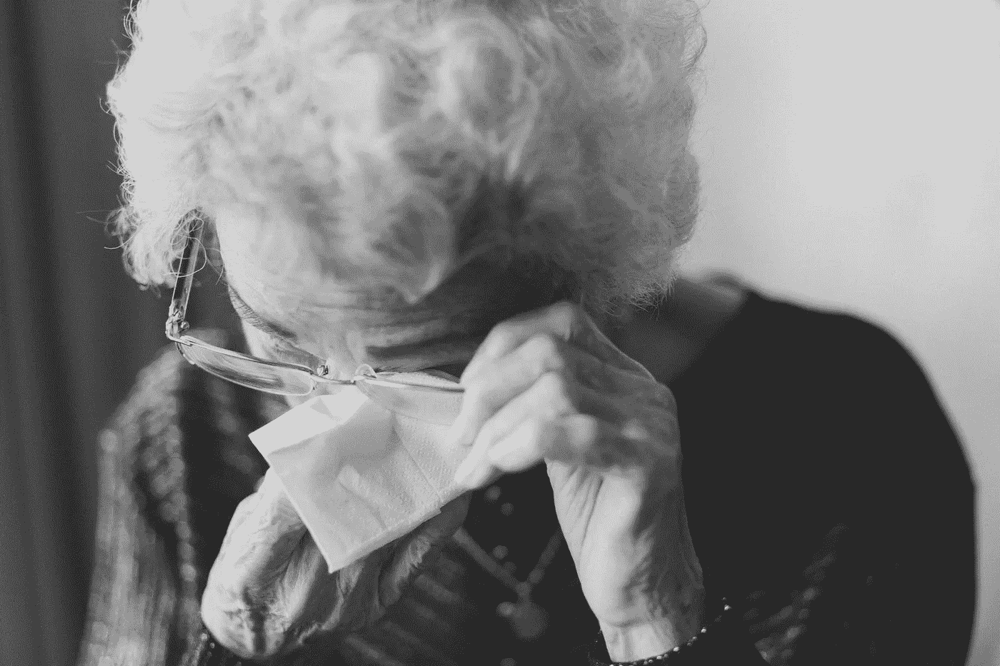
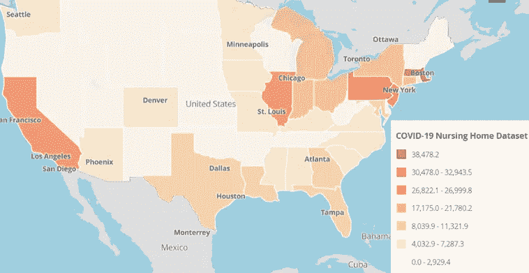
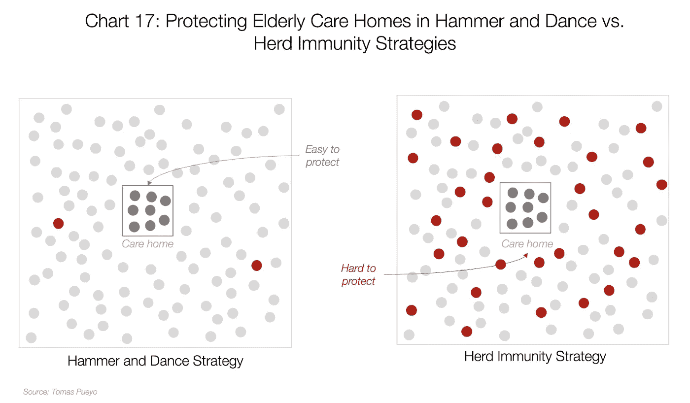
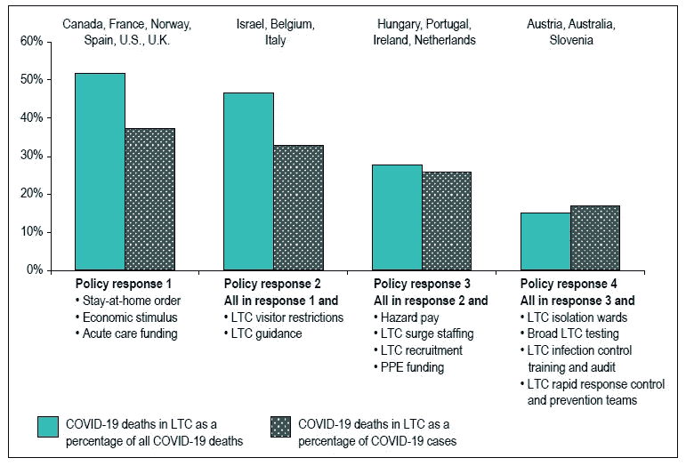
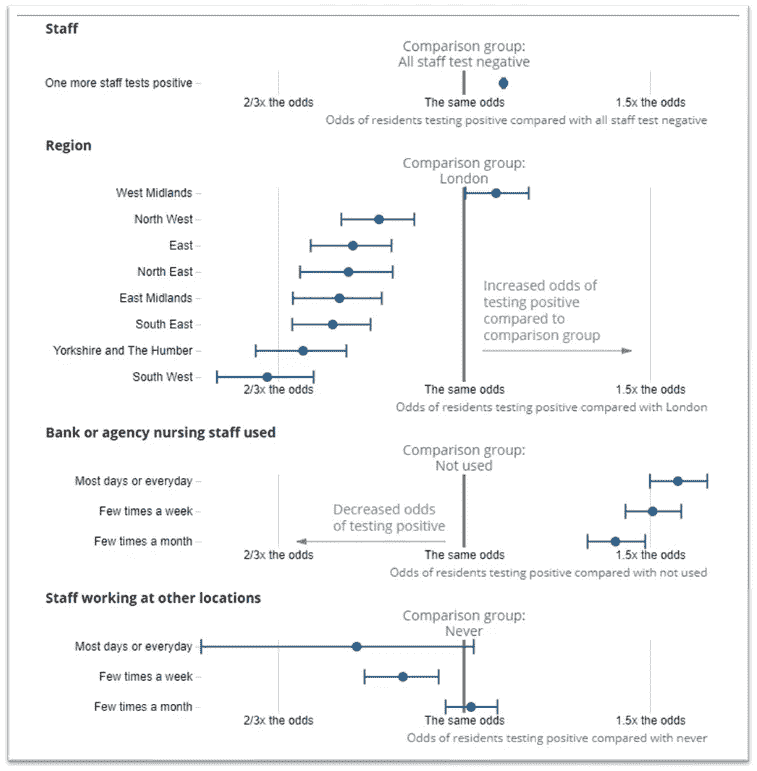
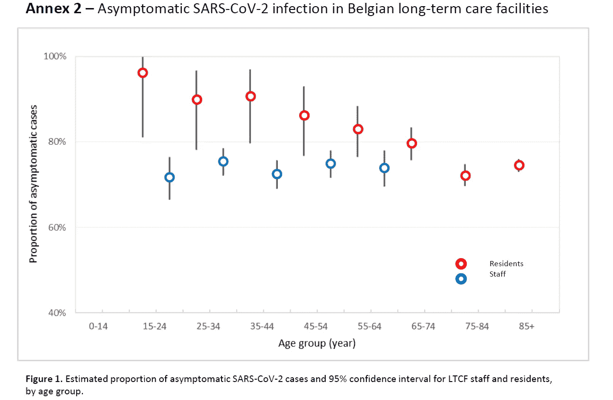
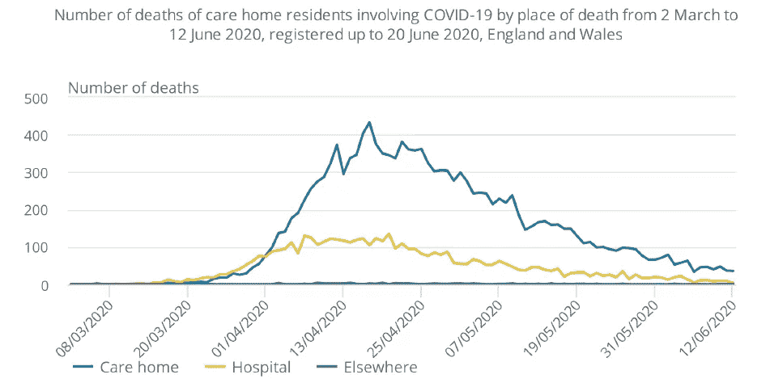
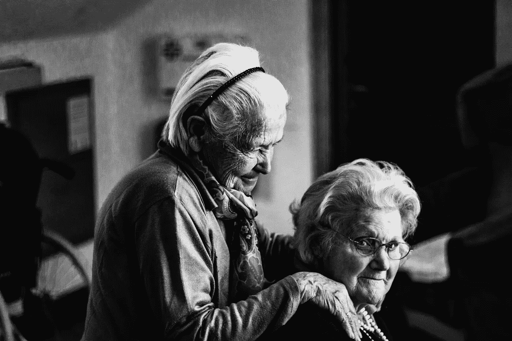

# 新冠肺炎时间养老院:为什么有这么多护理和保护失败的例子？

> 原文：<https://towardsdatascience.com/nursing-homes-in-covid-19-time-why-so-many-examples-of-failure-to-care-and-protect-e0ea38f6fd2c?source=collection_archive---------68----------------------->

## 走向数据科学

## 数据显示，许多发达国家的护理院在保护和拯救弱势人群免受冠状病毒感染方面存在无名的失败

[黄之锋](https://unsplash.com/@jwwphotography?utm_source=unsplash&utm_medium=referral&utm_content=creditCopyText)在 [Unsplash](/s/photos/elderly-woman?utm_source=unsplash&utm_medium=referral&utm_content=creditCopyText) 上的照片

## 疗养院:不仅是一个沉重的打击，而且也是卫生保健系统的失败！

养老院(NH)和长期护理(LTC)部门普遍受到新冠肺炎疫情的重创。本说明通过观察和数据分析，研究了疫情在世界各国和各地区的 NH 经验的相似性和差异性。以下是在第一次分析中得出的一些发现，这些发现导致之前的一篇文章触及了魁北克的这个主题，在加拿大新冠肺炎疫情的第一周，魁北克的养老院情况最糟糕:

 [## 魁北克对新冠肺炎的不同反应

### 就在许多地区的商业和学校重新开放之前，加拿大的这个省出现在了前 10 名最高的…

medium.com](https://medium.com/swlh/quebecs-distinct-response-to-covid-19-6caf65543574) 

今年 5 月观察到的情况，以及前一篇文章中报道的情况，在美国病例上升、欧洲一些地区重新出现的情况下，目前甚至更有意义。根据最近纽约时报[6 月 27 日发布的分析](https://www.nytimes.com/interactive/2020/us/coronavirus-nursing-homes.html)，现在，在美国 130，000 多例冠状病毒死亡中，超过 40%与疗养院有关。事实上，《纽约时报》的数字(即 43%)包括了新冠肺炎确诊死亡病例和疑似病例。

正如雅虎财经上周五所指出的，专家将这一失败归咎于全国各地养老院面临的资源缺乏，以及他们特别脆弱的人群。

 [## 冠状病毒如何肆虐一个已经“陷入危机”的养老院行业

### 冠状病毒疫情已经影响了所有种族和年龄的人，尤其是破坏了养老院和…

finance.yahoo.com](https://finance.yahoo.com/news/coronavirus-nursing-homes-162629862.html) 

6 月 13 日,《每日邮报》报道称，冠状病毒已经杀死了 16 名护理院居民中的 1 人。

> 疫情期间，英国政府因其对护理院的处理受到广泛批评，自 3 月份首次发病以来，病毒传播的数字迅速上升。

 [## 在英格兰和威尔士，Covid 已经杀死了 1/16 的养老院居民

### 新的研究表明，冠状病毒现在已经导致英格兰和威尔士 16 个护理院居民中的一个死亡。的…

www.dailymail.co.uk](https://www.dailymail.co.uk/news/article-8404653/Coronavirus-killed-1-16-care-home-residents-England-Wales-analysis-reveals.html) 

他们是对的:数据显示，自疫情爆发以来，护理院已有 26211 人超额死亡。在一个对它们有特殊保护的国家，这是世界上最高的。只有一个国家，比利时，在养老院死亡的绝对数字上有更高的份额。值得注意的是，比利时是少数几个将疗养院中疑似冠状病毒导致的 T2 死亡作为官方病例统计的司法管辖区之一。

## 一些州和较小的管辖区也有类似的失败趋势

截至 5 月 24 日，美国有类似数量的人死于疗养院，即根据 CMS(医疗保险和医疗补助服务中心)的计算，超过 26000 人，并于 6 月初在 [MSN 上报道。在美国的许多州和县，这个数字每天都在增长。值得注意的是，在目前增长最快的 NH 死亡人数(人均)中，亚利桑那州 Puma 县 6 月 30 日的](https://www.msn.com/en-us/news/us/nearly-26000-nursing-home-residents-died-of-covid-19-us-tally-shows/ar-BB14TGEA)[报告显示，该县 50%的死亡人数是 LTC 居民(在那一周，总共 263 人中有 136 人死亡)。这一趋势与前 3 周相似，并且与一个月前相比有所增长。](https://webcms.pima.gov/cms/One.aspx?portalId=169&pageId=578441)

因此，使用最新完成的 CMS 数据(6 月 21 日)绘制美国疗养院的死亡地图是很重要的。它显示了新冠肺炎死亡人数最多的地区。注意:该图仅考虑了“确认”的测试死亡人数，该数字使用根据 CMS 图的“每百万居民”比率。例如，在马萨诸塞州，“38472”意味着 3.8%的居民死亡。值得注意的是，截至 6 月 21 日，该州有 3012 例死亡，新冠肺炎 NH 病例中有 20.1%的死亡，而在新泽西，NH 居民中有 3416 例死亡，死亡率为 3.3%，占 NH 病例的 11.9%。

来源: [CMS 数据集](https://data.cms.gov/d/f7fj-fpid)；介词截至 2020 年 6 月 21 日，美国比洛多——养老院居民每百万人死亡地图【SB】[data.cms.gov](https://data.cms.gov/d/f7fj-fpid)

一些州和国家的养老院似乎特别容易受到高传染性病毒的影响，因为它们的设置，年老体弱的居民经常住在共用的房间里，与工作人员密切接触，这些工作人员可能在没有症状的情况下被感染。

这就是为什么我们将疗养院(NH)的工作扩展到更广泛的领域，拥有新的权限和更全面的数据集。简而言之，这项分析包括超过 23 个国家、省、州和地区，这些国家、省、州和地区有足够的数据可供报告。

> 请注意，由于 NH 和 LTC 的不同定义以及新冠肺炎测试和报告实践中不同国家之间的差异，必须极其谨慎地解释比较结果。值得注意的是，开始报告或包括(如比利时和魁北克)或不包括(如其他)新冠肺炎“疑似”死亡的日期。然而，任何比较都提供了另一个视角，让我们从不同的经历中学习。在这样一个不可思议的时代，不应该回避任何信息来源、比较或学习。每个生命都值得。

## 这需要的不仅仅是“自由放任”

虽然此处报告的正在进行的研究集中于疗养院和/或长期护理中心的新冠肺炎死亡，但它也触及了解决疫情的政策响应。

在 6 月 9 日的一篇 [Medium 文章中，Tomas Pueyo 对群体免疫策略(所谓的“自由放任”方法)和锤子&舞蹈(“碾压曲线”)策略进行了比较。](https://medium.com/@tomaspueyo/coronavirus-should-we-aim-for-herd-immunity-like-sweden-b1de3348e88b)

来源:to MAS PUE yo[medium . com/coronavirus-we-should-aim-for-herd-immunity-like-Sweden](https://medium.com/@tomaspueyo/coronavirus-should-we-aim-for-herd-immunity-like-sweden-b1de3348e88b)

Pueyo 报告说，瑞典为保护养老院采取的第一项措施是实际禁止探访，但未能保护其老年人。即使这种措施仍然限制了传染，也不足以控制护理院环境中的感染传播。瑞典首席流行病学家安德斯·泰格内尔承认:

> 我们很难理解一级防范禁闭将如何阻止疾病进入养老院。(……)这不是总体战略的失败，而是保护老年人的失败。

但是，尽管看起来很糟糕，瑞典的例子还远不是保护弱势群体失败的最糟糕例子，特别是在长期护理(LTC)环境中。

截至 2020 年 6 月 25 日，养老院和长期护理中心居民中报告的新冠肺炎死亡人数差异很大，从斯洛文尼亚的 10 人或澳大利亚的 28 人到美国的 33，500 人，比利时和加拿大的超过 5，000 人，到法国、意大利、西班牙和[英国](https://www.theguardian.com/society/2020/jun/07/more-than-half-of-englands-coronavirus-related-deaths-will-be-people-from-care-homes)的超过 10，000 人

五月底，英国出现了一个关于疗养院的错误策略的例子。即使 3 月 19 日英国国家医疗服务体系(NHS)和政府发给医疗服务提供者的一封信(旨在释放医院容量)命令“那些不再需要躺在病床上的人安全快速地出院，新的默认将是今天出院回家”。这种“出院”与英国公共卫生部的第一个(也是正确的)反应相反。英国(PHE)在二月份警告说，如果存在传播病毒的严重风险，老年人不应该从医院出院到护理院。

 [## 英格兰超过一半的冠状病毒相关死亡将是来自护理院的人

### 护理院居民将占冠状病毒直接或间接导致的死亡人数的一半以上…

www.theguardian.com](https://www.theguardian.com/society/2020/jun/07/more-than-half-of-englands-coronavirus-related-deaths-will-be-people-from-care-homes) 

许多国家都犯了和英国一样的错误。事实上，在养老院死亡人数超过 5000 人的国家中，我们可以在大多数主要的新冠肺炎地区找到同样的痕迹。保护主要卫生机构(即医院)可能会损害长期护理院的利益。

## 许多“所谓的”发达国家做出了错误的选择

在 [OECD](https://www.oecd.org/coronavirus/en/) 国家/地区，平均有超过 5500 名长期护理住院患者死亡，其中许多国家/地区的长期护理死亡比例很高。值得注意的是，养老院居民占加拿大所有报告的新冠肺炎死亡人数的 68%(占加拿大所有 LTC 的 81%)，西班牙的 66%和比利时的 64%，而其他经合组织国家的平均水平超过 42%(斯洛文尼亚和匈牙利的一些国家不到 10%，奥地利和荷兰不到 20%)。

数据:卫生当局；介词 [S.Bilodeau](https://medium.com/@smbilodeau) 用 [**Datawrapper**](https://www.datawrapper.de/_/A39wQ) **创建；**注:只有比利时和魁北克(加拿大)在报告中包括疑似新冠肺炎疗养院死亡病例(在这两种情况下，分别占病例的 22%和 20%)

各地区、州或省之间的差异大于经合组织国家之间的总体差异。在这方面，加拿大各省之间的差异尤其明显。截至 6 月 25 日，纽芬兰省和拉布拉多半岛、爱德华王子岛省、新不伦瑞克省和其他地区没有养老院和长期护理机构的死亡报告，而在魁北克省、安大略省和阿尔伯塔省，NH 死亡人数占新冠肺炎死亡人数的 65%以上。在新斯科舍省，97%的死亡发生在 LTC。

在美国，我们也看到各州之间的重要差异。马萨诸塞州、康涅狄格州和新泽西州每百万人口中养老院的死亡人数最少，而宾夕法尼亚州是 NH 死亡人数与新冠肺炎总死亡人数之比最大的州。虽然没有前几个州高，但亚利桑那州现在显示出死亡率的最大周增长率。

一般来说，社区中新冠肺炎感染率较低的管辖区报告的 NH 病例和死亡人数较少。但是有很多种情况。作为新冠肺炎病例总数的一部分，疗养院中的病例比例从澳大利亚的不到 1%到加拿大的 18%,到法国的 51%和英国的 73%

感染 NH 的居民死于该疾病的比例在不同国家也有很大差异，从斯洛文尼亚的 4%到挪威的 83%。在加拿大，截至 6 月 25 日，NH 中感染新冠肺炎病毒的死亡率约为 36%。

## 成功是可能的

许多国家报告了卫生保健工作者的高感染率，导致缺勤和人员短缺。

CIHI(加拿大健康信息研究所)6 月发布的新报告:“长期护理领域的疫情”证实了我们过去几周的发现。他们强调了一个有趣的观点:“在限制和关闭公共场所的同时，实施了专门针对 LTC 部门的强制性预防措施的国家(澳大利亚、奥地利、荷兰、匈牙利和斯洛文尼亚)在 SLD 中的新冠肺炎感染率和疾病相关死亡率较低。”这些是需要在失败的(疗养院)卫生系统中复制的成功故事。

资料来源:[cihi.ca/en](https://www.cihi.ca/en)在该国出现第 1000 例新冠肺炎病例时宣布或实施的新冠肺炎政策干预的影响 o 截至 2020 年 5 月 25 日的长期死亡/总死亡和病例比率

为使疗养院的成功机会最大化，包括一些预防措施，如即时感染控制措施、访客限制、急性护理和个人防护设备资助、LTC 设施中的招募、培训和普遍筛查、建立隔离单位以管理病例群、广泛的 LTC 检测、感染控制培训和审计、快速反应控制、预防团队和对员工的额外支持。LTC，如增加人员配备、创建专业团队和分发个人防护设备(PPE)。

## 工作人员管理和保护，一个明确的问题来源

在“不那么”受控制的疫情，试图通过探视限制来限制疗养院的感染将需要持续数月，甚至数年，直到出现治疗或疫苗。这是因为即使许多人已经克服了感染，病毒仍然存在。

根据英国国家统计局的数据，英国那些雇佣更多机构员工或不提供病假工资的养老院，其居民中新冠肺炎感染率更高。

周五发表的 [Vivaldi 研究](https://www.ons.gov.uk/peoplepopulationandcommunity/healthandsocialcare/conditionsanddiseases/articles/impactofcoronavirusincarehomesinenglandvivaldi/26mayto19june2020)基于英国 5126 家护理院的回应，发现大多数时间或每天使用银行或机构护士或护工的护理院居民比那些不使用这些工作人员的护理院居民新冠肺炎病毒检测呈阳性的可能性高 1.58 倍。

资料来源:【ons.gov.uk 图 1:按工作人员感染、地区、使用银行或机构护理人员以及在其他地点工作的工作人员分类的养老院居民新冠肺炎感染几率

 [## 冠状病毒对英格兰养老院的影响——国家统计局

### 2020 年 5 月 26 日至 6 月 20 日，作为维瓦尔第项目的一部分，英格兰的 9，081 家护理院(全部由……

www.ons.gov.uk](https://www.ons.gov.uk/peoplepopulationandcommunity/healthandsocialcare/conditionsanddiseases/articles/impactofcoronavirusincarehomesinenglandvivaldi/26mayto19june2020) 

简而言之，在英格兰和威尔士护理院冠状病毒相关死亡人数升至 19394 人之际，英国国家统计局的调查结果突显出合同制员工(通常是低薪和“零时工”合同)可能无意中助长了病毒的传播。另一方面，在工作人员领取病假工资的护理院，与工作人员领取病假工资的护理院相比，住院病人检测呈阳性的几率估计在 0.82 到 0.93 之间。

托马斯·普约在 6 月 9 日的文章中指出:

> 老人还是需要工人照顾的。这些被称为 shielders 的工人会怎么样？他们也会被隔离吗？好几年了？他们的伴侣呢，也会被隔离吗？他们会失业吗？他们的孩子呢，他们也应该被隔离吗？不上学了？如果不是，那么其他孩子和他们的父母呢？他们应该被隔离吗？所有这些都是不可能的，所以我们必须假设许多护理之家的工作人员会被感染。如何保护老年人免受其害？

## 绿化疗养院

在这段时间里，只要疗养院里有一个人被感染，病毒就会像野火一样在里面蔓延。因此，这意味着如果我们不能在普通人群中用“绿区”方法或“零感染”策略来控制病毒，那么多年内都不能就诊。

 [## 绿色区域——EndCoronavirus.org

### 严格的旅行限制，在抵达时进行检测和隔离，将有助于减少进口…

www.endcoronavirus.org](https://www.endcoronavirus.org/green-zones) 

一些“失败的养老院”政府试图采取适当的方式，并建立良好的做法，如在后续国家。周五，[魁北克公共卫生主任 Horacio Arruda 博士](https://montrealgazette.com/news/local-news/quebec-will-renew-testing-efforts-so-nobody-is-refused-arruda-says)宣布，养老院和长期护理中心的所有[工作人员，特别是在大都市地区，将每周接受一次检测，以检测出病毒携带者但没有症状的人。虽然这还是一小步，但这是重要的一步，因为无症状人群是疫情的重要隐形载体。比利时有超过 61 509 例严重急性呼吸综合征新型冠状病毒感染确诊病例和 9754 例相关死亡病例。4 月，卫生部决定在长期护理设施中开展大规模检测活动。《柳叶刀》](https://www.en24news.com/2020/07/quebec-will-hunt-asymptomatic-this-summer.html)发表的一项新研究揭示了 2020 年 4 月 8 日至 5 月 18 日期间从实验室收到的数据的横截面分析。对在长期 CFs 中进行的大量测试的分析显示，无症状病例的比例很高(见下面的“附录 2”图表)。这证实了之前在欧洲和中国进行的研究，评估无症状新型冠状病毒感染的比例在受试人群的 20%至 88%之间。

来源:[安娜·霍查](https://www.thelancet.com/journals/laninf/article/PIIS1473-3099(20)30560-0/fulltext#)、[克洛伊·温德姆-托马斯](https://www.thelancet.com/journals/laninf/article/PIIS1473-3099(20)30560-0/fulltext#)、[索菲克·克拉默](https://www.thelancet.com/journals/laninf/article/PIIS1473-3099(20)30560-0/fulltext#)、[多米尼克·杜伯格](https://www.thelancet.com/journals/laninf/article/PIIS1473-3099(20)30560-0/fulltext#)、[梅丽莎·维穆伦](https://www.thelancet.com/journals/laninf/article/PIIS1473-3099(20)30560-0/fulltext#)、[马奈·哈玛米](https://www.thelancet.com/journals/laninf/article/PIIS1473-3099(20)30560-0/fulltext#)等人 T[helancet . com/journals/laninf/article/piis 1473–3099(20)30560–0](https://www.thelancet.com/journals/laninf/article/PIIS1473-3099(20)30560-0/fulltext#sec1)

因此，比利时的布鲁塞尔地区与红十字会合作，为养老院的所有护理人员制定了指南和特殊的新冠肺炎课程，以确保无症状者不会传播更多的感染。

英格兰和鲸鱼还参与了一项名为“冠状病毒对护理院的影响”的大型研究，该研究旨在更好地了解并纠正该领域的严峻形势。

资料来源:[国家统计局](https://www.ons.gov.uk/)——涉及新冠肺炎护理部门的死亡

所有这些都提出了许多国家社会保健系统的状况问题，这些国家多年来迫切需要改革。它经常资金不足，而护理人员的工资却很低。在我们的[新冠肺炎养老院死亡人数与总死亡人数](https://datawrapper.dwcdn.net/A39wQ/3/)图表中，许多国家的养老院死亡人数没有那些“前 12 名”管辖区高，我们经常可以看到一个成功的模式。对于同一图表中排名倒数 10 位的许多国家来说尤其如此(如德国、葡萄牙、挪威、以色列或斯洛文尼亚)。值得注意的是，我们将会看到一个由训练有素、受人尊敬的护理人员组成的不同体系，他们的艰苦工作会得到更合理的回报，而不是依赖多个机构的工作来谋生，从而导致病毒从一个机构迅速传播到另一个机构。

## 现在还需要改进

现在比以往任何时候都更需要纠正这种情况。上世纪中叶，玛格丽特·米德博士定义了人类文明的一个特征。Ira Byock 博士在他关于姑息医学的书*中报道了这一点【最好的护理:一位医生对临终关怀的探索】* (Avery，2012)。

> 几年前，一个学生问人类学家玛格丽特·米德，她认为什么是一种文化中文明的第一个标志。这个学生以为米德会谈论鱼钩、陶罐或磨石。但不是。米德说，古代文化中文明的第一个标志是一根被折断然后愈合的股骨。
> 
> 米德解释说，在动物王国里，如果你摔断腿，你就会死去。你不能逃避危险，去河边喝水或寻找食物。你是觅食野兽的肉。没有动物能在断腿后存活到骨头愈合。愈合的股骨骨折证明有人花时间陪伴跌倒的人，包扎伤口，把他带到安全的地方，并照顾他康复。米德说，帮助他人渡过难关是文明的起点。当我们为他人服务时，我们处于最佳状态。要文明。

来源:britannica.com/biography/Margaret-Mead

从失败中吸取教训并扩大成功不仅仅是我们政府的责任。是让所有的领导都站出来。社区、城市或地区、养老院或家庭的领导者。比如一个月前《经济学人》的一篇文章中强调的，

> 新冠肺炎已经证明了繁荣的基础是不稳固的。人们谈论了很久，却忽视了很久的灾难会毫无征兆地降临到你身上，颠覆生活，动摇一切看似稳定的事物。

 [## 政客们忽视了远在天边的风险:他们需要提高自己的水平

### 1993 年，这份报纸告诉全世界要观察天空。当时，人类对小行星的了解可能…

www.economist.com](https://www.economist.com/leaders/2020/06/25/politicians-ignore-far-out-risks-they-need-to-up-their-game) 

米德博士的这一见解在《疫情时报》上仍然很有价值。2020 年，那些忽视照顾弱势群体的人，那些拒绝社会距离，戴着面具，禁闭来拯救生命的人，应该思考一下。

因此，我们所有人都应该参与到拯救最脆弱人群的生命和痛苦的行动中来。在这样一个关键时刻，每个人都可以做出贡献。我们都可以在各自的社区、家人和朋友中成为领导者。我们的卫生系统，尤其是照顾最弱势群体的部门，以及我们每个人都需要做好准备，以避免另一次失败。我们需要在第一波结束前准备好。第二波可能很快会在混乱中出现。我们应该让弱势群体做好准备。

## 让我们文明一点！

eberhard grossgasteiger 在 [Unsplash](https://unsplash.com/collections/4677825/human?utm_source=unsplash&utm_medium=referral&utm_content=creditCopyText) 上的照片

本文由[夏羽·比洛多](https://www.linkedin.com/in/stephane-bilodeau/?locale=en_US)，ing 准备。工程博士，对外经济合作中心。创始人&首席技术官，Smart Phases ( [Novacab](http://www.novacab.us/) )，加拿大[工程师协会会员](https://engineerscanada.ca/about/committees/operational/public-affairs-advisory)。他的文章涉及能源问题、可持续发展、创新、人工智能、数据科学和分析，以及新冠肺炎；他是[能源中心](https://www.energycentral.com/member/profile/217621/activity)、[创业](https://medium.com/swlh)、 [DDI](https://medium.com/datadriveninvestor) & [迈向](https://towardsdatascience.com/)[媒介](https://medium.com/@smbilodeau)数据科学的专家贡献者。他也为[EndCoronavirus.org](https://www.endcoronavirus.org/)和[STIM-科维德](https://www.facebook.com/groups/stimcovid)做贡献

.