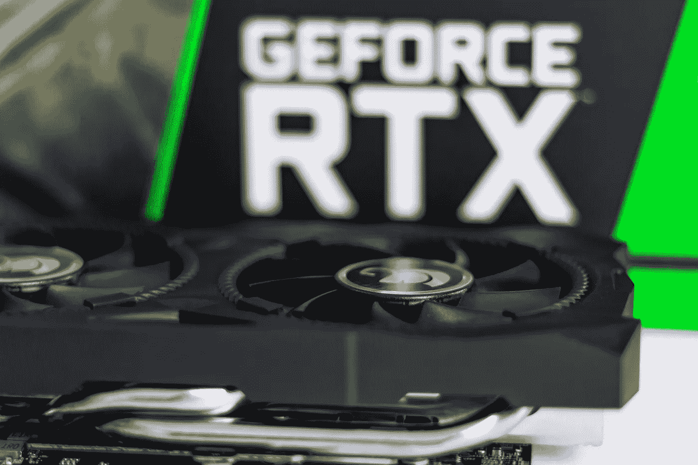
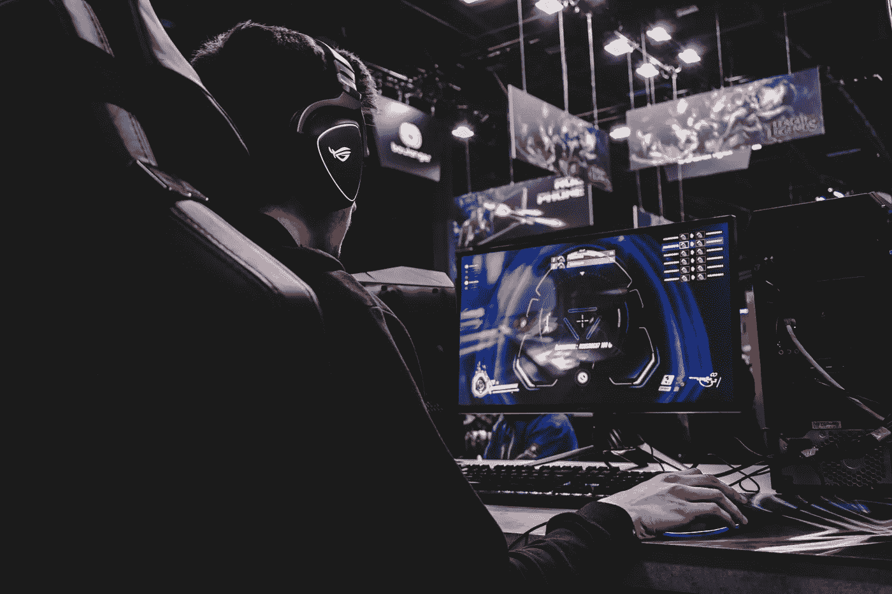
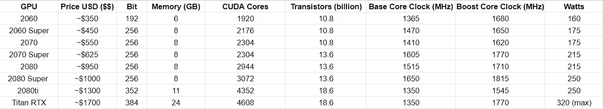
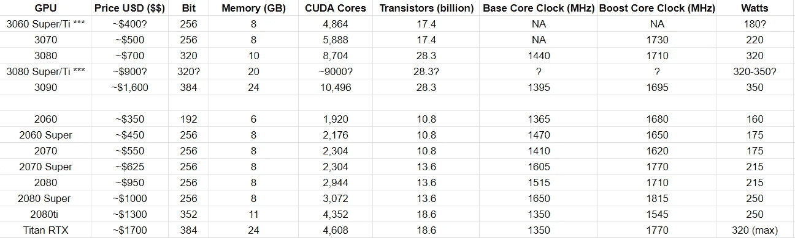
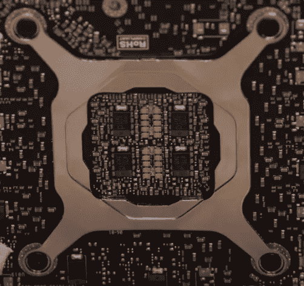
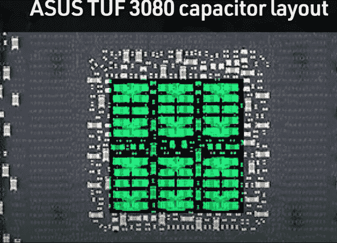
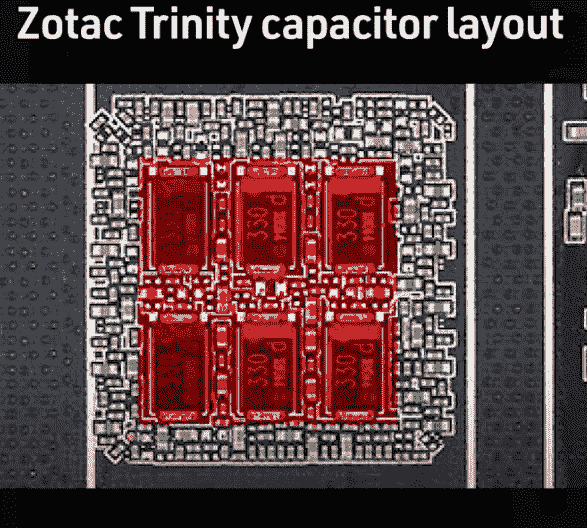
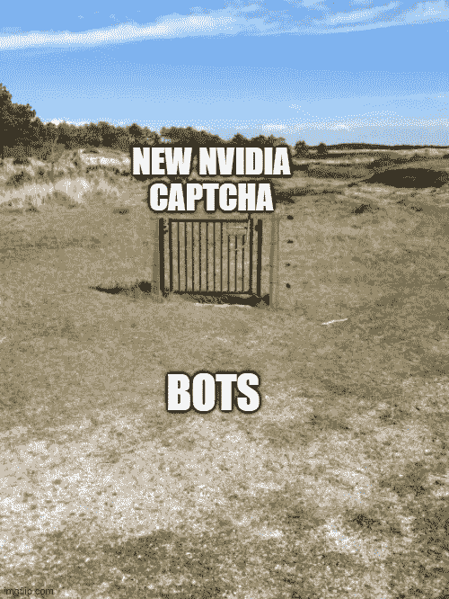

# Nvidia 3000 GPUs:数据科学家、游戏玩家和黄牛的碰撞

> 原文：<https://towardsdatascience.com/nvidia-3000-gpus-where-data-scientists-gamers-and-scalpers-collide-7a9a6f34f81f?source=collection_archive---------19----------------------->

## 新 Nvidia Ampere 系列概述；不同的 GPU 基准、规格、传言和制造问题；以及我自己尝试购买 3000 系列 GPU 的经历

图片来源:克里斯蒂安·魏迪格

在这篇博客中，我将解释围绕新的 Nvidia Ampere 3000 系列 GPU 的宣传，它们与图灵 2000 系列卡的比较，以及当前每一代 RTX 可用的基准。我还会查看即将推出的 3080 变种的传言，以及来自用户的报告，称他们收到的卡有缺陷。在文章的最后，我将回顾一下我的观点和我对任何试图获得它们的人的建议，不管是针对游戏、数据科学还是后两者。

# 英伟达为什么这么受欢迎？

Nvidia 一直是 GPU 领域的赢家，但这是出于多种原因，而不仅仅是他们的“能力”。当你想比较 Nvidia 和 AMD GPUs 之间的计算能力或万亿次浮点运算量(TF)时，实际上没有太大的差异——而且往往 AMD 在这方面名列前茅。例如，当比较 AMD 镭龙 RX Vega 64(~ 400 美元)和 Nvidia 2080(~ 700 美元)时，你会看到 Nvidia 是最强大的*这一论点的裂缝。*当比较这些卡之间的万亿次浮点运算性能时，AMD 镭龙 64 在各个方面都名列前茅(FP16、FP32 和 FP64)。那么如果 AMD 以低得多的成本提供更强大(就 TF 而言)的卡，那么为什么 Nvidia 会被认为是最好的 GPU 制造商呢？真正的答案来自于 Nvidia 提供的花哨功能，以及它们如何针对多种不同类型的客户，从图形设计师、数据科学家，最重要的是，**游戏玩家**。说到游戏，TF 的数量并不等同于它们提供的游戏体验。看看织女星 64 和 RTX 2080，RTX 2080 在每一项游戏基准测试中都击败了织女星，平均每秒帧数(FPS)增加了 20%-50%[[织女星 64 对 2080 基准测试](https://www.gpucheck.com/compare/amd-radeon-rx-vega-64-vs-nvidia-geforce-rtx-2080/intel-core-i7-7700k-4-20ghz-vs-intel-core-i7-8700k-3-70ghz/) ]。我知道有些人可能会想，你到底为什么用 Vega64 和 RX 2080 做比较？我知道这些卡的用法完全不同，但我想说明的是，仅仅说“更强大”只是故事的一半。Nvidia 在 GPU 方面优于 AMD 的原因有很多，其中只有一部分原因是针对您计划使用硬件的方式的。我将在这篇博文的其余部分更详细地阐述我的意思。

图片来源:弗洛里安·奥利佛( [Unsplash](https://unsplash.com/photos/Mf23RF8xArY)

RTX GPU 在现代游戏中如此强大的原因是由于他们的光线跟踪技术和 Nvidia 所谓的 CUDA 核心的实现。CUDA 核心是为游戏而创造的，但对 Nvidia 来说，锦上添花的是，它们在深度学习和人工智能方面也令人印象深刻——让这项技术拥有更广泛的目标受众。拥有更多 CUDA 内核不仅可以提高您实现神经网络和高级算法的能力，而且当应用于游戏时，它们可以创建更逼真的图形和更高的 FPS 率。

# RTX 2000 系列(图灵架构)

为了充分理解为什么 3000 系列受到如此多的关注，了解上一代 Nvidia 卡以及 3000 系列在性能上的巨大飞跃是很重要的。为了保持一致，我将坚持使用这些卡:Nvidia 2060、2060S、2070、2070S、2080、2080S、2080ti 和泰坦 RTX。

英伟达图灵 2000 系列(作者供图)

上面我们可以看到 2000 系列产品中每个 GPU 的性能差异。我想指出的是，在这一代人之前，没有超级卡。Super 的实施被认为是对 AMD 激进定价策略的回应，因为 Nvidia 填补了每个型号之间的价格差距，使他们的产品比 AMD 更便宜的卡更具吸引力。我还想指出，上面列出的价格不是发布价格，而是亚马逊和新蛋的当前价格。这些卡刚上市时，每张卡的零售价格要高出 20%-40%。从这个系列到 3000 系列的一个主要飞跃是核心时钟、位带宽，以及最重要的 CUDA 核心数量。正如我们在上面看到的，2000 系列中的旗舰卡有 4606 个 CUDA 内核，384 位的位带宽，1350–1770 MHz 的时钟速度；上市时定价高达 2500 美元。这一性能令人印象深刻，但与新的 3000 系列产品相比，这些规格就显得微不足道了。

# Nvidia 3000 系列(安培架构)

在这一代 GPU 中，Nvidia 真的超越了自己。他们不仅创造了一个击败他们最后一个的阵容，而且他们增加了一个新的定价策略，作为一个硬件公司，这是非传统的。下面你可以看到新系列的规格。每张标有***的卡都被认为是谣言，价格和规格都不确定。

英伟达安培 3000 系列 vs 图灵 2000 系列(作者供图)

正如你在上面看到的，价格不仅仅是上一代的一半，而且低端 3000 系列卡比他们的旗舰产品更快？我在这里加了个问号是因为和你一样，我就是不明白。看看售价约为 700 美元的 3080，我们可以看到它的 CUDA 内核几乎增加了 50%,时钟速度也高于之前的旗舰产品 RTX Titan——我知道，这很疯狂，对吧...通过创建这些卡并像这样定价，Nvidia 使他们自己的上一代产品完全无关紧要——也就是说，对于游戏玩家来说。这就引出了我的下一个话题， ***记忆。***2000 系列和 3000 系列的内存带宽略有不同，因为 3080 仅包含 10GB，比上一代 2080ti 少 1GB，后者包含 11GB。对于游戏玩家来说，1GB 的损失并不重要，只要 FPS 速率和光线跟踪内核增加，他们确实增加了。然而，对于深度学习和图形设计师来说，这有点令人失望。显卡中可用的内存带宽对于使用最先进的(SOTA)技术至关重要。[这里](https://timdettmers.com/2018/12/16/deep-learning-hardware-guide/#:~:text=You%20should%20have%20enough%20RAM,not%20necessarily%20need%20more%20RAM.)是一篇解释内存带宽如何重要，以及某些深度学习技术需要哪些 GPU 的文章。在这篇文章中，作者 Tim Dettmers 解释如下:

*   追求最高分数的研究:> =11 GB
*   寻找有趣架构的研究:> =8 GB
*   任何其他研究:8 GB
*   ka ggle:4–8 GB
*   初创公司:8 GB(但检查型号大小的具体应用领域)
*   公司:8 GB 用于原型开发，> =11 GB 用于培训

考虑到这一点，尽管 3080 缺乏内存带宽令人失望，但包含一个巨大的 24gb 3090 模型弥补了一些人感到的痛苦。看看新的 3090 系列，它不仅包含更多的 CUDA 内核，而且比 RTX Titan 多 2GB 的内存——别忘了它便宜 1000 美元！

# 3080 20GB 谣言

如果你是少数有机会在发布日购买 3080 GPU 的人之一，你可能会恐慌地看着图表。虽然还不确定，但有无数可靠的消息来源透露，将会有 3080 20GB 的变体。就我个人而言，当我读到这些时，我感到非常欣慰，因为我自己也在试图购买 3080。这个版本背后的想法是，Nvidia 将在 AMD 的大 Navi 发布的同一周内发布这个变种。AMD 宣布了他们下一代 6000 系列卡的一些规格，显示他们的旗舰将包含总共 16GB 的内存，并将比 3080 更快。这一增长也令人印象深刻，但 Nvidia 坚持 20GB 的型号是天才，因为它将比大 Navi 版本更有吸引力。[Carly Page 的这篇文章](https://www.techradar.com/news/amd-big-navi-might-still-be-faster-than-the-rtx-3080)概述了泄露的规格以及它们与 Nvidia 3000 系列的比较。如果 AMD 真的创造了一种比 3080 更快的卡，那么 3080 拥有更多内存将把客户推向 Nvidia，而不是 AMD。

第一次泄露来自技嘉网站。正如你在这里看到的，他们公布了 3000 系列发布的各种兑换代码，包括尚未公布的卡。当我看到这些时，我已经确信这是真的，尤其是 Nvidia 还没有纠正这些谣言，并保持沉默。

在这次泄露几天后，另一家 GPU 制造商 Galax 又泄露了一次。[在这次泄露的](https://hothardware.com/news/galaxy-ampere-leaked-roadmap-geforce-rtx-3060)中，一份内部演示中的路线图显示了 3080 20GB 的变体。考虑到这两个泄漏发生在同一个星期，而 Nvidia 对此只字未提，在我看来，很明显这个版本可能真的会发布。

从机器学习的角度来看，推出价格低于 1000 美元的 20GB 卡将是一个游戏规则改变者——尤其是对我来说，因为我目前使用的是 RX 580 8GB 卡。然而，从游戏的角度来看，这些内存的增加对大多数人来说并不重要。我将谈谈我对 3090 年前后大规模炒作的看法，以及为什么有些人不应该因为他们计划将它用于游戏而感到兴奋。

# 损坏/缺陷卡的报告

当用户开始实际收到他们的卡时，已经有许多报告说卡不能如预期的那样工作，或者他们的卡在装运时没有盒子，导致卡弯曲和美观损坏。前一个没有盒子的贺卡问题在本文中有所概述，作者解释说这是像新蛋这样的分销合作伙伴的错。另一方面，要完全理解卡崩溃和不能正常工作的原因，你还必须知道卡的分发和制造是如何工作的。当 Nvidia 创建一个 GPU 时，市场上会有不同的版本。例如，每个创始人版卡都是 Nvidia 自己创建的，被认为具有最好的硅胶质量和规格，以便创建卡设计的完整体验。另一方面，Nvidia 也将其设计授权给第三方制造商，如 EVGA 和华硕，这些公司被给予这些卡工作所需的最低规格。许多人遇到的问题是由于这些最低要求以及这些卡上的电容布局。如下图所示，左图是一张方正版卡片，包含两排大电容和一排非常小的电容(中间一排)。看一下中间的卡，我们看到每行只有小电容，这使得该卡的制造成本更高。最后，Zotac 卡是报告问题的卡之一，它只有更大、更便宜的电容器。从这些卡有缺陷的意义上来说，这些问题不是问题，而是它们不能提升到它们想要的时钟速度。电容的作用是实现安全稳定的能量传输。只有大电容会使卡不稳定，并在卡试图自我增强时导致崩溃。在[由 JayzTwoCents 制作的视频](https://www.youtube.com/watch?v=x6bUUEEe-X8&list=WL&index=59&t=1133s&ab_channel=JayzTwoCents)中，他解释了为什么会发生这种情况，以及对那些有这个问题的人可能的解决方法。

左(创始人版)、中(华硕 TUF)、右(Zotac)[图片鸣谢: [JayzTwoCents](https://www.youtube.com/watch?v=x6bUUEEe-X8&list=WL&index=59&t=1133s&ab_channel=JayzTwoCents) & [伊戈尔的实验室](https://www.igorslab.de/en/what-real-what-can-be-investigative-within-the-crashes-and-instabilities-of-the-force-rtx-3080-andrtx-3090/) ]

图片来源: [Giphy](https://media.giphy.com/media/lnaPs6Y1SE6LDQgQR3/giphy.gif)

# 我的看法

在我进入之前，我想指出的是，人们有购买他们想要的东西的自由，仅此而已。这些意见只是表达了如何以更好的方式花钱，以及 GPU 硬件的整个倒票时代是如何毫无意义，因为我相信人们会在尝试这样做时被严重烧伤。

虽然新推出的 3000 GPU 在性能升级方面令人难以置信，但如果你只是将这些 GPU 用于游戏，就必须考虑一些事情。作为一个狂热的游戏玩家，我觉得我可以为为什么某些型号不应该这么快售罄提供意见，因为花那种钱去看 ***最低限度的*** 性能提升是没有意义的。对比 3090 和 3080，Youtube 上有大量基准视频显示，尽管价格差距为 700 美元，但 FPS 性能并没有太大差异。在本文[中，](https://wccftech.com/nvidia-geforce-rtx-3090-10-15-percent-faster-geforce-rtx-3080-in-4k-gaming-confirms-limited-supply-at-launch/)作者展示了基准性能，并显示 3080 和 3090 的性能仅提高了 10%。此外，考虑到 CUDA 内核，3090 中当然有更多，但由于它们都远高于上一代旗舰机型，额外的 2000 个 CUDA 内核对游戏几乎没有影响。我可能有偏见，因为我是一名痴迷于神经网络的数据科学家，但我相信 3090 最适合数据科学和机器学习。额外的 14GB 内存乍一看似乎很性感，但它真正改变您游戏体验的唯一情况是您在 8K 显示器上玩游戏，我敢肯定只有非常少的一部分游戏玩家会这样做。是的，有些人可能会说，“好吧，山姆！它的未来证明”。虽然这是正确的，但所有关于现在得到它的宣传对我来说毫无意义。你不仅需要一个高端处理器，比如 i9 或锐龙 9(价格在 700-1000 美元之间)，而且你肯定还需要升级你的电源。因此，如果你是一个购买了 3090 的狂热游戏玩家，你不仅在卡上花了 1500 美元，在 PSU 上花了 200 美元，而且除非你有可以处理 GPU 的 CPU，否则你在体验上看不到任何差异(除非你是从 GTX 900 系列卡或更低版本升级)。

## 头皮

转向我的下一点，黄牛们！我自己从来没有当过球鞋头，但现在我理解了他们每次发射时应对的痛苦。你可能会认为这些大公司，特别是像英伟达这样在机器学习方面有如此大影响力的公司，应该已经预料到这一点或开发出检测黄牛的算法。当然，这是对创建这种算法的难度的过度简化，然而，我仍然相信 Nvidia 从现在到 10 月下旬的下一次发布有足够的时间来修复它。

图片来源:内里诺( [Memedroid](https://www.memedroid.com/memes/detail/3086991/NVIDIA-is-trying-to-prevent-bots-from-buying-30-series?refGallery=tags&page=1&tag=nvidia)

在我看来，人们看到了购买一个被大肆宣传的产品的机会。但是，与运动鞋不同的是，显卡并不局限于生产。是的，这个版本的库存有限，但不是因为 Nvidia 希望它这样，而是因为由于新冠肺炎产量下降。例如，像耐克这样的大型运动鞋公司会宣布他们将发布一款鞋，但他们只生产了几百款。在这种情况下，Nvidia 每周都会不断生产更多产品，并计划在未来几个月内恢复正常生产。黄牛认为他们可以购买一张卡，并以高于零售成本 1000 美元的价格出售，这是令人惊讶的愚蠢。是的，也许有些人在易贝成功地推销了他们的产品，但我敢打赌，那是极少数人。仅仅因为易贝上有数百种售价 1000-2000 美元的新卡上市，并不意味着人们会购买它们。

图片来源:[吉菲](https://media.giphy.com/media/3krAxhMRrpsdH17A24/giphy.gif)

# 我想买 3090 的经历

为了充分了解情况的严重性，让我向您介绍一下 ***我的经历*** 在发布日试图在我当地的 Micro Center 购买 3090。我醒得特别早，因为我知道商店开门前外面会排起长队。老实说，因为我没有计划露营前一天晚上，我知道我能够得到一个 3090 的机会很渺茫，考虑到 3080 一周前推出，但我仍然想尝试，并看到自己的混乱。我终于在他们开门后大约 20 分钟到达了微中心，不出所料，有几十个人在商店外面露营。当我走到门口时，我看到两个人拿着他们全新的 3090 走出商店。商店外面的露营者一看到他们，就有两个人冲到幸运的购买者面前，问他们是否可以以比他们刚刚在里面支付的价格多 500 美元的价格从他们那里购买卡片。我听到的答案让我很失望。当这些人被问及是否愿意出售这些卡片时，他们的回答是这样的:“嗯，我打算在易贝以 4000 美元的价格出售这张卡片”。我心想…多傻啊… $4000？？！？！？考虑到你可以花不到 4000 美元买一台内置 3090 的预装电脑，这种逻辑是如此荒谬。因此，如果有人非常渴望这张卡，他们可以购买预建的卡，取出卡，出售其他部分，花掉卡的价值。当然，我不希望任何人倒霉，考虑到当今的经济形势，挣 1000 美元的机会对一些人来说非常重要；然而，我只是希望吸取一个教训，鞋子和 GPU 是完全不同的东西。

图片来源:[吉菲](https://media.giphy.com/media/xT5LMuwtkyTall6BsA/giphy.gif)

# 我的建议

我的建议很简单。如果你目前还没有显卡，而你一直在等待这个版本，那么尽一切办法去尝试获得一个。我去过那里，我知道建造一台电脑并在你自己的游戏上尝试的兴奋，所以我一点也不轻视它。然而，如果你不能得到卡，我建议得到一个临时卡，如 1660 或 RX 580。你可以在易贝以低于 200 美元的价格买到这些卡片，它们非常好用。目前，我有一台 125 美元买的 RX 580 8GB。在每一个游戏中，(堡垒之夜，英雄联盟，鳕鱼战争区)我都在 1080p 获得了惊人的画面。这些卡片的美妙之处在于它们买起来很便宜，而且当你用完它们时，总会有转售的市场。如果你急着要买一台游戏电脑，就买一张这样的卡，一直用到你觉得买新一代 3000 卡没那么麻烦为止。例如，假设你花 150 美元买了一台 RX 580。一旦你觉得 3000 系列卡很容易得到，就以 100 美元的价格出售 RX 580，以保证快速销售。这样做之后，你只花了 50 美元买了一张临时卡，就能拥有你想要的游戏体验，而不是什么都不等。

如果你是一名数据科学家，我的建议会更悲观(这就是我现在正在经历的)。目前，我正在做几个不同的项目，这些项目让我很头疼如何使用我的显卡，所以能够升级的想法真的很令人兴奋。因为这些发射是一场灾难，唯一能做的就是等待。对我来说，我计划等到 10 月下旬 AMD/Nvidia 发布新卡，也许我会在商店露营-我还不确定。在我看来，卡的稀缺性将开始减少，因为 Nvidia 会像过去一样增加生产和销售。

图片来源: [Giphy](https://giphy.com/gifs/26BRuo6sLetdllPAQ)

我希望我能提出一些好的建议。如果你和我处于相似的位置，不要担心，我们是一起的:)

再过几个月，库存就会得到补充，黄牛党就会明白，这是一个糟糕的商业决策。