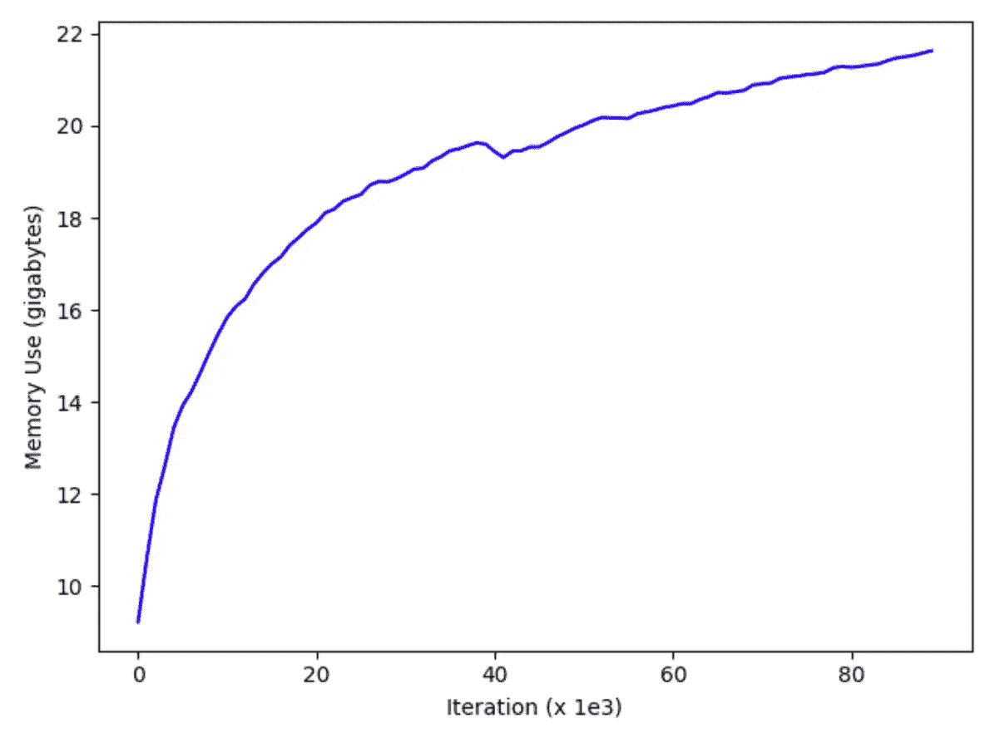
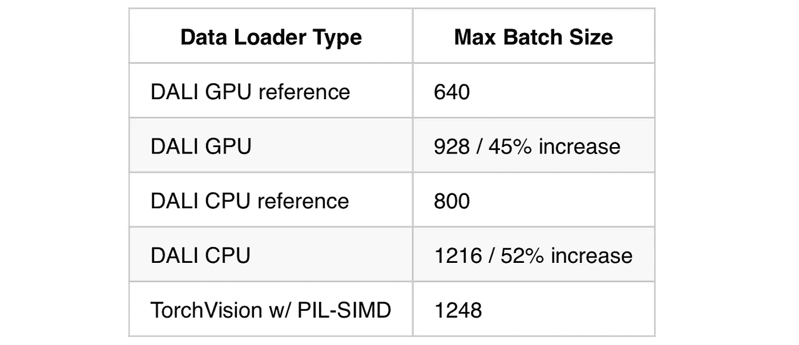

# NVIDIA DALI:加速 PyTorch

> 原文：<https://towardsdatascience.com/nvidia-dali-speeding-up-pytorch-876c80182440?source=collection_archive---------10----------------------->

## 提高 DALI 资源利用率的一些技术&创建一个完全基于 CPU 的管道。PyTorch 培训速度提升高达 4 倍


TL；DR:我展示了一些提高 DALI 资源利用率的技术&创建一个完全基于 CPU 的管道。与 DALI 包提供的示例 CPU 和 GPU 管道相比，这些技术稳定了长期内存使用，并允许大约 50%的大批量。使用 Tesla V100 加速器进行的测试表明，PyTorch+DALI 可以达到近 4000 张图像/秒的处理速度，比原生 PyTorch 快约 4 倍。

更新 20/3/2019: DALI 0.19 改进了内存管理，消除了内存使用量的逐渐上升( [278](https://github.com/NVIDIA/DALI/issues/278) )。我仍然建议在使用 GPU 管道时重新导入 DALI，以减少 GPU 内存的使用。

# 介绍

过去几年，深度学习硬件领域取得了巨大进步。Nvidia 的最新产品 Tesla V100 & Geforce RTX 系列包含专用张量内核，用于加速神经网络中常用的操作。特别是 V100，它有足够的能力以每秒数千张图像的速度训练神经网络，将 ImageNet 数据集上的单 GPU 训练缩短到仅几个小时的小模型。这与 2012 年在 ImageNet 上训练 AlexNet 模型所需的 5 天时间相去甚远！

如此强大的 GPU 使数据预处理管道不堪重负。为了解决这个问题，Tensorflow 发布了一个新的数据加载器:tf.data.Dataset。该管道用 C++编写，并使用基于图形的方法，从而将多个预处理操作链接在一起形成一个管道。另一方面，PyTorch 在 PIL 库的基础上使用 Python 编写的数据加载器——在易用性和灵活性方面很棒，但在速度方面不太好。尽管 PIL-SIMD 图书馆确实改善了这种情况。

进入 NVIDIA 数据加载库(DALI):旨在消除数据预处理瓶颈，允许训练和推理全速运行。DALI 主要设计用于在 GPU 上进行预处理，但大多数操作也有快速的 CPU 实现。本文关注 PyTorch，但是 DALI 也支持 Tensorflow、MXNet 和 TensorRT。尤其是 TensorRT 的支持，非常棒。它允许训练和推理步骤使用完全相同的预处理代码。Tensorflow 和 PyTorch 等不同的框架通常在数据加载器之间有细微的差别，这可能最终会影响准确性。

以下是开始使用 DALI 的一些重要资源:

[大理家园](https://developer.nvidia.com/DALI)

[用 NVIDIA DALI 快速 AI 数据预处理](https://devblogs.nvidia.com/fast-ai-data-preprocessing-with-nvidia-dali/)

[大理开发者指南](https://docs.nvidia.com/deeplearning/sdk/dali-developer-guide/docs/index.html)

[入门](https://docs.nvidia.com/deeplearning/sdk/dali-developer-guide/docs/examples/getting%20started.html)

在本文的剩余部分，我将假设对 ImageNet 预处理和 [DALI ImageNet 示例](https://github.com/NVIDIA/DALI/blob/master/docs/examples/pytorch/resnet50/main.py)有基本的了解。我将讨论我在使用 DALI 时遇到的一些问题，以及我是如何解决它们的。我们将研究 CPU 和 GPU 管道。

# DALI 长期记忆使用

更新 20/3/2019:此问题已在 DALI 0.19 中修复

我在 DALI 中遇到的第一个问题是，RAM 的使用随着每个训练时期而增加，导致 OOM 错误(即使在具有 78GB RAM 的 VM 上)。这已被标记( [278](https://github.com/NVIDIA/DALI/issues/278) 、 [344](https://github.com/NVIDIA/DALI/issues/344) 、 [486](https://github.com/NVIDIA/DALI/issues/486) )，但尚未修复。



我能找到的唯一解决方案并不漂亮——重新导入 DALI 并在每个时期重建培训和验证管道:

```
del self.train_loader, self.val_loader, self.train_pipe, self.val_pipe
torch.cuda.synchronize()
torch.cuda.empty_cache()
gc.collect()importlib.reload(dali)
from dali import HybridTrainPipe, HybridValPipe, DaliIteratorCPU, DaliIteratorGPU<rebuild DALI pipeline>
```

注意，使用这种解决方法，DALI 仍然需要大量 RAM 来获得最佳结果。考虑到现在 RAM 有多便宜(至少相对于 Nvidia GPUs 来说),这不是什么大问题；相反，GPU 内存是一个更大的问题。从下表中可以看出，使用 DALI 时可能的最大批量比 TorchVision 低 50%:


在接下来的几节中，我将介绍一些减少 GPU 内存使用的方法。

# 构建完全基于 CPU 的管道

我们先来看例子 [CPU 流水线](https://github.com/NVIDIA/DALI/blob/master/docs/examples/pytorch/resnet50/main.py)。当不需要峰值吞吐量时，基于 CPU 的管道非常有用(例如，当处理 ResNet50 这样的中型&大型模型时)。然而，CPU 训练管道仅在 CPU 上执行解码&调整大小操作，而 CropMirrorNormalize 操作在 GPU 上运行。这意义重大。我发现，即使只是用 DALI 将输出传输到 GPU，也使用了大量的 GPU 内存。为了避免这一点，我修改了示例 CPU 管道[以完全在 CPU 上运行:](https://github.com/NVIDIA/DALI/blob/master/docs/examples/pytorch/resnet50/main.py)

```
class HybridTrainPipe(Pipeline):
    def __init__(self, batch_size, num_threads, device_id, data_dir, crop,
                 mean, std, local_rank=0, world_size=1, dali_cpu=False, shuffle=True, fp16=False,
                 min_crop_size=0.08):

        # As we're recreating the Pipeline at every epoch, the seed must be -1 (random seed)
        super(HybridTrainPipe, self).__init__(batch_size, num_threads, device_id, seed=-1)

        # Enabling read_ahead slowed down processing ~40%
        self.input = ops.FileReader(file_root=data_dir, shard_id=local_rank, num_shards=world_size,
                                    random_shuffle=shuffle)

        # Let user decide which pipeline works best with the chosen model
        if dali_cpu:
            decode_device = "cpu"
            self.dali_device = "cpu"
            self.flip = ops.Flip(device=self.dali_device)
        else:
            decode_device = "mixed"
            self.dali_device = "gpu"

            output_dtype = types.FLOAT
            if self.dali_device == "gpu" and fp16:
                output_dtype = types.FLOAT16

            self.cmn = ops.CropMirrorNormalize(device="gpu",
                                               output_dtype=output_dtype,
                                               output_layout=types.NCHW,
                                               crop=(crop, crop),
                                               image_type=types.RGB,
                                               mean=mean,
                                               std=std,)

        # To be able to handle all images from full-sized ImageNet, this padding sets the size of the internal nvJPEG buffers without additional reallocations
        device_memory_padding = 211025920 if decode_device == 'mixed' else 0
        host_memory_padding = 140544512 if decode_device == 'mixed' else 0
        self.decode = ops.ImageDecoderRandomCrop(device=decode_device, output_type=types.RGB,
                                                 device_memory_padding=device_memory_padding,
                                                 host_memory_padding=host_memory_padding,
                                                 random_aspect_ratio=[0.8, 1.25],
                                                 random_area=[min_crop_size, 1.0],
                                                 num_attempts=100)

        # Resize as desired.  To match torchvision data loader, use triangular interpolation.
        self.res = ops.Resize(device=self.dali_device, resize_x=crop, resize_y=crop,
                              interp_type=types.INTERP_TRIANGULAR)

        self.coin = ops.CoinFlip(probability=0.5)
        print('DALI "{0}" variant'.format(self.dali_device))

    def define_graph(self):
        rng = self.coin()
        self.jpegs, self.labels = self.input(name="Reader")

        # Combined decode & random crop
        images = self.decode(self.jpegs)

        # Resize as desired
        images = self.res(images)

        if self.dali_device == "gpu":
            output = self.cmn(images, mirror=rng)
        else:
            # CPU backend uses torch to apply mean & std
            output = self.flip(images, horizontal=rng)

        self.labels = self.labels.gpu()
        return [output, self.labels]
```

DALI 管道现在在 CPU 上输出 8 位张量。我们需要使用 PyTorch 来完成 CPU-> GPU 传输、浮点数转换和规范化。这最后两个操作是在 GPU 上完成的，实际上，它们非常快，并且降低了 CPU -> GPU 内存带宽要求。我试图在转移到 GPU 之前锁定张量，但这样做并没有获得任何性能提升。用预取器把它放在一起:

```
def _preproc_worker(dali_iterator, cuda_stream, fp16, mean, std, output_queue, proc_next_input, done_event, pin_memory):
    """
    Worker function to parse DALI output & apply final preprocessing steps
    """

    while not done_event.is_set():
        # Wait until main thread signals to proc_next_input -- normally once it has taken the last processed input
        proc_next_input.wait()
        proc_next_input.clear()

        if done_event.is_set():
            print('Shutting down preproc thread')
            break

        try:
            data = next(dali_iterator)

            # Decode the data output
            input_orig = data[0]['data']
            target = data[0]['label'].squeeze().long()  # DALI should already output target on device

            # Copy to GPU and apply final processing in separate CUDA stream
            with torch.cuda.stream(cuda_stream):
                input = input_orig
                if pin_memory:
                    input = input.pin_memory()
                    del input_orig  # Save memory
                input = input.cuda(non_blocking=True)

                input = input.permute(0, 3, 1, 2)

                # Input tensor is kept as 8-bit integer for transfer to GPU, to save bandwidth
                if fp16:
                    input = input.half()
                else:
                    input = input.float()

                input = input.sub_(mean).div_(std)

            # Put the result on the queue
            output_queue.put((input, target))

        except StopIteration:
            print('Resetting DALI loader')
            dali_iterator.reset()
            output_queue.put(None)

class DaliIteratorCPU(DaliIterator):
    """
    Wrapper class to decode the DALI iterator output & provide iterator that functions in the same way as TorchVision.
    Note that permutation to channels first, converting from 8-bit integer to float & normalization are all performed on GPU

    pipelines (Pipeline): DALI pipelines
    size (int): Number of examples in set
    fp16 (bool): Use fp16 as output format, f32 otherwise
    mean (tuple): Image mean value for each channel
    std (tuple): Image standard deviation value for each channel
    pin_memory (bool): Transfer input tensor to pinned memory, before moving to GPU
    """
    def __init__(self, fp16=False, mean=(0., 0., 0.), std=(1., 1., 1.), pin_memory=True, **kwargs):
        super().__init__(**kwargs)
        print('Using DALI CPU iterator')
        self.stream = torch.cuda.Stream()

        self.fp16 = fp16
        self.mean = torch.tensor(mean).cuda().view(1, 3, 1, 1)
        self.std = torch.tensor(std).cuda().view(1, 3, 1, 1)
        self.pin_memory = pin_memory

        if self.fp16:
            self.mean = self.mean.half()
            self.std = self.std.half()

        self.proc_next_input = Event()
        self.done_event = Event()
        self.output_queue = queue.Queue(maxsize=5)
        self.preproc_thread = threading.Thread(
            target=_preproc_worker,
            kwargs={'dali_iterator': self._dali_iterator, 'cuda_stream': self.stream, 'fp16': self.fp16, 'mean': self.mean, 'std': self.std, 'proc_next_input': self.proc_next_input, 'done_event': self.done_event, 'output_queue': self.output_queue, 'pin_memory': self.pin_memory})
        self.preproc_thread.daemon = True
        self.preproc_thread.start()

        self.proc_next_input.set()

    def __next__(self):
        torch.cuda.current_stream().wait_stream(self.stream)
        data = self.output_queue.get()
        self.proc_next_input.set()
        if data is None:
            raise StopIteration
        return data

    def __del__(self):
        self.done_event.set()
        self.proc_next_input.set()
        torch.cuda.current_stream().wait_stream(self.stream)
        self.preproc_thread.join()
```

# 基于 GPU 的流水线

在我的测试中，上面详细介绍的新的完整 CPU 流水线大约是 TorchVision 的数据加载器的两倍，同时达到几乎相同的最大批量。CPU 管道对于像 ResNet50 这样的大型模型非常有用；然而，当使用 AlexNet 或 ResNet18 这样的小模型时，CPU 流水线仍然无法跟上 GPU。对于这些情况，[示例 GPU 流水线](https://github.com/NVIDIA/DALI/blob/master/docs/examples/pytorch/resnet50/main.py)工作得最好。问题是 GPU 管道将最大可能的批处理大小减少了近 50%，限制了吞吐量。

一种显著减少 GPU 内存使用的方法是让验证管道远离 GPU，直到一个时期结束时真正需要它。这很容易做到，因为我们已经重新导入了 DALI 库并在每个时期重新创建了数据加载器。

# 更多提示

使用 DALI 的更多提示:

*对于验证，平均划分数据集大小的批次大小效果最佳，例如，对于 50000 的验证集大小，500 而不是 512，这样可以避免在验证数据集结束时出现部分批次。

*与 Tensorflow 和 PyTorch 数据加载器类似，TorchVision 和 DALI 管道不会产生位相同的输出，您会看到验证精度略有不同。我发现这是由于不同的 JPEG 图像解码器。以前有一个调整大小的问题，但现在已经修复。另一方面，DALI 支持 TensorRT，允许将完全相同的预处理用于训练和推理。

*对于峰值吞吐量，请尝试将数据加载器工作线程的数量设置为虚拟 CPU 内核的数量。2 提供最佳性能(2 个虚拟内核= 1 个物理内核)

*如果您想要绝对最佳的性能，并且不在乎输出类似于 TorchVision，请尝试在调整 DALI 图像大小时关闭三角形插值

*不要忘记磁盘 IO。确保您有足够的内存来缓存数据集和/或真正快速的 SSD。DALI 最高可以从磁盘拉 400Mb/s！

# 把它放在一起

为了帮助轻松集成这些修改，我用这里描述的所有修改创建了一个[数据加载器类](https://github.com/yaysummeriscoming/DALI_pytorch_demo/blob/master/dataloader.py)，包括 DALI 和 TorchVision 后端。用法很简单。实例化数据加载器:

```
dataset = Dataset(data_dir, 
                  batch_size,
                  val_batch_size
                  workers,
                  use_dali,
                  dali_cpu,
                  fp16)
```

然后获取训练和验证数据加载器:

```
train_loader = dataset.get_train_loader()
val_loader = dataset.get_val_loader()
```

在每个训练时段结束时重置数据加载器:

```
dataset.reset()
```

或者，在模型验证之前，可以在 GPU 上重新创建验证管道:

```
dataset.prep_for_val()
```

# 基准

以下是我在 ResNet18 中能够使用的最大批量:



因此，通过应用这些修改，DALI 可以在 CPU 和 GPU 模式下使用的最大批处理大小增加了大约 50%！

以下是 Shufflenet V2 0.5 和批量 512 的吞吐量数据:


以下是使用 DALI GPU 管道训练 TorchVision 中包含的各种网络的一些结果:


所有测试都是在 Google Cloud V100 实例上运行的，该实例具有 12 个 vCPUs 个物理内核)、78GB RAM &使用 Apex FP16 培训。若要重现这些结果，请使用以下参数:
— fp16 —批量大小 512—workers 10—arch " shuffle net _ v2 _ x0 _ 5 或 resnet 18)—prof—use-Dali

所以，有了 DALI，单个特斯拉 V100 就可以达到将近 4000 图像/秒的速度！这只是英伟达超级昂贵的 8 V100 GPU DGX-1 的一半多一点(尽管使用的是小型号)。对我来说，能够在几个小时内在单个 GPU 上运行 ImageNet 培训是生产力游戏规则的改变者。希望对你也一样。感谢反馈！

本文给出的代码是这里的

# 承认

非常感谢 Patricia Thaine 对本文早期草稿的反馈。

封面图片由[亚采克·阿布拉莫维奇](https://pixabay.com/users/JacekAbramowicz-1981807/?utm_source=link-attribution&utm_medium=referral&utm_campaign=image&utm_content=1201077)拍摄