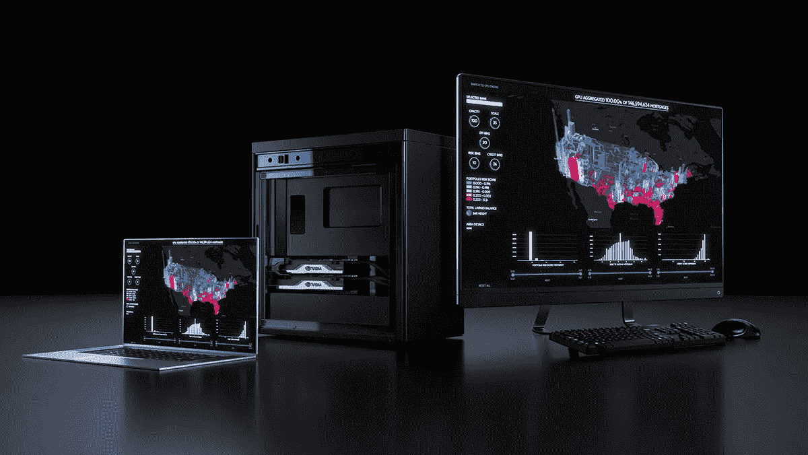
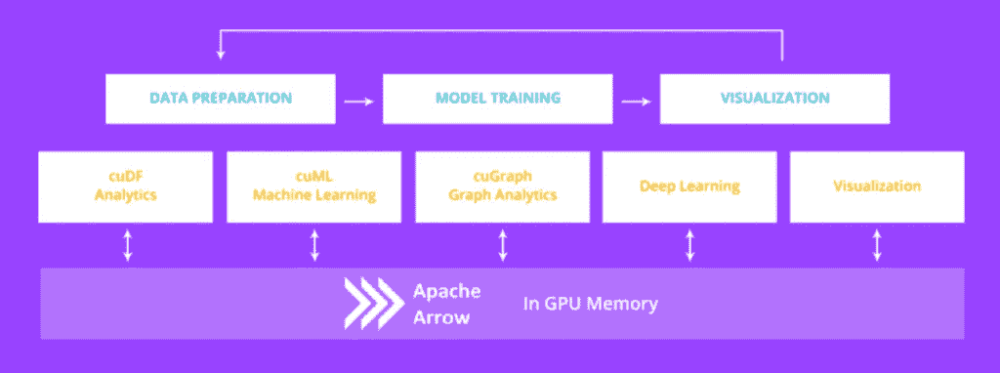
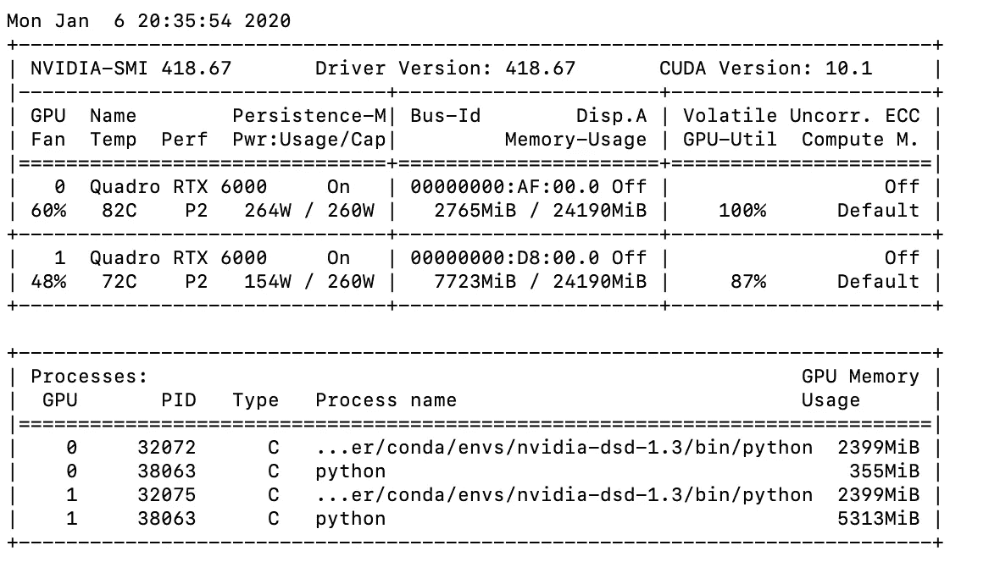
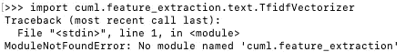
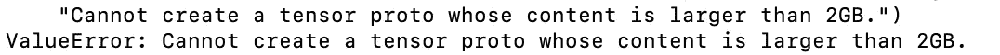
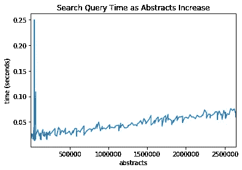
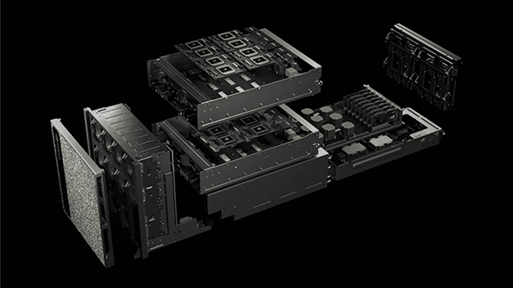

# Nvidia 给了我一个价值 15000 美元的数据科学工作站——以下是我用它做的事情

> 原文：<https://towardsdatascience.com/nvidia-gave-me-a-15k-data-science-workstation-heres-what-i-did-with-it-70cfb069fc35?source=collection_archive---------2----------------------->

## [视频教程](https://towardsdatascience.com/tagged/video-tutorial)

## 在几个小时而不是几个星期内，在数据科学 WhisperStation 上重建一个大规模的 Pubmed 文献搜索项目

[在 YouTube 上观看](https://www.youtube.com/watch?v=WCz8AF-wT1I)并查看[相关的 git 回购](https://github.com/kylegallatin/gpu-accerelated-search-notebook)

当 NVIDIA 问我是否想试试最新的数据科学工作站时，我很兴奋。然而，一个发人深省的想法伴随着兴奋而来:*我到底应该用它来做什么？*

作为一名机器学习工程师，我做了很多深度学习，但我绝对不是谷歌大脑研究员。我可以运行基准测试，时间工作等…但我不在英伟达工作，老实说，这听起来不太有趣。



[该死的](https://www.nvidia.com/content/dam/en-zz/Solutions/deep-learning/deep-learning-solutions/data-science/data-science-laptop-workstation-4c25-p@2x.jpg) —基于 NVIDIA 的数据科学工作站

我不断推销自己的想法，并开始思考强大计算对数据科学家的真正价值。精心设计的 GPU 计算可以节省成本，降低服务延迟，简化大型模型的训练，但我最感兴趣的是快速迭代。

数据科学是一个以实验为基础的领域。对于大数据或大模型，如果没有大量资源，科学家尝试新配置或参数的次数是有限的。每个人都知道启动一个计算密集型进程的痛苦，只是在运行它的几个小时内被一个不可预见的错误弄得措手不及。然后你要改正，重新开始。

我回想起我的第一个数据科学项目:一个大规模、多语言的医学文献搜索引擎。如果我在 2020 年回到 2017 年，能够访问我现在拥有的计算和 GPU 库，我可能已经能够完成什么？我能以多快的速度完成它？

因此，我试图通过构建一个仅使用 GPU 资源的 Pubmed 搜索引擎来回答这个问题。

# 该项目

最初的项目来自中国的一个团队，那里的制药公司有责任向医疗保健从业者(hcp)提供非品牌医疗信息。该团队希望构建一个新颖的搜索工具，它需要:

*   多语言(*中文/中文*)
*   可通过多种渠道(网络/微信)获得
*   可定制(能够调整算法以获得最佳结果)
*   低延迟(快速搜索结果)
*   大数据(所有的 Pubmed 摘要—这里我以过去 10 年为试点)
*   准确(比 Pubmed 搜索结果更好)

我的工作是设计一个能够满足并支持所有这些需求的解决方案。此外，这个解决方案需要通过迭代相对快速地周转，以便我们能够基于来自主题专家(SME)的输入快速地测试、评估和更新系统。

然而，作为一名数据科学家，我有一个大问题…

# 数据

对于那些不知道的人来说，Pubmed 是一个包含超过 3000 万次引用的生物医学文献数据库。虽然不是所有的全文文章都是开源的，但是每个引用都有摘要。所有这些信息都可以通过 API 获得，或者以 XML 文件的形式从[批量下载，不幸的是，对我来说，大约 300GB 分布在一千个文件中。](https://mbr.nlm.nih.gov/Download/Baselines/2019/)


这张照片体现了“搜索”吗？

在解析每个 XML 以提取有用的字段(标题、摘要、出版年份等)之后，数据大小减少到接近 25GB。然而，这仍然不是超级本地可管理的。就像我之前说过的，数据科学是关于实验的——我需要做很多实验。作为一个有点新的数据科学家(和糟糕的工程师)，我基本上只有一个资源:Python。没有 20 个节点的 Spark 或 Elasticsearch 集群来救我。

但是，如果我有一两个 GPU 呢？

# 工作站

我通过 Microway &获得访问权限的[数据科学耳语站](https://www.microway.com/preconfiguredsystems/data-science-whisperstation-nvidia-data-science-workstation/)Nvidia 具有以下特性:

*   双英特尔至强 10 核 CPU
*   192GB 内存
*   高速 1TB 暂存驱动器
*   带 NVLink 的双 NVIDIA Quadro RTX 6000 GPU
*   预装和配置 Python，Docker，RAPIDs 和我这个项目需要的所有机器学习库

我们真正关心的是最后两颗子弹。你可能知道，GPU 计算在数据科学中非常流行。使用 GPU 库运行工作流可以将代码速度提高几个数量级，这意味着每次实验运行只需几个小时，而不是几周。

此外，如果您曾经从零开始建立过数据科学环境，您会知道这真的很糟糕。安装和配置 Docker、RAPIDs、tensorflow、pytorch 和其他所有现成的软件节省了安装时间。

直到最近，GPU 主要用于数据科学中的深度学习。然而，不久前 Nvidia 发布了[RAPIDS](https://rapids.ai/)——一个针对 GPU 的通用数据科学库。急流由以下部分组成:

*   cudf (基本是熊猫)
*   *cuml* (基本上是 scikit-learn)
*   *cugraph* (基本是网络-X)

这些通用数据科学库为传统的 CPU 处理(数据加载、清理、特征工程、线性模型等)提供了大量的计算增强，为数据科学的全新前沿铺平了道路。

# 熊猫到急流城

在现代，简单的搜索是一个相当简单的过程。单词可以用数字向量来表示，然后计算这些向量之间的距离，就可以看出段落有多“相似”。最简单的方法是使用 TF-IDF 字向量的余弦相似度。



[急流](https://www.google.com/url?sa=i&url=https%3A%2F%2Fdevblogs.nvidia.com%2Fgpu-accelerated-analytics-rapids%2F&psig=AOvVaw3tl2r6V5aeZNUhBe_5KKnC&ust=1582231062758000&source=images&cd=vfe&ved=0CAIQjRxqFwoTCLiuvZa83ucCFQAAAAAdAAAAABAD)

然而，为了“矢量化”我们的文本，我们首先需要实际读入并预处理它。假设 XML → csv 预处理已经完成，现在我们只需要将它们作为数据帧读入并执行相关的预处理。

现在，我们有大约 23GB 的数据，只有两个 GPU。我并不幻想能够用 Python 将所有这些都放入 GPU 内存中。幸运的是，就像科学文献一样，只有最近的文章才是相关的。为了评估专家搜索的准确性，我真的只需要 Pubmed 最近 10 年的数据——根据我的数据集，大约有 800 万篇文章。

使用受 CPU 限制的进程会很费力，但是用 cuda 加速会有很大的不同。我想:

1.  读入数据帧
2.  清除“摘要”列中的字符串
3.  仅保留≥ 2009 年的年份
4.  重写为 csv

这就是 cudf 的用武之地。我真的写了熊猫代码，做了查找/替换，我还有 GPU 加速代码！

这比在本地处理数据帧要快得多。以下是使用 pandas 的本地输出示例:

```
Processed 13783 abstracts in 0.84604811668396 seconds
Processed 21714 abstracts in 1.2190630435943604 seconds
Processed 20259 abstracts in 1.1971170902252197 seconds
```

下面是使用 cudf 的工作站上的流程输出:

```
Processed 23818 abstracts in 0.3909769058227539 seconds
Processed 23609 abstracts in 0.5951714515686035 seconds
Processed 23929 abstracts in 0.3672349452972412 seconds
```

每个文件的处理速度提高了一倍以上，而代码只需要一个 GPU！更好的是，我们可以通过创建 cuda 集群和使用 dask 来使用两个 GPU 中的所有内存。

如果我只是想阅读所有的摘要，然后用它们做些别的事情，dask 用最少的代码行就能做到非常高效。

上面的代码在我的 Pubmed 数据子集上产生了以下输出(所有的 Pubmed 都会抛出一个内存错误——这并不奇怪)。

```
Read 7141779 abstract in 64.332682 seconds
```

使用`watch -n 0.5 nvidia-smi`在单独的窗口中检查 GPU 使用的输出，您可以观察您的进程运行并监控内存使用。



监控工作站上的 GPU 使用情况

# GPU 加速余弦相似度

既然我现在知道我可以将过去十年的 Pubmed 数据加载到 GPU 内存中，我就可以进入有趣的部分了:实际的 TF-IDF 矢量化。在 scikit 中——了解这一点相当容易，请在这里查看我的[完整 CPU 实现](https://gist.github.com/kylegallatin/0860a1b51101c7bd9c2fcc0d7b6f0906)。使用 cuml，我们应该能够像对熊猫那样找到并替换，但不幸的是…



失败:(

根据[这期 Github](https://github.com/rapidsai/cuml/issues/1266)的消息，在撰写本文时，cuml 的文本特征提取库仍在工作中(但一旦完成，我会用代码更新！).这意味着我们的矢量器仍然需要用 scikit-learn 来实现，我们还不能在这个 TF-IDF 任务上获得 GPU 加速。这只是针对训练步骤，但这意味着我们的 TF-IDF 矢量器将仍然受到 CPU 的限制，因此效率低下。

然而，这还没有结束。即使训练本身是低效的，那一步真的只需要发生一次。幸运的是，sklearn 的 TF-IDF 矢量器的输出只是一个稀疏矩阵——当我们回到处理矩阵时，我们可以从一些经典的张量库中获得帮助。我决定用 tensorflow。

正如所料，矩阵乘法是任何张量库的隐含部分。在 sklearn 中训练了我的矢量器之后，我可以用 tensorflow 将实际的矢量移植回 GPU 来执行矩阵乘法。

现在，从理论上讲，这对于 Pubmed 的一小部分非常有效——但是它没有伸缩性。在所有的 Pubmed(甚至我们的子集)中，有相当多的独特的单词。由于 2009 年以后 Pubmed 中的每一个引用都有一个向量，我们的稀疏矩阵变得庞大。我想大概是 800 万 T4 乘以 100 万 T5。



是的，大惊喜，凯尔，干得好，伙计

受到阻碍的不是硬件，而是软件。试图在 sklearn 和 tensorflow 之间来回切换导致了一系列问题。意识到这种方法需要更多的时间和技能，这是我继续前进或者成为一名更好的工程师的时候了。是时候转向深度学习表示了。

# 创建 GPU 加速的 BERT 索引

## 使用 BERT 向量化 Pubmed

NLP 中的变压器的最新进展已经在各种任务中显示出巨大的改进。虽然此后出现了许多模型，但这场革命的起源是谷歌的 BERT。像其他一些基于 DL 的模型一样，BERT 为句子生成一个*上下文*向量。维数(向量的长度)等于隐藏层的大小，在最新推荐的 BERT-large 模型中是 1024。

这是巨大的。即使我们不能再使用稀疏矩阵，我们向量的大小也从几百万 x 几百万→几百万 x 几千。在空间有限的 GPU 上，这一点非常重要。

通常 BERT 用于分类任务，但是在我们的例子中，我们只是想用它来提取 Pubmed 摘要的矢量化表示，这样它们就可以被索引和搜索。感谢腾讯研究院，我们已经有了一个设计良好且支持 GPU 的库: [BERT as a service](https://github.com/hanxiao/bert-as-service) 。

您可以按照 repo 中的说明来实际安装该服务。一旦您的环境中有了它，您所要做的就是下载您喜欢的 BERT 模型并启动它。

下载模型并启动服务

现在您已经运行了服务，可以调用简单的 Python 来获取您想要 BERT 表示的任何文本的向量。

使用 bert-as-service 对文本进行矢量化

很简单。通过使用工作站上两个 GPU 的 BERT 服务，大量摘要以惊人的速度通过模型。下面是我为每个 csv 计时时的输出:

```
Vectorized 23727 abstracts in 53.800883 seconds
Vectorized 25402 abstracts in 56.999314 seconds
Vectorized 25402 abstracts in 57.235494 seconds
Vectorized 23575 abstracts in 50.786675 seconds
Vectorized 17773 abstracts in 33.936309 seconds
Vectorized 24190 abstracts in 53.914434 seconds
```

即使有了工作站，这个过程也需要一段时间——这让你知道没有它需要多长时间。同样值得注意的是，这次包括用 cudf 读入数据。为了说明 GPU 加速和本地计算之间的差距有多大，下面是使用我的个人笔记本电脑的相同过程:

```
Vectorized 13172 abstracts in 2048.069033 seconds
```

*30 分钟*。我花了将近 30 分钟在工作站上对< 60 秒处理的*一半*的摘要进行矢量化处理。即使只是从如此大的模型中获取向量，GPU 计算也让我在代码运行时不用整天摆弄手指。

## 使用 Faiss 索引

这一次，我将把它交给一个设计良好的快速索引库，而不是自己做矩阵乘法。脸书的 faiss 易于使用，GPU 能力使其成为索引伯特矢量的完美工具。要在 faiss 中创建一个基于 GPU 的平面，我们只需要大约 10 行代码。

一旦你有了索引，你要做的就是把向量放进去。为了节省 GPU 内存，我建议先单独使用 BERT 服务对文本进行矢量化，然后保存到磁盘。然后，您可以加载和索引向量，而不需要服务在后台运行。但是，如果您愿意，也可以一次性完成。

创建索引本身后，可以在一行中完成搜索。但是这个规模会大吗？如果我想使用这段代码来检索结果，或者甚至将一个模型投入生产，我想确保搜索尽可能快地运行。我对大约 300 万份摘要进行了基准搜索，搜索结果仍然花费了不到 0.1 秒。



即使是 250 万份摘要，在工作站上使用 faiss 的搜索查询时间仍然不到 10 毫秒

终于？健全检查。我一直在假设 SME 能够评估搜索的准确性的情况下进行搜索。然而，如果搜索结果如此糟糕，那就毫无意义了，我将不得不从头开始，或者彻底重构我的方法。幸运的是，情况并非如此。

```
>>> search_term = "parkinsons disease" # search parkinsons
>>> search_vector = bc.encode([search_term]) # encode term
>>> distances,indicies = index.search( # get top 3 results
    search_vector.astype('float32'), 
    k=3)
>>>for i in indicies[0]:
...    print(text[i][0:500], sep = "\n") # print first 500 charDeep brain stimulation (DBS) improves motor symptoms in Parkinson's disease (PD), but questions remain regarding neuropsychological decrements sometimes associated with this treatment, including rates of statistically and clinically meaningful change, and whether there are differences in outcome related to surgical target.Neuropsychological functioning was assessed in patients with Parkinson's disease (PD) at baseline and after 6 months in a prospective, randomised, controlled study comparingKennedy's disease (KD) is a progressive degenerative disorder affecting lower motor neurons. We investigated the correlation between disease severity and whole brain white matter microstructure, including upper motor neuron tracts, by using diffusion-tensor imaging (DTI) in eight patients with KD in whom disease severity was evaluated using the Amyotrophic Lateral Sclerosis Functional Rating Scale (ALSFRS).From DTI acquisitions we obtained maps of fractional anisotropy (FA), mean diffusivity (Autophagy is associated with the pathogenesis of Lewy body disease, including Parkinson's disease (PD) and dementia with Lewy bodies (DLB). It is known that several downstream autophagosomal proteins are incorporated into Lewy bodies (LBs). We performed immunostaining and Western blot analysis using a cellular model of PD and human brain samples to investigate the involvement of upstream autophagosomal proteins (ULK1, ULK2, Beclin1, VPS34 and AMBRA1), which initiate autophagy and form autophago
```

快速浏览显示，aa 上下文搜索“帕金森病”会返回该领域的相关摘要(以我外行的评价)。

因此，让我们回顾一下需求，看看这种方法是否解决了该项目的所有需求:

***多语言(en/zh)* ✅:** BERT 支持 104 种语言！

***多渠道(网络/微信)***✅:用 API 包好，端上桌。

***可定制(能够调整算法以获得最佳结果)* ✅:** 我使用的是 BERT base，但这里也可以使用 Bio-BERT 或任何其他微调过的 BERT。此外，我们可以在这些结果上叠加轻量级分类算法或启发式算法，以进一步提高准确性。

***低延迟(快速搜索结果)* ✅:** 使用 Pubmed abstracts 的近 1/3，延迟仍为< 0.1 秒，看起来比例合理。

***支持大数据(所有 Pubmed 摘要等)* ✅:** 我们只使用 2009 年的引文进行验证，但是有了更多的 GPU 和更好的工程师，你可以很容易地将其扩展到整个 Pubmed。

***准确(比 Pubmed 更好的搜索结果)*🤔:**有待观察。中小企业必须用 Pubmed search 对搜索结果进行评级和比较，并随着时间的推移调整算法。然而，由于大约 700 万份摘要的短期周转，工作站使得这种周转相对较快的方法非常可行。此外，虽然健全性检查缺乏规模，但它至少表明这种方法可能值得探索。

# 结论

在充斥着杂乱无章的文档的大公司中，信息检索非常重要。检索这些文档的智能解决方案非常受欢迎。虽然许多供应商都提供了强大的企业级解决方案，但要在如此短的时间内组织如此大规模的信息，现在只有通过 2010 年代后期的硬件和软件进步才有可能。

在几周的空闲时间里，我创造、重复和修改了我解决这个问题的方法。多亏了工作站和开源的力量，我在那段时间里成功地完成了我的目标。我没有等待几个星期来运行代码，而是不断收到反馈，并尽早解决错误。结果，我的代码和这个个人项目以指数级的速度进步。


[我太喜欢这个小家伙了，他们帮我解决了几个小时的头痛问题](https://www.docker.com/sites/default/files/social/docker_facebook_share.png')

因为我基本上已经在一个生产环境中工作，所以也很容易过渡到更多托管的云主机进行部署。虽然我的代码与生产代码相去甚远，但使用 Docker 使我能够确保我构建的所有东西都可以被预打包，并被发送到我喜欢的任何映像注册中心和部署方案。

显然，15000 美元对于某些硬件来说是一笔不小的数目。但是，如果你是一个寻求快速试验和周转的企业组织，这是有意义的。作为对比，这里有一个专用 AWS p3.8x large (4 特斯拉 V100s)的报价。一年 75，000 美元，以及自己安装所有库和工具的麻烦。


专用 GPU 资源的 AWS 定价

这个问题有不涉及 GPU 的解决方案。由于 elasticsearch 现在有了对向量评分的[支持](https://www.elastic.co/jp/blog/text-similarity-search-with-vectors-in-elasticsearch)，您可以非常容易地在一个 20 节点的集群上部署相同的解决方案，比我在这里使用的大约 30 行代码多得多。



[英伟达 DGX](https://www.nvidia.com/content/dam/en-zz/Solutions/deep-learning/dgx-saturnv/nvidia-dgx-saturnv-real-world-quality-assurance-4c25-m@2x.jpg)

然而，这里仅在两个 dgx 上实现的效率和规模应该显示了使用 GPU 的工作情况。通过高级 Python APIs 的可访问性现在使普通数据科学家能够以最小的努力执行高度优化的任务。感谢您的阅读，请务必改进这些解决方案！

*不要脸塞:正在制作* [*我的 Twitter 游戏*](https://twitter.com/kylegallatin) *并随时连接上*[*LinkedIn*](https://www.linkedin.com/in/kylegallatin/)*！*