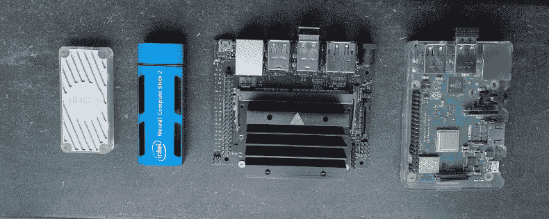
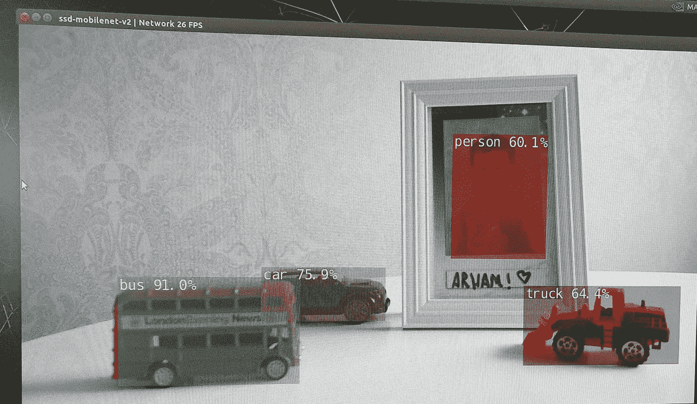
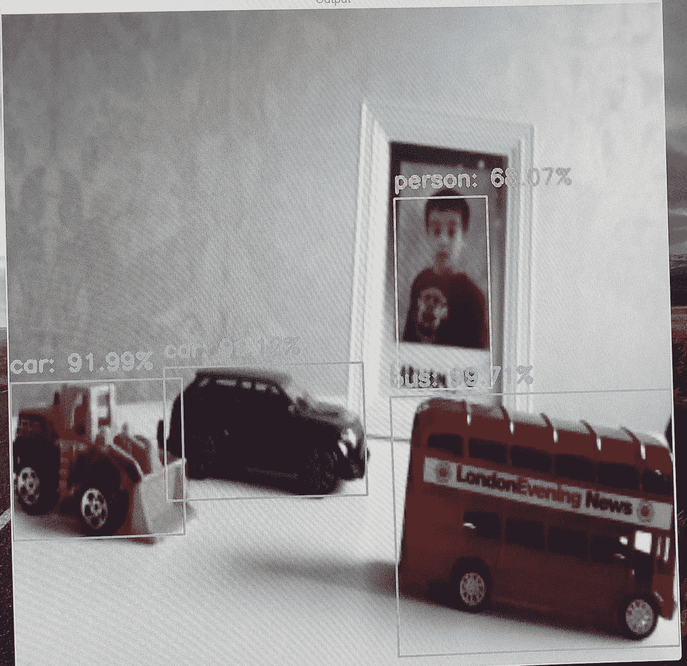

# NVIDIA Jetson Nano vs Google Coral vs Intel NCS:比较

> 原文：<https://towardsdatascience.com/nvidia-jetson-nano-vs-google-coral-vs-intel-ncs-a-comparison-9f950ee88f0d?source=collection_archive---------5----------------------->

## 用于计算机视觉和机器学习的边缘人工智能硬件加速器

Edge AI 硬件:谷歌珊瑚、英特尔 Movidius NCS、英伟达 Jetson Nano、树莓 Pi

在人工智能培训框架达到一定程度的成熟后，dge 人工智能已经获得了发展势头；Tensorflow，Pytorch，Caffe，Keras，OpenVINO 等。然而，从数据采集到模型部署和推理的完整工具链仍不清晰，因为这项工作仍处于研究阶段，发展非常迅速。然而，这并没有阻碍该领域一些令人兴奋的解决方案的开发。例子包括从计算机视觉的[物体识别](/recent-advances-in-modern-computer-vision-56801edab980)和从自然语言处理角度的[语音识别](https://emerj.com/ai-sector-overviews/ai-for-speech-recognition/)。

# 传统人工智能，机器学习方法

许多现有的人工智能解决方案都将云计算或存储作为架构的重要组成部分。由于隐私、延迟、可靠性和带宽方面的问题，这使得某些部门很难将该技术用于实际应用。虽然资源有限，但边缘计算可以在一定程度上缓解这些问题。争论的焦点不是边缘和云计算的相互排斥，而是边缘计算对云计算的补充。

# 边缘人工智能未来提案

Gartner 炒作周期 2019 年和 2018 年[ [1](https://www.gartner.com/en/documents/3956015/hype-cycle-for-emerging-technologies-2019) ]显示的新兴技术趋势表明，边缘人工智能和边缘分析具有过高的预期。然而，由于该领域仍处于起步阶段，软件框架和硬件平台将随着时间的推移而发展，以经济高效的方式创造价值。

# 谁在竞争:英伟达、谷歌和英特尔

人工智能领域的三个主要参与者；英特尔、谷歌和英伟达通过提供小型硬件平台/加速器来支持边缘人工智能。虽然这三者各有优缺点，但这完全取决于应用程序、预算和技能组合的可用性。

在这篇博客中，我将提供三个 edge AI 硬件加速器的简要比较；英特尔 Movidius NCS 棒，谷歌 Coral 盘，英伟达 Jetson Nano。

# 测试设置

为了执行检测比较，考虑了相同的环境设置。测试对象包括一个人、一辆公共汽车和一辆汽车。确保相同的照明条件。讨论的最后给出了设置每个实验的*入门教程*的链接。在实验中，硬件组件包括 NVIDIA Jetson Nano 开发者套件、32GB Scandisk Ultra SDcard、微软 USB LifeCam 1080p HD(网络摄像头)、树莓 Pi 官方通用电源 2.5A、树莓 Pi 摄像头、谷歌 Coral USB 和英特尔 NCS。

图片由作者提供。测试设置

# 性能和资源利用率

使用 Linux 的`top`命令测量资源利用率。推理时间是在单个帧中检测到对象的时间，CPU 使用率表示协处理器的利用率。英特尔 NCS 的帧率较低，但第二代英特尔 NCS2 据称可提供高达 8 倍的性能[ [2](https://software.intel.com/content/dam/develop/public/us/en/documents/ncs2-product-brief.pdf) ]。检测结果代表检测的置信度得分。

图 01 描绘了 Nvidia Jetson Nano 的检测结果，图 02 代表 Google Coral，图 03 显示了来自 Intel NCS 的检测结果。可以看出，NVIDIA 和 Intel NCS 提供了更好的置信度得分，而 Google Coral 的置信度得分相对较低。原因之一是谷歌珊瑚使用的是红外摄像头，因此由于摄像头传感器的不匹配，检测性能并不完全科学。但是，这提供了一个指示，表明有多少对象用于估计处理负载、内存使用和推理时间计算。

图片由作者提供。图 01，Nvidia Jetson Nano 的检测结果

图片由作者提供。图 02，Google Coral 的检测结果

图片由作者提供。图 03，英特尔 Movidius NCS 的检测结果

# 费用

下表列出了硬件加速器以及所需组件的成本。值得一提的是，Nvidia Jetson Nano 是一个开发板，作为一个独立的设备工作。然而，Google Coral USB 和 Intel NCS 需要一台主机来处理数据流。主计算机可以是单板计算机，例如 Raspberry Pi 或任何其他具有 Windows 或 Linux 操作系统的 x86 计算机。下表中的费用是用树莓 Pi 3 B+计算的。

单板计算机的边缘人工智能设置。

成本是针对原型系统估算的，每个加速器提供商都有生产就绪的硬件。生产就绪型加速器的成本将取决于批量和第三方产品，因为这些模块需要集成到主机中。

生产就绪的硬件加速器:[杰特森纳米](https://www.nvidia.com/en-us/autonomous-machines/embedded-systems/jetson-nano/)，[谷歌珊瑚](https://coral.ai/products/#production-products)，[英特尔 NCS](https://up-board.org/world-first-mpcie-ai-machine-learning-expansion-card/) 。

# 你应该买什么

答案取决于最终目标。

*   如果目标是最终产品，最好使用生产就绪的硬件加速器( [Jetson nano](https://www.nvidia.com/en-us/autonomous-machines/embedded-systems/jetson-nano/) 、 [Google Coral](https://coral.ai/products/#production-products) 、 [Intel NCS](https://up-board.org/world-first-mpcie-ai-machine-learning-expansion-card/) )，它们具有更好的温度额定值。
*   如果目标是开发概念验证(PoC)，最好使用开发板(NVIDIA、Google coral)或 USB 接口加速器(Intel NCS、google Coral)。

对于 PoC，成本相对相同，并且完全取决于应用程序要求、选择三个选项中任何一个的技能的可用性。尽管如此，还是建议评估不同的模型，并评估加速器是否支持特定的模型。下一段将简要讨论每个硬件加速器的灵活性。

# 大部分

通用性可以从硬件和软件两个角度来理解。从硬件角度来看，灵活性可能是；在片上系统或主机中集成/利用特定加速器有多容易。这完全取决于应用程序和接口的可用性。
从软件角度来看，灵活性可以从特定加速器支持多少检测和分类模型的角度来定义。这里列出了三个加速器的模型动物园

*   英特尔 NCS 模型动物园和应用[ [3](https://github.com/movidius/ncappzoo/blob/master/apps/README.md)
*   Nvidia Jetson Nano 型号[ [4](https://github.com/NVIDIA-AI-IOT/tf_trt_models)
*   谷歌珊瑚动物园[ [5](https://coral.ai/models/)

# 结论

从延迟角度来看，Nvidia Jetson Nano 的性能明显优于 google coral 的约 9 fps 和 Intel NCS 的约 4 fps，前者约为 25 fps。对于某些应用，考虑到成本差异，超过 4 fps 也可能是一个不错的性能指标。Nvidia Jetson Nano 是一款评估板，而英特尔 NCS 和谷歌 Coral 则是可以连接到现有硬件的附加设备。使用上述硬件可以快速开发 PoC。还值得一提的是，这三款产品都具有可生产的硬件加速器，具有更好的额定温度和性能模式，例如 google coral 具有[动态频率缩放](https://coral.ai/docs/mini-pcie/datasheet/#thermal-limit-and-operating-frequency)，并根据加速器的温度调整负载。
这些原型硬件加速器的成本相对较小，且在同一范围内，适用于不同的低成本应用。

# 入门教程

 [## 入门:Nvidia Jetson Nano，对象检测和分类

### 边缘计算的未来

towardsdatascience.com](/getting-started-nvidia-jetson-nano-object-detection-and-classification-161ad566d594)  [## 开始使用英特尔神经计算棒 2

### 按照下面的逐步说明来设置您的英特尔神经计算棒 2(英特尔 NCS 2)或原始…

software.intel.com](https://software.intel.com/content/www/us/en/develop/articles/get-started-with-neural-compute-stick.html)  [## 开始使用 USB 加速器| Coral

### Coral USB 加速器是一种 USB 设备，可为您的计算机提供 Edge TPU 作为协处理器。它会加速…

coral.ai](https://coral.ai/docs/accelerator/get-started/) 

# **参考文献:**

1.  [https://www . Gartner . com/en/documents/3956015/hype-cycle-for-emerging-technologies-2019](https://www.gartner.com/en/documents/3956015/hype-cycle-for-emerging-technologies-2019)
2.  [https://software . Intel . com/content/dam/develop/public/us/en/documents/NCS 2-product-brief . pdf](https://software.intel.com/content/dam/develop/public/us/en/documents/ncs2-product-brief.pdf)
3.  [https://github . com/m ovidius/ncappzoo/blob/master/apps/readme . MD](https://github.com/movidius/ncappzoo/blob/master/apps/README.md)
4.  [https://github.com/NVIDIA-AI-IOT/tf_trt_models](https://github.com/NVIDIA-AI-IOT/tf_trt_models)
5.  [https://coral.ai/models/](https://coral.ai/models/)

# 相关文章

 [## 在 Windows 上使用 GStreamer 和 QT 的 OpenCV

### 使用 OpenCV 的 GStreamer 管道的分步指南和实例

towardsdatascience.com](/opencv-with-gstreamer-and-qt-on-windows-6f0fdb075993)