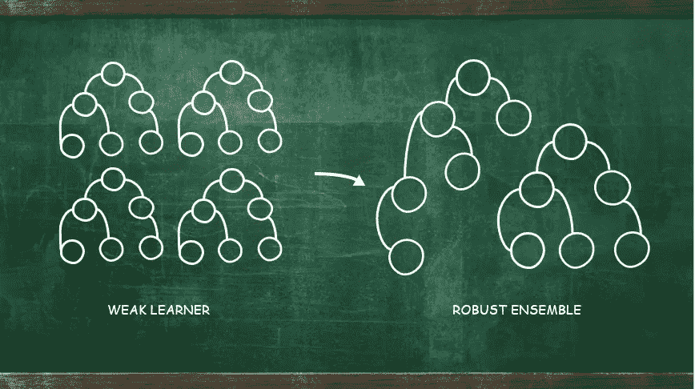
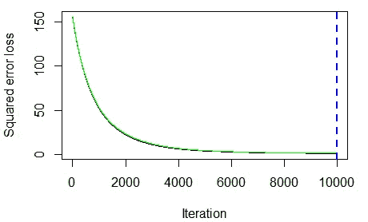
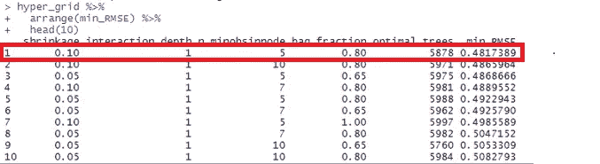

# 基于梯度推进算法的纽约出租车费用预测

> 原文：<https://towardsdatascience.com/nyc-taxi-fare-prediction-with-gradient-boosting-algorithm-9ff7a1eded1e?source=collection_archive---------66----------------------->

## 基于决策树的预测模型构建方法

卢克·斯塔克波尔在 [Unsplash](https://unsplash.com/s/photos/taxi?utm_source=unsplash&utm_medium=referral&utm_content=creditCopyText) 上拍摄的照片

纽约市的出租车展示了一幅清晰的城市生活画面。每个月，出租车机构收集的数百万数据使他们能够深入了解需求密度、出行模式和交通拥堵情况。通过利用这些每天积累的数据，出租车公司可以提供更好的定价，旨在为乘客提供具有竞争力的乘车费用。

在这个实验中，我们将实现一个梯度推进的学习算法来预测出租车费用。

> **梯度推进(GBM)** 是一种学习技术，它将许多简单预测器的输出结合起来，构建一个强大的预测器，其性能优于基础学习器树。新树是先前树的增强版本，因此这种技术被称为 boosting，其中新树提高了原始版本的性能(Biau 等人，2019)。

作者插画的大树

GBM 算法可以如上图所示。GBM 使用由固定规模的多层决策树组成的基本学习器。已经强调了梯度增强具有几个优点。GBM 提供了训练模型的易用性，并提高了效率和有效性，如下所示:

*   与其他模型相比，预测准确性更高
*   提供优化各种损失函数的灵活性，并提供多种超参数调谐选项
*   不需要预处理数据，因为 GBM 可以很好地处理数字和分类变量
*   不需要处理丢失的数据

## **数据集**

这项实验利用了纽约市出租车和豪华轿车委员会(TLC)的数据，特别是 2019 年 6 月的黄色出租车数据。点击查看数据集[。数据集由包括上下客区、行程距离、上客时间、乘客数量、拥堵附加费等要素组成。这些变量将被用作独立变量。另一方面， **fare_amount** 变量将被用作目标变量，其定义为出租车费的总额。此外，出于模型开发和评估的目的，大约 1000 个观察值的随机子集将被分割成 8:2 的比例。](https://www1.nyc.gov/site/tlc/about/tlc-trip-record-data.page)

最后，RStudio 将用于执行模型开发的所有实验，均方根误差(RMSE)将用作评估指标。

## **梯度增强实现**

GBM 提供各种调谐参数，非常灵活。然而，在寻找超参数的最佳组合时会出现挑战，因为它可能很费时控制。

毫无疑问，GBM 通过消除所有错误，过分强调离群值，并导致它们过度拟合来继续发展。因此，有必要进行交叉验证以推广该模型。第一步，用默认的**【收缩】** **为 0.001** 的 **10 重交叉验证**建立 GBM 模型。此外，GBM 使用默认的数量 **interaction.depth** **作为 1** 来定义用于学习的树的级别。最后， **n.trees** 将被设置为 10000。

输出:

交叉验证估计

从上图可以看出，0.001 收缩率是一个非常小的学习率，通常需要大量的树才能达到最小 MSE。此外，许多树木也导致一个漫长的训练过程。

这个设置似乎不足以进行更好的预测。因此，需要通过网格搜索来调整几个参数。为了在不过度拟合的情况下找到具有较低 RMSE 速率的参数的正确拟合，执行网格搜索。在此步骤中，调整几个参数，包括:

*   **缩水:**指 GBM 学习率
*   树的深度(层次)增长
*   **n.minobsinnode:** 树终止时的观察次数
*   **bag.fraction:** 随机选择的训练集分数观察值比率，用于提出扩展中的下一棵树

以下是各参数的网格搜索设置。参数范围设置为适合数据集特征。在这种情况下，给定的数据仅仅是 1000 个观察值，非常小。

然后，网格搜索设置被适配到模型训练循环中，如下所示。

因此，以下是输出 RMSE 的 10 个最低比率的几个参数集。在这种情况下，第一行设置将用于拟合最终模型。

RMSE 税率最低的 10 个州的产量

以下是为最终模型设置的参数:

*   **收缩率:** 0.10
*   **互动深度:** 1
*   微小牛肝菌
*   **袋.分数:** 0.80

该配置将用于获得最佳模型。然后用 **gbm** ()函数将这些参数拟合到最终模型，以训练模型。

最终列车 RMSE 是 0.1148923，测试 RMSE 是 0.3030436，这表明它是一个好模型，其中列车 RMSE 和测试 RMSE 之间的差距相当小。

## **结论**

在整个模型开发过程中，微调和优化程序在寻找最佳参数以建立更好的模型和降低错误率方面发挥着重要作用。在所有模型被训练之后，执行验证以在测试数据集上评估训练的模型是必要的任务。该验证过程验证模型是否按预期执行。不仅如此，这一过程还有助于已经训练和调整的模型的泛化能力。

## **讨论:随机森林和梯度推进的比较**

在速度性能方面，以前的研究人员揭示了梯度推进学习技术比其他基于树的学习(如随机森林)执行得更快。在随机森林的训练过程中，该模型利用完全生长的树，通过投票的方式将所有的树结合起来进行预测。然而，梯度提升利用弱学习器的组合来做出更好的预测。

## **参考文献**

1.  Biau，g,“干部”, b .和 Rouvière，l,“加速梯度推进”。*《机器学习》(2019)，*第 108 卷，第 971–992 页。
2.  纽约市出租车和豪华轿车委员会， *TLC 旅行记录数据(* 2020 *)，*【在线】
    可从以下网址获得:[https://www1 . NYC . gov/site/TLC/about/TLC-Trip-Record-Data . page](https://www1.nyc.gov/site/tlc/about/tlc-trip-record-data.page)