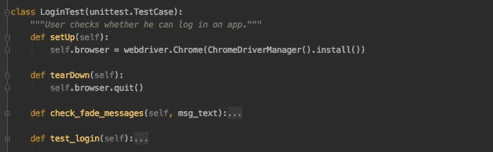
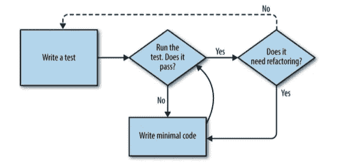
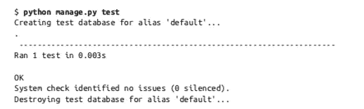
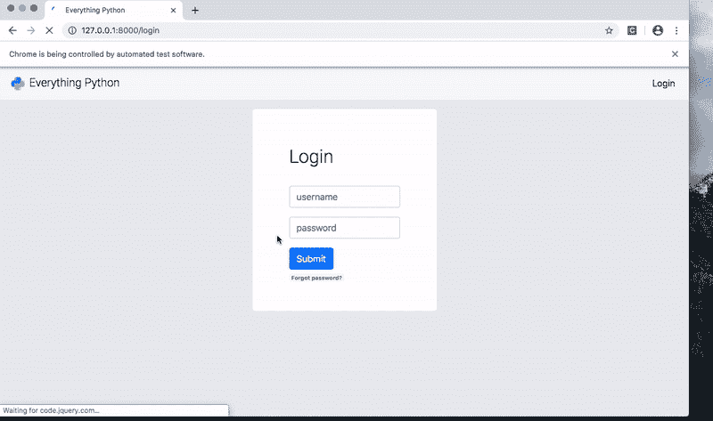
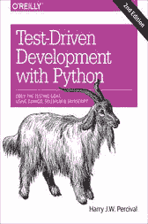

# 服从试验山羊！在你有测试之前什么都不要做

> 原文：<https://towardsdatascience.com/obey-the-testing-goat-do-nothing-until-you-have-a-test-5f17c714c0f9?source=collection_archive---------58----------------------->



图片作者。

## 测试驱动的开发周期是 Django 应用程序向生产环境迁移的重要部分。在这篇简介中学习 TDD 的基础知识。

我经历了惨痛的教训，比如数据库操作、登录或注册等功能部件在您没有注意到的情况下发生了故障。然而，你的用户*会注意到*。测试是的生产过程中至关重要的一部分，在这个故事中，我们将简要介绍如何测试您的 Django 应用程序。

这个故事包括:

*   测试驱动的开发周期
*   单元测试简介
*   用 Django 的`TestCase`进行单元测试
*   功能测试简介
*   功能测试登录页面

# 测试驱动的开发周期



[TDD 周期](https://www.obeythetestinggoat.com/)

> 首先我们编写测试；然后我们运行它，检查它是否如预期的那样失败。只有这样，我们才能继续开发我们的应用程序。

TDD 由*单元测试*组成，这是一种软件测试方法，通过这种方法，单个单元的源代码和*功能测试*。**功能测试**使用 Selenium，让我们驱动一个真正的 web 浏览器，这样我们就可以从用户的角度与应用程序的功能进行交互！功能测试的其他术语有**验收测试**、**端到端测试、**和**黑盒测试**。

一些有用的 TDD 概念是*用户故事*和*预期失败*。

*   *用户故事*:应用程序如何为用户工作的描述。用于构建功能测试。
*   预期失败:当一个测试以我们预期的方式失败。我们不打算明确地涵盖这一点，但是在传统的 TDD 周期中，你编写一个测试*期望它失败*，然后只重构它以便它不会失败。这样，您就知道当它失败时会发生什么，比如返回哪个错误消息，以及您是否希望对其进行更改以提供更多信息。

我们将在一个单独的文件`test.py`中编写单元测试，在一个单独的文件`functional_tests.py`中编写功能测试，我们将把它们放在我们的项目结构中，如下所示。

```
[projectname]/
├── [projectname]/
│   ├── __init__.py
│   ├── forms.py
│   ├── models.py
│   ├── settings.py
│   ├── templates/
│   │   ├── home_page.html
│   ├── **tests.py** │   ├── urls.py
│   ├── views.py
│   ├── wsgi.py
└── manage.py
└── **functional_tests.py**
```

然后，我们可以使用以下命令行命令运行我们的测试:

```
-- unit tests --
$ cd projectname
$ python3 manage.py test-- functional tests --
$ cd projectname/projectname
$ python3 functional_tests.py
```

# 单元测试简介

对于我们的第一个单元测试，我们将尝试解析`home_page`视图 URL，并检查它是否映射到正确的视图函数。我们应用程序的`home_page`的网址是`'/'`。`home_page()`必须是我们的视图中的一个函数，在我们的`urls.py`中有一个这样的 URL 映射

```
url(r'^$', views.home_page, name='home_page')  # Windows
url('', views.home_page, name='home_page')  # Macintosh/Linux
```

现在我们希望在运行命令`$ python3 manage.py test`时能够正确解决这个问题，事实也确实如此！



单元测试

# 用 Django 的`TestCase`进行单元测试

对于我们的下一个单元测试，我们将尝试检查主页是否返回正确的 HTML 模板。

然而，我们在这里做的事情非常幼稚。我们通过检查 HTML 代码和文本来检查 HTML 模板的内容。然而，如果我们改变`<title>`文本会发生什么？我们的测试会失败，因为文本现在不同了。

一般来说，单元测试的一个规则就是 ***不要测试常量*** ，测试 HTML 为文本很像测试常量。单元测试实际上是关于测试逻辑、流程控制和配置的。断言 HTML 字符串中的字符序列并不能做到这一点。

我们可以使用 Django 的内置`TestCase`工具`assertTemplateUsed`来检查我们的模板，而不用检查常量！Django 模板放在我们项目的`templates`文件夹中(参见项目结构)，我们可以自动检查`home_page`的渲染模板。

另外，`test_root_url_resolves_to_home_page_view(self)`功能隐含在`assertTemplateUsed`功能中。重构我们的单元测试现在只需要两行代码！

# 功能测试简介

既然我们已经断言一些视图和功能的独立单元工作，我们将使用一个*用户故事*来构建一个使用 Selenium 的功能测试。

Selenium 是一个使用 Selenium WebDriver 编写功能/验收测试的简单 API。它所做的是打开一个网络浏览器并阅读其内容来测试模拟用户体验。Selenium 的其他用例是 web 抓取动态网站。

使用 Selenium，您可以访问用于形成网页的源代码，并找到您想要访问的元素。这使我们能够自动填写数据库操作、登录用户或注册的表单。

为了在本地运行功能测试，我们需要两个终端。一个是用`$ python3 manage.py runserver`运行应用，一个是用`$ python3 functional_tests.py`运行应用。

在下面的功能测试中，我们模拟了一个用户体验:用户将如何看到主页并声明它的信息。用户故事在评论中有详细描述。

`setUp()`和`tearDown()`是打开网络驱动程序，然后关闭的功能。我们使用的是 Chrome webdriver，但是 Firefox 也可以使用，一旦安装，就可以在虚拟 Python 环境的 bin 路径中访问。

# 功能测试登录页面



登录页面的功能测试

正如你所看到的，这是一个非常简单的例子，用户检查了`title`文本和`header`文本。但是我们也可以使用 Selenium 来自动化表单提交。对于我们的下一个用户故事，我们将检查登录页面，看看它是否如我们预期的那样工作。

我们使用`Keys`在登录表单中输入用户名和密码。由于该应用程序已经用 Google 的 RECAPTCHA 保护了表单提交，我们无法登录，但确实收到了一条错误消息，我们可以对其进行测试。

**注意**在我们的功能测试中，我们*是*测试常量，比如标题文本，或者错误消息文本，更好的做法是包含一个元素属性，比如`id="recaptcha_error"`并验证它。

这个故事的灵感来自《用 Python 进行测试驱动的开发》一书。如果你想通过 Django 和 Selenium 了解更多关于 TDD 的信息，请查看[！相信我，这只是冰山一角:还有很多东西要学。](https://www.obeythetestinggoat.com/)



用 Python 进行测试驱动开发