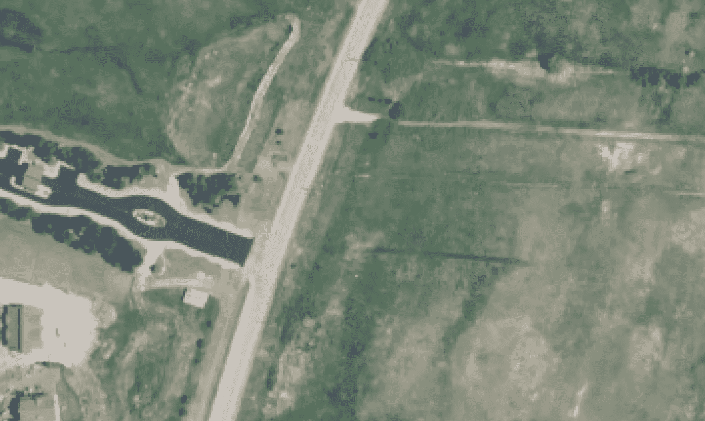
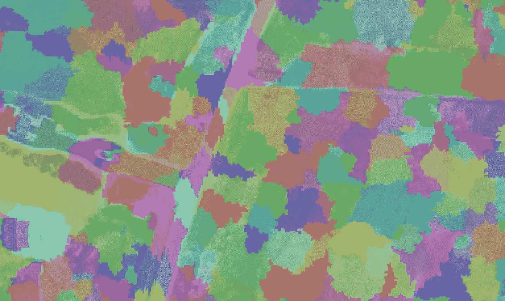
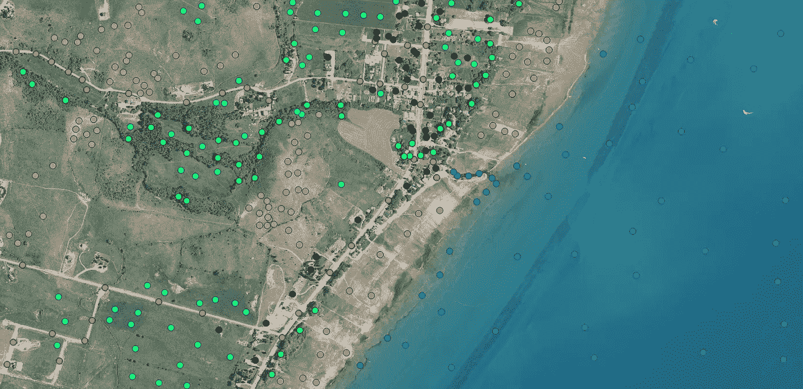
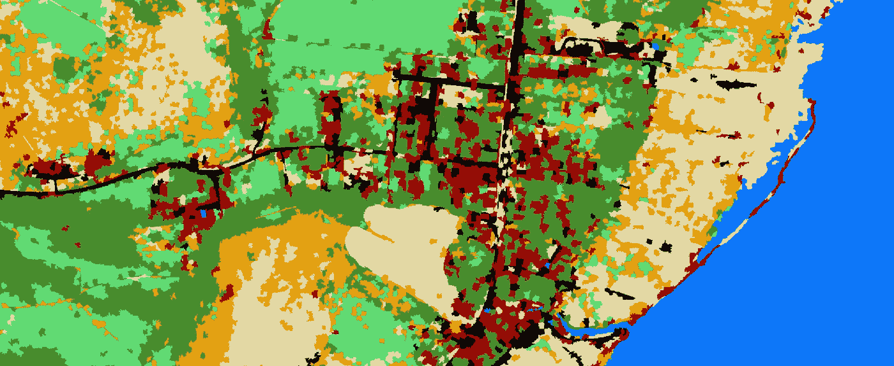

# 基于对象的 Python 土地覆盖分类

> 原文：<https://towardsdatascience.com/object-based-land-cover-classification-with-python-cbe54e9c9e24?source=collection_archive---------22----------------------->

## eCognition 和 ERDAS Imagine 的免费开源替代品

国家农业图像项目(NAIP)的航空图像

航空图像以不同的空间和时间分辨率覆盖全球。从航空图像中及时提取信息需要自动分析，以训练计算机识别人眼立即识别的内容。基于对象的图像分析(OBIA)通过实施图像分割算法将像素组组合成对象(片段)来减少图像中的信息量，从而提高处理效率。本文描述了如何使用开源 Python 包来执行航空影像的影像分割和土地覆盖分类。具体来说，我将演示基于地理对象的影像分析(GeOBIA)过程，通过 5 个步骤执行监督土地覆盖分类。

1.  *图像分割*
2.  *量化分段光谱特性*
3.  *真实数据*
4.  *土地覆盖分类*
5.  *精度评估*

## 1.图象分割法

上图是美国农业部(USDA)在国家农业图像计划(NAIP)下收集的航拍照片的一部分。水平图像分辨率为 1 米。我们的第一个任务是将相似的像素分组为片段。分割有效地减少了图像中需要分类的元素的数量。这可能会将 1 百万像素的图像减少到 50，000 个片段，这更易于管理。

有许多分割算法可供使用。本文中我们就不详细赘述了。我将向您展示两种不同算法的结果，以及如何使用`skimage`在 Python 中实现它们。

下面的代码演示了使用 SLIC(简单线性迭代聚类)和 quickshift 算法的分段(分别是第 23 行和第 24 行)。首先，来自 NAIP 图像的 4 个波段(红、蓝、绿、近红外)中的每一个都被读取为带有`gdal`的`numpy`阵列。波段数据被重新调整为亮度值(范围从 0 到 1)。然后创建段。用`gdal`将线段保存到新的光栅。

下图演示了分割算法和参数如何影响图像片段的大小和形状。第一幅图像中的片段(快速移位)不能很好地捕捉图像中的特征。您会看到路段与道路、田地和森林区域重叠。在第二幅图像中，来自 SLIC 算法的片段沿着图像特征的边界做得更好。本文的其余部分使用 SLIC 结果。图像中的特征可能由不同的算法或不同的算法参数来最好地表示。在继续分类之前，请务必评估您的细分市场。

快速移位分段(作者提供照片)

SLIC 分段(作者提供照片)

## 2.图像片段的光谱特性

一旦图像被分割，每个部分的光谱特性必须被定量描述。给定一定数量的像素，下面的函数计算每个波段的描述性统计数据(例如，平均值、最大值、最小值、方差)。随机森林算法将使用这些值来将这些部分分类为土地覆盖类型。

现在，我们遍历每个片段，将每个片段的像素发送到`segment_features`函数，并将结果保存在一个列表中。这段代码可能会成为处理时间的瓶颈。它可以通过并行化来改进，但这里不讨论。

## 3.真实(训练和测试)数据

这是一个监督分类工作流，因此您需要一些真实数据来描述分类中表示的土地覆盖类型。我在 QGIS 中快速生成了下面的点来表示七种不同的土地覆盖类别。这些数据只是一个例子。理想情况下，您应该以一种更有组织和统计上更严格的方式收集数据。

描述土地覆被类型的真相(作者照片)

土地覆盖真实数据需要分成训练数据集和测试数据集。训练数据集将训练随机森林分类算法。我们将把分类结果与测试数据集进行比较，以评估分类的准确性。

我的土地覆盖数据是 shapefile 格式的。以下代码使用`geopandas`将真实数据作为地理数据框架读取。随机地，70%的真实观察值被分配给训练数据集，剩余的 30%被分配给测试数据集。训练和测试数据集分别保存到新的 shapefile 中。在此过程中，我还使用了一个我创建的查找表，为每个土地覆盖类别命名(第 8-11 行)。这不是必需的，但是可以更容易地看出每个类代表什么。

现在，将训练数据转换为栅格格式，以便每个观测点都可以与一个图像片段相关联。

将每个训练观察与相应的图像片段相关联。第 13–19 行确保每个训练观察只与一个片段相关联。由于区段包含多个像素，因此区段可能代表多种土地覆被类型。这就是为什么正确调整分段算法很重要。

## 4.土地覆盖分类

这是分析的核心。分类算法。首先，识别并标记培训对象(第 1-20 行)。这一过程包括将一个标签(土地覆盖类型)与描述图像段内每个光谱带的统计数据相关联。

现在，一切都设置好了，可以训练一个分类器，并使用它来预测图像中的所有片段。这里我使用随机森林，一种流行的分类算法。训练(适应)算法和进行预测的代码非常简单(第 22–24 行)。只需将训练对象(包含光谱属性)和相关的土地覆盖标签传递给分类器。一旦训练(拟合)了分类器，就可以基于它们的光谱特性对非训练片段进行预测。做出预测后，将其保存到栅格中，以便在 GIS 中显示(第 26–43 行)。

最终土地覆盖分类(作者提供照片)

## 5.用混淆矩阵进行精度评估

准确性评估是任何分类的一个重要方面。如果你的分类不能代表它应该代表的东西，它就没什么价值。因为本文的重点是描述 GeOBIA 工作流，所以我不展示我自己的准确性结果。相反，我将展示如何为准确性评估生成一个基本的混淆矩阵。

加载之前创建的测试数据集，并将其转换为栅格格式，以便与生成的预测兼容。然后简单地从测试数据存在的位置查询预测值。最后，从相应的值生成混淆矩阵。

注意:我们对片段进行了分类，但是这种精度评估比较的是像素。我们将每个测试片段中的所有像素与相应预测片段中的所有像素进行比较。如果某些土地覆被类别比其他类别更经常出现在较小(或较大)的部分，这可能会导致一些偏差。同样，如果您已经对图像分割进行了尽职调查，这应该不成问题。

## 结论

在 Python 中将图像模块与地理空间模块结合起来为 GeOBIA 创造了令人兴奋的机会。数据操作(将光栅转换为矢量，再转换为数组等。)对于这个应用程序来说是相当繁重和乏味的，但这就是为什么它被称为*数据*科学。