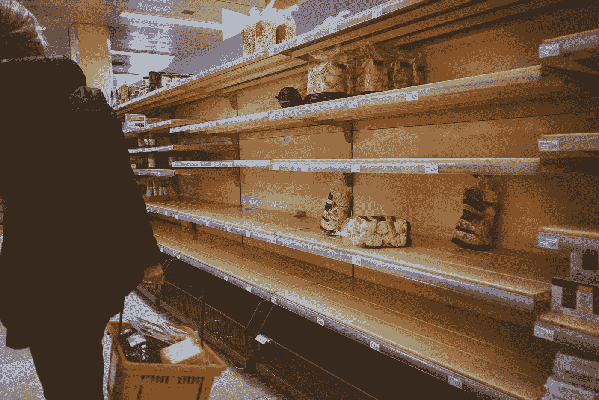
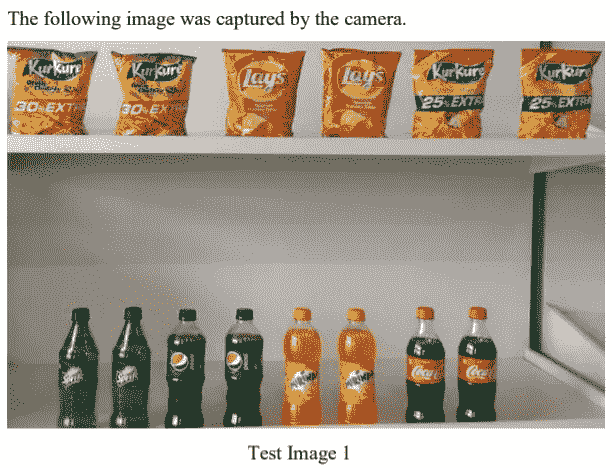
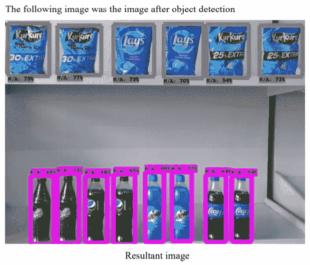
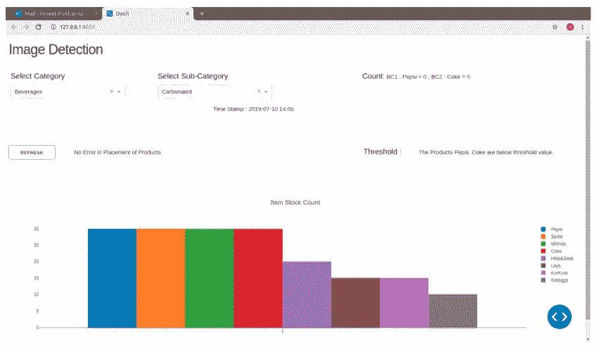

# 具有小训练数据集的对象分类

> 原文：<https://towardsdatascience.com/object-classification-with-small-training-datasets-c6bd1e90dfc8?source=collection_archive---------16----------------------->

## [实践教程](https://towardsdatascience.com/tagged/hands-on-tutorials)



由 [Boris Dunand](https://unsplash.com/@borisdunand?utm_source=medium&utm_medium=referral) 在 [Unsplash](https://unsplash.com?utm_source=medium&utm_medium=referral) 上拍摄的照片

在一次机器学习实习期间，我的任务是为“空货架综合症”创建一个解决方案。在某些情况下，空货架综合症是零售业中的一个常见问题，在这种情况下，零售商仅仅因为没有意识到货架已经空了而无法用他们库存的物品补充货架。这导致消费者认为该商品不可用，从而导致零售商失去销售机会。

最初，对象检测模型似乎是解决当前问题的理想方案。然而，在最初的设计阶段，我遇到了相当多的警告，使得一个简单的对象检测方法不可行。

我必须注意的一些关键业务警告是:

*   零售店中各种商品的数量
*   缺乏每个单项的综合数据集

该解决方案是对象检测的流水线和图像分类模型，用于最初检测项目的宽泛分类，然后进一步识别准确的类别标签。

# **管道:**

1.  捕捉图像:使用 OpenCV 构建的简单模块用于以 2 分钟的间隔捕捉货架的图像。为 POC 选择 2 分钟的时间间隔主要是为了提供充足的提醒时间，同时考虑到所需物品的重新进货。
2.  对象检测:捕获的图像通过对象检测模型运行。该模型确定了图像中存在的项目的大致分类。在当前的用例中，广泛的分类包括瓶子、盒子、包、书等。
3.  图像裁剪:一旦对象检测模型已经识别了对象的宽泛分类，每个对象被从左上到右下单独裁剪，并存储在对应于其宽泛分类标签的文件夹中。例如，图像中的所有瓶子将保存在名为“瓶子”的文件夹中。
4.  图像分类:文件夹中的所有图像被分组，然后通过相应的图像分类模型运行(为每个宽泛的分类标签开发了一个单独的模型)
5.  对象计数:分类模型的结果用于计数，图像的顺序用于映射货架上的物品位置。
6.  仪表板:项目的数量显示在仪表板上，并对任何位置不当的项目发出警告。

# **物体检测**

对于对象检测模型，我利用了 Tensorflow 对象检测 API([https://github . com/tensor flow/models/tree/master/research/Object _ Detection](https://github.com/tensorflow/models/tree/master/research/object_detection))。来自 COCO 数据集的预训练权重被用于在基本分类标签上训练模型。

一旦模型检测到相关的对象，OpenCV 就被用来裁剪图像中的边界框。这些图像随后被存储在相关的文件夹中。

该模型是使用 Tensorflow 对象检测 API 创建的。将更快的 RCNN 初始 resnet 权重用作初始权重，然后在 COCO 数据集上进一步训练该模型，该数据集具有广泛分类类所需的标签。

```
MODEL_NAME = 'object_detection/Models/faster_rcnn_inception_resnet_v2_atrous_oid_v4_2018_12_12'
PATH_TO_FROZEN_GRAPH = MODEL_NAME + '/frozen_inference_graph.pb'
```

*MODEL_NAME* 在这里指定要下载的模型，而 *PATH_TO_FROZEN_GRAPH* 是模型将实际用来执行对象检测的冻结图。

有关 Tensorflow 对象检测 API 使用的全面教程，请参考以下链接。

 [## 安装- TensorFlow 2 对象检测 API 教程文档

### 虽然安装和使用 TensorFlow 并不一定要有 Anaconda，但我建议这样做，因为它…

tensor flow-object-detection-API-tutorial . readthedocs . io](https://tensorflow-object-detection-api-tutorial.readthedocs.io/en/latest/install.html) 

# 图像裁剪

基于边界框裁剪图像是下一个关键步骤。

在上面的要点中，*output _ dict[' detection _ Scores ']*包含了模型创建的每个包围盒的分数。出于 POC 的目的，并且为了考虑部分可见的项目，阈值被设置为 50%(即，模型超过 50%确信所创建的边界框已经检测到相关项目)。50%可能看起来是一个相当低的数字，但它允许在不适当的位置考虑更广泛的项目。

然后存储每个边界框的 4 个端点，并用于确定图像的位置和要裁剪的原始图像的区域，并随后输入图像分类模型。

# 图像分类

对于图像分类模型，只有稀疏训练集是可用的。用户拍摄物品的图像(大约 5-10 张图像),然后进行复制和转换。这些图像随后被用来以很高的精确度训练模型。在创建这个概念验证时(2019 年 5 月)，我使用了 ImageAI 库([https://github.com/OlafenwaMoses/ImageAI](https://github.com/OlafenwaMoses/ImageAI))作为图像分类模型。

一旦模型被分类到广泛的分类标签中，它们都被存储在“裁剪图像”目录下的单独文件夹中。然后，该模型将依次考虑目录中出现的文件夹，并为每个文件夹创建一个预测列表。

例如，让我们考虑标签瓶。

*duck* 将包含瓶子文件夹中所有图像的列表，然后对图像进行排序。(图像正在排序，因为在裁剪过程中，图像的命名顺序与它们在原始图像中出现的顺序相同)。这些图像被分组，然后进行分类。每个分类的预测和概率随后被存储，并且列表 *img* 被所有预测的标签填充。



输入图像(作者提供的图像)



带有边框的图像(作者提供的图像)

# 结果



带有项目计数和位置提醒的仪表板(图片由作者提供)

仪表板根据项目的广义分类标签显示项目的数量。如果发现任何放错地方的物品，就会发出警报。

# 未来范围

这个项目是我在计算机视觉领域起步时创建的一个有趣的概念验证。将对该项目的进一步改进，以充实功能和优化管道。当处理小数据集时，一种简单而有效的方法来处理对象检测。

Github 链接:[https://github . com/abhinav 2301/Object _ Detection-Empty-Shelf-Issue](https://github.com/abhinav2301/Object_Detection-Empty-Shelf-Issue)