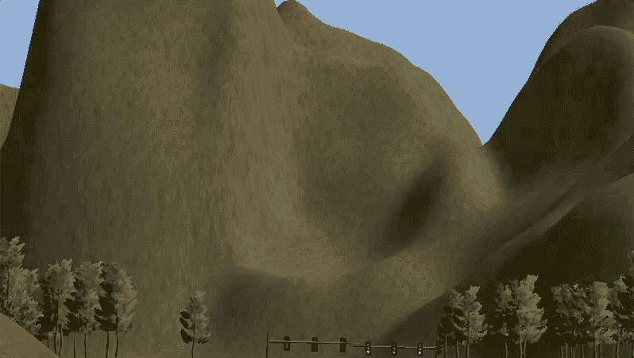
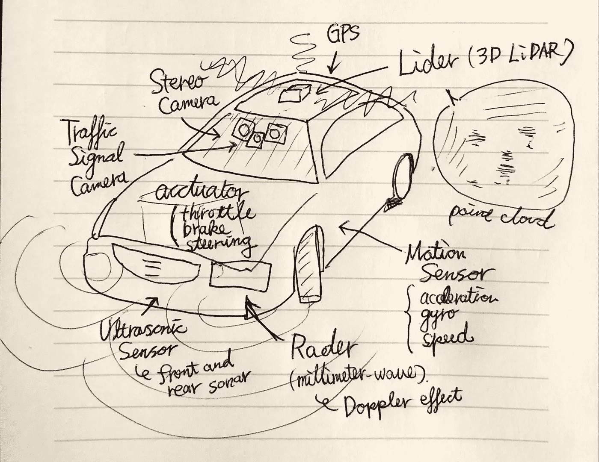
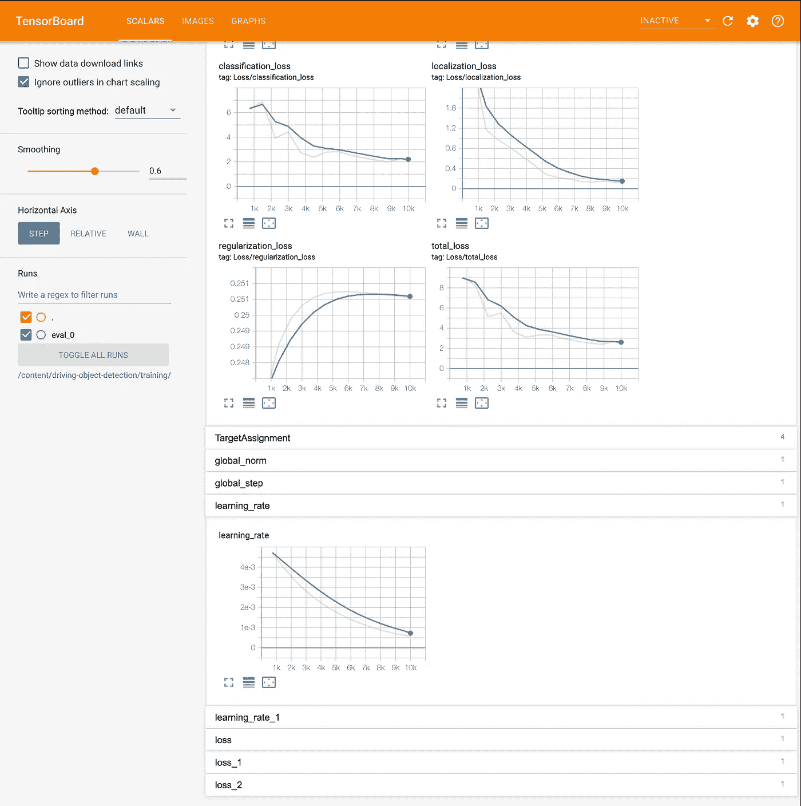
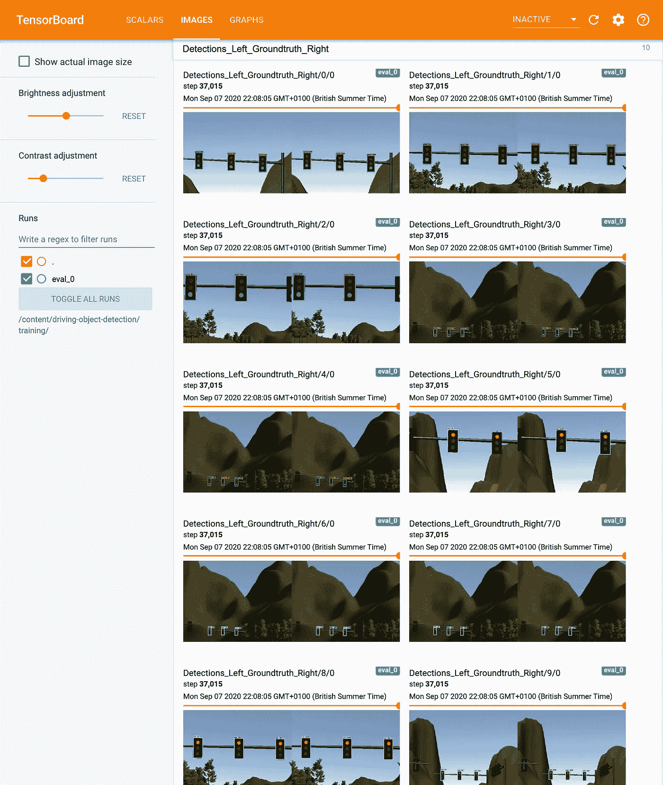
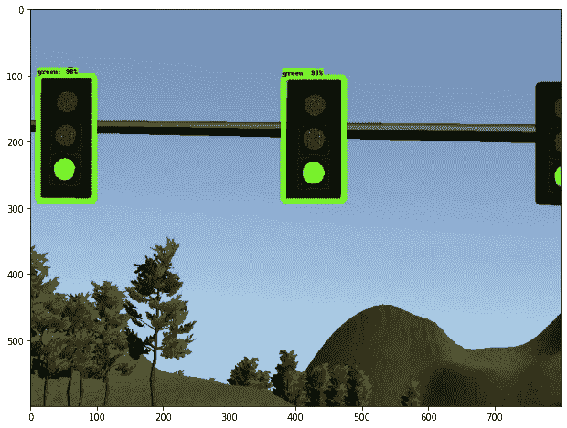
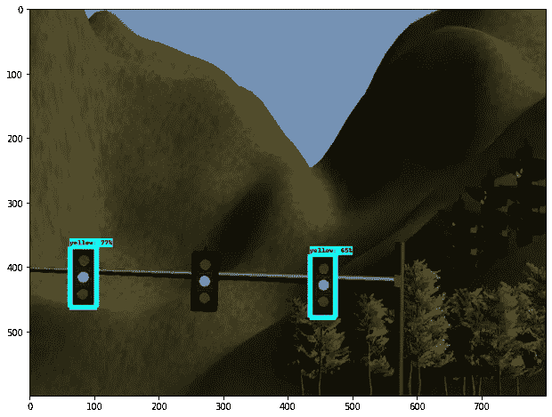
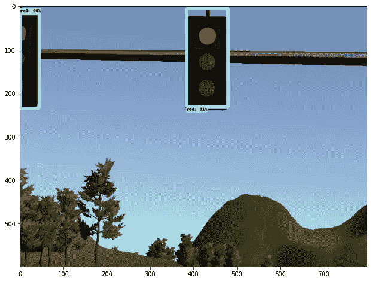

# 通过 Tensorflow 1.x 进行物体检测

> 原文：<https://towardsdatascience.com/object-detection-by-tensorflow-1-x-5a8cb72c1c4b?source=collection_archive---------18----------------------->

## 自动驾驶汽车的交通灯检测——如何应用 Tensorflow 对象检测 API 的分步指南

计算机视觉是增长最快的领域之一，基于深度学习的方法现在被广泛应用于解决现实世界的问题，如人脸识别、癌症检测等。

其中最有效的工具是 [Tensorflow 对象检测 API](https://github.com/tensorflow/models/tree/master/research/object_detection) 并使用它们预先训练好的模型，取代最后一层针对特定问题试图解决和微调的模型。

现在 Tensorflow 2.x 采用了 API。但是，运行时环境有时不允许使用最新版本，仍然需要使用 Tensorflow 1.x。这篇博客文章演示了如何在这种情况下使用 API。如果你能使用 Tensorflow 2.x 进行推理，最好使用它——[参见另一篇解释如何使用](https://medium.com/@yukitakahashi_46678/object-detection-by-tensorflow-2-x-e1199558abc?sk=c200d58b9d3dd1ab923e2c317e4ece95)的帖子。

作者图片

在这里，我以自动驾驶汽车的交通灯检测为例，由于依赖性，即使在汽车上的小型计算资源上，也必须以高频率(~10fps)检测红色、黄色或绿色交通灯。

请注意，这篇文章只描述了机器学习方法的对象检测。实际的自动驾驶汽车使用激光雷达、雷达、GPS 和地图，并应用各种滤波器进行定位、对象检测、轨迹规划等，然后应用致动器来加速、减速或转弯，这超出了本文的范围。

在训练数据方面，kitti(【http://www.cvlibs.net/datasets/kitti/index.php】)为自动驾驶汽车提供了全面的数据集。

下面用 Google Colab。如果您在当地环境下训练，请参考[报告](https://github.com/yuki678/driving-object-detection)中的自述文件。

# 第 1 部分:在本地 PC 上准备

**1。克隆项目** [**回购**](https://github.com/yuki678/driving-object-detection) **或创建新项目**

如果您创建了新的 repo，请创建以下目录

创建新的 repo 时，复制脚本目录中的所有脚本。

**2。选择要使用的预训练模型**

到 github 中的 [Tensorflow 1 检测模型 Zoo](https://github.com/tensorflow/models/blob/master/research/object_detection/g3doc/tf1_detection_zoo.md) 下载适合该用途的。由 [coco 数据集](https://cocodataset.org/#home)训练的模型在大多数情况下工作良好。速度和精度(地图)是权衡的。我选择 SSD Mobilenet v2 是为了获得更快的推理速度，但人们可以选择更大的模型和更好的精度，如更快的 RCNN Resnet101，它大约是模型大小的 100 倍，比我的机器慢 10 倍，但具有很高的精度。

一旦决定了模型，解压并复制 pipeline.config。或者，您可以从 [tensorflow 模型报告](https://github.com/tensorflow/models/tree/r1.13.0/research/object_detection/samples/configs)中复制示例管道配置。

**3。准备培训数据**

正如监督学习的情况一样，您需要花费几个小时来手动标记输入数据。将训练图像保存在 images 目录下，我在模拟器中提供了交通灯检测图像，并在我的报告中使用 Pascal VOC 进行了标记。有许多可用的工具，labelImg 是最简单的盒型经典工具之一。确保你有 python 3 并简单地从 PyPI 安装，或者参考[安装指南](https://github.com/tzutalin/labelImg#installation)。

将 xml 文件保存在同一目录中。好消息是，不需要准备成千上万的标签，因为这是一个迁移学习，每个类别 100 个标签将产生良好的微调结果。

**4。创建标签图**

这只是一个标签列表。名称应该与上一步中的注释标签相匹配。将文件另存为 annotations/label_map.pbtxt

训练集准备的下一步是将图像分离为训练集和测试集，然后生成。每个 xml 文件的 TFRecord。这可以在本地完成，但是我在 Colab 上包含了这个步骤，这样任何附加的标签都不会在 TFRecord 中丢失。

**5。编辑 pipeline.config**

有些更改是强制性的，有些是可选的，但更适合培训数据。

将回购推给 github—一切就绪！

# 第 2 部分:Google Colab

接下来，转到 Google Colab，创建一个新的笔记本。[红绿灯检测-tf1.ipynb](https://github.com/yuki678/driving-object-detection/blob/master/traffic-light-detection-tf1.ipynb) 是我 repo 里的一个样本。

**1。安装 Tensorflow 1.14 和所需的库**

**2。设置变量**

**3。克隆 Tensorflow 模型回购**

将 tensorflow 模型 repo 下载到 Colab env，编译协议缓冲区，设置 PYTHONPATH，安装 COCO API 进行评估。

**4。下载预先训练好的模型**

将预先训练的模型下载到 Colab 环境中。

**5。克隆项目回购**

确保本地更改在 master 分支中提交，并提前推送到 github。

**6。过程输入图像(训练数据集)**

1.  首先，将图像和标签分割成训练集和测试集
2.  接下来，将 xml 文件转换成 csv 文件
3.  然后，将 csv 转换为 TFRecord

**7。设置张量板**

启动 tensorboard 监控训练进度非常有用。要访问 tensorboard 进程，请在此处使用 ngrok 隧道。

**8。火车！**最后:)

这需要一段时间，取决于型号和参数，可能需要几分钟到几小时甚至更长时间。喝两杯茶，甚至吃顿饭，洗个澡，看看电视，然后睡觉…

在 TF1 中，评估在 pipeline.config 中指定的训练期间在检查点运行。如果损失没有减少，准确性/召回率没有提高或学习曲线没有达到预期，则检查 Tensorboard 上的进度并调整 pipeline.config 中的参数很好。目标总损失低于 2。

在每个评估步骤中，它也提供了地面真实和图像检测之间的良好比较。

**9。输出输出**

不要忘记导出并下载训练好的模型，它将用于推理。

下载后，将文件解压缩到 exported_models/[model name]目录。

**10。预测！(可选)**

Tensorboard 已经提供了预测图像，所以这里只是演示如何使用训练好的模型进行推理并绘制图像。

以下是一些示例输出。

# 第 3 部分:将训练好的模型转换为 tensoflow 运行时的旧版本(可选)

如果您的推理运行时受到 tensorflow 版本的限制，导出的模型可能会出现错误，因为引用了旧版本中不存在的参数。这可以通过在匹配运行时版本的环境中转换导出的模型来避免。

这里，我的运行时是 tensorflow v1.3。最老的可用对象检测 API 是在 v1.4 上，但幸运的是，它似乎与 v1.3 兼容，所以使用这个版本。

**1。创建一个 env 并安装库**

我使用康达，但你可以使用任何一个虚拟环境管理工具。

**2。克隆 tensorflow 模型回购，复制兼容版本**

**3。下载协议并编译协议缓冲区**

兼容的协议版本是 v3.4.0，可以从[这里](https://github.com/protocolbuffers/protobuf/releases/tag/v3.4.0)下载。下载后，编译协议缓冲区。

**4。转换型号**

如果您启动一个新的控制台，请确保设置 PYTHONPATH，它也可以被保存以在每次切换虚拟环境时自动运行——例如，对于 conda，请参考[保存环境变量](https://docs.conda.io/projects/conda/en/latest/user-guide/tasks/manage-environments.html#saving-environment-variables)。

这篇文章解释了如何使用 Tensorflow 对象检测 API 进行训练，以及如何使用旧版本的 Tensorflow 1.x 对微调后的模型进行推理，如果你没有这样的限制，请参见[另一篇文章，其中解释了如何使用最新的 Tensorflow 2.x 对象检测 API](https://medium.com/@yukitakahashi_46678/object-detection-by-tensorflow-2-x-e1199558abc?sk=c200d58b9d3dd1ab923e2c317e4ece95) 。样本代码和图片可以在我的 github [repo](https://github.com/yuki678/driving-object-detection) 中找到。