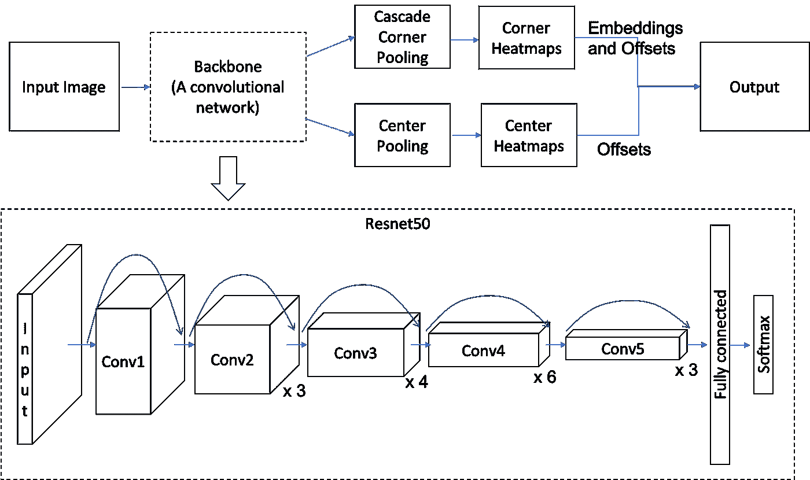
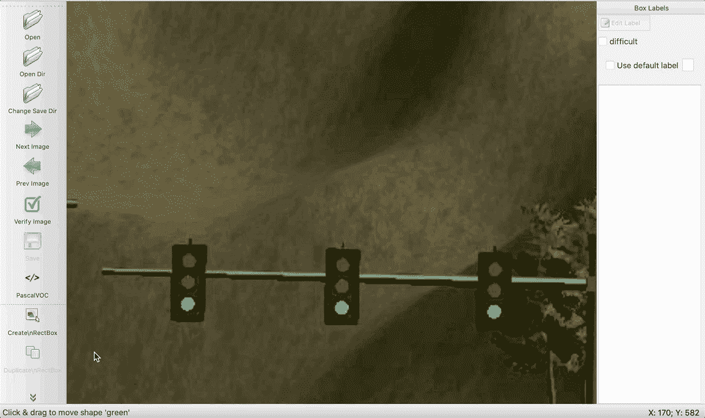
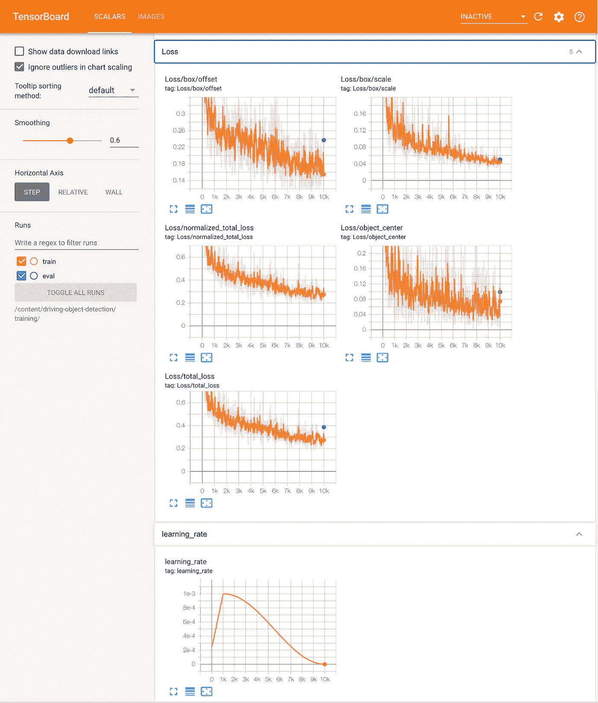
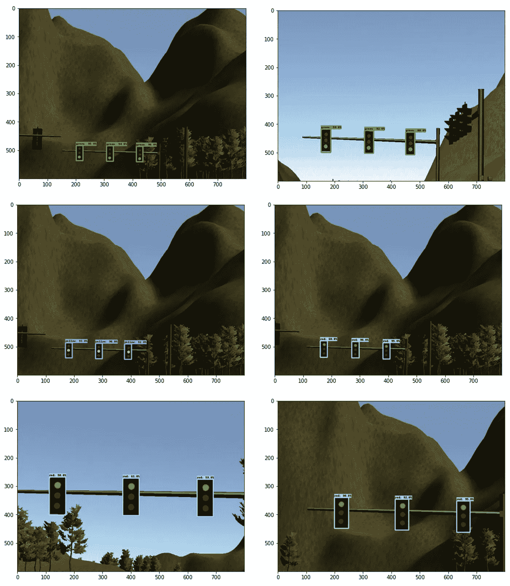
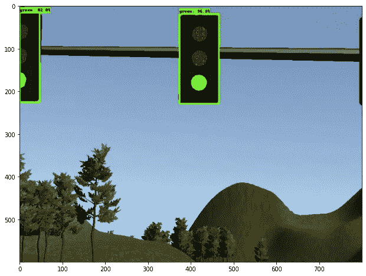
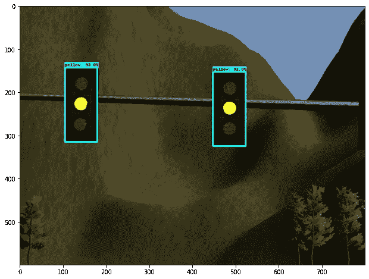

# 通过 Tensorflow 2.x 进行物体检测

> 原文：<https://towardsdatascience.com/object-detection-by-tensorflow-2-x-e1199558abc?source=collection_archive---------10----------------------->

## 自动驾驶汽车的交通灯检测—如何应用 Tensorflow 对象检测 API 的分步指南

计算机视觉是增长最快的领域之一，基于深度学习的方法现在被广泛应用于解决现实世界的问题，如人脸识别、癌症检测等。

其中最有效的工具是 [Tensorflow 对象检测 API](https://github.com/tensorflow/models/tree/master/research/object_detection) 并使用它们预先训练好的模型，取代最后一层针对特定问题试图解决和微调的模型。

现在，API 支持 Tensorflow 2.x。有很好的理由使用 TF2 而不是 TF1——例如，[渴望执行](https://www.tensorflow.org/guide/eager),它在 TF1.5 中引入以使编码更简单和调试更容易，并且新的艺术(SOTA)模型如 [CenterNet](https://arxiv.org/abs/1904.08189) 、 [ExtremeNet](https://arxiv.org/abs/1901.08043) 和 [EfficientDet](https://arxiv.org/abs/1911.09070) 可用。撰写本文时的最新版本是 Tensorflow 2.3。

这个 API 是向后兼容的，但是如果你的运行时不能升级，使用 TF1 会让你的生活更容易。[这里是 TF1 版的分步指南。](https://medium.com/@yukitakahashi_46678/object-detection-by-tensorflow-1-x-5a8cb72c1c4b)

作者提供的自动驾驶汽车图片

在这里，我以自动驾驶汽车的交通灯检测为例，由于依赖性，即使在汽车上的小型计算资源上，也必须以高频率(~10fps)检测红色、黄色或绿色交通灯。

请注意，这篇文章只描述了机器学习方法的对象检测。实际的自动驾驶汽车使用激光雷达、雷达、GPS 和地图，并应用各种滤波器进行定位、对象检测、轨迹规划等，然后应用致动器来加速、减速或转弯，这超出了本文的范围。

使用的预训练模型是 Centernet Resnet50，它通过级联角池和中心池架构实现了极高的效率和相当好的准确性，使用 Resnet50 作为主干网络，适合此使用案例。

Centernet Resnet50 架构的高级图像，基于 Centernet paper:[https://arxiv.org/abs/1904.08189](https://arxiv.org/abs/1904.08189)和 Resnet paper:[https://arxiv.org/abs/1512.03385](https://arxiv.org/abs/1512.03385)

在训练数据方面，kitti([http://www.cvlibs.net/datasets/kitti/index.php](http://www.cvlibs.net/datasets/kitti/index.php))为自动驾驶汽车提供了全面的数据集。

下面用 Google Colab。如果你在当地环境下训练，请参考[报告](https://github.com/yuki678/driving-object-detection)中的自述。

# 第 1 部分:在本地 PC 上准备

**1。克隆项目** [**回购**](https://github.com/yuki678/driving-object-detection) **或创建新项目**

如果您创建了新的 repo，请创建以下目录

创建新的 repo 时，复制脚本目录中的所有脚本[和](https://github.com/yuki678/driving-object-detection/tree/master/scripts)。

**2。选择要使用的预训练模型**

去 github 的 [Tensorflow 2 检测模型动物园](https://github.com/tensorflow/models/blob/master/research/object_detection/g3doc/tf2_detection_zoo.md)下载适合的。这里的所有模型都是在撰写本文时由 [coco 数据集](https://cocodataset.org/#home)训练出来的，在大多数情况下效果很好。速度和精度(地图)是权衡的。我选择了 CenterNet Resnet50 V1 FPN 512x512，其速度为 27，mAP 为 31.2——事实上这比 TF1 中的 SSD Mobilenet v2 更快更准确，速度为 31，mAP 为 21，我在这里使用了！

如果环境允许更大的模型规模和更慢的推理时间，当然可以选择更复杂的模型。

模型确定后，解压缩并复制 pipeline.config。该配置用于他们的培训，需要稍后进行修改，因为我们使用它进行微调。或者，您可以从 [tensorflow 模型报告](https://github.com/tensorflow/models/tree/master/research/object_detection/samples/configs)中复制示例管道配置，因为在使用 Colab 环境时，您实际上不需要下载模型本身。

**3。准备培训数据**

正如监督学习的情况一样，您需要花费几个小时来手动标记输入数据。将训练图像保存在 images 目录下，我在模拟器中提供了交通灯检测图像，并在我的报告中使用 Pascal VOC 进行了标记。有许多可用的工具，labelImg 是最简单的盒型经典工具之一。确保你有 python 3 并简单地从 PyPI 安装它，或者参考[安装指南](https://github.com/tzutalin/labelImg#installation)。

将 xml 文件保存在同一目录中。好消息是，不需要准备成千上万的标签，因为这是一个迁移学习，每个类别 100 个标签将产生良好的微调结果。

**4。创建标签地图**

这只是一个标签列表。名称应该与上一步中的注释标签相匹配。将文件另存为 annotations/label_map.pbtxt

训练集准备的下一步是将图像分离为训练集和测试集，然后生成。每个 xml 文件的 TFRecord。这可以在本地完成，但我包括在 Colab 的步骤中。

**5。编辑 pipeline.config**

有些更改是强制性的，有些是可选的，但更适合培训数据。

将更改推送到 github——一切就绪！

# 第 2 部分:Google Colab

接下来，转到 Google Colab，创建一个新的笔记本。[红绿灯检测-tf2.ipynb](https://github.com/yuki678/driving-object-detection/blob/master/traffic-light-detection-tf2.ipynb) 是我 repo 中的一个样本。

**1。安装所需的库**

**2。设置变量**

**3。克隆张量流模型回购**

克隆、编译协议缓冲区、设置 PTTHONPATH 并安装。

然后，安装 COCO API 进行评估

**4。下载预训练模型**

**5。克隆项目回购**

确保本地更改在 master 分支中提交，并提前推送到 github。

**6。处理输入图像(训练数据集)**

首先，将图像分为训练集和测试集。

然后，将 xml 文件转换为 csv 文件

最后，将 csv 文件转换为 TFRecord 格式

7。建立 Tensorboard

启动 tensorboard 监控训练进度非常有用。在 TF1 版本中，我们使用 ngrok 隧道，但现在有一个神奇的命令可以在笔记本中启动 tensorboard！

8。火车！最后:)

只需执行 model_main_tf2.py，注意 TF1 使用的 model_main.py 的参数略有不同。

这需要一段时间，取决于型号和参数，可能需要几分钟到几小时甚至更长时间。喝两杯茶，甚至吃顿饭，洗个澡，看看电视，然后睡觉…

9。评估(可选但必须)

在 TF1 中，它是在训练过程中完成的，但不知何故它被分开了。它在本地运行时很有用，但在 Colab 中没那么有用…无论如何，您可以在训练后通过指定 checkpoint_dir 来运行它，它运行评估模式。设置 eval_timeout 或在评估完成后终止进程，因为它会无限期等待输入。

如果损失没有减少，准确率/召回率没有提高，或者学习曲线没有达到预期，请调整 pipeline.config 中的参数。目标总损失低于 2。

在每个评估步骤中，它也提供了地面真实和图像检测之间的良好比较。

**9。输出输出**

不要忘记导出并下载训练好的模型，它将用于推理。这里再次使用 exporter_main_v2.py，而不是 TF1 中的 exporter_main.py。

成功导出后，将其存档并下载。

**10。预测！(可选)**

当然，训练模型的全部目的是使用训练好的模型进行推理。在这里，我使用测试图像进行演示，但这可以是任何新的图像，你想检测的对象。

首先配置图像路径:

然后，加载训练好的模型:

现在，对图像路径中的每个图像进行推理。

以下是一些示例输出。它可以在所有情况下以良好的置信度检测和分类交通灯，甚至具有更快的推理速度。

这篇文章解释了如何使用 Tensorflow 对象检测 API 2.x 进行训练，并在微调后的模型上执行推理。如果你用 Tensorflow 1.x，请看[这篇帖子](https://medium.com/@yukitakahashi_46678/object-detection-by-tensorflow-1-x-5a8cb72c1c4b)。样本代码和图片可以在我的 github [repo](https://github.com/yuki678/driving-object-detection) 中找到。