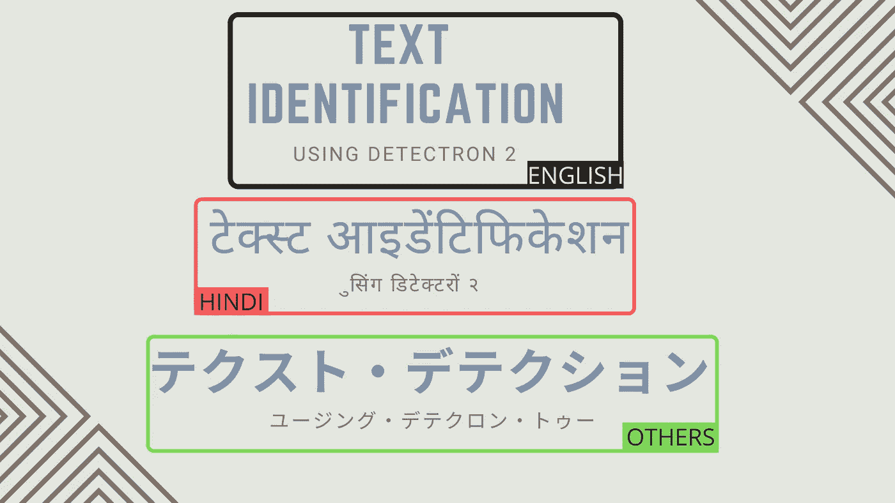
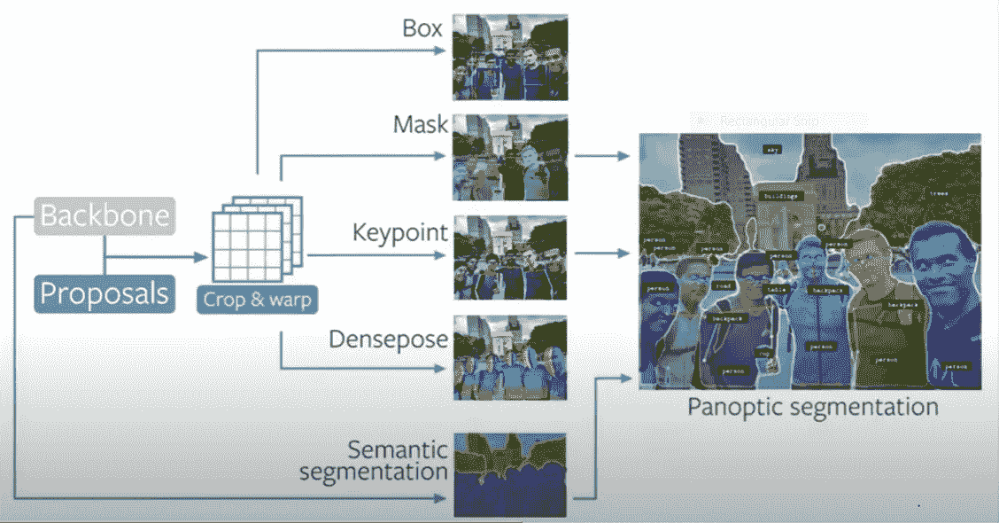
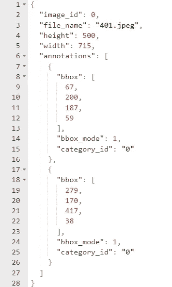
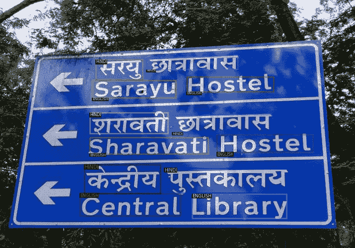
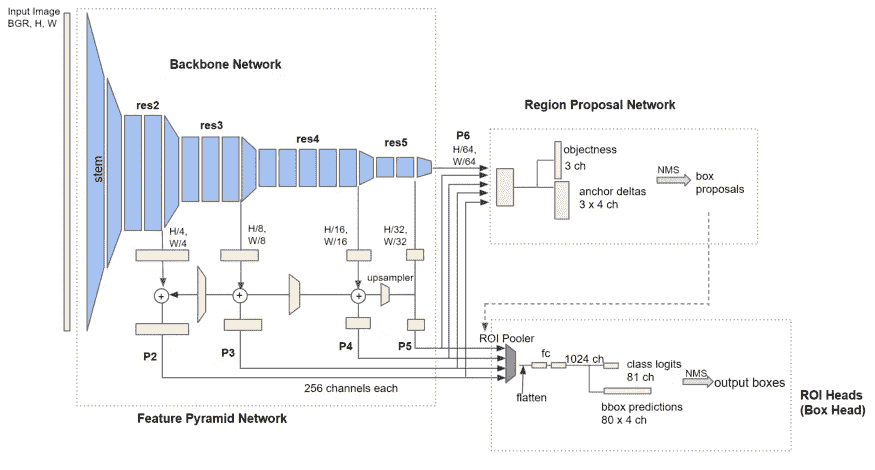
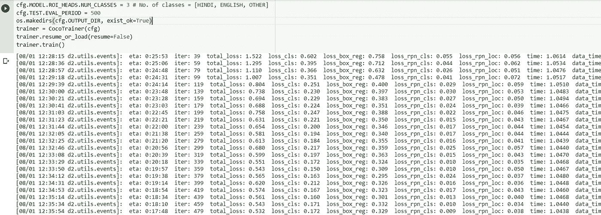
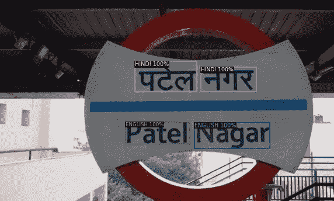
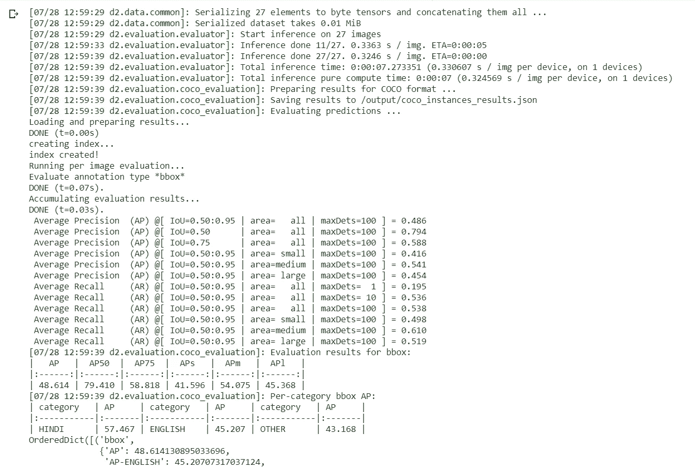

# 使用探测器 2 分 6 步进行物体探测

> 原文：<https://towardsdatascience.com/object-detection-in-6-steps-using-detectron2-705b92575578?source=collection_archive---------2----------------------->

## 让我们看看如何使用 FAIR(脸书人工智能研究所)的 Detectron 2 对涉及文本识别的自定义数据集进行实例检测。



使用 Canva 设计

你有没有尝试过使用自己选择的自定义数据集从头开始训练一个对象检测模型？

如果是的话，你就知道这个过程有多乏味了。如果我们选择基于区域建议的方法，如更快的 R-CNN，或者我们也可以使用一次性检测器算法，如 SSD 和 YOLO，我们需要从使用特征金字塔网络结合区域建议网络构建模型开始。

如果我们想从头开始实现它，这两种方法都有点复杂。我们需要一个框架，在这个框架中，我们可以轻松地使用最先进的模型，如 Fast、Faster 和 Mask R-CNN。然而，重要的是至少尝试一次从头构建模型，以理解其背后的数学原理。

如果我们想用自定义数据集快速训练一个对象检测模型，Detectron 2 就能帮上忙。Detectron 2 库的[模型动物园](https://github.com/facebookresearch/detectron2/blob/master/MODEL_ZOO.md)中的所有模型都在 COCO 数据集上进行了预训练。我们只需要在预训练的模型上微调我们的自定义数据集。

Detectron 2 是对 2018 年发布的第一款 Detectron 的完全重写。前任是在 Caffe2 上写的，这是一个深度学习框架，也是由脸书支持的。Caffe2 和 Detectron 现在都被弃用了。Caffe2 现在是 PyTorch 的一部分，后继者 Detectron 2 完全写在 PyTorch 上。

> Detectron2 旨在通过提供快速培训和解决公司从研究走向生产时面临的问题来推进机器学习。

这些是 Detectron 2 提供的各种类型的对象检测模型。



【https://research.fb.com/wp-content/uploads/2019/12/4\. -detectron2.pdf

让我们直接进入**实例检测**。

实例检测是指对周围有边界框的对象进行分类和定位。在本文中，**我们将使用 Detectron 2 的模型动物园中更快的 RCNN 模型来处理从图像中识别文本语言的问题。**

请注意，我们将把我们的语言限制为 2。

我们标识了印度语文本和英语文本，并为其他语言添加了一个标记为其他的类。


Colab 的最终结果

我们将实现一个输出如下的模型。

我们开始吧！

使用 Detectron 2，可以使用七个步骤对任何自定义数据集执行对象检测。所有的步骤都在这个 [Google Colab 笔记本](https://github.com/aakarsh7599/Text-Detection-using-Detectron2)中，你可以直接运行它！

使用 Google Colab 将是一项简单的任务，因为我们可以使用 GPU 进行更快的训练。

## 步骤 1:安装 Detectron 2

从安装一些依赖项开始，比如 Torch Vision 和 COCO API，然后检查 **CUDA** 是否可用。CUDA 帮助跟踪当前选择的 **GPU** 。然后安装 Detectron2。

```
# install dependencies: 
!pip install -U torch==1.5 torchvision==0.6 -f [https://download.pytorch.org/whl/cu101/torch_stable.html](https://download.pytorch.org/whl/cu101/torch_stable.html)
!pip install cython pyyaml==5.1
!pip install -U 'git+https://github.com/cocodataset/cocoapi.git#subdirectory=PythonAPI'import torch, torchvision
print(torch.__version__, torch.cuda.is_available())
!gcc --version# install detectron2:
!pip install detectron2==0.1.3 -f https://dl.fbaipublicfiles.com/detectron2/wheels/cu101/torch1.5/index.html
```

## 步骤 2:准备和注册数据集

导入一些必要的包。

在 detectron2 中有内置支持的数据集在[内置数据集](https://detectron2.readthedocs.io/tutorials/builtin_datasets.html)中列出。如果您想在重用 detectron2 的数据加载器的同时使用自定义数据集，您将需要**注册**您的数据集(即，告诉 detectron2 如何获取您的数据集)。

我们使用我们的文本检测数据集，它有三个类:

1.  英语
2.  印地语
3.  其他人

我们将从现有的在 COCO 数据集上预训练的模型中训练一个文本检测模型，该数据集可在 detectron2 的模型动物园中获得。

如果您有兴趣了解从数据集的原始格式到 Detectron 2 接受的格式的转换，请查看这个 [Colab 笔记本](https://colab.research.google.com/drive/1q-gwQteO79r8sX59oYnHYCNtP9zXWFPN?usp=sharing)。

数据输入模型的方式有一定的格式，如 YOLO 格式、PASCAL VOC 格式、COCO 格式等。Detectron2 接受数据集的 COCO 格式。数据集的 COCO 格式由 JSON 文件组成，该文件包括图像的所有细节，例如大小、注释(即，边界框坐标)、对应于其边界框的标签等。举个例子，



Detectron 2 的数据集格式

这是一张图片的 JSON 外观。边界框表示有不同类型的格式。它必须是[结构的成员。探测器 2 的 BoxMode](https://detectron2.readthedocs.io/modules/structures.html#detectron2.structures.BoxMode) 。有 5 种这样的格式。但目前支持 **BoxMode。XYXY_ABS，BoxMode。XYWH_ABS** 。我们使用第二种格式。(X，Y)表示边界框的一个坐标，W，H 表示该框的宽度和高度。category_id 是指盒子所属的类别。

然后，我们需要注册我们的数据集。

为了验证数据加载是否正确，让我们可视化训练集中随机选择的样本的注释。

## 步骤 3:可视化训练集

我们将从数据集的 train 文件夹中随机选取 3 张图片，看看边界框是什么样子的。

输出是这样的，



Colab 的结果

## 步骤 4:训练模型

**大步**。在这一步，我们给出配置，并设置模型以准备接受训练。从技术上讲，我们只是在数据集上微调我们的模型，因为该模型已经在 COCO 数据集上进行了预训练。

在 Detectron2 的模型动物园中有大量模型可用于对象检测。在这里，我们使用 **faster_rcnn_R_50_FPN_3x** 模型，从这个角度来看，它是一个高水平的模型。



[来源](https://medium.com/@hirotoschwert/digging-into-detectron-2-47b2e794fabd)

将有一个主干网络(在这种情况下为 Resnet ),用于从图像中提取特征，然后是一个区域建议网络，用于提出区域建议，还有一个框头，用于收紧边界框。

你可以在我的[上一篇文章](/understanding-fast-r-cnn-and-faster-r-cnn-for-object-detection-adbb55653d97)中读到更多关于 R-CNN 如何更快工作的信息。

让我们为培训设置配置。

我不会说这是最好的配置。当然，其他配置的精度也可能会提高。毕竟，这取决于选择正确的超参数。



培训过程(来自 Colab 的结果)

注意，这里我们还计算了验证集上每 500 次迭代的精确度。

## 步骤 5:使用训练好的模型进行推理

是时候通过在验证集上测试模型来推断结果了。

成功完成存储最终权重的训练后，输出文件夹会保存在本地存储中。您可以保存此文件夹，以便将来根据此模型进行推理。

**结果:**



## 步骤 6:评估训练好的模型

通常，模型按照 COCO 评估标准进行评估。平均精度(mAP)用于评估模型的性能。这里有一篇[文章](https://tarangshah.com/blog/2018-01-27/what-is-map-understanding-the-statistic-of-choice-for-comparing-object-detection-models/)精确地给出了地图上的一个概念。



评估指标(来自 Colab 的结果)

对于 0.5 的 IoU，我们可以获得大约 79.4%的准确率，这还不算太差。当然可以通过调整参数和增加迭代次数来增加。但是要密切关注广泛的训练，因为模型可能会超出训练集。

如果您需要从保存的模型中进行推断，请浏览本 [Colab 笔记本](https://colab.research.google.com/drive/1d0kXs-TE7_3CXldJNs1WsEshXf8Gw_5n?usp=sharing)。

# 结论

在本文中，我强调了使用 detectron 2 使用自定义数据集进行异议检测的过程，而不是关注获得更高的准确性。

虽然这似乎是一个非常简单的过程，但在 Detectron 2 的库中还有很多东西需要探索。我们有大量的优化参数，可以进一步调整以获得更高的精度，这完全取决于一个人的自定义数据集。

希望你今天学到了新东西。

你可以从我的 [Github 库](https://github.com/aakarsh7599/Text-Detection-using-Detectron2)下载笔记本，并尝试在 Google Colab 或 Jupyter 笔记本上运行。

你可以在我的[上一篇文章](/understanding-object-detection-and-r-cnn-e39c16f37600)中读到更多关于物体探测和传统 R-CNN 的内容。

如果你想联系我，请在 [LinkedIn](https://www.linkedin.com/in/aakarsh-yelisetty-6b691b171/) 上联系我。