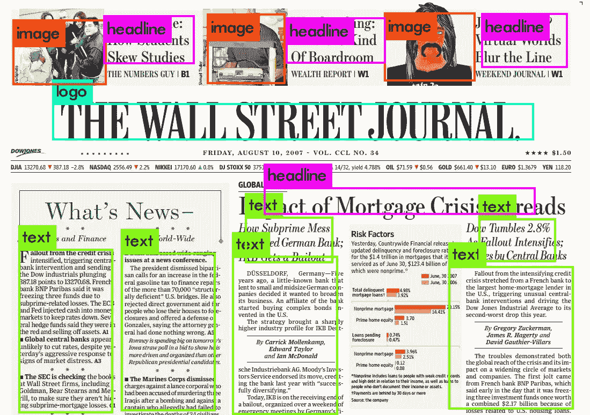
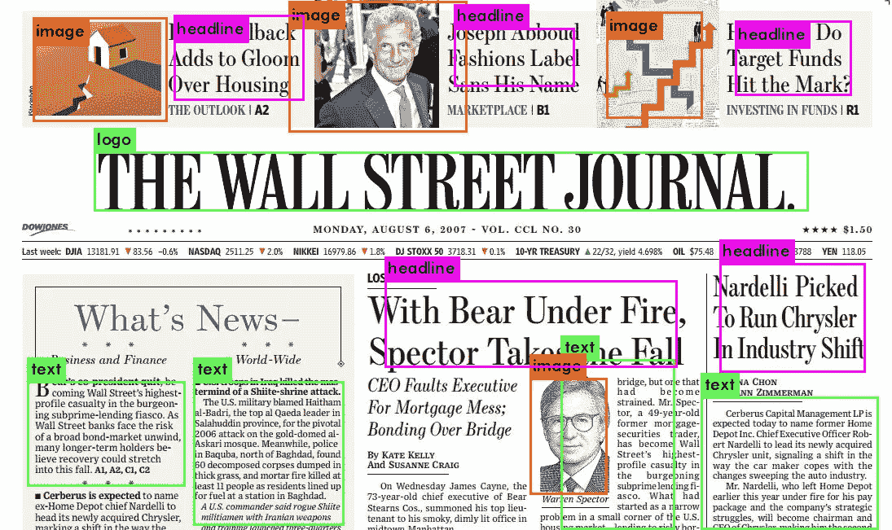

# 基于 YoloV3 的报纸图像目标检测

> 原文：<https://towardsdatascience.com/object-detection-on-newspaper-images-using-yolov3-85acfa563080?source=collection_archive---------16----------------------->

## 为更好的 OCR 制作自定义 YoloV3 模型



> 当我在报纸图像上尝试光学字符识别时，我意识到大多数文档都有章节，并且文本不一定跨越页面的整个水平空间。
> 
> 即使宇宙魔方能够辨认出文本，它也是乱糟糟的。为了解决这个问题，该模型应该能够识别文档中的部分，并在其周围绘制一个边界框，并执行 OCR。就在这个时候，我想到了在这样的图像上应用 Yolo 物体检测。

## YoloV3 简介

YOLOv3 速度极快，精度极高。在 mAP 中，测得 5 IOU YOLOv3 与焦点损耗相当，但速度快 4 倍左右。此外，你可以简单地通过改变模型的大小在速度和准确性之间进行权衡，不需要重新训练！

# 创建数据集

首先，我需要一个标记图像的数据集来训练 Yolo 模型，但没有可用的数据集，所以我决定自己制作一个。找到了一个用 **Python** 写的优秀工具，按照 Yolo 格式[链接 给图片加标签。经过几个小时的鼠标点击、绘制边框和手工标记报纸图片，我最终得到了一个包含 4 个类的图片数据集](https://github.com/tzutalin/labelImg)

*   头条新闻
*   标志；徽标
*   图像
*   文本

我已经将数据集上传到 Kaggle 和 Github 上，供任何人进一步使用。(下面的链接)

## 数据集文件结构

```
.
├── custom.names
├── detector.data
├── images
│   ├── 001.jpg
│   ├── 002.jpg
│   ├── 003.jpeg
│   ├── 100.jpg 
|   .....
│   ├── 101.JPG
├── labels
│   ├── 001.txt
│   ├── 002.txt
│   ├── 101.txt
├── newspaper-yolo.cfg
├── test.txt
└── train.txt
```

# 培养

我们将使用的模型架构被称为 YOLOv3，或者你只看一次，由 Joseph Redmon 编写。这种特定的模型是一次性学习器，这意味着每幅图像只通过网络一次来进行预测，这使得该架构的性能非常高，在预测视频馈送时每秒可查看高达 60 帧。从根本上说，YOLO 把一幅图像分成几个子部分，并对每个子部分进行卷积，然后汇集起来进行预测。这里有一个关于 YOLO 的深度潜水推荐[。](http://datahacker.rs/yolov3-tensorflow/)

现在，即使我们在自定义数据集上训练我们的模型，使用另一个已经训练好的模型的权重作为起点仍然是有利的。想象一下，我们想要尽可能快地爬上一座山，而不是完全从零开始创建我们自己的路径，我们将从假设别人的路径比我们随机尝试猜测曲折路径更快开始。

为了给我们的模型计算提供动力，我们将使用 Google Colab，它提供免费的 GPU 计算资源(在浏览器打开的情况下长达 24 小时)。

从克隆约瑟夫·雷德蒙的 Github 回购开始。这提供了动态训练对象检测模型所需的大部分工具。

```
git clone [https://github.com/pjreddie/darkne](https://github.com/pjreddie/darknet)t
```

编辑 yolo-v3.cfg 文件，根据您的要求进行配置

你需要在第一行输入你的班级号，`train.txt`和`test.txt`路径在第二和第三行，`object.names`路径在第四行。

现在你需要编辑`***.cfg**`文件。默认情况下，每个 YOLO 层有 255 个输出:每个锚点 85 个输出[4 个框坐标+ 1 个对象置信度+ 80 个类别置信度]，乘以 3 个锚点。

在我们的例子中，我们只使用了四个类，然后我们需要编辑过滤器。您可以将过滤器减少到`filters=[4 + 1 + n] * 3`，其中`n`是您的类计数。这种修改应该在三个 YOLO 层的每一层之前进行。此外，修改`classes=80`到`classes=n`在每个 YOLO 层，其中`n`是你的类计数。

我更改了第 **6** 和 **7** 行中的批量和细分。然后是行号 **610** (类=4)和 **603** (过滤器=27)，然后是行号 **689** & **696** ，最后是行号**776**&783。如果您使用 tiny-yolo，行号会有所不同。

```
[yolo]
mask = 0,1,2
anchors = 10,13,  16,30,  33,23,  30,61,  62,45,  59,119,  116,90,  156,198,  373,326
classes=4
num=9
jitter=.3
ignore_thresh = .7
truth_thresh = 1
random=1
```

将 num classes 更改为您想要检测的类的数量，我们就可以开始训练了。

```
# Start Training ./darknet detector train custom_data/detector.data custom_data/newspaper-yolo.cfg -dont_show
```

在数千行控制台输出和几个小时后…

# **结果**



在图像增强的帮助下，经过 2 小时训练的 32 幅图像的小数据集能够产生 98%以上置信度的结果。考虑到报纸是非常复杂的文档，需要适应大量的内容，这个模型表现得非常好。类似的模型可以被训练用于各种任务，如验证 Id，验证物理表单，转换手写笔记等等！

如果你喜欢我做的，请随意鼓掌！(你可以顺便做 50 次)

# **源代码和数据集链接**

[](https://github.com/imvab/news-yolo) [## imvab/news-yolo

### 报纸图像中的目标检测。在 GitHub 上创建一个帐户，为 imvab/news-yolo 的发展做出贡献。

github.com](https://github.com/imvab/news-yolo) [](https://www.kaggle.com/immvab/document-object-detection) [## 文档对象检测

### 用于文本图像上目标检测的标记图像。

www.kaggle.com](https://www.kaggle.com/immvab/document-object-detection) 

# 在 LinkedIn 和 Github 上与我联系

[](https://in.linkedin.com/in/vaibhav-birla-960412b7) [## vaibhav Birla-Techno India Salt Lake-Kolkata，西孟加拉邦，印度| LinkedIn

### 在世界上最大的职业社区 LinkedIn 上查看 Vaibhav Birla 的个人资料。Vaibhav 的教育列在…

in.linkedin.com](https://in.linkedin.com/in/vaibhav-birla-960412b7) [](https://github.com/imvab) [## imvab -概述

### 在 GitHub 上注册你自己的个人资料，这是托管代码、管理项目和构建软件的最佳地方…

github.com](https://github.com/imvab)