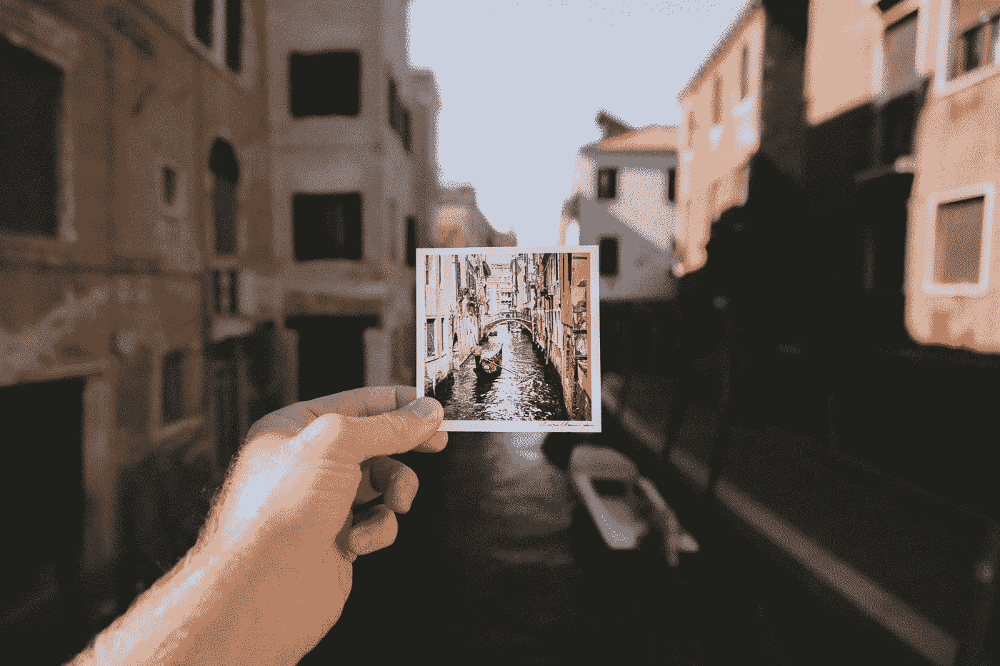
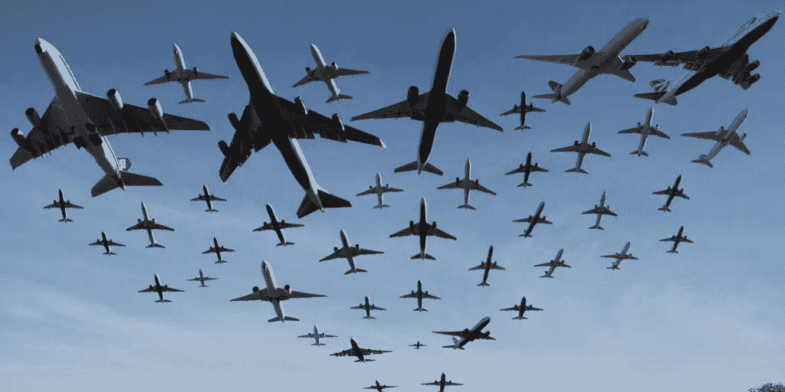
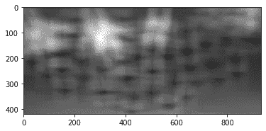
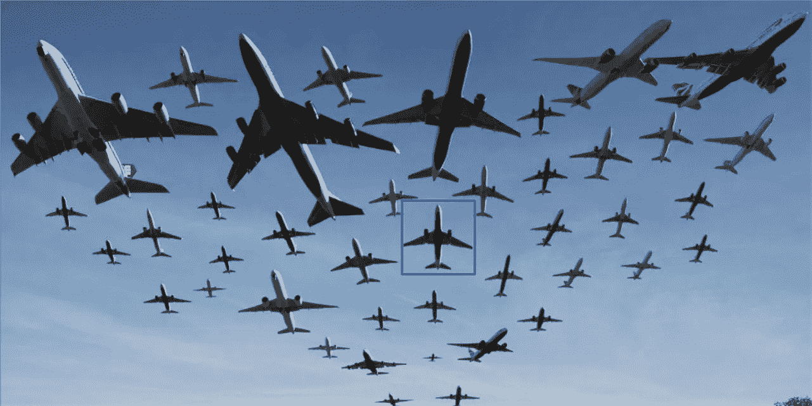
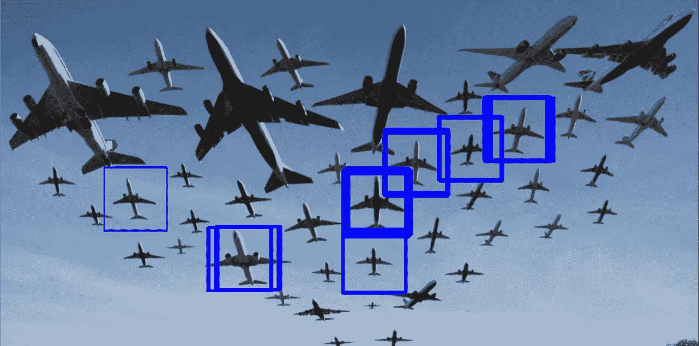

# 基于模板匹配的 Python 对象检测

> 原文：<https://towardsdatascience.com/object-detection-on-python-using-template-matching-ab4243a0ca62?source=collection_archive---------7----------------------->

## 了解如何在没有机器学习或任何框架的情况下在 Python 上进行对象检测



雅各布·欧文斯在 [Unsplash](/s/photos/object-detection?utm_source=unsplash&utm_medium=referral&utm_content=creditCopyText) 上的照片

每当我们听到“*对象检测*”时，我们脑海中就会浮现出机器学习以及不同的框架。但我们实际上可以在不使用机器学习或任何其他框架的情况下进行对象检测。在本文中，我将向您展示如何只用 Python 来实现这一点。

我们将从定义一个模板图像(对象)开始，系统将在源图像中找到与我们选择的模板匹配的所有其他对象。让我解释一下我给你们看一个例子的意思。下面有两张图片，左边是飞机的源图像，右边是飞机作为物体的模板照片。



左—源图像，右—模板图像

我要做的是写一个 python 代码来显示这个模板图像实际上适合我的源图像的所有区域。

首先，让我们从检测一个对象开始，其次，我们可以调整代码来检测多个对象。

## 检测一个对象—最精确的对象

为此，我们需要一个源图像和一个模板图像。模板图像在源图像上滑动(像 2D 卷积一样)，程序将试图找到最准确的匹配。

开始编码吧。

```
import cv2
import numpy as np
from matplotlib import pyplot as pltimg_rgb = cv2.imread('SourceIMG.jpeg')
img_gray = cv2.cvtColor(img_rgb, cv2.COLOR_BGR2GRAY)
template = cv2.imread('TemplateIMG.jpeg', 0)
```

在上面的部分代码中，我们使用 OpenCV 来读取我们的`SourceIMG.jpeg`和`TemplateIMG.jpeg`。

```
height, width = template.shape[::]
```

当模板图像滑过源图像时，它会寻找整个区域。(**左上角为参考帧**)。在模板图像与源图像匹配后，我们要注意左上角的位置，然后在实际匹配的区域周围画一个方框。为了做到这一点，我们需要找到这个模板图像的高度和宽度。所以我们可以画矩形。

```
res = cv2.matchTemplate(img_gray, template, cv2.TM_SQDIFF)
```

模板匹配是 OpenCV 的一部分，它获取我们的灰度源图像和带有我们需要使用的统计指标的模板图像。在这种情况下，我使用的是**最小方差** ( `TM_SQDIFF`)，因为我们在寻找模板图像和源图像之间的最小差异。

```
plt.imshow(res, cmap='gray')
```

如果你画出我们到目前为止所做的，我们会看到一个概率图。正如你从下图中看到的，这些小点就是模板实际匹配的地方。



概率图

```
min_val, max_val, min_loc, max_loc = cv2.minMaxLoc(res)
```

使用上面的代码，我们可以找到概率图中微小点的位置。使用`minMaxLoc(res)`我们可以提取最小值、最大值、最小位置和最大位置。

```
top_left = min_loc 
bottom_right = (top_left[0] + width, top_left[1] + height)
cv2.rectangle(img_rgb, top_left, bottom_right, (255, 0, 0), 2)
```

为了在模板图像匹配的源图像上绘制一个蓝色矩形，我们需要得到最小位置，`min_loc`(匹配实际开始的位置)作为我们的左上角。同样的，我们可以通过`top_left[0] + width`和`top_left[1] + height`得到我们的底部。有了这些尺寸，我们可以使用`cv2.rectangle`绘制蓝色矩形。
这就是我们需要设置的所有内容，让我们继续想象一下。

```
cv2.imshow("Matched image", img_rgb)
cv2.waitKey()
cv2.destroyAllWindows()
```



匹配图像—一个对象

完整代码:

## 在给定阈值下检测多个对象

我们已经通过选择源图像和模板图像之间的最小差异检测了一个对象。通过定义一个阈值，我们可以检测所有与模板图像相似的对象。

为此，我将使用相同的源图像和模板图像来检测一个概率阈值高于 0.5 的对象(您可以通过参考`res`数组来决定阈值)。我们只需要修改几行代码来检测多个对象。

```
res = cv2.matchTemplate(img_gray, template, cv2.TM_CCOEFF_NORMED)
```

这里我使用`TM_CCOEFF_NORMED`是因为我们需要得到最大值，而不是最小值。这意味着我们需要寻找多个物体而不是一个。

```
threshold = 0.5 #For TM_CCOEFF_NORMED, larger values means good fitloc = np.where( res >= threshold)
```

我们试图找到所有大于阈值的位置值。`loc`将接收 2 个输出数组，组合这些数组我们可以得到 x，y 坐标。

```
for pt in zip(*loc[::-1]):
   cv2.rectangle(img_rgb, pt, (pt[0] + width, pt[1] + height), (255, 0, 0), 1)
```

我现在要做的是，我们有多个位置，而不是一个。因此，对于所有这些位置，我们需要绘制蓝色矩形。这就是我们需要设置的所有内容，让我们继续想象一下。



匹配图像—多个对象

完整代码:

看起来很简单，对吗？但如果我们使用机器学习或框架，我们可以更准确地做到这一点。

感谢您的阅读，我希望这篇文章是有帮助的。

## 资源

[](https://www.youtube.com/channel/UC34rW-HtPJulxr5wp2Xa04w) [## Sreeni 为显微镜专家开发的 Python

### 本频道将带您了解学习 Python 编码的整个过程；从基础到高级…

www.youtube.com](https://www.youtube.com/channel/UC34rW-HtPJulxr5wp2Xa04w)