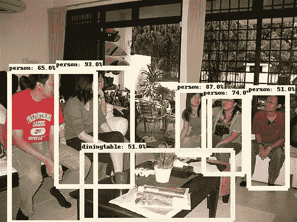

# 对象检测-张量流

> 原文：<https://towardsdatascience.com/object-detection-tensorflow-854c7eb65fa?source=collection_archive---------33----------------------->

## *使用 Tensorflow 对象检测 API 为 Pascal VOC 数据集训练对象检测模型*



Pascal VOC 数据集中图像的目标检测

T 使用 Tensorflow 对象检测 API 训练该模型，用于在 Pascal VOC 2012 数据集上训练 20 个类的模型。

*自从机器学习和深度神经网络被搁置了几年后，它们的受欢迎程度又恢复了，人们对此议论纷纷。最近，世界各地的社区已经开始为机器学习领域做出贡献。自从其发展以来，对象检测和对象识别已经获得了巨大的普及，并且世界各地的研究人员已经贡献了各种最先进的架构。*

> 谷歌的 Tensorflow 贡献了一个专用的 API(对象检测 API ),它提供了一堆在大型语料库上训练过的模型。这些模型是免费提供的，也允许用户贡献。在这篇文章中，我将使用预训练的模型来训练一个模型，以检测 **PASCAL VOC** 数据集中的对象。
> 
> 本博客使用的数据集可在此免费获取(2012 版)。但是，服务器大部分时间都是关闭的，所以您可以在这里找到数据集。

# *关于数据集*

我们使用的数据集代表 XML 文件和相应图像中的数据。数据中的每个 XML 文件都包含所有边界框的信息。对象检测 API 使用这些 XML 文件，并将它们转换为 csv 格式，CSV 格式可以进一步转换为训练模型所需的 tf 记录格式。在我们的例子中，我们使用的是 PASCAL VOC 数据集，tensorflow 已经为其提供了各种实用工具，使我们的生活变得更加轻松。我们将继续讨论细节。

# ***所以，现在是时候开始一些真正的编码了……***

API 为我们抽象了所有棘手的东西。但是，在使用 API 之前，用户需要满足一些要求。

API 使用 tf 记录格式的数据集。它是表示数据的二进制格式。API 使用这种格式来加速训练过程。Tf record 在内部以允许并行处理的格式表示数据。

让我们从克隆 tensorflow 模型开始，它是正在研究的模型和正式发布的模型的集合。

*现在我们需要在 models/research 的 object detection 文件夹中安装协议缓冲文件。此外，我们需要安装研究文件夹中的所有模型。让我们开始吧…*

在研究文件夹中安装了所有的模型之后，我们就可以将数据转换成 tf 记录格式了。现在，在我们使用 **PASCAL VOC** 数据集的情况下，tensorflow 为我们提供了一个脚本，我们可以用它来转换 tf 记录格式的数据。我们还需要标签数据，该数据包含要为其训练模型的类的数量。标签文件看起来像这样…

```
item {
  id: 0
  name: 'businesscard'
} 
```

这里，每个 id 映射到一个从开始的唯一数字，名称是类名。在我们的例子中，我们有 20 个类，并且在同一个文件中有 20 个唯一的项目 JSON 对象。出于我们的目的，tensorflow 为我们的数据集提供了一个标签文件，该文件可以在您的 colab 笔记本***/content/models/research/object _ detection/data/Pascal _ label _ map . Pb txt***中的以下路径找到

# **实际调用脚本将数据转换成 Tf-record 格式的时间。**

这将节省。列车数据的记录文件。

同样，您需要运行 create _ Pascal _ TF _ record _ test . py 来将测试数据转换成所需的格式。

# 现在该训练模型了…

在处理 API 时，有各种各样的兼容性问题需要处理。这是由于 API 的初始版本。我花了大约 3 天时间解决了我们大多数人都面临的一个主要问题，那就是超薄模块。即使在提供了正确的路径和阅读了大量的博客和评论后，我最初也无法解决这个问题。但是，我会指导你的步骤，以帮助你按照目前的版本。运行培训流程时，需要使用瘦模块。要导入 slim 模块，您首先需要制作一个新的笔记本，导入并下载所有的库，并在其中克隆模型。

在 colab 笔记本开始时，您必须首先使用以下命令***% tensorflow _ version 1.x***将 tensor flow 版本转换为 1 . x

出于我们的培训目的，我们将使用***SSD _ mobilenet _ v1 _ coco****模型。我也尝试使用其他模型，但不知何故，在遵循相同的过程后，我无法摆脱那里的错误。但是对于****SSD _ mobilenet _ v1****型号来说一切都很好。它是在 COCO 数据集上训练的模型，因此可以检测 90 个类别。但是出于我们的目的，我们只需要为 VOC 数据集中的 20 个类训练它。*

首先从 tensorflow 官网下载模型([此处](https://github.com/tensorflow/models/blob/master/research/object_detection/g3doc/detection_model_zoo.md))。现在，我们将提取模型 tar 文件。

现在，我将为您提供一些命令，您可以运行这些命令来解决 slim 问题。将以下命令复制并粘贴到您的笔记本中，以安装 slim 库，一次在 research/slim 文件夹中，第二次，复制 object_detection 文件夹中的所有 slim 文件，并将它们也安装在那里。

有时，使用 pip install tf-slim 直接安装 tf-slim 包也是可行的(大多数情况下是 kaggle 笔记本)

接下来，您需要从[**models**](https://github.com/tensorflow/models)**/**[**research**](https://github.com/tensorflow/models/tree/master/research)**/**[**object _ detection**](https://github.com/tensorflow/models/tree/master/research/object_detection)**/**[**samples**](https://github.com/tensorflow/models/tree/master/research/object_detection/samples)**/configs/**文件夹中下载模型的 config 文件，并将输入 tf 记录文件、标签映射文件、测试 tf 记录文件的路径和目录更改为现在，运行命令开始训练过程。

> ***注意:在 colab 笔记本中，即使修改了 fine_tune_checkpoint 路径，检查点也会保存在 colab 笔记本根目录下的 tmp 文件夹中。如果这种情况仍然存在，一定要考虑一下。此外，如果训练中出现错误，则通过重新启动会话切换到 tensorflow 2.x。这样现在就不会出现小错误了。***

# 推理

在为 20 个类训练好模型之后，我们需要将检查点文件转换成可重用的格式。为了将模型转换成所需的格式，tensorflow 提供了一个可以使用的脚本。

在 trained_checkpoint_prefix 中提供最新的检查点路径，但最多不超过您看到的最大检查点数量。

> **注意:如果 export_inference_graph.py 脚本抛出一个错误，指出必须使用 output_file 提供路径，那么您需要用另一个可以下载的脚本替换这个脚本，在这里找到**[](https://github.com/tensorflow/models/blob/master/research/object_detection/export_inference_graph.py)****，然后运行上面的命令****

# **获得预测**

**为了获得预测，我们将使用 tensorflow 工具来获得概率和边界框值，然后在图片上显示边界框。预测的全部代码非常简单，遵循相同的结构。你可以在下面找到代码…**

**您可以在我的 github repo 上找到完整的工作笔记本:**

**[](https://github.com/sahilgupta001/Object_Recognition_Pascal_VOC) [## sahilgupta 001/Object _ Recognition _ Pascal _ VOC

### GitHub 是超过 5000 万开发人员的家园，他们一起工作来托管和审查代码、管理项目和构建…

github.com](https://github.com/sahilgupta001/Object_Recognition_Pascal_VOC) 

我希望本教程能在培训和测试的各个方面帮助你。如果你有任何疑问，你可以在评论区提问。

# **谢谢！****