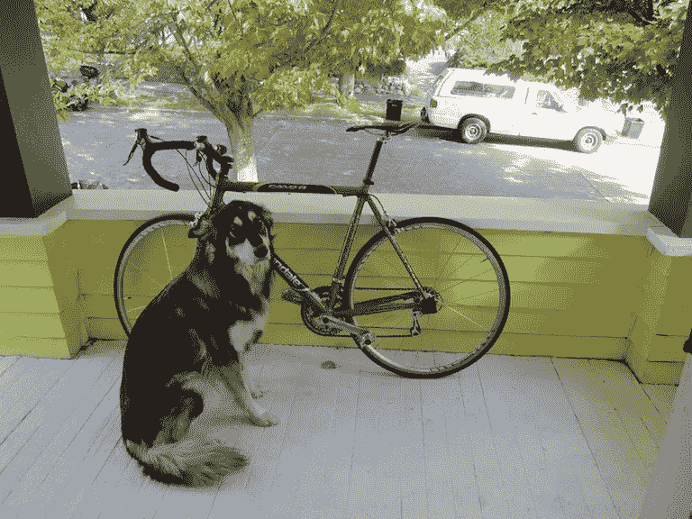
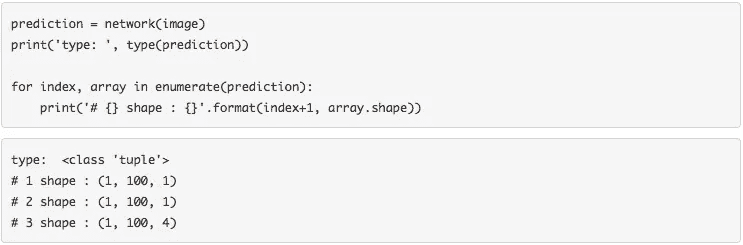

# 使用 GluonCV 的目标检测

> 原文：<https://towardsdatascience.com/object-detection-using-gluoncv-b7940670ba54?source=collection_archive---------38----------------------->

## 在本文中，我们将演示如何使用 GluonCV 使用预训练模型进行对象检测。

1.  **导入库**

我们将从导入所需的库开始。我们需要导入 MXNet、GluonCV 和 Pyplot。

```
import mxnet as mx
import gluoncv as gcv
import matplotlib.pyplot as plt
```

**2。测试图像**

我们将使用下面的图像进行对象检测。该图像有几个明显的对象。在前景中，我们有一只在自行车前面的狗。在背景中，我们有一棵树和一辆车。我们想要一个模型来探测这些物体。



**3。加载图像**

因此，让我们使用 *imread()加载图像。*

```
image = mx.image.imread(image_path)
print('data type: ', image.dtype)
print('shape: ', image.shape)
print('type: ', type(image))
plt.imshow(image.asnumpy())
plt.show()
```


**4。变换图像**

如上所示，该图像具有 HWC 的数据布局。我们的图像高度为 576 像素，宽度为 768 像素。这是一个有三个通道的彩色图像。因此，让我们将图像转换成所需的格式。

CV 提供了一个为 yolo 网络应用所有必要的预处理步骤的函数。我们用我们的图像调用 *yolo.transform_test* ,并用 short 参数提供输出图像的短长度。我们输入的图像是高度小于宽度的风景。使用此功能，高度将被调整为 512 像素，同时保持图像的纵横比。

```
image, chw_image = gcv.data.transforms.presets.yolo.transform_test(image, short=512)

print('data type: ', image.dtype)
print('shape: ', image.shape)
print('minimum value: ', image.min().asscalar())
print('maximum value: ', image.max().asscalar())
```


转换测试函数返回两个对象。我们的第一个对象是准备好提供给网络的转换图像。我们的第二个对象只是调整了大小的图像，我们使用这个图像来绘制结果。

*调整大小后的图像是一批单幅图像。这是 NCHW 格式，而不是 NHWC 格式，并且是 32 位浮点数组，而不是 8 位整数。最后，返回的 resize 图像是一个规范化的图像。*

我们可以绘制调整后的 CHW 图像。


我们可以看到调整大小的效果。我们的短边现在是 512 像素而不是 576 像素，而宽度仍然是高度的三分之一。

**5。负载预训练模型**

我们可以使用 *get_model()* 函数从 CV 模型动物园加载我们的预训练模型。我们将使用带有 darknet53 主干网的 yolo3 网络，该主干网已经在 coco 数据集上进行了训练。

*不要忘记将 pretrained 参数设置为 true。*


6。做出预测

我们可以再次像函数一样调用网络。给网络和图像和一个预测将被返回。当使用检测模型时，我们可以预期返回三个 MXNet ndarrays。我们可以遍历元组并打印出这些数组的形状。

1.  *第一个数组包含对象类索引。*
2.  *第二个数组包含对象类别概率。*
3.  *最后一个数组包含了物体边界框的坐标。*



请注意，这些数组的形状都是从 1，100 开始的。这是因为我们的模型可以预测单个图像中多达 100 个对象。因此，对于第一个数组，形状为 1，100，1，这意味着我们有 1 个图像，100 个潜在对象，每个对象有 1 个类别索引。

对于最后一个数组，形状为 1，100，4，我们有 1 个图像，100 个潜在的对象。和 4 个值来定义其边界框。

因为我们只对一个图像执行对象检测，所以我们可以删除所有数组的额外批处理维度，然后解包元组。我们将赋予每个数组自己的变量。


7 .**。对象类别**

让我们仔细看看对象 *class_indexes* 。虽然我们的模型可以潜在地检测每幅图像中的 100 个对象，但是让我们来看看前十个对象的类索引。


我们检测到的第一个对象的预测类别为 16，我们看到了更多类别为 1、7、2、13 和 0 的对象。在这之后，我们有许多类索引为-1 的对象。

-1 是一个特殊的类索引，用于指示没有检测到对象。

因此，我们总共有六个检测到的对象，剩下的 94 个潜在对象用-1 值填充。我们可以使用网络的类别属性来查找类别标签。顶部的对象是 class 16，在查看 class 标签时，我们可以看到 dog 的索引是 16。


**8。物体概率**

类似于对象 *class_indexes* ，我们可以得到相关的对象类概率。我们可以把这理解为我们相信类索引是正确的。


如果我们使用 50%的置信度阈值，我们可以看到已经检测到三个对象。我们的模型对它的两个检测非常有信心，概率得分在 90%以上。这可能是两个前景物体。我们还会看到-1。我们没有填充物体的置信度。

**9。包围盒坐标**

四个值用于定义每个对象的边界框。给出了边界框左上角和右下角的坐标，总共有四个值。


**10。可视化**

让我们来做可视化，而不是解释表格中的边界框。CV 带有边界框绘图功能。我们可以提供之前调整过大小的图像( *chw_image* )。以及每个网络输出。可选地，我们可以提供类标签来为我们的绘图添加注释。


预训练的网络在检测图像中的对象方面做得很好。它成功地检测到了一只狗、一辆自行车和一辆卡车(置信区间为 50%)。预训练的网络错过了背景中的树，因为它是在 coco 上预训练的，而 coco 没有树的对象类。

总之，我们从预处理输入图像开始。然后，我们从模型动物园加载一个对象检测模型，并使用它来生成预测。最后，我们解释了网络输出并可视化了检测到的目标。

在下一篇文章的[中，我们将讨论使用 GluonCV 的图像分类问题。](/image-classification-using-gluoncv-f6ae5401d6ae)

> 在这里成为媒体会员[，支持独立写作，每月 5 美元，可以在媒体上看到所有的故事。](https://medium.com/@rmesfrmpkr/membership)