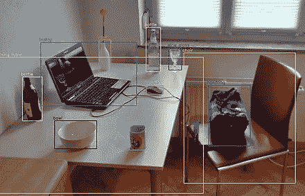
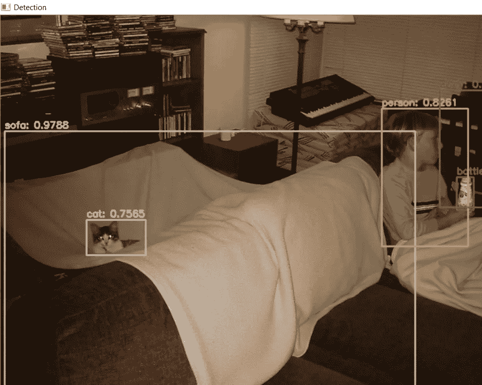
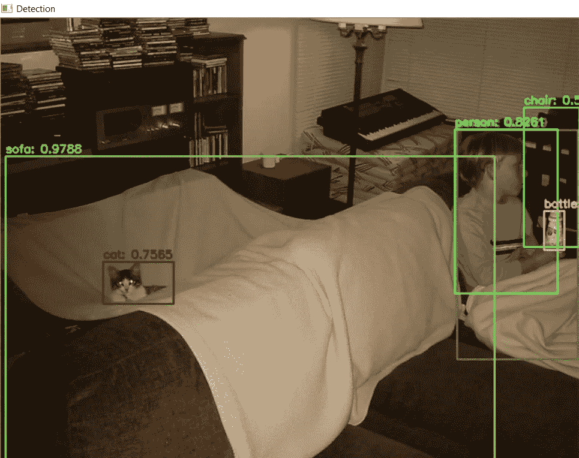

# 使用 YOLOv3 的对象检测

> 原文：<https://towardsdatascience.com/object-detection-using-yolov3-9112006d1c73?source=collection_archive---------23----------------------->

## 使用 YOLOv3 和 OpenCV 实时检测物体的旅程

深度学习彻底改变了计算机视觉领域。神经网络被广泛应用于几乎所有的尖端技术，如特斯拉的自动驾驶功能。他们表现得太好了，有时会导致道德问题和冲突。我们今天不会深入讨论这些。让我们来关注一下计算机视觉的一个子类，叫做“检测”。

探测一个物体是什么意思？当我们看到一个物体时，我们可以准确地指出它在哪里，并轻松地确定它是什么。然而对于计算机来说，任务并不简单。多年来，这一直是一个活跃的研究领域，今天仍然如此。在过去的十年里，随着深度学习的出现(而不是复兴)，我们能够取得良好的结果，在一定程度上已经可以在实时场景中使用它。

图片来自[维基百科](https://en.wikipedia.org/wiki/Object_detection)

## 概观

有几种用于检测的神经网络结构

*   R-CNN 系列架构
*   单发探测器
*   YOLO——你只能看一次

我们今天将看到 YOLOv3 的实现(最初 YOLO 架构的一个变种),但不会详细介绍它是如何工作的。之所以选择 Python(❤语，是因为它得到了 OpenCV 等库的大力支持。值得一提的另一个要点是，YOLO 模型不如 R-CNN 模型准确，但它们很快，很容易适用于实时应用。

## 履行

让我们从导入必要的库开始。OpenCV 库将是我们在本教程中最好的朋友，因为它有几个用于操作图像的有用函数，以及一些有用的模块，比如‘dnn’。

由于我们将使用预先训练好的模型，我们必须下载某些文件。“权重”文件、“配置”文件和“可可名”文件。权重和配置文件可以在[链接](https://pjreddie.com/darknet/yolo/)中找到，coco-names 文件可以从[这里](https://github.com/pjreddie/darknet/blob/master/data/coco.names)下载/复制。有几种预先训练好的模型可用，我们将使用“yolov 3–416”模型。在 MS COCO 数据集上训练模型，该数据集上存在 80 类对象。

下载完所有文件后，就该创建和加载我们的模型了。正如您在下面看到的，dnn 模块有几个内置的函数在这方面帮助我们。我们的模型被训练识别的对象的名称在“coco.names”文件中给出，我们将该文件存储在一个名为 classes 的列表中。我们还在 **getLayerNames()** 和**getUnconnectedOutLayers()**函数的帮助下检索输出层的名称，并将它们存储在 output_layers 列表中。

我们现在必须通过模型传入图像。但是，我们不能直接这样做，因为我们的模型期望我们的图像具有特定的形状。这就是 **cv2.dnn.blobFromImage()** 函数派上用场的地方。它帮助我们重塑我们的形象，同时也使它们正常化，并以适当的顺序重新排列颜色通道。

然后将图像提供给模型，并执行向前传递。其输出为我们提供了一个检测列表。从该列表中，获得每个检测到的对象的一组边界框坐标，如下所示。我们使用置信度阈值来过滤掉弱检测。我使用的置信度阈值的默认值是“0.5”。所有的包围盒坐标、它们的类别 id 和它们相应的置信度值分别存储在列表“盒子”、“类别 id”和“置信度”中。

现在我们已经获得了图像中物体的位置，是时候画出它们的边界框并标记它们了。函数 **draw_boxes()** 为我们做了这件事。我们在旅途中可能会遇到的一个问题是，这些物体有时可能会被探测到不止一次。为了避免这种情况，我们将采用非最大值抑制(也称为非最大值抑制)。我使用的 NMS 阈值的默认值是“0.4”。这是下面的 **cv2.dnn.NMSBoxes()** 函数所执行的。我们最后使用 **cv2.imshow()** 函数显示输出图像。

既然我们已经看到了所有需要的组件，现在让我们把它们粘在一起，在一个图像文件中执行对象检测。

我们可以从文件和网络摄像头的视频中执行相同的任务，如下所示。

右图显示了同一个人周围的多个边界框。在使用 NMS 之后，我们获得了左边的图像作为输出。重复的包围盒已经被处理。

样本输出—从[http://cocodataset.org/](http://cocodataset.org/)获得的测试图像

通过下面的链接，可以在我的 GitHub 库中找到这篇文章的全部代码以及一个清晰的界面。

[https://github.com/GSNCodes/YOLOv3_Object_Detection_OpenCV](https://github.com/GSNCodes/YOLOv3_Object_Detection_OpenCV)

深度学习的最新进展为研究和探索开辟了许多途径。如果你想深入研究这个问题，我鼓励你这样做。创造和创新新技术，但要合乎道德。我希望这篇文章对你有所帮助，我很高兴成为你旅程的一部分:)

G.SowmiyaNarayanan

**附言:——**

这是我关于媒介的第一篇文章，我欢迎任何批评来改进我的工作，以便我能更好地满足未来像你这样的探险家的需要。欢迎评论，让我知道你的想法。你也可以在 [LinkedIn](https://www.linkedin.com/in/sowmiyanarayanan-g/) 上和我联系。

**内存字节:-**

*“若无变化，则无变化。”*