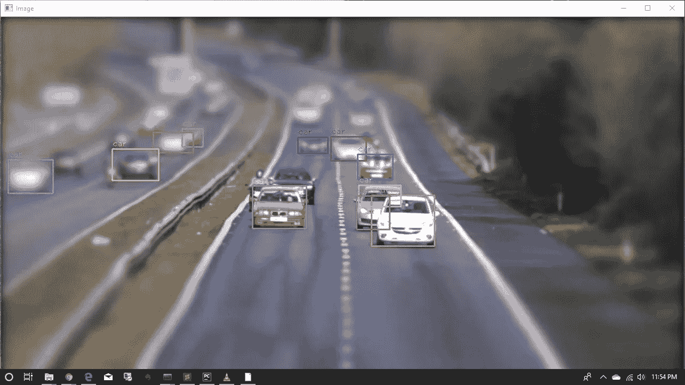
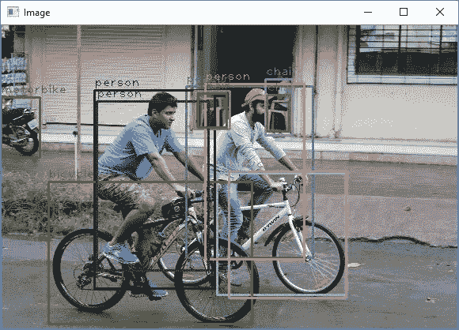
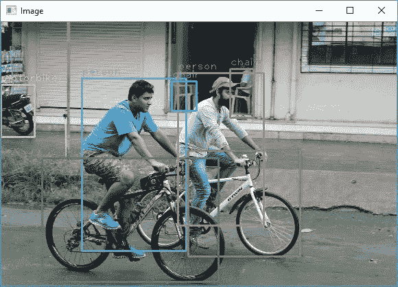
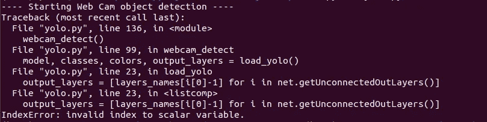
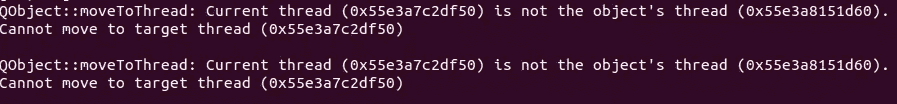

# 使用 YoloV3 和 OpenCV 进行目标检测

> 原文：<https://towardsdatascience.com/object-detection-using-yolov3-and-opencv-19ee0792a420?source=collection_archive---------6----------------------->

## 面向初学者的 YoloV3 物体检测介绍

使用 YoloV3 和 OpenCV 进行目标检测

计算机视觉一直是我着迷的话题。通俗地说，计算机视觉就是复制人类视觉的复杂性和他对周围环境的理解。它正在成为人工智能最强有力的应用领域之一。由于每天都会产生大量的数据。

# 目标检测

当我们观看图像或视频时，我们可以很容易地在瞬间定位和识别我们感兴趣的对象。将这种智能传递给计算机只不过是物体检测——定位物体并识别它。目标检测在很多领域都有应用，比如视频监控、图像检索系统、自动驾驶汽车等等。各种算法可用于对象检测，但我们将集中于 YoloV3 算法。

# YoloV3 算法

*你只看一次*或者更通俗的说法是，与 R-CNN 家族(R-CNN，Fast R-CNN，Faster R-CNN 等)相比，YOLO 是最快的实时物体检测算法之一(每秒 45 帧)。)

R-CNN 系列算法使用区域来定位图像中的对象，这意味着该模型被应用于多个区域，并且图像的高得分区域被认为是检测到的对象。但是 YOLO 遵循一种完全不同的方法。它不是选择一些区域，而是对整个图像应用神经网络来预测边界框及其概率。

我们有两个选项来开始对象检测:

1.  使用预先训练的模型
2.  从头开始训练自定义对象检测器

在本文中，我们将着眼于使用图像、视频和实时网络摄像头的预训练模型来创建对象检测器。如果你想训练一个自定义的 YOLO 物体探测器，我建议你前往 [**与 YOLO 物体探测:动手教程**](https://neptune.ai/blog/object-detection-with-yolo-hands-on-tutorial) 。作者介绍了从定制对象检测器的数据注释到处理数据并最终训练模型的所有步骤。

让我们深入研究代码。

让我们从导入该程序所需的模块开始。

模块

您还需要下载几个重要文件，包括 YoloV3 的预训练权重、配置文件和名称文件。

重量和 cfg(或配置)文件可以从[https://pjreddie.com/darknet/yolo](https://pjreddie.com/darknet/yolo/)下载。您将看到几个不同的选项。该模型已针对不同大小的图像进行了训练:320 x 320(高速，精度较低)、416 x 416(中速，精度中等)和 608 x 608(低速，精度较高)。我们现在将下载 yolov 3–320 的重量和 cfg 文件。

名字文件可以从[https://github . com/pjreddie/darknet/blob/master/data/coco . names](https://github.com/pjreddie/darknet/blob/master/data/coco.names)下载。

现在我们已经下载并准备好了所有这些文件，我们可以开始编写 python 脚本了。就像我之前提到的，我们的输入有三种形式:

1.  图象档案
2.  网络摄像头馈送
3.  可见文件

首先，我们将创建一个名为 **load_yolo()** 的函数。

装载重量

在上面的函数中，你可以看到，我在 OpenCV 的 **dnn** 模块的帮助下加载 YoloV3 权重和配置文件。 **coco.names** 文件包含我们的模型被训练识别的不同对象的名称。我们将它们存储在一个名为 ***类*** 的列表中。现在要使用 **cv2.dnn** 模块运行一个正向传递，我们需要传递要计算输出的层的名称。**net . getunconnectedoutlayers()**返回网络输出层的指数。

为了接受图像文件，我们将需要另一个名为 **load_image()** 的函数，它将接受一个图像路径作为参数，读取图像，调整其大小并返回它。

加载图像

为了正确预测具有深度神经网络的对象，我们需要对我们的数据进行预处理， **cv2.dnn** 模块为此提供了两个函数:***blobFromImage***和 ***blobFromImages。*** 这些功能执行缩放、均值减法和可选的通道交换。我们将在一个名为 **detect_objects()** 的函数中使用***blobFromImage***，该函数接受来自视频或网络摄像头流的图像/帧、模型和输出层作为参数。

正如你在上面的代码片段中看到的，我们使用了 **0.00392** 的**比例因子**，也可以写成 **1/255** 。因此，我们将图像像素缩放到 0 到 1 的范围。不需要均值减法，这就是为什么我们将它设置为**【0，0，0】**值。

**cv2.dnn** 模块的 **forward()** 函数返回一个嵌套列表，其中包含所有检测到的对象的信息，包括检测到的对象中心的 x 和 y 坐标、边界框的高度和宽度、coco.names 中列出的所有对象类别的置信度和得分。得分最高的类别被视为预测类别。

在 **get_box_dimensions()** 函数中，创建了一个名为 *scores* 的列表，其中存储了对应于每个对象的置信度。然后，我们使用 **np.argmax()** 来识别具有最高置信度/得分的类的索引。我们可以从我们在 **load_yolo()** 中创建的 *classes* 列表中获得对应于索引的类名。

我选择了所有置信度超过 30 %的预测边界框。您可以随意使用这个值。

现在我们有了预测边界框的顶点和 class_id(预测对象类的索引)，我们需要绘制边界框并向其添加一个对象标签。我们将借助 **draw_labels()** 函数来完成。

现在，你一定在想， **cv2.dnn.NMSBoxes()** 是干什么用的？我们只是应该添加绘制边界框，并添加一个标签，对不对？

尽管我们移除了低置信度边界框，但仍有可能在对象周围出现重复检测。例如，请看下图。

具有多个包围盒的对象检测

您可能会注意到，有些对象已经被检测了多次，我们有一个以上的边界框。为了解决这种情况，我们需要应用**非最大值抑制(NMS)** ，也称为**非最大值抑制**。我们传入置信度阈值和 NMS 阈值作为参数来选择一个包围盒。从 0 到 1 的范围内，我们应该选择一个中间值，如 0.4 或 0.5，以确保我们检测到重叠的对象，但最终不会为同一个对象获得多个边界框。

因此，最终输出如下所示:

最终输出

我们看到的所有函数都可以在另一个名为 **image_detect()** 的函数中流水线化，用于检测图像文件中的对象。

同样，对于视频文件和网络摄像头输入，我们可以创建两个不同的函数，分别叫做 **start_video()** 和 **webcam_detect()** 。

完整的工作脚本可以在[https://github . com/nandinib 1999/object-detection-yolo-opencv](https://github.com/nandinib1999/object-detection-yolo-opencv)找到。

**更新 2021/11/05**

加载 YOLO-V3 砝码时，代码可能会中断，您可能会得到如下所示的错误。

错误截图

如果发生这种情况，您可以使用 load_yolo()的以下代码片段:

错误修复

解决这个问题后，我遇到了另一个问题:

这就像一个警告。它不会中断代码的功能，但是在代码运行时，这个警告会一直出现在命令行上。我试图寻找一个解决方案，发现这是由于 OpenCV 和 PyQt 库之间的一些依赖问题。您可能需要升级/降级这些库，以使它们再次兼容。

一个有用的问题线索是 [THIS](https://github.com/Yuliang-Liu/Curve-Text-Detector/issues/11) 来了解更多关于警告和修复它的信息。此外，如果你们中的任何一个人能够找到这个警告的永久解决方法，也请与我们分享。

这都是为了这篇文章。希望你觉得有用。如果有，请鼓掌。如有任何问题和建议，请随时通过 [LinkedIn](http://www.linkedin.com/in/nandini-b-b4baaa178) 与我联系。

感谢阅读！

~南迪尼