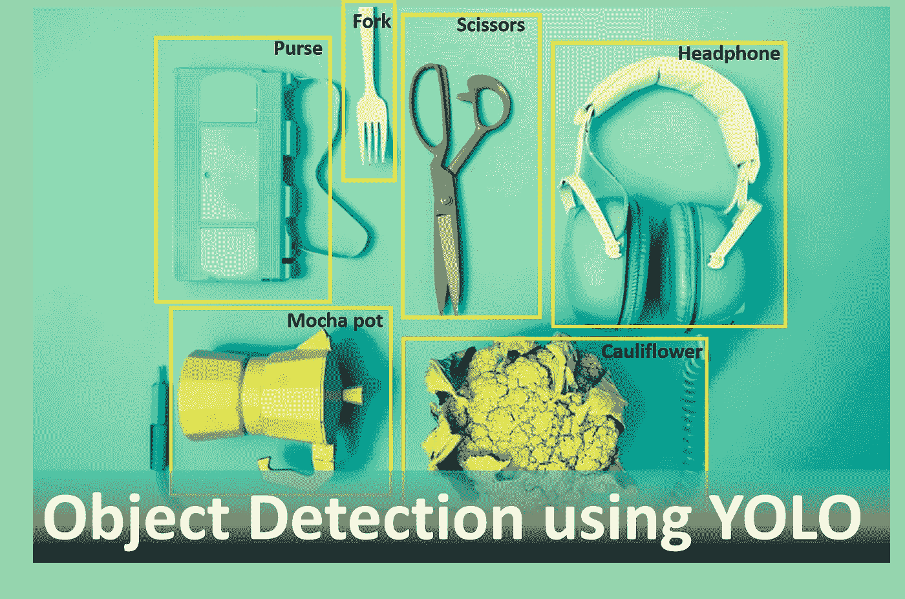
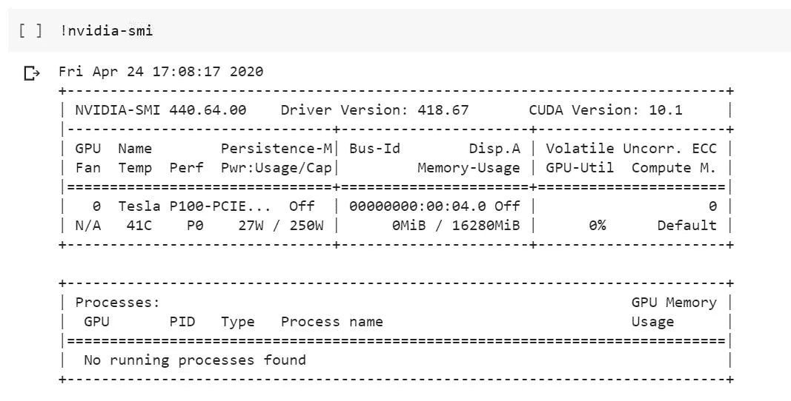
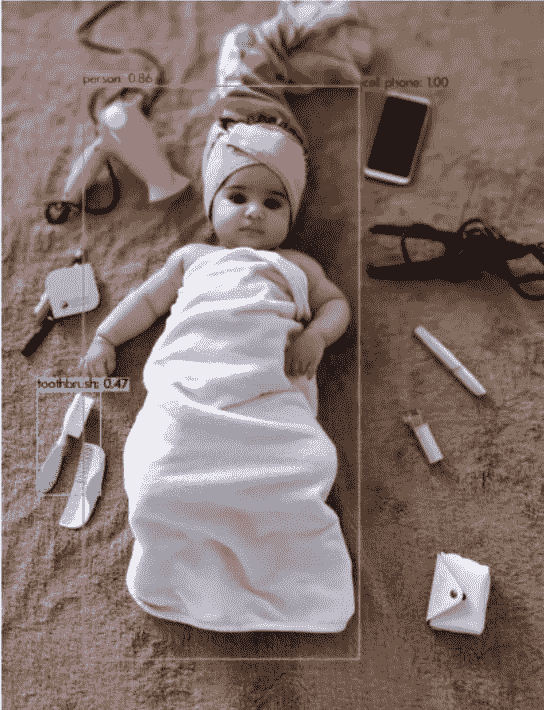

# 使用 Colab 上的 YOLOv3 进行对象检测，并为面试准备问题

> 原文：<https://towardsdatascience.com/object-detection-using-yolov3-on-colab-5d7d9eef02b3?source=collection_archive---------13----------------------->



来源:来自 Unsplash.com 的迈克·格吕贝尔

## 训练一个模型来识别你拍摄的图像中的不同物体。

这个博客将帮助你训练一个可以识别图像中不同物体的模型。观察模型如何在特定条件下比人类表现得更好，这既有趣又令人兴奋。它可以区分汽车和皮卡，即使卡车的尾部在图像中不清晰，就我个人而言，我无法做出这种区别。如果你已经把 YOLO 作为一个黑箱，这个博客将帮助你理解这个模型及其细微差别。最后，有一些问题可以帮助你衡量你对模型的理解。尽量在评论区回答问题，如果需要答案，尽管问我。

*要求*:有互联网连接和谷歌账户的 pc。

*学习*:使用 YOLOv3 进行物体检测的亲身体验，加深对 YOLO 算法的理解。

*设置:* 通过你的 google drive 设置一个 Colab 笔记本账号(我的 Drive >新>更多>连接更多 app>Colab)。要对您电脑中的图像执行对象检测，请安装“驱动器备份和同步”。允许您电脑上的一个文件夹同步到 google drive。该文件夹中的文件(图像或视频)将由 Colab 访问(通过 google drive)。

**物体检测**

物体检测部分分为 9 个简单的步骤。它将允许您对您点击的图像应用对象检测。所以让我们先开始物体检测，稍后我会解释它背后的算法(YOLO)。

**第一步**:用 google drive 连接你的 Colab 笔记本。一旦您导入并安装了驱动器，您需要点击出现在您的代码下面的链接。您需要通过允许来允许 Colab 访问驱动器。

```
from google.colab import drivedrive.mount('/content.gdrive')
```

**第二步**:将硬件加速器改为 GPU(运行时>更改运行时类型>硬件加速器= GPU)。要确保您已连接到 GPU，请键入！nvidia-smi，如果你连接了你应该得到你连接的 GPU 的详细信息(如下所示)。

```
!nvidia-smi
```



检查与 GPU 的连接

**Step3:** Darknet 是由 Joseph Redmon 编写的开源神经网络。是用 C 和 CUDA 写的。它同时支持 CPU 和 GPU 计算。暗网的官方实现可在:[https://pjreddie.com/darknet/](https://pjreddie.com/darknet/)获得。我们将使用 AlexyAB/darknet 上的 darknet 的稍微修改版本。该神经网络框架可以用于使用 YOLO 的对象检测。

```
#clone darknet repositoryimport osos.environ['PATH'] += ':/usr/local/cuda/bin'!rm -fr darknet!git clone https://github.com/AlexeyAB/darknet
```

**步骤 4:** 使用！pwd。我们应该在/content/darknet 文件夹中。或者转到 darknet 文件夹(%cd /darknet)。在这个文件夹中，我们使用流编辑器(sed)编辑 GPU 和 OpenCV 的 make 文件(在就地模式下，即 sed -i)。我们把 GPU=0 到 GPU =1 的所有实例都改成，启用 GPU 和 OpenCV。

```
#go to the darknet folder, edit and remake Makefiles of GPU and OPENCV!sed -i 's/GPU=0/GPU=1/g' Makefile!sed -i 's/OPENCV=0/OPENCV=1/g' Makefile!make
```

**第五步:**加载预先训练好的 YOLO 物体检测权值。我们从 pjreddie.com 得到 YOLOv3 的预训练重量。这个网站属于约瑟夫·雷德蒙，他是 YOLO 和黑暗网的幕后黑手。

```
# get yolov3 weights!wget https://pjreddie.com/media/files/yolov3.weights!chmod a+x ./darknet
```

**第六步:**确保你在正确的目录下(/content/darknet)使用！pwd。如果是，则安装所需的软件包。关于完整的列表，我鼓励你看看 github 上[我的 jupyter 文件。](https://github.com/DrManishSharma/YOLO_Obj_Detection/blob/master/Yolo_Obj_Detection_Using_Colab.ipynb)

```
!apt install ffmpeg libopencv-dev libgtk-3-dev python-numpy python3-numpy libdc1394-22 libdc1394-22-dev libjpeg-dev libtiff5-dev libavcodec-dev libavformat-dev libswscale-dev libxine2-dev libgstreamer1.0-dev libgstreamer-plugins-base1.0-dev libv4l-dev libtbb-dev qtbase5-dev libfaac-dev libmp3lame-dev libopencore-amrnb-dev libopencore-amrwb-dev libtheora-dev libvorbis-dev libxvidcore-dev x264 v4l-utils unzip
```

**第七步:**将镜像从你的硬盘加载到 Colab，并在上面运行 YOLO。您可以将 pc 中的任何图像传输到您在步骤 1 中与 google drive 共享的文件夹中。该图像将出现在驱动器的同一文件夹中。在我的例子中，我将文件夹命名为“darknet”，图像的名称为“test2.jpg”。文件夹的地址将是:/content . g Drive/My Drive/darknet/test 2 . jpg，但是由于地址路径中不允许有空格，所以您可以使用:/content . g Drive/My \ Drive/darknet/test 2 . jpg。

```
!./darknet detect cfg/yolov3.cfg yolov3.weights /content.gdrive/My\ Drive/darknet/test2.jpg
```

你需要 OpenCV 和 matplotlib 来查看你的结果。如果你正在进行这一步，首先祝贺你已经使用你的图像运行了你的第一个 YOLO 物体探测。

```
import cv2import matplotlib.pyplot as pltimport os.pathfig,ax = plt.subplots()ax.tick_params(labelbottom="off",bottom="off")ax.tick_params(labelleft="off",left="off")ax.set_xticklabels([])ax.axis('off')file = './predictions.jpg'if os.path.exists(file):img = cv2.imread(file)show_img = cv2.cvtColor(img, cv2.COLOR_BGR2RGB)#show_img(show_img)plt.imshow(show_img)plt.show()#cv2.imshow(img)
```

**第九步:**结果分析。在这里，你可以看到算法可以正确地检测出婴儿是人、手机还是发刷(牙刷)。而其他几件物品(吹风机、小钱包、化妆品)无法被检测到。你能猜到原因吗？也许你应该检查一下我们所用的重物是在哪个物体上训练的。



结果分析(来源:作者照片)

在这里，我已经提出了一个练习，以帮助新用户开始使用他们的电脑对象检测。此外，用户可以使用他们的图像，这将进一步增加他们的乐趣。一旦你完成了这个有趣的部分，了解 YOLO 如何探测到这些物体将会很有趣。

# **关于 YOLOv3 的信息**

让我们试着了解算法是如何工作的。

YOLO ( [原文链接](https://pjreddie.com/media/files/papers/YOLOv3.pdf) ): *你只看一次*是物体探测网。它对物体进行定位和分类。它在一个步骤中完成这两项任务。darknet-53 神经网络中 YOLO 的主干，网络中有 53 个卷积层用于特征提取。

YOLO 把输入图像分成 m×m 的网格。网格的每个单元包含一些(B)定位框来定位对象。对于一个物体，物体中心所在的细胞负责检测物体。

让我们试着去理解输出向量，它将给出这个算法不同方面的见解。输出向量将由 B * (5 + C)个元素组成。b 是每个单元中存在的锚盒的数量。每个框将给出一个概率元素，显示对象出现在单元中的概率，4 个元素描述边界框(2 个用于中心坐标 bx，by，另外两个用于描述框的高度和宽度 bh 和 bw)。c 是类的数量。如果有 6 个类，那么每个盒子将有 11 个元素，如果有 3 个盒子，那么在输出中总共将有 33 个元素。

YOLOv3 是目前最快的对象检测算法之一。速度是以准确性为代价的。与快速 R-CNN 相比，它在对象定位中产生较高的误差，但是与后者相比，它产生较小的背景误差。

为了检测每个单元中的多个对象，它在每个单元中使用多个锚定框。当然，这些锚会有不同的尺寸。假设一个是更宽的矩形(纵向)，另一个是更长的矩形(横向)。要提到的另一个方面是使用标准的非最大抑制来消除每个对象的多个边界框。

# 面试问题

你可以在评论区评论你的答案，或者问我，如果你想让我回答这些问题的话。如果你能回答你知道答案的问题，我将非常感激，其他读者肯定会因为你的评论而受益。

Q1。一个 n×n 的图像与一个 f×f 大小的滤波器、p 的填充和 s 的步幅进行卷积，输出的大小是多少？一定要检查如果没有填充并且 f & s 都等于 2 会发生什么。

Q2。为什么在对象检测神经网络中需要完全连接的层？

Q3。列出数据扩充的策略/方法。

Q4。在 YOLO，定位框和边框有什么区别？

Q5。如何计算平均精度？

Q6。解释 NMS 或非最大值抑制的概念？

Q7。YOLO 损失函数的不同组成部分是什么？

要访问完整的 jupyter 文件:[点击这里](https://github.com/DrManishSharma/YOLO_Obj_Detection/blob/master/Yolo_Obj_Detection_Using_Colab.ipynb)。

我希望这个博客给你全面的 YOLO 实践，并帮助你开始你的目标探测之旅。如果你想讨论更多，请随意评论。