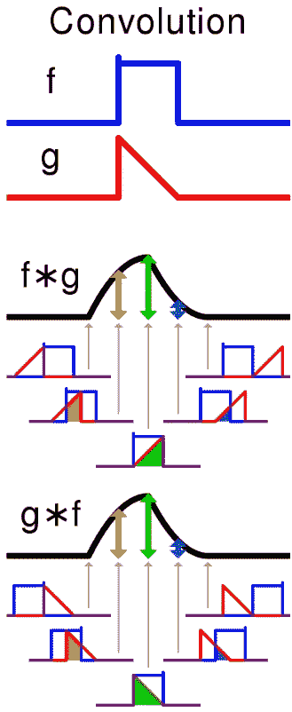
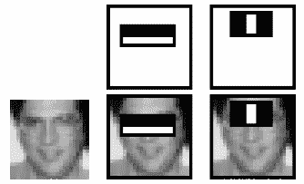
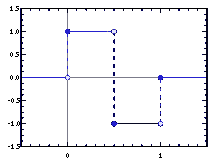
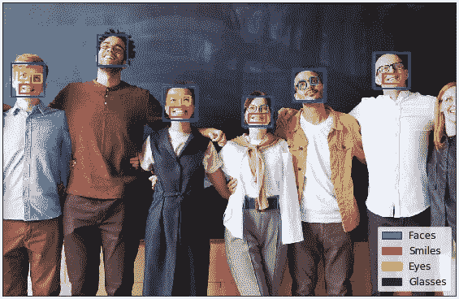
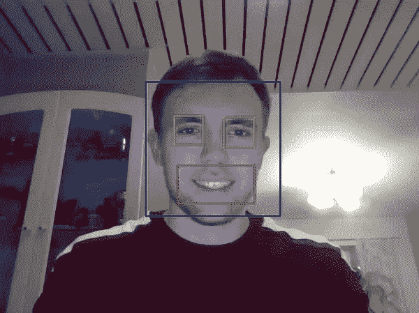

# Python 中 Haar 级联的目标检测

> 原文：<https://towardsdatascience.com/object-detection-with-haar-cascades-in-python-ad9e70ed50aa?source=collection_archive---------11----------------------->

## 计算机视觉演示

## OpenCV for Python 在一个易于使用的包中附带了一些高级工具，使用 Haar 级联的对象检测就是其中之一。我将大致解释它是什么，并介绍如何识别图像和视频中的面部特征。

# 理论课

我们将使用基于 Haar 特征的级联分类器来检测人脸、眼睛、微笑以及眼镜。该方法由 P. Viola 和 M. Jones 于 2001 年提出[1]。简而言之，它是一种机器学习方法，其中在大量的正负图像上训练所谓的级联函数(正的意思是它包括期望的对象，负的图像缺少它)，反过来可以用于对象检测。

为了实际解释它，我们引入了 Haar 特征的概念，它们是由下面充当卷积核的黑盒子和白盒子获得的。更具体地说，这些特征是通过从黑色矩形下的像素总和中减去白色矩形下的像素总和而接收的单个值。[2]

哈尔的特点[2]

如果你对卷积这个词感到不安，让我借助维基百科的一幅图片来简化它。它本质上是两种功能相互影响的结果。因此，在我们的例子中，它表示盒子的白色和黑色部分的像素的总和如何相互作用，即被区分以产生单个值。当然，还有一种算法可以有效地计算一个区域内像素的总和，它被称为总面积表，由 F. Crow 于 1984 年发表[3]。它后来在图像处理领域得到推广，并被命名为 integral image，但我在这里不会深入研究它。

卷积(来自维基百科的 Cmglee)

接下来，功能选择会像您想象的那样发生。您尝试不同的 Haar 特性，并查看哪一个特性能够产生黑白矩形之间像素总和的最大差值。我们下面有一个例子，其中发现了最佳的哈尔特征。眼睛通常有点暗，而下面的区域可能比较亮，因此一个上黑下白的水平矩形是合适的。第二，鼻梁通常比眼睛亮，因此中间有一个垂直的白色方框的哈尔特征是合适的。

图像的最佳哈尔特征[2]

Haar features 这个名字听起来有点奇怪，但它实际上源于与 Haar 小波的直观相似性，Haar 小波就是这些坏男孩:

它们没有被直接使用，但是这些特征(黑盒子和白盒子)是我们可以称之为 *Haar-like* 的东西，在这个意义上，你现在已经明白了。许多这些类似 Haar 的特征可以应用于图像，并使用 Adaboost 算法，该算法找到用于正确分类训练图像的最佳阈值。但是将其中的一个放在某个地方，即使放在可能的最佳位置，仍然会导致一些误差，因为正集和负集中的所有图像彼此不同。最后，选择错误率最小的哈尔特征作为分类器。

尽管采取了这些措施，但最终的特征数量可能相当大，因此发明人引入了分类器***级联的概念(现在我们已经得到了基于特征的级联分类器*的全称*)。这在进行检测时使用，因为用大量特征进行检测会很慢，相反，在检测时分类器由级联的特征组成。因此，最初的哈尔特征可能只是检查图像是否可能是人脸(在人脸检测的情况下)，然后接下来的阶段具有更多最基本的哈尔特征。这是一种有利的方法，因为早期不包含所需对象的图像被丢弃并且不再被处理。将这与一次将所有特征扔向图像进行比较，你会看到增益。[2]***

# **履行**

**到了我们用 Python 实现它的部分。如果你想在自己的机器上跟随或尝试任何酷的东西，它可以在 [GitHub 仓库](https://github.com/deinal/opencv-recognition-demo)或 [Google Colab](https://colab.research.google.com/drive/1H2XBOI31j4idgAqyY-brunwOlIajeFRt#scrollTo=KjxUh493oYf-) 中公开获得，尽管不幸的是，后者不能在视频中进行对象检测……无论如何，我们从做一些导入开始，所以我们都准备好了。**

**接下来，我们加载容易训练的对象分类器。我从 OpenCV 自己的仓库下载了它们，在这篇文章的底部还有一个链接，告诉你如何训练你自己的分类器来分类你家里的任何东西。**

**所以我想这是有趣的部分。首先，在灰度模式下进行分类，然后我们可以看看 detectMultiScale，它执行对象检测，并以矩形列表的形式返回它们。该方法可以接受一些参数，这些参数可以根据个人喜好进行调整。**

*   ****scaleFactor:** 指定在每个图像比例下图像尺寸缩小多少的参数。增加它会导致更快的检测，但有丢失一些对象的风险，而较小的值有时可能会太彻底。**
*   ****minNeighbors:** 参数，指定每个候选矩形应该有多少个邻居来保留它。较高的值导致较少的检测，但质量较高。**
*   ****最小尺寸:**可能的最小物体尺寸。小于该值的对象将被忽略。**
*   ****maxSize:** 最大可能的对象大小。大于该值的对象将被忽略。**

**我篡改了代码中的比例因子和最小邻居。例如，眼镜很难被检测到，可能是因为我使用的图片中的人是向上看的，这不像输入级联被训练的目的。因此，为了更精确，我降低了比例因子和最小邻居。除此之外，我发现了太多的微笑——所以我增加了这两个参数。**

**请注意，OpenCV 使用图像通道的 BGR 排序，而不是 RGB，所以如果你绘制任何东西，并以一些有趣的东西结束，你知道为什么。**

****

**当你的颜色通道顺序错误时(原始的，由 Pexels 的 fauxels 拍摄的更好的照片)**

**我们使用 *cv2 来考虑这一点。COLOR_BGR2RGB* 并绘制我们的对象检测结果。**

****

**脸部、眼睛和微笑现在都可以被检测到了**

**整洁不是吗？你可以看到眼镜检测远非理想。我们还注意到，正如理论课所预期的那样，分类器不适用于半张脸。为此，我们需要一个单独的分类器。**

**现在，继续我发现的更令人兴奋的事情。我们可以修改图像检测代码中的几行代码来对视频进行对象检测。我的意思是调用 *cap = cv2。VideoCapture(0)* 指的是网络摄像头。我们通过按 ESC 键退出视频，作为键码*键码。KEY _ ESCAPE = 27*for*OpenCV 的 cv2.waitKey()* 这是一个将显示一帧的毫秒数作为输入的函数。不要忘记用 *cap.release()* 和*cv2 . destroyallwindows()*释放并关闭最后的窗口。**

**如前所述，你可以通过克隆我的 [GitHub 库](https://github.com/deinal/opencv-recognition-demo)或者在 Google Colab 上尝试我所说的东西。然而， [Colab 笔记本](https://colab.research.google.com/drive/1H2XBOI31j4idgAqyY-brunwOlIajeFRt)不支持网络摄像头流式视频，但我确实找到了一种在 Colab 内部拍摄自己照片的方法，面部检测可以在上面进行。这仍然是它在运行时的样子。**

****

**我们可以看到，它确实很好地检测到了我的脸和眼睛，而且笑容应该很大，就像这个:D，这样它才能工作。否则可能会被误认为是眼睛。**

**最后，如果您想为自己唯一的对象训练一个分类文件，该怎么办？这相当简单，我们需要一组正匹配以及大量负匹配，其中不包括您的对象。这里是我发现的一个逐步操作指南:**

** [## 将数据集训练为 XML 文件，用于级联分类器 OpenCV

### 查找列车图像:

medium.com](https://medium.com/@toshyraf/train-dataset-to-xml-file-for-cascade-classifier-opencv-43a692b74bfe) 

现在一切都结束了，如果你愿意，在领英上和我联系，链接在我的个人资料里。祝你有愉快的一天！** 

**[1]: P. Viola 和 M. Jones，使用增强级联简单特征的快速目标检测(2001)**

**[2]:使用 Haar Cascades 进行人脸检测，[https://docs . opencv . org/3.4/D2/d99/tutorial _ js _ Face _ Detection . html](https://docs.opencv.org/3.4/d2/d99/tutorial_js_face_detection.html)**

**[3]: F. Crow，纹理映射的总面积表(1984)**