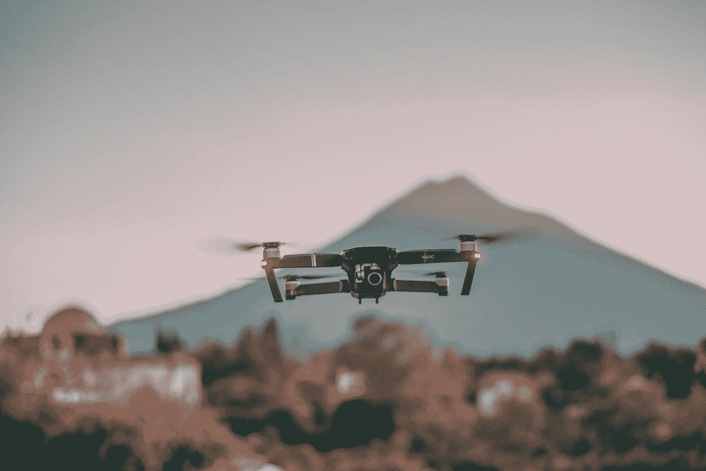
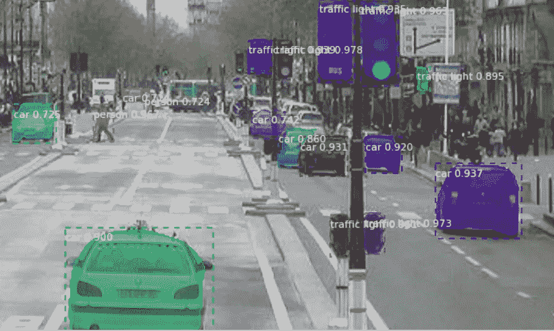
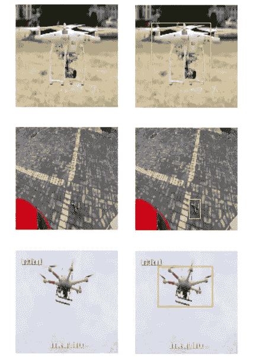
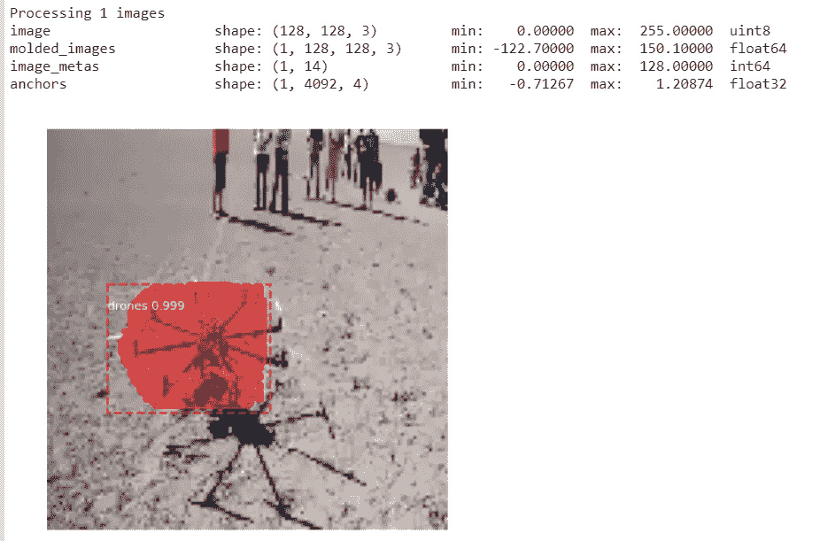

# 物体(无人机)探测:掩模 R-CNN 的逐步指南

> 原文：<https://towardsdatascience.com/object-drones-detection-step-by-step-guide-on-mask-r-cnn-7bec0fb09a1?source=collection_archive---------13----------------------->



米格尔·Á·安赫尔·埃尔南德斯在 [Unsplash](https://unsplash.com?utm_source=medium&utm_medium=referral) 上拍摄的照片

对象检测是一类计算机视觉，用于识别和定位图像中的对象。存在许多检测算法，这里的[是对它们的一个很好的总结。](https://medium.com/analytics-vidhya/beginners-guide-to-object-detection-algorithms-6620fb31c375)

掩模 R-CNN 是对象检测的扩展，因为它为图像中检测到的每个对象生成边界框和分段掩模。我最近不得不训练一个 Mask R-CNN 模型，并在尝试在我的自定义数据集上训练时遇到了一些障碍。即使有来自 [matterport](https://github.com/matterport/Mask_RCNN/blob/master/samples/shapes/train_shapes.ipynb) 的样品笔记本，由于兼容性和数据问题，实现也不是那么简单。因此，我决定写这篇关于使用 Mask R-CNN 训练自定义数据集的指南，并希望它能帮助你们简化这个过程。



[https://github.com/matterport/Mask_RCNN](https://github.com/matterport/Mask_RCNN)

对于本指南，我选择使用无人机数据集，您可以在这里下载。

## 首先—库和包

该算法的主要软件包是 mrcnn。从下载并导入库到您的环境中开始。

```
!pip install mrcnnfrom mrcnn.config import Config
from mrcnn import utils
import mrcnn.model as modellib
from mrcnn import visualize
from mrcnn.model import log
```

当我们到达那里时，我将解释每个导入的类。现在，只需要知道这些是我们需要的导入语句。

至于 TensorFlow，mrcnn 尚未与 TensorFlow 2.0 兼容，所以请确保您恢复到 TensorFlow 1.x。因为我是在 Colab 上开发的，所以我将使用 magic 函数恢复到 TensorFlow 1.x。

```
%tensorflow_version 1.x
import tensorflow as tf
```

如果我没看错，在 TensorFlow 2.0 中 tf.random_shuffle 被重命名为 tf.random.shuffle，导致了不兼容问题。通过更改 mrcnn 代码中的 shuffle 函数，您可能能够使用 TensorFlow 2.0。

我也不得不把我的 Keras 恢复到以前的版本，但是我不记得原因了。只是把它放在那里，以防你遇到一些错误，由于 Keras。

```
!pip install keras==2.2.5
```

## 预处理

mrcnn 包在其接受的数据格式方面相当灵活。因此，由于它的简单性，我将处理成 NumPy 数组。

在此之前，我意识到视频 17_295 和视频 19_1900 不能被 cv2 正常读取。因此，我过滤掉这些图像，并创建了一个文件名列表。

```
dir = "Database1/"# filter out image that cant be read
prob_list = ['video17_295','video19_1900'] # cant read format
txt_list = [f for f in os.listdir(dir) if f.endswith(".txt") and f[:-4] not in prob_list]
file_list = set([re.match("\w+(?=.)",f)[0] for f in txt_list])# create data list as tuple of (jpeg,txt)
data_list = []
for f in file_list:
    data_list.append((f+".JPEG",f+".txt"))
```

接下来要做的事情很少；

1.  检查标签是否存在(一些图像不包含无人机)
2.  读取和处理图像
3.  读取并处理边界框的坐标
4.  出于可视化目的，绘制边界框

```
X,y = [], []
img_box = []
DIMENSION = 128 # set low resolution to decrease training timefor i in range(len(data_list)):
    # get bounding box and check if label exist
    with open(dir+data_list[i][1],"rb") as f:
    box = f.read().split()
    if len(box) != 5: 
        continue # skip data if does not contain labelbox = [float(s) for s in box[1:]]# read imageimg = cv2.imread(dir+data_list[i][0])
    img = cv2.cvtColor(img,cv2.COLOR_BGR2RGB)# resize img to 128 x 128
    img = cv2.resize(img, (DIMENSION,DIMENSION), interpolation= cv2.INTER_LINEAR)# draw bounding box (for visualization purposes)
    resize1, resize2 = img.shape[0]/DIMENSION, img.shape[1]/DIMENSION
    p1,p2,p3,p4 = int(box[0]*img.shape[1]*resize2), int(box[1]*img.shape[0]*resize1) ,int(box[2]*img.shape[1]*resize2) ,int(box[3]*img.shape[0]*resize1)ymin, ymax, xmin, xmax = p2-p4//2, p2+p4//2, p1-p3//2, p1+p3//2draw = cv2.rectangle(img.copy(),(xmax,ymax),(xmin,ymin),color=(255,255,0),thickness =1)# store data if range of y is at least 20 pixels (remove data with small drones)
    if ymax - ymin >=20:
        X.append(img)
        y.append([ymin, ymax, xmin, xmax])
        img_box.append(draw)# convert to numpy arraysX = np.array(X).astype(np.uint8)
y = np.array(y)
img_box = np.array(img_box)
```

在转换为 NumPy 数组之前，我获取了数据集的一个子群体，以减少训练时间。如果你有计算能力，可以忽略它。

这里有一些样本图像。



## MRCNN —处理

现在来看看 mrcnn 本身，我们需要在训练过程之前定义一个 mrcnn 数据集类。这个数据集类提供图像的信息，例如图像所属的类以及图像中对象的位置。我们之前导入的 mrcnn.utils 包含这个数据集类。

这就是事情变得有点棘手的地方，需要对[源代码](https://github.com/matterport/Mask_RCNN/blob/master/mrcnn/utils.py)进行一些解读。

这些是你需要修改的函数；

1.  add_class，它决定了模型的类的数量
2.  add_image，您可以在其中定义 image_id 和图像路径(如果适用)
3.  load_image，加载图像数据的地方
4.  load_mask，它获取关于图像的遮罩/边界框的信息

```
# define drones dataset using mrcnn utils classclass DronesDataset(utils.Dataset):
    def __init__(self,X,y): # init with numpy X,y
        self.X = X
        self.y = y
        super().__init__()def load_dataset(self):
        self.add_class("dataset",1,"drones") # only 1 class, drones
        for i in range(len(self.X)):
            self.add_image("dataset",i,path=None)def load_image(self,image_id):
        image = self.X[image_id] # where image_id is index of X
        return imagedef load_mask(self,image_id):
    # get details of image
    info = self.image_info[image_id]
    #create one array for all masks, each on a different channel
    masks = np.zeros([128, 128, len(self.X)], dtype='uint8')class_ids = []
    for i in range(len(self.y)):
        box = self.y[info["id"]]
        row_s, row_e = box[0], box[1]
        col_s, col_e = box[2], box[3]
        masks[row_s:row_e, col_s:col_e, i] = 1 # create mask with similar boundaries as bounding box
        class_ids.append(1)return masks, np.array(class_ids).astype(np.uint8)
```

因为我们努力将图像格式化成 NumPy 数组，所以我们可以简单地用数组初始化 Dataset 类，并通过索引数组来加载图像和边界框。

接下来做一个传统方式的火车测试，

```
# train test split 80:20np.random.seed(42) # for reproducibility
p = np.random.permutation(len(X))
X = X[p].copy()
y = y[p].copy()split = int(0.8 * len(X))X_train = X[:split]
y_train = y[:split]X_val = X[split:]
y_val = y[split:]
```

现在将数据加载到数据集类中。

```
# load dataset into mrcnn dataset classtrain_dataset = DronesDataset(X_train,y_train)
train_dataset.load_dataset()
train_dataset.prepare()val_dataset = DronesDataset(X_val,y_val)
val_dataset.load_dataset()
val_dataset.prepare()
```

prepare()函数使用 image_ids 和 class_ids 信息为 mrcnn 模型准备数据，

接下来是我们从 mrcnn 导入的 config 类的修改。Config 类决定了训练中使用的变量，应该根据数据集进行调整。以下这些变量并不详尽，您可以参考[文档](https://github.com/matterport/Mask_RCNN/blob/master/mrcnn/config.py)获得完整列表。

```
class DronesConfig(Config):
    # Give the configuration a recognizable name
    NAME = "drones"# Train on 1 GPU and 2 images per GPU.
    GPU_COUNT = 1
    IMAGES_PER_GPU = 2# Number of classes (including background)
    NUM_CLASSES = 1+1  # background + drones# Use small images for faster training. 
    IMAGE_MIN_DIM = 128
    IMAGE_MAX_DIM = 128# Reduce training ROIs per image because the images are small and have few objects.
    TRAIN_ROIS_PER_IMAGE = 20# Use smaller anchors because our image and objects are small
    RPN_ANCHOR_SCALES = (8, 16, 32, 64, 128)  # anchor side in pixels# set appropriate step per epoch and validation step
    STEPS_PER_EPOCH = len(X_train)//(GPU_COUNT*IMAGES_PER_GPU)
    VALIDATION_STEPS = len(X_val)//(GPU_COUNT*IMAGES_PER_GPU)# Skip detections with < 70% confidence
    DETECTION_MIN_CONFIDENCE = 0.7config = DronesConfig()
config.display()
```

根据您的计算能力，您可能需要相应地调整这些变量。否则，你将面临卡在“Epoch 1”而没有给出错误信息的问题。甚至有一个 [GitHub 问题](https://github.com/matterport/Mask_RCNN/issues/287)针对这个问题提出，并提出了许多解决方案。如果这种情况发生在你身上，一定要检查一下，并测试其中的一些建议。

## MRCNN —培训

mrcnn 已经在 [COCO](http://cocodataset.org/#home) 和 I [mageNet](http://www.image-net.org/) 数据集上进行了训练。为了将这些预先训练好的权重用于迁移学习，我们需要将其下载到我们的环境中(记得首先定义您的 ROOT_DIR)。

```
*# Local path to trained weights file*
COCO_MODEL_PATH = os.path.join(ROOT_DIR, "mask_rcnn_coco.h5")*# Download COCO trained weights from Releases if needed*
**if** **not** os.path.exists(COCO_MODEL_PATH):
    utils.download_trained_weights(COCO_MODEL_PATH)
```

创建模型并以预训练的权重开始。

```
# Create model in training mode using gpuwith tf.device("/gpu:0"):
    model = modellib.MaskRCNN(mode="training", config=config,model_dir=MODEL_DIR)*# Which weights to start with?*
init_with = "imagenet"  *# imagenet, coco***if** init_with == "imagenet":
    model.load_weights(model.get_imagenet_weights(), by_name=**True**)
**elif** init_with == "coco":
    *# Load weights trained on MS COCO, but skip layers that*
    *# are different due to the different number of classes*
    *# See README for instructions to download the COCO weights*
    model.load_weights(COCO_MODEL_PATH, by_name=**True**,exclude=["mrcnn_class_logits", "mrcnn_bbox_fc", "mrcnn_bbox", "mrcnn_mask"])
```

最后，我们可以开始实际训练了。

```
model.train(train_dataset, val_dataset,learning_rate=config.LEARNING_RATE,epochs=5,layers='heads') # unfreeze head and just train on last layer
```

对于本练习，我将只训练最后一层来检测我们数据集中的无人机。如果时间允许，您还应该通过训练所有前面的层来微调您的模型。

```
model.train(train_dataset, val_dataset, 
            learning_rate=config.LEARNING_RATE / 10,
            epochs=2, 
            layers="all")
```

你已经完成了 mrcnn 模型的训练。您可以用这两行代码保存模型的权重。

```
# save weights
model_path = os.path.join(MODEL_DIR, "mask_rcnn_drones.h5")
model.keras_model.save_weights(model_path)
```

## MRCNN —推理

要对其他图像进行推理，您需要创建一个带有自定义配置的新推理模型。

```
# make inferenceclass InferenceConfig(DronesConfig):
    GPU_COUNT = 1
    IMAGES_PER_GPU = 1inference_config = InferenceConfig()# Recreate the model in inference mode
model = modellib.MaskRCNN(mode="inference",config=inference_config, model_dir=MODEL_DIR)# Load trained weightsmodel_path = os.path.join(MODEL_DIR, "mask_rcnn_drones.h5")
model.load_weights(model_path, by_name=True)
```

mrcnn 的 visualize 类在这里派上了用场。

```
def get_ax(rows=1, cols=1, size=8):
    _, ax = plt.subplots(rows, cols, figsize=(size*cols, size*rows))return ax# Test on a random image
image_id = random.choice(val_dataset.image_ids)
original_image, image_meta, gt_class_id, gt_bbox, gt_mask =\
modellib.load_image_gt(val_dataset, inference_config,image_id, use_mini_mask=False)results = model.detect([original_image], verbose=1)
r = results[0]visualize.display_instances(original_image, r['rois'], r['masks'], r['class_ids'],val_dataset.class_names, r['scores'], ax=get_ax())
```



恭喜你，你已经用自定义数据集训练了一个 mrcnn 模型。拍拍自己的背，因为这不是一件容易的事。如您所见，掩蔽对我们的数据集来说并不完美，因为我们没有掩蔽数据。在这样的模型上测试一下，你会得到更好的结果。

快乐学习。