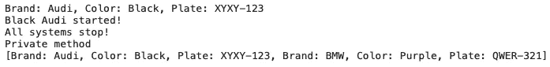
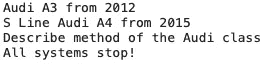
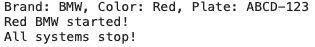

# 使用 Python 进行面向对象编程——您需要知道的一切

> 原文：<https://towardsdatascience.com/object-orientated-programming-with-python-everything-you-need-to-know-cb0ada963756?source=collection_archive---------27----------------------->

## 在 10 分钟内掌握最流行的编程范式的概念。

面向对象编程并不是一个新概念。它由 Alan Kay 在 20 世纪 60 年代引入，但直到 20 世纪 90 年代才成为主流(感谢 C++)。今天我们将通过 Python 编程语言来了解 OOP 的基础知识。

照片由[丹金](https://unsplash.com/@danielcgold?utm_source=unsplash&utm_medium=referral&utm_content=creditCopyText)在 [Unsplash](https://unsplash.com/s/photos/car?utm_source=unsplash&utm_medium=referral&utm_content=creditCopyText) 上拍摄

不想看书？看看我关于这个主题的视频:

在一篇文章中不可能涵盖 OOP 的所有内容。整本书都是关于这个主题的，但是我们将使用 80:20 原则来涵盖你每天在 20%的时间里使用的 80%的东西。

这篇文章的结构如下:

*   OOP 是什么？
*   类别和对象
*   构造器
*   类方法
*   遗产
*   结论

# OOP 是什么？

面向对象编程不是特定于语言的。它是许多语言中使用的编程范式，比如 *Python* 、 *Java* 、 *C#* 等等。OOP 技能是可以转移的——所以学习 Python 中的概念会让你在其他语言中变得熟练，如果我们不考虑语法差异的话。

OOP 就是从类中创建对象。一个类包含许多以某种方式相关的字段和方法。类被用作创建对象的蓝图。

例如，您可以声明一个*客户*类，并使用它来创建许多*客户*对象。在这种情况下， *Customer* 类是创建单个客户的蓝图。并非所有的客户都是平等的，但是都可以用相同的字段来描述，比如年龄、性别、成员类型等等。

OOP 的目标是在代码中实现真实世界的实体。你可以用 OOP 来建模你生活中的任何东西。比如你每天都和人打交道。即使人与人不同，但他们仍然只是人。用面向对象的术语来说，你可以用一个类来建模人，并用不同的属性创建尽可能多的实例。

但是这个例子对于今天来说太复杂了。相反，我们将用**汽车**来探索 OOP 概念。接下来让我们看看类和对象在实践中是如何工作的。

# 类别和对象

把类想象成你自己的数据类型。Python 中有内置的数据类型，比如列表和字符串，但这些对于更高级的用例来说还不够。

在 Python 中，类是通过在关键字`class`后面加上类名和冒号来定义的。类名是任意的，但是将它写在一个**标题案例**中是一个好的实践。比如写`MyPythonClass`而不是`myPythonClass`或者`my_python_class`。

一旦声明了类，就可以根据需要创建任意多个实例。让我们来看一个例子:

在上面的例子中，我们创建了一个空的`Car`类。下面，我们制作了它的一个实例(存储在变量`car`中)并打印结果。默认情况下，只有内存地址被打印到控制台:`<__main__.Car object at 0x7fda5cefb3d0>`。

这个空类几乎没有用，所以让我们开始向它添加东西。我们将从构造函数开始。

# 构造器

类构造函数只有一个目标:在创建对象时给类变量赋值。

我们在这里研究汽车，所以花点时间想想每辆车的共同点是个好主意。对于我们的例子，三个属性就足够了——汽车*品牌*、*颜色*和*车牌*。

汽车的属性必须在`__init__()`方法内部。这个方法也被称为*初始化器*或*构造器*——所以请记住这些是同义词。每当创建一个对象时，就会立即调用`__init__()`方法。

构造函数的第一个参数必须是`self`。它是一个关键字，负责将传递的值分配给类变量。在 Java 等其他编程语言中，它被命名为`this`。

现在让我们看看如何添加具有上述三个属性的构造函数，以及如何创建一个实例:

这就是你要记住的一般语法。在创建实例时，您可以看到现在需要三个参数，不提供它们会导致错误。print 语句仍然输出一个内存地址，但这是意料之中的。

我们的课还是很无聊。幸运的是，我们有办法增加趣味。接下来就让我们来探究一下。

# 类方法

最简单地说，方法是用来描述对象行为的函数。至少，涵盖您可以用方法做的所有事情需要一整篇文章，所以让我们坚持 80:20 原则。

本节涵盖常规、静态、私有和特殊方法。术语 *private* 在 Python 中是有争议的，因为没有相应的关键字，就像 Java 一样。

您可以像声明任何其他函数一样声明**常规方法**，用一个`def`关键字后跟方法名和参数列表。常规方法必须包含`self`作为第一个参数。

另一方面，**静态方法**不会。它和常规方法完全一样，但是我们需要在声明上面放一个`@staticmethod`装饰器。

**私有方法**和常规方法非常相似。惯例是在方法名前使用下划线。这不会使方法成为私有的，因为您仍然可以从外部访问它。下划线是告诉其他开发人员不应该显式使用该方法，也不应该修改其功能的一种方式。

最后但同样重要的是，我们有**特殊方法**。这些修改了类的原始行为。例如，我们可以用`__str__`方法修改输出(注意双下划线)，而不是每次打印实例时都输出内存地址。当处理一个对象数组时，用`__repr__`方法修改打印行为。还有很多，但这两个将让你开始。

下面的代码片段演示了每种类型的方法以及如何调用它:

下面是相应的输出:

图片 Car 类方法的探索(图片由作者提供)

接下来，让我们讨论继承。

# 遗产

继承是 OOP 的一个重要支柱。因此，一个类可以继承另一个类的属性和方法。其属性和方法被继承的类称为*父类*。类似地，继承的类被称为*子类*。

打个车的比方，你可以这样想:*每辆奥迪都是车，但不是所有的车都是奥迪*。Audi 是一个子类，继承了 car 类的基本属性和方法。

为了使继承有效，您必须将您继承的类的名称放在子类名称后面的括号中。让我们来看一个例子:

以下是输出结果:

图 2——继承在行动(作者图片)

`describe`方法是新的，并且特定于`Audi`类。我们已经覆盖了`__str__`方法，正如您在前两条 print 语句中看到的。由于继承的原因，我们可以在`Audi`类内部使用`Car`类中的`stop`方法。

像这样构建类是有限的。我们还需要别的东西。例如，在`Audi`类中，我们不能访问`start`方法，因为它需要`Audi`类没有的字段。`super()`关键词来拯救。

在构造函数中调用`super()`调用父类的构造函数，让我们可以访问里面的一切。让我们来看一个例子:

以下是输出结果:

图 3-继承和超级关键字(作者图片)

如您所见，`BMW`类没有任何方法，但可以从其父类访问任何内容。

# 离别赠言

这就是你所拥有的 Python 面向对象编程的基础。这是一个相对简短的指南，介绍了基本的 OOP 概念，并附有示例。我希望你已经理解了，并且现在概念已经很清楚了。

你今天学到的一切足以让你开始。OOP 范例可以用于所有类型的项目。我喜欢以这种方式进行机器学习，并扩展内置预测算法的功能。

感谢阅读。

## 加入我的私人邮件列表，获取更多有用的见解。

*喜欢这篇文章吗？成为* [*中等会员*](https://medium.com/@radecicdario/membership) *继续无限制学习。如果你使用下面的链接，我会收到你的一部分会员费，不需要你额外付费。*

 [## 通过我的推荐链接加入 Medium-Dario rade ci

### 作为一个媒体会员，你的会员费的一部分会给你阅读的作家，你可以完全接触到每一个故事…

medium.com](https://medium.com/@radecicdario/membership) 

*原载于 2020 年 11 月 16 日*[*https://betterdatascience.com*](https://betterdatascience.com/object-orientated-programming-with-python/)T22。