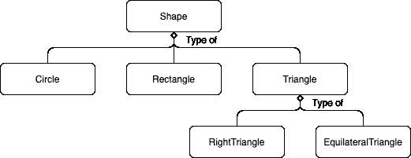

# 面向对象编程:实用介绍(第二部分)

> 原文：<https://towardsdatascience.com/object-oriented-programming-a-practical-introduction-part-2-f376bc25f839?source=collection_archive---------53----------------------->


凯利·麦克林托克

在本系列的第 1 部分中，您看到了一些如何使用面向对象编程(OOP)来帮助您解决一些代码设计问题的实际例子。如果你错过了，就在这里:

[](/object-oriented-programming-a-practical-introduction-part-1-a6755b9cee72) [## 面向对象编程:实用介绍(第一部分)

### 面向对象编程是现代软件工程工具箱中的一个主要部分。这篇文章给出了一个温柔的…

towardsdatascience.com](/object-oriented-programming-a-practical-introduction-part-1-a6755b9cee72) 

好吧，我们开始吧。

# 变得技术化

面向对象的语言看起来令人生畏。您已经在第 1 部分的示例中看到了一些这种语言，但是让我们把它变得更具体一些。首先，让我们从最基本的问题开始:一个`class`和一个`object`之间有什么区别？

*   **类** —给定结构可用的数据和程序的*定义*。换句话说，一个类定义了它引用什么数据，以及什么过程(方法)可以用在这些数据上。
*   **对象** —类的具体*实例*。例如，在上面的例子中，你*定义了*类`Rectangle`，并实例化了这个类以产生一个`Rectangle`对象(例如`Rectangle(10, 5)`)。

`class`方法和变量与`instance`方法和变量之间也有一些重要的区别，它们会对代码的行为产生影响:

*   **实例变量—** 这些是“属于”一个类的每个实例的数据元素(即对象，例如`Rectangle`类上的`length`和`width`变量)。
*   **类变量**——这些是“属于”一个类的所有实例的数据元素——该类的所有*实例都有一个副本。*

为了澄清这一点，我们来看看两者之间的区别:

```
class NewCircle(Shape): 
    pi = math.pi     def __init__(self, radius: float) -> None: 
        self.radius = radius     def area(self) -> float: 
        return self.pi * self.radius ** 2
```

在这种情况下，`pi`是一个*类变量*，而`radius`是一个*实例*变量。实际上，`pi`是由所有类共享的，所以如果你这样做:

```
a, b = NewCircle(1), NewCircle(1) 
print(a.area(), b.area()) # 3.141592653589793 3.141592653589793 NewCircle.pi = 3.14 # this changes `pi` on both `a` and `b`. print(a.area(), b.area()) # 3.14 3.14
```

你会看到用`NewCircle.pi`更新类变量改变了*和*两个圆的面积，而:

```
a, b = NewCircle(1), NewCircle(1) 
print(a.area(), b.area()) # 3.141592653589793 3.141592653589793 
a.pi = 3 # update only the copy of `pi` on the instance `a`. print(a.area(), b.area()) # 3 3.141592653589793
```

*只会在属于这个类的`a`实例的`pi`的副本上*修改`pi`。

对数据操作*的*方法—* 事物*怎么样？正如你在[第 1 部分](https://mark.douthwaite.io/object-oriented-programming-a-whistlestop-tour/)中看到的，方法可以被认为是一个类的成员(即“属于”)的函数。有两个特别重要的例子反映了上面的变量定义:**

*   ***实例方法** —很像*实例变量*，实例*方法*‘属于’个别对象。这些方法可以访问*封装的数据和方法*成为对象，包括其他方法、实例变量和类变量。*
*   ***类方法—** 相比之下，类*方法*是对一个类的所有实例都可用的方法，但是只能访问该类的其他类方法和类实例。*

*Python 支持类方法(以及一些其他种类的方法)，但是理解它们在 Python 中的使用需要对一些中级 Python 语言特性(包括 [*装饰器*](https://www.python.org/dev/peps/pep-0318/) )有扎实的理解，所以关于这些的示例和讨论将留到以后的文章中。*

*现在正式介绍 OOP 的一些更大的概念。*

# *包装*

*在第 1 部分的例子中，你看到了`Rectangle`类的定义。概括来说，您有:*

```
*class Rectangle(Shape): 
    def __init__(self, length: float, width: float) -> None: 
        self.length = length 
        self.width = width     def area(self) -> float: 
        return self.length * self.width     def perimeter(self) -> float: 
        return (self.length + self.width) * 2.0*
```

*在 OOP 中，*封装*指的是将数据和函数(方法)捆绑成一个单一的结构(一个类)。实际上，封装用于隐藏对象的状态。这种信息隐藏的一部分包括定义如何访问特定的变量和方法，以限制误用并确保稳定性。这就是某些语言中使用的*公共*、*受保护*和*私有*‘访问修饰符’概念的由来。让我们来看看这意味着什么。*

*在这里的例子中，`Rectangle`中的所有实例变量和方法都可以描述为 *public -* 它们对于与任何`Rectangle`实例交互的任何代码都是“可见的”(可访问的)。然而，如果您决定不希望您的用户在实例化了一个`Rectangle`之后干扰`length`和`width`实例变量*，会发生什么呢？一种方法是将你的变量和方法*保护起来*或者*私有*。这将防止(或者在 Python 中某些情况下*阻止*直接使用`Rectangle`的人访问`length`和`width`。具体地说，您可以将一个类的成员定义为具有三种访问级别之一:**

*   ***Public** —对任何使用该类的代码可见。*
*   ***Protected** —仅对定义该成员的类以及该类的所有子类可见。*
*   ***私有—** 仅对定义成员的类可见。*

*同样，其他语言也可以有额外的访问([或非访问](https://www.w3schools.com/java/java_modifiers.asp))修饰符。这在 Python 中是如何工作的？下面是上述`Rectangle`片段的修改版本:*

```
*class Rectangle(Shape): 
    def __init__(self, length: float, width: float) -> None: 
         self._length = length 
         self.__width = width     def area(self) -> float: 
         return self._length * self.__width 

    def perimeter(self) -> float: 
         return (self._length + self.__width) * 2.0*
```

*这个代码片段[遵循 Python 约定](https://www.python.org/dev/peps/pep-0008/#designing-for-inheritance)，现在表明`_length`实例变量是一个受保护的成员(即可以被子类访问)并且`__width`是一个*私有*成员(即只能被`Rectangle`访问)。这表明如果您要创建`class Square(Rectangle)`，这个新类根本不能使用`width`变量。*

*另外，你不应该在`Rectangle`的实例上访问变量`_length`(例如`Rectangle(10, 5)._length`)。如果你正在使用棉绒，你会注意到如果你试图违反这些规则，它会给你警告。此外，虽然 Python 不以传统方式强制*保护的*或*私有的*成员，但是许多语言都这样做，并且控制对所述成员的访问的能力(即使在 Python 的更有限的方法中)可能是一个有用的设计特性。*

*例如，将计算中的中间步骤分解成不同的*受保护的*方法是有用的，但是只公开一个*公共*方法供用户使用。换句话说:*隐藏终端用户不应该访问的*实现细节，只暴露那些他们*应该*访问的细节。*

*因此，只让方法*的最小子集成为公共方法*通常是个好主意(或者相反，你应该默认让变量和方法*成为受保护的*，除非你有特定的理由让它们成为公共的)。这有助于保持用户与类交互的方式尽可能的窄，这反过来减少了您向他们展示的 API 的“表面区域”,这通常会减少支持和维护该 API 所需的开发工作。*

# *多态性*

*让我们再一次回顾第 1 部分中重构的`Shape`示例:*

```
*class Shape: 
    def area(self) -> float: ... class Rectangle(Shape): 
    def __init__(self, length: float, width: float) -> None: ... def area(self) -> float: ... class Triangle(Shape): 
    def __init__(self, base: float, height: float) -> None: ... def area(self) -> float: ... shapes = [Rectangle(5, 10), Triangle(1, 2)] area = 0 for shape in shapes: 
    area += shape.area()*
```

*这个片段捕获了与*多态性*概念相关的一些关键思想。技术上，多态是指不同*类型*的对象可以公开一个*单个*接口的概念。在这里的示例代码中，`Rectangle`和`Triangle`都公开了相同的方法，因此调用这些方法的代码*可以与它所操作的对象的*类型*无关。换句话说，你在列表`shapes`上的循环只需要保证它所操作的对象实现了`Shape`接口，如果它们实现了，那么它总是工作得很好。**

*这是一个非常强大的概念。如果使用得当，它允许您构建干净的、可扩展的 API，这些 API 易于使用且易于调试。这个特定的概念被用作许多流行框架的基础:公开的接口捕获一个领域或问题的模型，然后您可以与它交互或扩展它。*

*具体来说，以一个流行的机器学习(ML)库为例，比如 [Scikit-Learn](https://scikit-learn.org/stable/) 。如果你曾经使用过这个库，你无疑会熟悉描述库中模型特征的经典`fit`和`predict`方法(以及其他方法)。这个接口简单明了——如果有时有限制(通过定义什么东西*是*，你也最终定义了什么东西*不是*),并且允许用户构建利用它的 ML 管道，而不用担心管道使用的特定模型变量(事实上，这正是 [Scikit-Learn Pipelines](https://scikit-learn.org/stable/modules/generated/sklearn.pipeline.Pipeline.html) 所做的！).*

> **…通过定义什么东西* **是** *，你也经常最终定义什么东西* **不是**，毕竟*。**

*因此，其他提供者可以实现他们自己的符合该接口的模型版本，这些版本又可以立即用于任何使用 Scikit-Learn 模型的管道设置中。您可能还记得其他流行的库，如 [LightGBM](https://lightgbm.readthedocs.io/en/latest/Python-API.html#scikit-learn-api) 、 [XGBoost](https://xgboost.readthedocs.io/en/latest/python/python_api.html#module-xgboost.sklearn) 和 [Tensorflow](https://www.tensorflow.org/api_docs/python/tf/keras/wrappers/scikit_learn) 提供了 Scikit-Learn 兼容的接口。这是为什么存在如此活跃的 Scikit-Learn 兼容工具生态系统的部分原因，也是为什么从工程角度来看这个事实如此有用(和重要):它帮助您将您实际使用 a 模型所做的事情的逻辑与特定模型变体的实现细节分开。这(部分)是通过多态性实现的。*

*如果你对更正式地理解各种形式的多态性背后的思想感兴趣，你可能会发现阅读与[相关的思想](https://ocw.mit.edu/courses/electrical-engineering-and-computer-science/6-088-introduction-to-c-memory-management-and-c-object-oriented-programming-january-iap-2010/lecture-notes/MIT6_088IAP10_lec05.pdf)，包括[利斯科夫替代原理](https://ocw.mit.edu/courses/electrical-engineering-and-computer-science/6-088-introduction-to-c-memory-management-and-c-object-oriented-programming-january-iap-2010/lecture-notes/MIT6_088IAP10_lec06.pdf)，会很有帮助。此外，多态性有时会被误认为是 OOP 本身的一个特定方面。相反，它是一个更通用的编程概念，并且可以在各种形式的许多不同范例中找到变体，包括函数式编程(另一个杰出的编程范例)。*

# *遗产*

*OOP 的第三个主要特征是*继承。*这里的关键思想是继承允许你表达类之间的“是一种类型”的关系。例如，在[第 1 部分](https://mark.douthwaite.io/object-oriented-programming-a-whistlestop-tour/)中看到的`Shape`示例中，您可以将关系`class Triangle(Shape)`表达为:`Triangle` *是* `Shape`的一种类型。同样，你可以把`class RightTriangle(Triangle)`表达为:`RightTriangle` *是* `Triangle`的一种。然后，您可能会开始看到您正在构建一个类的层次结构。在这个简单的例子中，您会看到这样的内容:*

**

*这种层次结构中的“根节点”(即本例中的`Shape`)通常被称为*基类*。这些类是抽象的*也是很常见的:它们不指定自己的实现，而是定义一个接口(也许是部分实现)。抽象类不是设计来直接实例化的:*它是设计来子类化的*。许多语言积极地强调这一事实，并阻止你试图直接实例化一个抽象类。[这种行为也可以在 Python 中实现](https://docs.python.org/3/library/abc.html)。在这些类上定义的不提供实现的方法(如示例中的`area`)被称为*抽象方法*(或者在某些语言/上下文中等同于*虚拟方法*)。**

**为了更具体一点，抽象类可以定义为:**

*   ****抽象类** —具有一个或多个抽象方法的类。**

**那么为什么*这个*有用呢？继承(理论上)使您能够轻松地扩展和修改类，从而可以更容易地向代码中添加特性和功能。以上面的例子为例:你看到了`Triangle`类是如何被扩展的，在两种新类型的`Triangle`上快速方便地实现一个新方法`perimeter`，而不需要“接触”父`Triangle`类。**

**您可能会看到如何在业务环境中使用它:您可以选择捕获不同类型的客户、交易或其他业务实体作为一个类层次结构，然后使用您在多态中看到的思想创建一些好的通用业务逻辑来操作这些不同类型的对象。你当然应该探索这个想法，但要谨慎行事。**

# **深入挖掘**

**这篇文章实际上只是触及了 OOP 的皮毛:它是一个很大的领域，有大量的工具、思想和实现来支撑它在现代软件项目中的使用。如果你选择深入 OOP 的世界，你会发现某些血统的语言(例如 C++，Java)之间有很多相似之处，也有一些区别。一些语言和工具有意采用了这里讨论的特性的特定子集，而其他语言和工具也实现了更复杂的版本。如果你花时间学习这些思想——特别是跨语言的*来帮助你比较和对比思想和方法——你会发现 OOP 是你编程工具箱中的一个无价工具。然而…***

## **一句警告**

**到目前为止，你已经看到了 OOP 如何被用来*帮助*你构建和解决问题。在有经验的人看来，这是一个强有力的工具。然而，当不加选择地使用时，OOP 可能会成为*的问题*。不恰当/过度地使用 OOP 概念和能力很容易对你不利。正如在学习新知识和新技能时的情况一样，对于不熟悉 OOP 概念的人来说，落入“锤子定律”设置的陷阱是很常见的:当你有一把锤子时，一切看起来都像钉子。**

> ***…对于不熟悉 OOP 概念的人来说，落入“锤子定律”的陷阱是很常见的:当你有一把锤子时，一切看起来都像钉子。***

**实际上，你在上面看到的封装、多态和继承的完全相同的特性会*增加*复杂性，并且*阻碍*你的代码的调试、性能和维护，如果你不小心和没有预先考虑就使用它们的话。例如，过度复杂和/或设计不良的类层次结构是开发团队最终陷入困境的常见方式——他们的类层次结构可能会变成难以推理和技术上难以扩展的大型复杂结构。**

**与任何技能一样，理解何时以及如何应用 OOP 概念来自实践，坦率地说，来自偶尔的失败。您将使一些代码变得不必要的复杂和笨拙。你很可能会打碎东西。最终，你需要将 OOP 的思想应用到你自己的问题中几次，然后你才能感觉到什么可行，什么不可行。此外，对概念的“纯粹”技术理解是不够的:当你开始一个新项目(或加入一个现有项目)时，你需要记住后退一步，思考更大的图景，以及如何最好地使用可用的工具。**

# **结束语**

**正如您所看到的，OOP 提供的概念和 OO 语言特性的具体实现可以帮助您设计和实现代码，以非常优雅的方式运行。然而，从某种意义上来说，它们并没有增加任何“新”东西:你可以编写代码来解决你可能面临的任何问题，而不需要*去使用 OOP 提供的工具。也就是说，*明智地*使用面向对象的思想可能会让你成为一个更加*高效的*程序员，并且可能会让别人更容易*采用*和*重用*你的代码。此外，很好地掌握 OOP 还将帮助你更好地理解和推理许多流行软件框架的行为和设计。***

> *很好地掌握 OOP 也将帮助你更好地理解和推理许多流行软件框架的行为和设计。*

*和往常一样，知道何时使用特定的工具(并准备好工具等待使用)是一项需要培养的宝贵技能。重要的是，你要尝试和思考如何以及在哪里将面向对象的思想应用到你自己的工作中。例如，如果您确定您正在编写一个一次性问题的解决方案，那么创建一个复杂的类层次结构很可能会过度设计您的解决方案*和*，产生比它解决的问题更多的问题。然而，如果你开始一个你知道会被广泛使用和扩展的项目，它可能*真的*会有回报。*

# *进一步阅读*

*[](https://ocw.mit.edu/courses/electrical-engineering-and-computer-science/) [## 电气工程和计算机科学

### 麻省理工学院的电子工程和计算机科学系的毕业生工作在不同的行业和进行…

ocw.mit.edu](https://ocw.mit.edu/courses/electrical-engineering-and-computer-science/) [](https://www.python.org/dev/peps/pep-0008/#designing-for-inheritance) [## PEP 8 风格的 Python 代码指南

### Python 编程语言的官方主页

www.python.org](https://www.python.org/dev/peps/pep-0008/#designing-for-inheritance) 

*原载于 2020 年 10 月 9 日*[*https://mark . douthwaite . io*](https://mark.douthwaite.io/object-oriented-programming-a-brief-practical-tour-part-2/)*。**