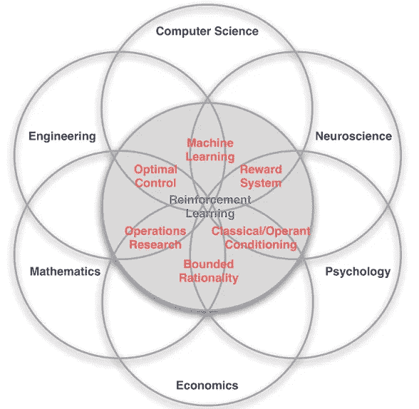
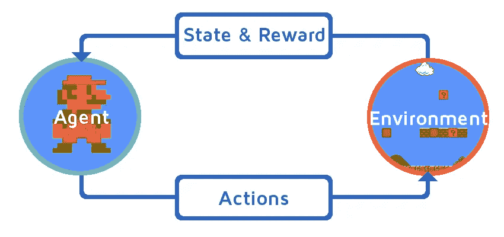
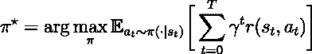
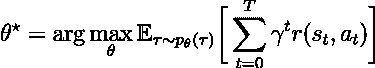
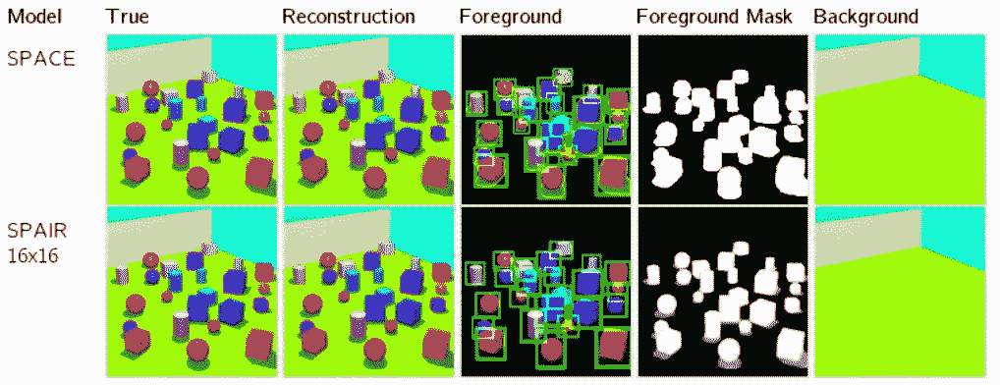
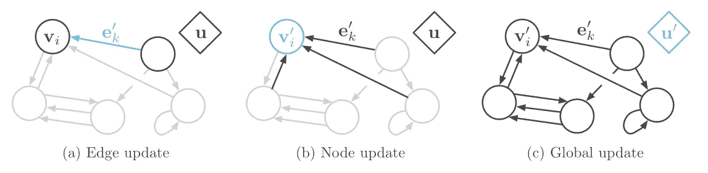

# 基于对象的强化学习

> 原文：<https://towardsdatascience.com/object-oriented-reinforcement-learning-95c284427ea?source=collection_archive---------17----------------------->

## 对世界物体的认知能提高强化学习算法的有效性和效率吗？

有一天，强化学习可能会提供正确的工具来建立完全自主的代理。在 [Unsplash](https://unsplash.com?utm_source=medium&utm_medium=referral) 上由 [Franck V.](https://unsplash.com/@franckinjapan?utm_source=medium&utm_medium=referral) 拍摄的照片

**强化学习**为建模行为构成了一种强大的形式主义，它允许我们解决多种类型的**复杂决策问题**，例如*游戏*、*自主机器人*、*自动股票*交易；我们曾经认为用经典的(甚至基于人工智能的)算法方法几乎不可能有效地解决这些问题。

在这篇文章中，我们将探索一个名为**面向对象强化学习**【1】**的强化学习形式，其主要特点是在更高的抽象层次上进行推理，即在世界/环境的对象及其关系的层次上进行推理。这种形式保证了优越的性能以及采样效率的显著提高。**

## **内容**

**这篇文章的结构如下:**

*   **强化学习简介，**
*   **RL 的基本限制，**
*   **面向对象的强化学习，**
*   **结论和参考文献。**

# **RL 的非正式介绍**

**强化学习提供了一套工具来训练一个 ***代理*** 在 ***环境*** (一个真实或模拟的世界)中，通过*试错*(即执行一个动作，然后体验它的效果)，仅在 ***奖励*** 的指导下，采取最优*动作*。奖励是一个标量反馈信号，告诉代理人所采取的行动有多好。代理人收集奖励是为了学习在给定的情况或状态下执行哪种动作是最好的。**

****

**RL 位于许多知名领域的交汇点。[ [来源](http://www0.cs.ucl.ac.uk/staff/d.silver/web/Teaching_files/intro_RL.pdf) ]**

**简而言之，代理学习如何解决一个*任务*即决策问题。Atask 被正式定义为根据环境和奖励函数描述的**马尔可夫决策过程** (MDP)。环境决定了世界的*动态*，即当一个动作在特定情况下被执行时接下来会发生什么(称为**状态**)，而奖励函数告诉代理在给定世界的当前情况(其状态)下，它通过执行一个动作赚了(或赔了)多少。**

****

**在每个时间步，代理通过执行一个动作来改变环境的状态。行动的效果是由环境提供的，作为下一个状态和奖励。代理使用奖励或两者的反馈来改善其行为。[ [来源](https://www.math.csi.cuny.edu/~mvj/MTH513/lectures/Lecture22.html#/) ]**

**MDP 的解决方案是确定代理行为的**策略** 𝛑。最佳策略是"*最大化(预期)回报的(贴现)总和"*，也称为 **RL 目标**:**

****

**RL 目标。最佳代理人是能获得最高回报的人。当从随机策略中抽取行动样本时，我们通过行动概率对累积回报进行加权。**

**请注意，这是一个通用公式，因为该策略可以用多种方式表示:作为一个*表*、*手工设计功能的线性或浅层组合*，或者作为一个**深度神经网络**。此外，策略可以是随机的或确定的。*随机*策略是行动的概率分布，在这种情况下，RL 目标是最大化*预期*奖励总和。相反，一个*确定性*策略是状态 *s* 的确定性函数，其中只有一个动作具有非零概率。**

****深度 RL** 支持深度神经网络策略，因为它们既有表达性(我们可以轻松增加模型容量)，又在空间和时间上计算高效，因为计算神经网络的*正向传递*通常是廉价的。用这些术语来表达，RL 目标旨在找到政策的参数θ，该参数产生最高的可能(贴现)累积回报总和:**

****

**当策略是具有参数θ的神经网络时的 RL 目标。注意，期望是在轨迹𝜏上，即状态和动作对(s，a ),通过与环境交互并根据具有参数θ的策略行动而获得。**

**请注意，在这两个目标中都有一个*𝛄折现因子，即一个介于 0 和 1 之间的实数，用于“衡量”未来的奖励。当*时间范围 T* 为无穷大时，贴现因子是强制性的，因为它防止了报酬总和的发散。一般来说，我们总是想用 0.9、0.95 或 0.99 的系数来贴现奖励。***

***为了计算最优策略，我们需要一种比较策略的方法。直觉告诉我们，一项更好的政策会惠及“更有价值”的州，也会挑选出“更有回报”的行动:***

*   *****状态值函数 V(s)** ，量化了我们从状态 *s* 采取最优行动平均可以获得多少回报。如果 *s* 是*初始状态*其值衡量当前策略从开始时平均会得到多少奖励。因此，最佳策略是实现最高价值的策略。同样的，***
*   *****动作值函数 Q(s，a)** 表示当处于状态 *s* 时采取动作 *a* 有多好。action-value 函数有助于理解在状态 *s* 时采取哪个特定动作是最好的。我们知道最优策略只执行最优动作，即面对给定状态时 Q 值最大的动作。***

***这两个函数是寻找最优策略的**贝尔曼最优方程**的基本成分。对于小问题，这个方程可以用动态规划很容易地解决。相反，对于高维度和连续的 MDP，我们通常使用神经网络来近似由*无模型*方法(例如 Q 学习、TD 学习、策略梯度、参与者-批评家)和*基于模型的*方法(例如 Dyna)使用的 V 和/或 Q，以找到给定任务的最佳策略。***

# ***深度强化学习有什么问题？***

***Deep RL 正在实现几个突破性的人工智能，它非常有前途，但并不完美，因为它继承了深度学习和经典强化学习的问题。主要缺陷是:***

*   *****样本效率:**深度神经网络(DNNs)需要具有大量示例的数据集(想想 ImageNet)才能实现良好的性能。对于作为 dnn 实现的代理策略也是如此，需要来自其环境的数百万个经验样本。减少样本数量是减少训练时间的基础。***
*   *****概括:**在训练期间很少或根本没有样本的区域中，DNNs 的输出不一致。因此，在大而多样化的数据集上训练网络对于在输入空间的大范围内实现低概化误差非常重要。对于 RL 来说，情况要复杂得多:如果一个代理学习做某事(例如驾驶)，它应该能够*重用*和*调整*它的技能，以便当它被要求解决与它被训练的任务相关的任务时“概括它的行为”。**元强化学习**旨在训练代理人能够快速调整他们的行为以适应新的任务。***
*   *****安全:**物理媒介(如机器人)在接受训练前后都可能是危险的。在学习时，物理代理与真实环境(如果没有经过模拟训练)进行交互，以学习什么动作是好的。如果这种相互作用没有受到约束，该制剂可能会损坏自身(例如过热、撞击物体、破坏致动器)以及由于随意尝试动作而导致的人身伤害。在学习了最佳行为之后，由于错误的预测(例如，对象的错误分类)，代理仍然可能是危险的。因此，有必要对动作实施两种 ***安全约束*** ，以了解执行哪些动作是安全的，并对预测中的**不确定性建模，以考虑次优(悲观)行为。*****
*   *******合规:**智能体在与人类互动时，应该能够根据*用户偏好*、*非语言提示*、*法律和社会规范*调整自己的行为。*****
*   ******可解释性:**为了理解和调试整个代理决策过程，代理的策略应该可以由人来解释，即，为了输出特定的动作，输入的哪些元素与代理相关。****

****这五个问题是现代强化学习算法的一般局限性。克服这些限制是在生产系统中实现 RL 的基础。要进一步理解，请参考启发本节的这两篇论文[2]和[3]。****

# ****基于对象的表示****

****面向对象的 RL 依赖于对象及其交互来为给定的任务设计最佳策略。对象和交互形成了任务环境的表示。****

****在这个上下文中， ***对象*** 是出现在任务环境中的任何相关实体，其特征在于一些属性集。当两个对象 ***以某种方式交互*** 时，交互对象之一或两者中的一个或多个属性的值会发生变化，这被称为 ***效应*** 。****

****将任务的环境表示为一组相互作用的对象可以促进先前知识的重用，并且提供重要的机会来:****

*   ******一般化:**如果一个智能体学会了如何在一个环境中对某些类别的对象做出最佳行为，它可能会将其行为一般化到包含相同类别对象的任何环境中。假设这些对象以相同或相似的方式运行。****
*   ******更低的样本复杂度:**从基于对象的世界表示中学习智能体的行为可以加快学习过程。原因可能是这种表示提供了比原始像素观察(通常在深度 RL 中进行)更多的先验知识，这可以减少无模型方法训练竞争代理所需的样本数量。****
*   ******可解释:**对象和交互很容易被人类理解，因此调试代理的决策过程应该更容易。理想情况下，我们想知道哪些对象会影响代理的决策，所以我们可以想象代理会给我们一种“对象上的注意力向量”,让我们了解哪些对象与其决策更相关。此外，通过监视对象的属性如何随时间变化，应该可以理解代理本身如何影响其他对象。请注意，在像素级推理时，这两种分析都很难执行。****
*   ******确保安全:**安全约束可直接应用于对象。例如，我们可以限制某些对象类的某些属性的值(例如，惩罚汽车类的速度属性)。更重要的是，甚至对象之间的交互也可以被约束。这样，我们可以，理想地，在我们选择的一些对象类中防止非法行为。****

****因此，对象可以帮助减轻 RL 的一些基本问题，但实际上，在这种方法中，我们需要克服一些重要的问题，以便实现这样的框架。****

****首先，我们必须检测对象，以便能够对它们进行推理。这应该以一种*无人监督的*方式来完成，因为我们不想手工设计东西，也不想引入特定问题的先验知识；我们希望使用尽可能广泛适用的**无监督对象检测/场景理解**方法。****

********

****两个最近的场景理解算法，空间和 SPAIR。[ [来源](https://arxiv.org/pdf/2001.02407)****

****其次，我们应该能够预测被检测对象的一些属性，以便出于安全目的最终约束它们。最后，也是更重要的，我们需要一些方法来推断它们之间的相互作用。这是最大的问题，因为不完全清楚如何在没有先验知识的情况下，以无人监督的方式估计这种相互作用。****

****让我们假设我们能够检测对象、属性并估计交互。*我们如何代表他们？*还有，*我们如何更新它们？*嗯，交互可以自然地将对象排列成类似图形的结构。因此，一种可能的方法是将两者都建模为**图形神经网络**！****

********

****一般来说，图网络有三种更新规则:一种用于节点，一种用于边，另一种用于全局属性集。[ [来源](https://arxiv.org/pdf/1806.01261.pdf?utm_campaign=nathan.ai%20newsletter&utm_medium=email&utm_source=Revue%20newsletter) ]****

****图形神经网络(或图形网络)由*节点*(即对象的属性)*边*(即对象对之间的交互)和一组可选的全局属性组成。图网络(GN)将图作为输入，并将图作为输出返回。结果输出图的结构可以不同于输入图的结构。****

****GN 非常适合处理基于对象的表示，因为它们可以被构造为图形。因此，GN 可以理想地替代密集的、卷积的或递归的神经网络来表示代理的策略。****

****基于 OO-RL 的两个有前途的工作，(1)战略面向对象强化学习[8]和(2) COBRA [9]，展示了本节讨论的一些思想的有效性。需要进一步的研究来充分利用 RL 方法中的对象。****

# ****结论****

****有很多东西要讨论，甚至有更多的东西要发现！面向对象的 RL 是 RL 的一个相当未开发的子领域，在我看来，它应该得到研究社区更多的关注。此外，无监督计算机视觉方法的进一步改进，如对象检测和场景理解，对于 OO-RL 的成功可能是至关重要的。****

****理想情况下，OO-RL 有可能帮助减轻现代深层 RL 方法的基本限制。解决这些问题将推动基于 RL 的人工智能应用向大规模采用迈进一步。****

****希望这篇文章对你来说足够有趣。请评论任何疑问或澄清。这几个字里面有很多概念要解包，所以一开始可能会比较混乱。下次见！****

# ****参考资料和进一步阅读****

## ****RL 理论****

*   ****大卫·西尔弗 2015 年在 UCL 的强化学习课程([链接](http://www0.cs.ucl.ac.uk/staff/d.silver/web/Teaching.html))。****
*   ****Sergey Levine 在加州大学伯克利分校的深度强化学习课程，2019 ( [链接](http://rail.eecs.berkeley.edu/deeprlcourse/))。****

## ****引用论文****

****[1]迪尤克，c .，科恩，a .，&利特曼，M. L. (2008 年 7 月)。有效强化学习的面向对象表示。****

****[2] McAllister，Rowan 等人，“自动驾驶汽车安全的具体问题:贝叶斯深度学习的优势。”2017 年国际人工智能联合会议。****

****[3] Dulac-Arnold、Gabriel、Daniel Mankowitz 和 Todd Hester。“现实世界强化学习的挑战。” *arXiv 预印本 arXiv:1904.12901* (2019)。****

****[4] Keramati，Ramtin，等人，“面向战略对象的强化学习” *arXiv 预印本 arXiv:1806.00175* (2018)。****

****[5] Watters，Nicholas 等，“Cobra:通过无监督的对象发现和好奇心驱动的探索，基于数据高效模型的 rl。” *arXiv 预印本 arXiv:1905.09275* (2019)。****

## ****元学习、图形网络等。****

*   ****芬恩，切尔西，彼得·阿贝耳和谢尔盖·莱文。“用于深度网络快速适应的模型不可知元学习。”*第 34 届机器学习国际会议论文集——第 70 卷*。JMLR。org，2017。****
*   ****强化学习的无监督元学习。 *arXiv 预印本 arXiv:1806.04640* (2018)。****
*   ****彼得·w·巴塔格利亚等人，《关系归纳偏差、深度学习和图形网络》 *arXiv 预印本 arXiv:1806.01261* (2018)。****
*   ****林，等，〈空间:经由空间注意与分解的无监督物件导向场景表现〉arXiv 预印本 arXiv:2001.02407 (2020)。****