# SPOT 机器人系统的目标识别和空间感知

> 原文：<https://towardsdatascience.com/object-recognition-and-spacial-awareness-for-a-spot-robotics-system-2ba33152bf65?source=collection_archive---------47----------------------->

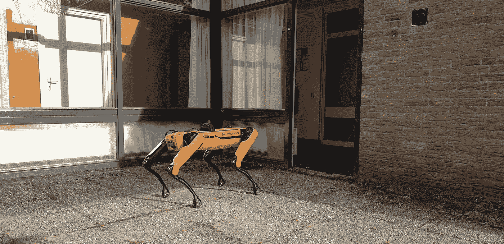

荷兰 TNO 研究机构的 SPOT 机器人。经许可使用。

本月早些时候，TNO 的首席科学家 Joris Sijs 加入了我们对 T2 Grakn 轨道 T3 的第二系列研究。

TNO 是荷兰的国家研究协会，乔里斯和他的团队希望在这里结合机器人和人工智能。

大约两年前，他们开始与 Grakn 合作。到那时为止，还没有一个适合机器人学的数据库能够准确地代表真实世界。这在需要在真实世界环境中执行任务和做出决策的自治系统中是必不可少的。机器人项目经常在精心策划的环境中运行，在 TNO 的案例中，他们希望尽可能接近真实世界的场景。

# 搜索和救援——雪计划

TNO 正在进行的项目叫做 SNOW，专注于自主系统。该团队将**自主系统**定义为*机器人技术与人工智能*的结合。

在实践中，这意味着机器人被赋予了更多的自主权，从用户的角度来看，人类的干预更少。这使得机器人能够在更复杂的环境中工作。

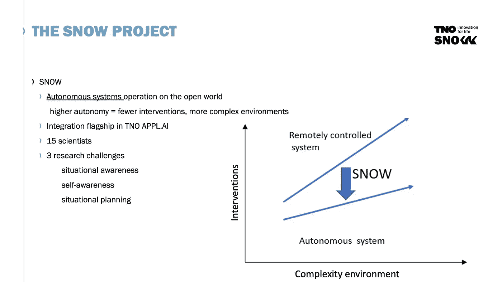

雪计划目标。经许可使用的幻灯片

传统上，在机器人领域，你会有远程控制系统。然而，对于雪，TNO 正试图尽可能减少人为干预，尤其是当环境的复杂性增加时。

从事 SNOW 项目的团队由 15 名科学家组成，主要关注 3 个挑战:

> **情境意识**——机器人知道它在哪里操作吗
> 
> **自我意识**——在给定的环境下，机器人此时能做什么
> 
> **情景规划**——基于机器人所知道的，它应该如何完成任务

TNO 为这个项目选择的用例是半真实的。通常，他们的客户只会要求一个狭窄的人工智能任务来探索。然而，通过创建他们自己的案例，他们能够测试全套的技术情况并集成所有的技术解决方案。

SPOT 将在什么样的环境和情况下运营？

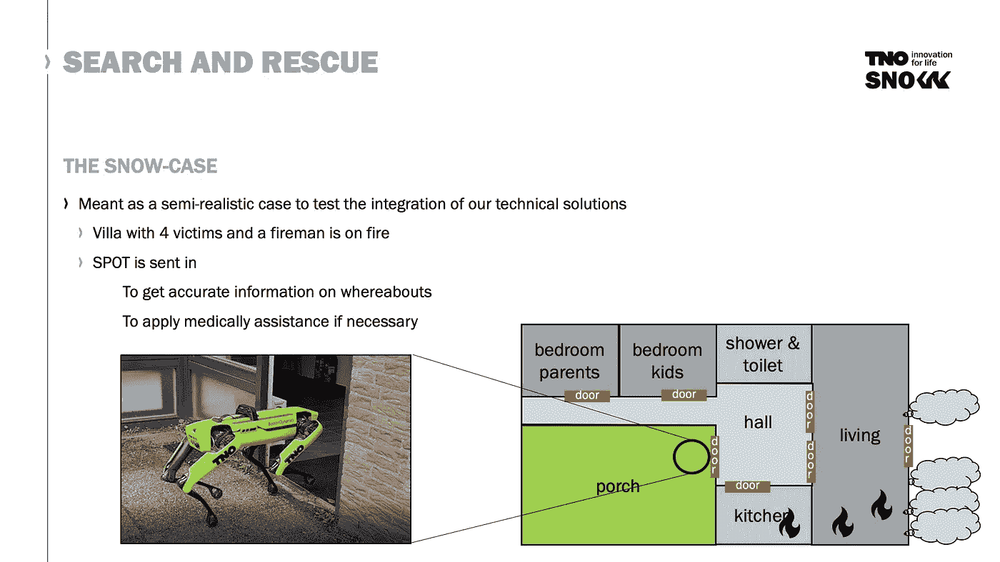

雪地项目设置。经许可使用的幻灯片

TNO 使用的是一栋内部别墅，由四个房间、一个大厅和一个门廊组成。现场有四名受害者和一名消防员。斯波特被派去获取关于遇难者下落的准确信息，以及对搜救有用的任何其他信息。

这个机器人来自波士顿动力公司，然后被送进别墅去寻找或定位受害者。

然后，SPOT 被赋予一系列目标:

*   找到家庭成员
*   对他们进行医学评估

例如，机器人可能会报告女儿在去厨房的走廊上，并且她有反应。接下来的**行动、**将是*继续搜寻其他受害者*。

过了一段时间，机器人报告说它在客厅的椅子旁边找到了父亲，但没有反应。在这种情况下，**动作**是*原地不动，为救援队*制造噪音。

SPOT 在现实环境中运行时面临一些挑战:

*   斑点不应该被玩具狗弄糊涂——它应该区分真正的狗和玩具
*   SPOT 应该评估什么时候情况太危险——根据房间里的条件，搜索和定位能力是如何减弱的
*   SPOT 应该能够根据受害者的情况或其他变量，如位置或危险的接近程度等，权衡救援对象。

# 斯诺的机器人系统

SPOT 是如何观察和收集数据的——雪地里用的是什么硬件？

*   PTZ 摄像机—安装在聚光灯顶部的全景倾斜变焦摄像机
*   用于语音交互的语音阵列和扬声器

这些组件安装在迷你电脑的顶部。这种迷你电脑拥有强大的计算能力，因为大部分计算都是在设备本身上完成的，以确保机器人尽可能多的自主权。

# TNO 的典型机器人系统是什么样的？

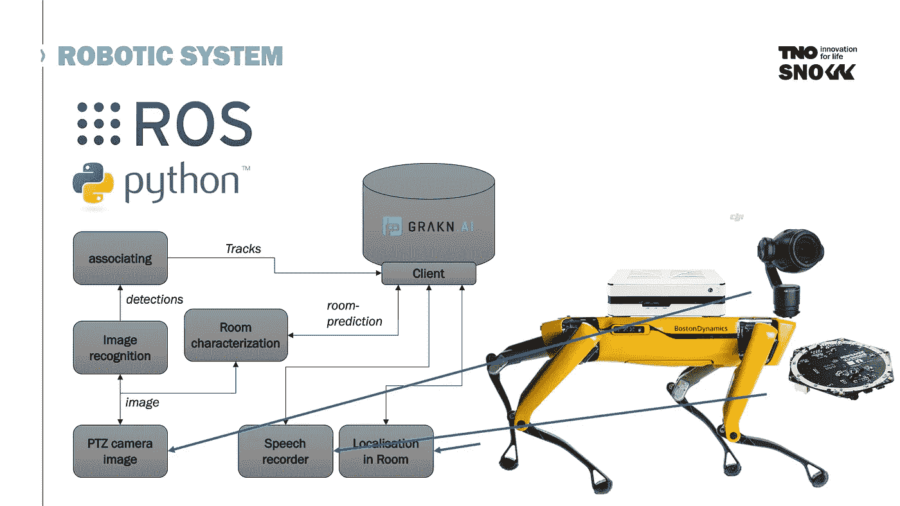

例如 TNO 机器人系统。经许可使用的幻灯片

首先，从 **PTZ 摄像机**中捕捉到一幅图像，然后将它传送到**图像识别模块**，该模块用于进行一些**房间特征描述**，这样机器人就可以在房间内确定自己的位置。

**关联模块**从摄像机获取所有检测，并将它们关联起来，以便它们可以创建更好的轨迹，而不是单独的检测。

Grakn 被用作**数据库**，以协调他们系统中的所有数据和知识。

传统上，在机器人学中，ROS 和 Python 用于实现系统中模块之间的通信。如果你用 Python 创建一个模块或软件组件，ROS 会在 Python 代码中添加另一层，以便与系统的其他部分进行通信。

因此，他们还需要为 Grakn 创建一个专用的 ROS 客户端，并使用原生 Python 客户端。

Joris 注意到他们的数据库虽然相对较小，但在处理管理负担和向数据库中添加新知识方面非常动态。

# Grakn ROS 客户端

什么是 [ROS](https://en.wikipedia.org/wiki/Robot_Operating_System) ？ROS 在这个过程中扮演了什么角色？

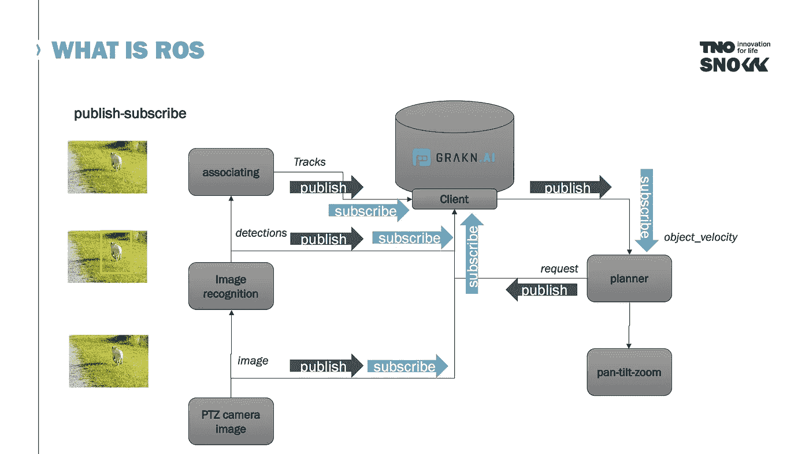

ROS 客户端。经许可使用的幻灯片

ROS(机器人状态发布器)是一种发布/订阅机制。设置包括:摄像机、图像识别、关联层、规划器和控制器。ROS 便于将输入的数据合并到数据库中。让我们来看看这个识别狗的例子:

*   PTZ 照相机发布了一幅图像
*   Grakn 客户端订阅图像，以便将其反馈给数据库
*   图像然后被传递到识别模块
*   检测到一只狗
*   然后狗被发布在 ROS 总线上
*   Grakn 客户机再次订阅这个输出(dog ),以便将它发送并写回数据库
*   同样的情况也发生在关联模块中，狗的速度和位置被写入数据库
*   那么计划者可能需要一些信息
*   Grakn 客户端也将订阅来自规划器(对象速度)的这些请求，反之亦然

# 您如何着手构建 ROS Grakn 客户端？

着手构建这个 ROS 客户端的团队将它分成了两部分:ROS 包装器和 Grakn 客户端会话。

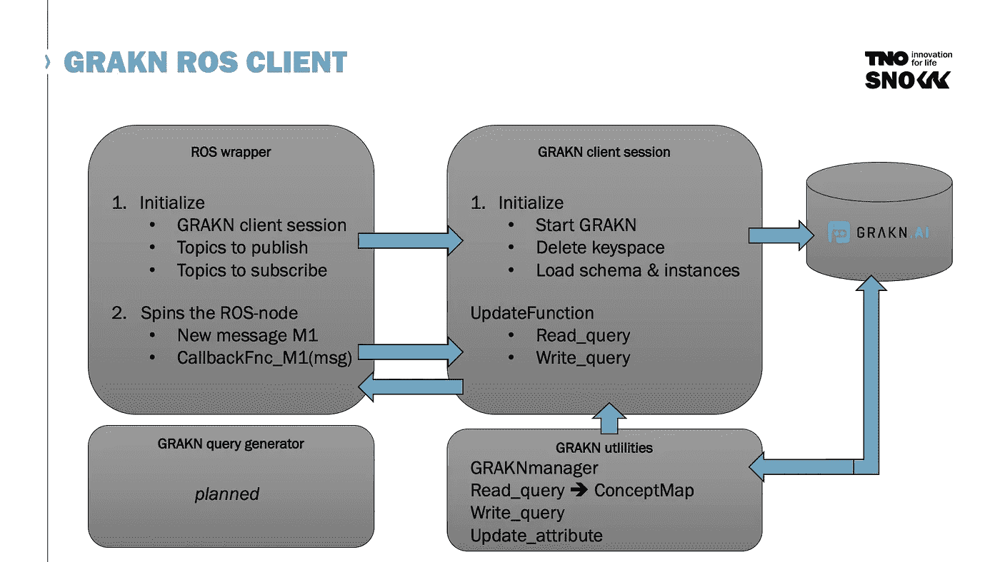

构建一个 ROS 客户端。经许可使用的幻灯片

**ROS 包装器**处理发布/订阅机制， **Grakn 客户端会话**作为抽象层构建在 [Grakn 客户端](http://dev.grakn.ai/docs/client-api/python)之上。

各有什么要求？

*   ROS 包装器初始化客户端和要发布或订阅的主题。
*   Grakn 客户端应该自动启动 Grakn 并删除任何现有的密钥空间。删除键空间是必要的，因为在机器人学中，我们希望从一个空的键空间开始。我们希望有一个新的场景来描述机器人所处的动态变化的环境。
*   Grakn 客户端会话还应该加载已知的模式和实例。

过一会儿，当事情可能已经运行了一段时间时，新的 ROS 消息进来(例如，对 object_velocity 的请求)。

在这里，他们使用基于 Grakn Python 客户端的 Grakn 实用程序。

*Joris 和他的团队目前正在寻找一个可以自动生成查询的工具。这被记为未来的工作。*

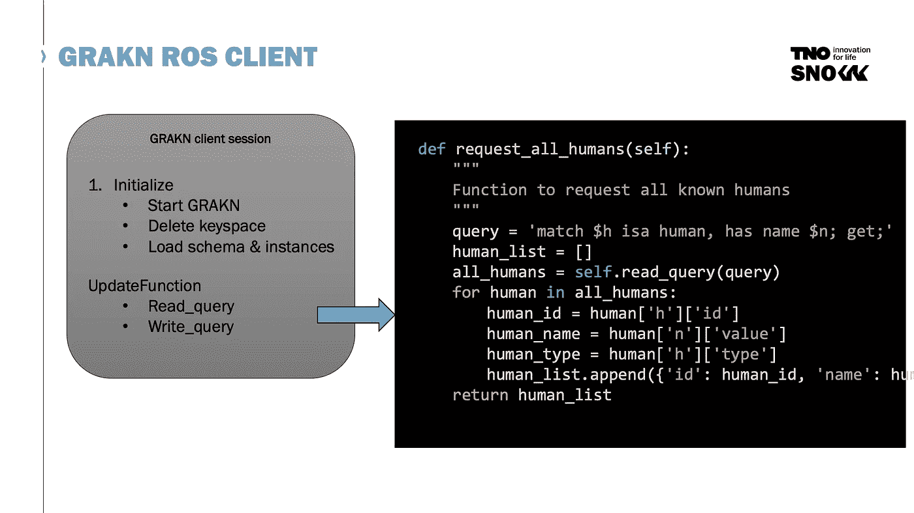

经许可使用的幻灯片

这张幻灯片向我们展示了 read 函数在幕后的样子。函数`request_all_humans`获取数据库中已知的所有人类。他们使用 Grakn 实用程序从数据库中读取查询。

然后数据被检索，并以一种良好的格式提供给 ROS 包装器，由它作为 ROS 主题再次发布。

这是一个创建起来相当简单的函数。然而，当我们考虑为机器人观察添加额外的变量时，情况变得有点复杂。

在我们到达那里之前，让我们看一下他们的模式——Joris 在下面的幻灯片中以模式图的形式浏览了其中的一部分。

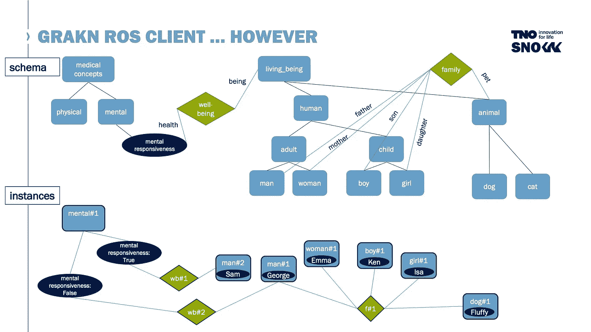

架构图的部分。经许可使用的幻灯片

这里我们看到他们定义了一个`living_being`，它是一个`human`或者一个`animal`的父实体。这两个实体是:`adult`、`child`的父实体；还有`dog`、`cat`。

SPOT 需要报告`living_being` s 的状态，包括`physical`状态和`mental`状态。具体来说，SPOT 的任务是识别已识别的`living_being`的`mental-responsiveness`。

让我们看看他们是如何在这个模式片段中建模关系的。

```
define
## relation 1: mental responsiveness of a discovered (by SPOT) living-being ##
well-being sub relation,
	relates health,
	relates being;
mental-responsiveness sub attribute,
	plays health;
living-being sub entity,
	plays being;

## relation 2: family of living-beings ##
family sub relation,
	relates father,
	relates mother,
	relates son,
	relates daughter,
	relates pet; 
human sub living-being;
adult sub human;
child sub human;
man sub adult,
	plays father;
woman sub adult,
	plays mother;
boy sub child,
	plays son;
girl sub child,
	plays daughter;
animal sub living-being,
	plays pet;
```

参考上面幻灯片的下半部分，我们还可以看到该模型的一个实例。

首先，他们用`true`或`false`实例化`mental`概念。他们有一些人和一只狗，*毛毛*。注意，在这个例子中有两个成年人，`man`(名字是 Sam)和`man`(名字是 George)。山姆是消防员，乔治是一家之主。

我们可以看到，萨姆是精神上有反应的，而乔治不是精神上有反应的。我们如何在代码中创造心理反应？

假设母亲在精神上有反应:

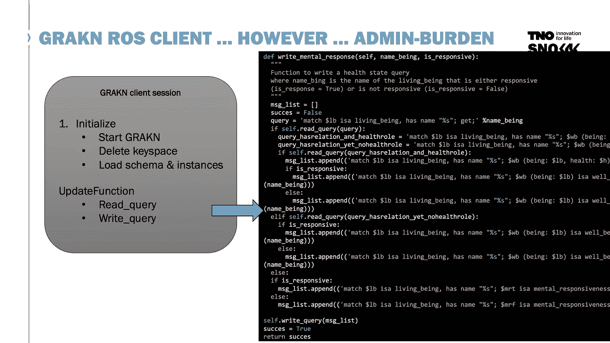

经许可使用的幻灯片

在这里，您可以看到代码增长很快，以及希望探索自动查询生成的原因。

# 小但有活力

还记得我们说过数据库很小但却是动态的吗？在这里，我们将看到 SPOT 在现实世界中的运行情况。

把场景设在现实世界中，我们有一个家庭，一个消防队，一个有一个大厅和一组房间的房子。

这差不多是 SNOW 项目的完整模式图。

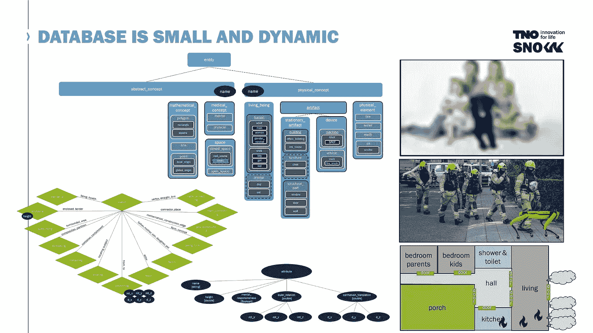

完整的架构图。经许可使用的幻灯片

您可以看到绿色的所有关系和深蓝色的所有属性。所有的概念或实体都是淡蓝色的，并被组织成一个类型层次结构。

乍一看，它没有看起来那么大或复杂，但正如 Joris 继续描述的那样，一旦机器人在一个房间里，复杂性就会迅速增长，因为机器人需要确定自己的方向。

他们能够通过在数据库中表示多边形来对此建模。

看下面的幻灯片，我们看到厨房、厨房门和四面墙被映射为多边形的点和边。

多边形是一个数学概念，可以用来描述房间的边界，比如厨房。写为多边形，你有一组点和边或线。这些边缘对应于墙壁或厨房门。

多边形由直线构成，直线由两点定义。如果您将此多边形建模为 Grakn，则该多边形与一组线相关，每条线与两个点和一个结构部分相关。

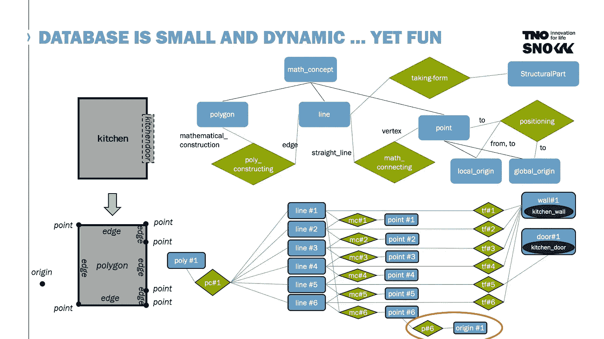

在 Grakn 中为空间感知建模多边形。经许可使用的幻灯片。

在 Grakn 中对此建模，我们得到实体:`mathematical-concept`、`polygon`、`line` s、`point` s，以及实体`point`的两个子类型:`local-origin`和`global-origin`。

这些线条也可以采取某种物理形式，如结构部件:墙或门。

为什么知道这些有用的信息？

如果斑点在厨房里，它应该能够在那个房间里定位自己。

如果它在厨房，需要通过厨房门离开房间，它必须知道厨房门的位置。使用激光雷达系统，SPOT 能够测量到墙壁的距离，从而将阵列映射到多边形。接下来，它应该通过检索门的端点来定位门。最后，向门口走去，它会找到一个出口。

这样，如果你根据平面布置图使用机器人和真实环境，使用多边形是很方便的。

# 推理如何从一个房间移动到另一个房间

我们看到了乔里斯如何模拟一个特定的房间，以便点点在里面移动；但是在整栋楼里移动呢？我们应该如何建立一个建筑模型，使得斑点可以在房间和大厅之间自由移动？

首先，Joris 需要在模式中对建筑物的组成进行建模——我们可以看到他的图表在 Graql 中的样子:

```
define
building sub entity,
plays composition; 

office-building sub building;
res-house sub building;	
space sub entity,
	plays partition;	
open-space sub space;
closed-space sub space;
real-estate sub closed-space,
	plays composition;
room sub real-estate;
	composing sub relation,
	relates composition,
	relates partition;
structural-part sub entity,
	plays partition;
window sub structural-part;
wall sub structural-part;
door sub structural-part;
```

这意味着当我们有一个`res-house`的实例时，比如这个例子中的别墅，它由房间组成:`kitchen` `hall` `living`。这些房间由`structural-part` s: `kitchen-wall`、`kitchen-door`、`hall-wall`、`living-wall`、`living-door`组成。

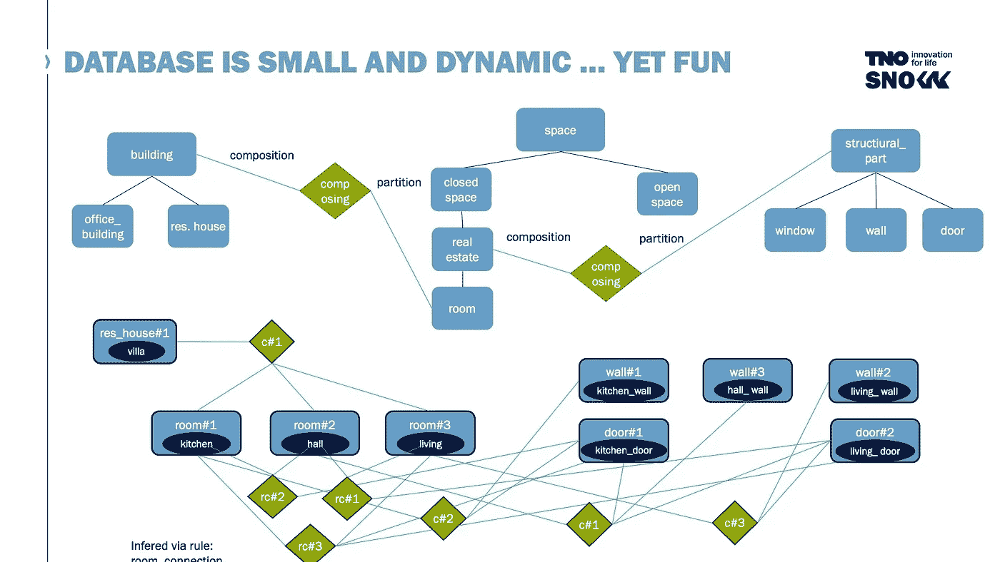

正如 Joris 解释的那样，我们可以利用 Grakn 的超图和基于规则的推理，根据通常关联的`structural-parts`来创建房间连接(关系)。

如果我们知道`kitchen-door`是与房间`kitchen`以及房间`living`有关系的角色扮演者(上图中的`c#2`);然后我们可以通过`kitchen-door`推断出房间`kitchen`和`living`之间的关系。

这让 SPOT 知道它可以通过厨房门从厨房移动到大厅。正如你自己可能推断的那样，我们可以通过`kitchen-door`和`living-door`在房间:`kitchen`和`living`之间建立联系。这是 Grakn 中传递关系的一个例子。

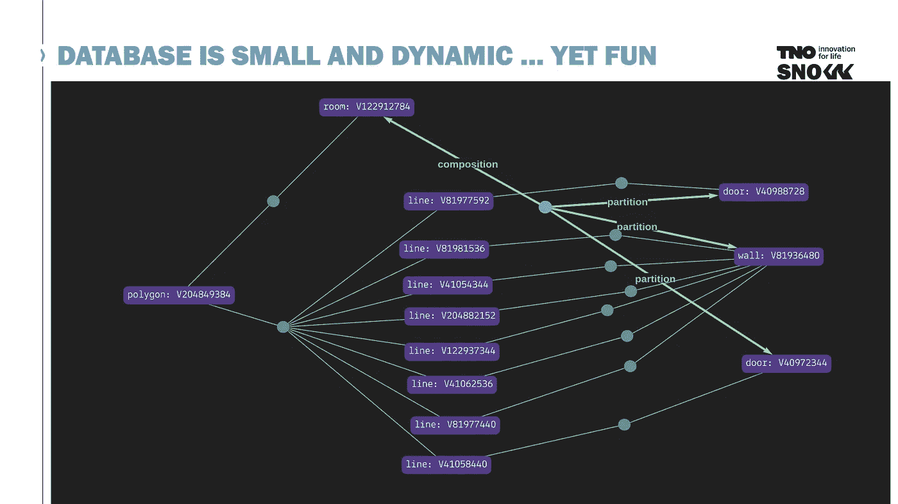

传统上，机器人团队可能会使用 [SLAM](https://en.wikipedia.org/wiki/Simultaneous_localization_and_mapping) 或其他导航技术来实现这种穿越空间的机动性。在 Grakn 中，这变得相当简单。

您可以在 Grakn work base(Grakn 的 IDE)中看到这种情况:

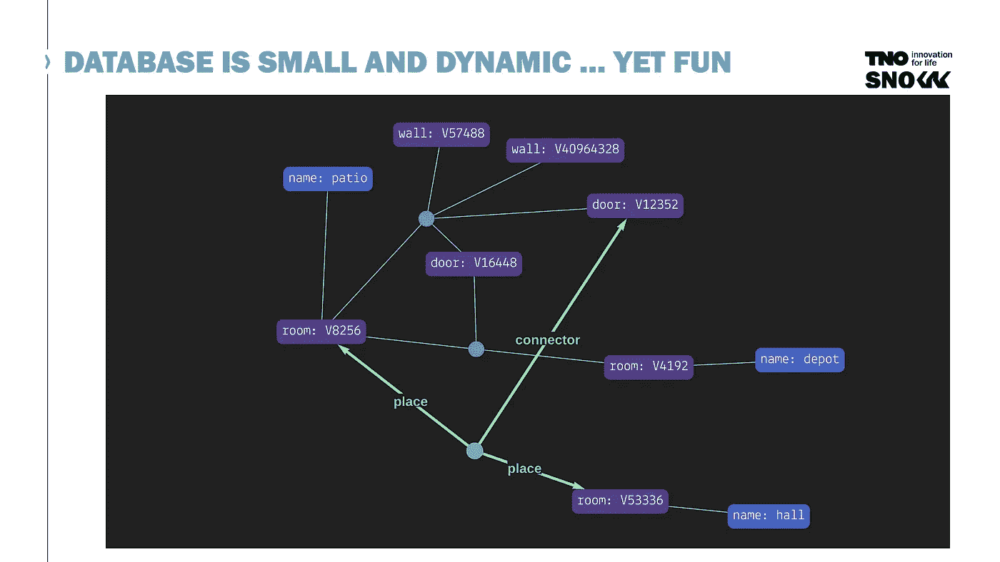

# 模拟否定

当机器人进入建筑物时，我们如何处理点点还不知道`living-being`在哪里的事实？我们如何在数据库中模拟这种知识的缺乏？

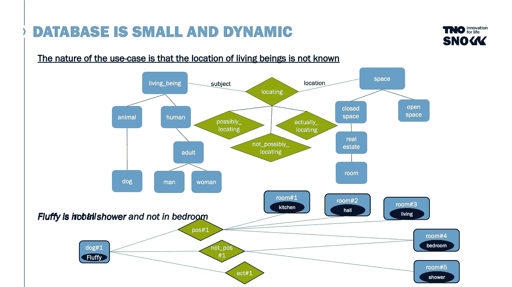

在 Grakn 中，我们使用一个带有两个子关系的`locating`关系:`possibly-locating`、`not-possibly-locating`和`actually-locating`。这些让我们能够解决负面问题；一旦搜索到一个空间，在数据库中捕获一个`living_being`不在该房间中。我们不需要现场复查房间和浪费宝贵的时间。这需要在主动搜索期间频繁更新数据库。

# 向数据库中添加新知识怎么样？

在真实世界的场景中，在积极的搜索和救援过程中会出现新的事实。想象一下，一名消防指挥官发现其中一间卧室有一台弹球机，这些数据目前可能不在数据库中。

您应该更新基础知识，而不是将这些新知识作为实例添加到数据库中。您希望将这一点添加到模式中，以便可以对知识进行推理并用于帮助 SPOT 实现其目标。

Joris 指出，这种情况可能会定期发生。以一种合适的、自动化的方式来做这件事是很重要的。Grakn 的动态模式——能够在任何时候更新，而不需要进行任何迁移——使这变得非常简单。

# 摘要

> 对我来说，机器人技术非常酷。还有，知识图比较热。所以综合这些，在我看来，让我发烧。你可以在这里看到我的一些发烧症状。

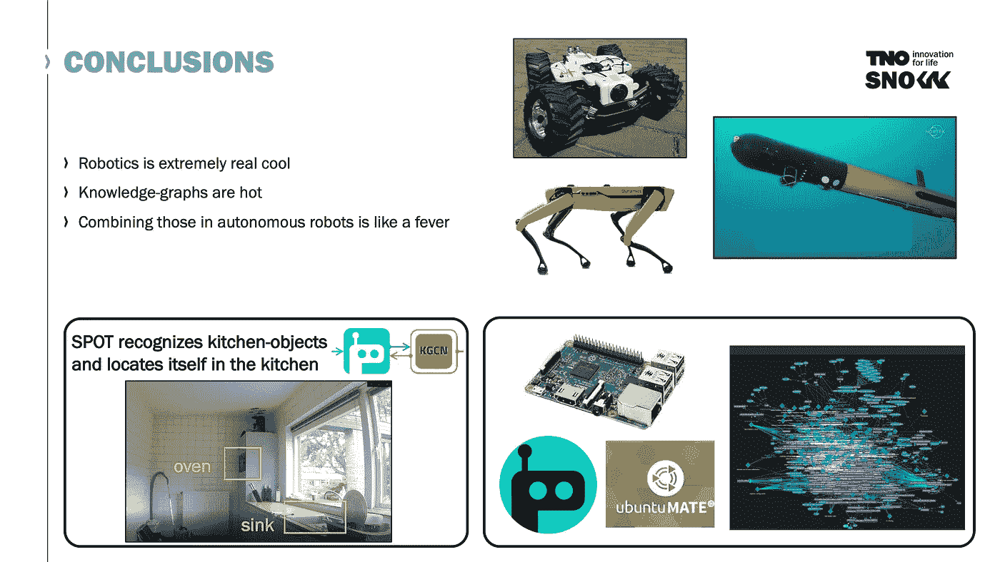

只是一些额外的“狂热”打动了乔里斯和他的团队。

在结束讲话时，Joris 谈到了他对使用知识图上的机器学习来通过对象识别定位自己的兴趣。例如，如果我们认识到两个物体:一个烤箱和一个水槽，我们应该能够知道我们在厨房里。

Joris 和他的团队目前正在与 Grakn 实验室的首席科学家 James Fletcher 合作，该项目利用了他对知识图卷积网络(KGCN)的研究。

特别感谢 Joris 和他在 TNO 的团队，感谢他们的热情、启发和透彻的解释。

你可以在 Grakn Labs YouTube 频道[点击](https://www.youtube.com/watch?v=3oAu4_bxjAg&t=1s&ab_channel=GraknLabs)找到完整的演示文稿。