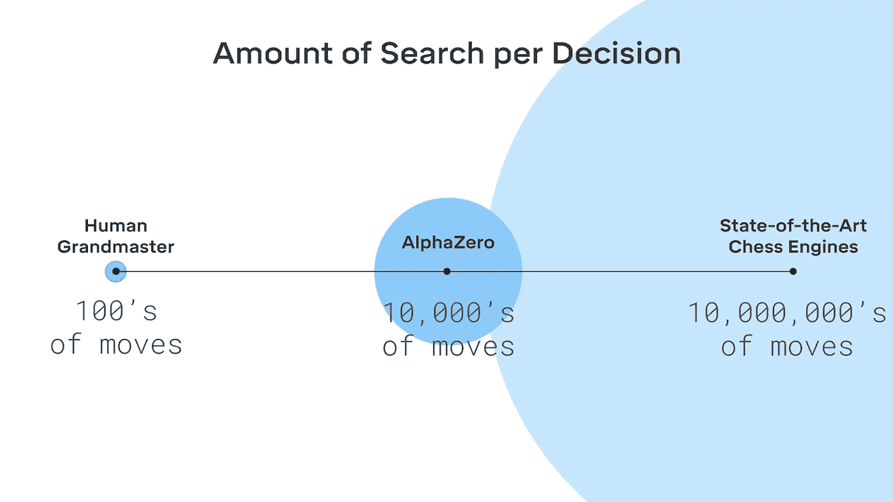
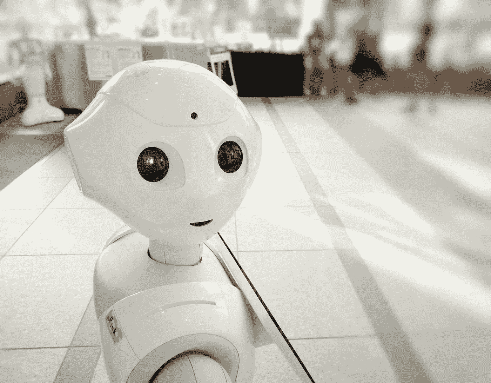

# 软件风险和人工智能的未来

> 原文：<https://towardsdatascience.com/observation-on-software-risks-and-artificial-intelligence-future-473a1bd55fb9?source=collection_archive---------47----------------------->

## 在机器学习时代，我们应该害怕什么，不应该害怕什么

人类一直生活在有史以来最受机器支配的时代。在大多数人注意到这一点之前，他们已经将世俗的决定留给了网飞推荐、特斯拉自动驾驶仪或《纽约时报》上的机器人撰写的评论，通常没有考虑到这些由人类编码的机器也可能容易出现意想不到的结果，如审查或假新闻。虽然不可否认的是，许多行业的机器智能改善了大多数人的生活质量，但越来越多的与数据隐私和人工智能有关的新闻，例如剑桥分析公司丑闻，或参与地区战争的杀手无人机，都给公众带来了一些担忧。让我们承认:作为整个人类物种，我们偶尔会失去对信息和算法的控制。然而，当公众人物谈论人工智能时，绝大多数人只是谈论它的前景，这让一些人对人类过度依赖机器决策感到紧张。这些担心是可以理解的:人们害怕他们不确定的事情，甚至专家也不知道人工智能研究最终将走向何方。在这些恐惧中，哪些是合理的，哪些显然是不必要的？

恐惧是真实的吗？

如果我们列举新闻和科幻电影中人们出现的有害的人工智能应用，杀手无人机和人工智能战斗机器人通常位于列表的首位。人们担心这些实体会超出发明者的控制，从而危及人类。虽然不幸的是，美国军方已经在任务中使用杀手无人机，但仍然足以说，人工智能杀手机器人将在几十年内仍然是一个幻想。谷歌大脑集团前总裁吴恩达表示，自 20 世纪 50 年代以来，人类一再遭受对人工智能的过度期望，即使在人工智能掌握围棋和星际争霸 2 之后，当前的研究仍然远远没有产生一个可以征服人类的全能人工智能。

在解决更多的恐惧之前，有必要知道现在的人工智能能够做什么。假设我们将一个人工智能定义为*好*如果它的表现可以与人类相媲美。2016 年和 2019 年，AlphaGo 和 [**AlphaStar**](https://deepmind.com/blog/article/alphastar-mastering-real-time-strategy-game-starcraft-ii) 的胜利表明，人工智能能够"*在合理的步骤数内做出好的决定，即使在没有完整信息的情况下。*(如传统象棋 AI 一步考虑 1000000 步，而 [**AlphaZero**](https://deepmind.com/blog/article/alphazero-shedding-new-light-grand-games-chess-shogi-and-go) 考虑 10000 步)。在过去的十年里，计算机也变得非常擅长合成逼真的图像、玩策略游戏和辅助诊断。

来源:DeepMind 官方[在 AlphaZero](https://deepmind.com/blog/article/alphazero-shedding-new-light-grand-games-chess-shogi-and-go) 上的博文。

也就是说，*其他一些*恐惧是有根据的吗？在我看来，是的，但是认识到 AI *还不能做*的事情也同样重要。当前的人工智能无法 ***概括任务*** ，这意味着它无法将其训练的模型概括为新的但类似的任务，例如，识别猫的模型在识别狗时表现不佳。《麻省理工技术评论》称，“机器学习系统可能会被它们以前从未见过的情况搞糊涂”。

艾也患 ***辨因果*** 。无法“推断”的结果来自于人工智能算法对相关性而不是因果关系的狭隘关注。“这就好像你知道云更有可能下雨，但你不知道云会下雨，”哥伦比亚大学的研究员 Elias Bareinboim 说。当人工智能必须回答“如果……会怎样”的问题时，这种无知是至关重要的。比如一个病人在临床试验中死亡；是实验医学的错还是别的什么？这样的推理远远超出了目前人工智能的熟练程度。虽然研究人员已经提供了可能的解决方案，如因果贝叶斯网络-一种可以检测哪些变量对其他变量影响最大的架构，但这种方法仍然没有在人工智能领域取得多少进展。

# **短期恐惧:算法偏差**

当机器被用来确定*公平性*时，识别因果关系的不恰当可能是有问题的，这导致了对当前人工智能的似是而非的担忧——算法偏差。这种争议出现在 2016 年，当时司法辅助系统 COMPAS 被指控对黑人被告有偏见。新闻调查集团 ProPublica 声称，就累犯率而言，“在最终没有再犯的被告*中，黑人被归类为中等或高风险的可能性是白人的两倍多”。*

要理解这场争论，人们必须仔细思考一个系统的“公平”意味着什么？请记住，COMPAS 基于 100 多个因素来分配分数，包括年龄、性别、犯罪史，特别是种族“不”包括在内。《华盛顿邮报》重新分析了 ProPublica 收集的被告 COMPAS 评分数据，发现了以下情况:

*   在每个风险类别中，无论种族如何，重新犯罪的被告比例大致相同。**这是发明者对公平的定义。**
*   黑人被告的总体累犯率高于白人(52%比 39%)。

然而，这两个特征导致以下两个观察结果:

*   黑人被告更有可能被归类为中等或高风险(58%对 33%)
*   最终“没有”再次犯罪的黑人被告被预测比没有再次犯罪的白人被告更危险。**这是 ProPublica 对算法的批评。**

这里的一个重要认识是:

> **双方对公平的定义是互斥的，因此结果的差异在数学上是有保证的。**

请记住，虽然系统不考虑个人决策的种族，但“训练数据”确实包括一个全面的特征列表，其中可能包括种族。因此，很可能是输入系统的真实数据导致了系统偏差。我们应该简单地接受这个不幸的结果吗？这可能不是大多数人想听到的答案。然而，如果我们手动调整算法，有条件地降低对黑人的风险预测，根据发明者的定义，我们也对白人被告有偏见。

算法偏见的另一个例子如下:美国政府的测试发现，2019 年，即使是性能最高的面部识别系统对黑人的错误识别率也比白人高 5 至 10 倍。反复出现的有问题的机器决策留下了一个尚未解决的问题:这种道德困境对于机器决策来说是不可避免的吗？鉴于算法有可能提高后续决策的有效性，我认为*公平性*应该是人们在不久的将来应该应对的重要恐惧之一。

机器知道公平问题吗？[图像来源](https://unsplash.com/photos/zbLW0FG8XU8)

# **长期恐惧:所有人工智能都是有益的吗**

从 2015 年开始，特斯拉首席执行官埃隆·马斯克(Elon Musk)一直在敦促美国对所有高级人工智能研究进行监管。“人工智能比核武器更危险，”马斯克解释道。“狭隘的人工智能将导致混乱、失业和更好的武器，但这不是我所说的物种层面的风险。”不管拟议的法规是否可行，马斯克的言论让人工智能乐观主义社会陷入混乱，特别是当马克·扎克伯格和谷歌人工智能首席执行官约翰·詹南德雷亚以及许多研究人员公开反驳他的说法时。

不过，对话特别有意思。想想这个:埃隆·马斯克绝不是技术悲观主义者。他敢于冒险，将他所有的 1.8 亿 PayPal 收入投资到 SpaceX、特斯拉和太阳能城市。他还负责人类历史上第一个“可重复使用的火箭”项目。马斯克在这里关注的不是 Siri 等公司人工智能，而是人工*通用*智能——一些前所未有的、有意识的超级智能实体。虽然我之前对这些“人工智能启示录”的说法表示了怀疑，但马斯克的回答提出了一个“人类控制机器”的关键问题。

加州大学伯克利分校教授斯图尔特·拉塞尔(Stuart Russell)是有史以来最有影响力的人工智能研究人员之一，他曾表示，他认为一个有益的人工智能必须“可证明地符合”人类价值观，当我们谈论“一般智能”时，最终的问题是我们是否能控制人工智能的决定，而不是它能做什么。

失控恐惧实际上是理性的。从历史上来说，艾伦·图灵发明的计算机时代仅仅是 70 年前，但我们已经看到机器从努力解决井字游戏发展到在棋盘游戏上超越人类知识，只需 30 个小时的训练，甚至可以解决生物医学研究中人类无法克服的障碍。从技术角度来看，强化学习模型对环境变量的敏锐度和即时生成训练数据的能力比新生儿强得多。一个实体如此快的学习速度，无疑是人类在发明之前无法理解的。因此，推测机器智能将在一个世纪或更短的时间内超越人类是公平的。但是，我们准备好了吗？

**不确定性有利于机器决策**

有时，人们害怕深入谈论人工智能的阴暗面，因为我们几个世纪以来一直信奉的科学实践并不是为有益的技术追求而设计的:在统计学和机器学习中，你会最小化外部指定的损失函数；在运筹学中，你最大化一个奖励函数。在许多学科中， ***我们构思问题的方式是基于这些任意选定的方向来解释自然界中某个特定的、可以说是歪斜的镜头*** 。“这是一个错误的问题，”斯图尔特·罗素在 2019 年接受采访时说。

“我们需要机器具有不确定性，也就是说对人类的任务持合理的怀疑态度，这样在它朝着指定的方向起飞后，我们就不会失去对它的控制。”他补充道，“机器永远不应该把输入目标当成真理。”的确，现代人工智能训练方法包括人类指定一个固定的目标，而这个目标实际上可能是错误的。有时这些目标存在于我们内心，但我们要么不知道如何解释它，要么不知道我们想要什么样的未来。如果一个人工智能盲目地追求最小化一个数字，而没有考虑到它的目标，数值最优，在人类逻辑中可能没有意义，结果可能会彻底脱轨。

> 我们需要机器具有不确定性，这样在它按照指定的方向起飞后，我们才不会失去对它的控制。

这一愿景也许是理想的。如果我们真的希望我们的机器是不确定的，所有传统的决策过程，如马尔可夫决策，标准博弈树搜索，都变得不适用。此外，这产生了一个更复杂的问题，因为人的交互现在是机器决策问题的一部分。就金钱主宰一切因素的行业而言，这种人性化的考量往往超出了任何企业愿意投入的成本。

# **结束思绪**

为了确保一个有益的人工智能未来，需要在实验中保持耐心，并大胆挑战一些旧的科学方法。甚至一些专家关于有益的人工智能的说法也仍然模糊不清:例如，如果人类的价值观不断进化，人工智能如何才能“可证明地与价值观保持一致”？然而，我的观点认为，只有考虑到人工智能在未来十年能做什么和不能做什么，对人工智能的恐惧才是合理的。“具有不确定性的人工智能”的说法目前似乎难以置信，但随着我们在使我们的机器智能更“意识到”人类价值方面取得进展，如因果关系，更多的线索可能会被揭示，或许将人类互动纳入决策的人工智能将不再是幻想。

**参考**

1.  " IBM 研究员:对人工智能的担忧被夸大了."*时间*2016 年 3 月 12 日[https://Time . com/4281476/IBM-人工智能-沃森-2016/](https://time.com/4281476/ibm-artificial-intelligence-watson-2016/)
2.  "埃隆·马斯克表示，所有先进的人工智能开发都应该受到监管，包括特斯拉."*TechCrunch*2020 年 2 月 18 日[https://TechCrunch . com/2020/02/18/elon-musk-says-all-advanced-ai-development-should-be-regulated-including-at-Tesla/](https://techcrunch.com/2020/02/18/elon-musk-says-all-advanced-ai-development-should-be-regulated-including-at-tesla/)
3.  “这位人工智能先驱有一些担忧”， *Wired，*2015 年 5 月 23 日，[https://www . Wired . com/2015/05/Artificial-Intelligence-Pioneer-Concerns/](https://www.wired.com/2015/05/artificial-intelligence-pioneer-concerns/)
4.  “AlphaZero:为象棋、松木和围棋带来新的启示”， *DeepMind* ，2018 年 12 月 96 日，[https://deep mind . com/blog/article/alpha zero-Shedding-new-light-grand-games-chess-shogi-and-Go](https://deepmind.com/blog/article/alphazero-shedding-new-light-grand-games-chess-shogi-and-go)
5.  “Stuart Russell:超级智能 AI | AI 播客剪辑的控制问题”，2019 年 10 月 13 日，[https://youtu.be/bHPeGhbSVpw](https://youtu.be/bHPeGhbSVpw)
6.  萨姆·科比特-戴维斯、艾玛·皮尔森、阿维·费勒和沙拉德·戈埃尔。一个用于保释和判决的电脑程序被贴上了对黑人有偏见的标签。其实也没那么清楚。”、*《华盛顿邮报》、*2016 年 10 月 17 日、[https://www . Washington Post . com/news/monkey-cage/WP/2016/10/17/can-an-algorithm-be-racistic-our-analysis-is-more-谨慎于 propublicas/#评论](https://www.washingtonpost.com/news/monkey-cage/wp/2016/10/17/can-an-algorithm-be-racist-our-analysis-is-more-cautious-than-propublicas/#comments)
7.  布莱恩·伯格斯坦，“人工智能还不能做什么”，*麻省理工科技评论*，2020 年 2 月 19 日，[https://www . Technology Review . com/s/615189/What-AI-still-cant-do/](https://www.technologyreview.com/s/615189/what-ai-still-cant-do/)
8.  “最好的算法努力平等地识别黑人面孔”，2019 年 7 月 22 日，[https://www . wired . com/story/Best-Algorithms-fight-Recognize-Black-Faces-Equally/](https://www.wired.com/story/best-algorithms-struggle-recognize-black-faces-equally/)
9.  凯瑟琳·克利福德，“埃隆·马斯克:‘记住我的话——人工智能远比核武器更危险’”，2018 年 3 月 13 日，*美国消费者新闻与商业频道*，[https://www . CNBC . com/2018/03/13/Elon-Musk-at-sxsw-a-I-is-more-dangerous-than-nuclear-weapons . html](https://www.cnbc.com/2018/03/13/elon-musk-at-sxsw-a-i-is-more-dangerous-than-nuclear-weapons.html)