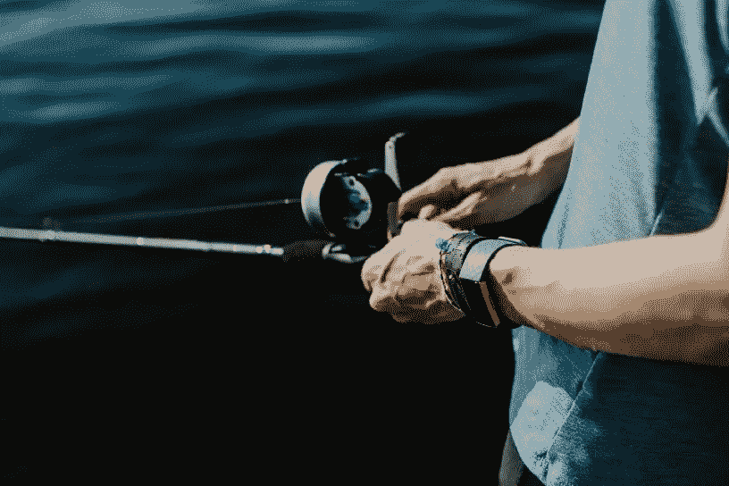
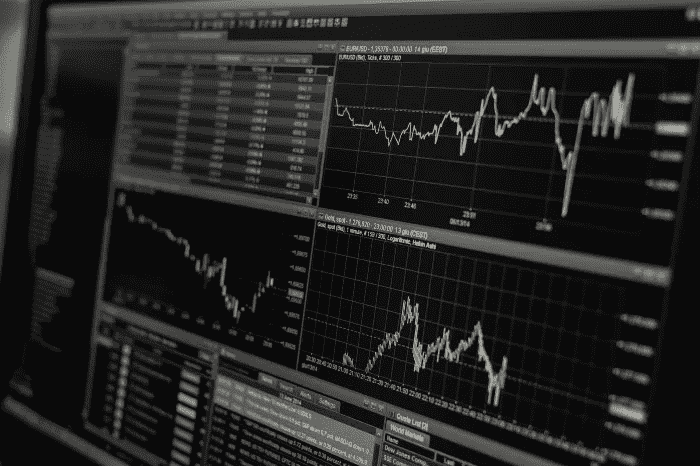
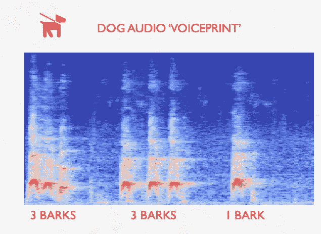
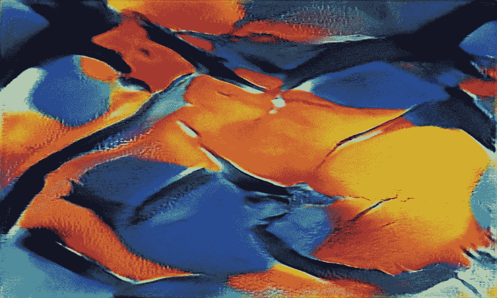

# 获取和分析 Fitbit 睡眠分数

> 原文：<https://towardsdatascience.com/obtaining-and-analysing-fitbit-sleep-scores-d2715aebd18e?source=collection_archive---------62----------------------->

凯利·西克玛在 Unsplash 上的照片

## [如何获取和分析 Fitbit 睡眠评分](/how-to-obtain-and-analyse-fitbit-sleep-scores-a739d7c8df85)

由[乔纳斯·班纳](https://medium.com/u/db70b21b73e5?source=post_page-----d2715aebd18e--------------------------------) — 9 分钟阅读

智能手表和其他可穿戴设备在过去几年里越来越受欢迎，并催生了“量化自我”的文化现象。Apple Watch 或 Fitbit 等设备让任何人都有可能轻松地自我跟踪，从而以某种方式量化他们的生活。

图片由来自 Pixabay 的洛伦佐·卡法罗提供

## [估计收入增长的贝叶斯方法](/a-bayesian-approach-to-estimating-revenue-growth-55d029efe2dd)

通过 [Vinai Oddiraju](https://medium.com/u/720ae9e409d7?source=post_page-----d2715aebd18e--------------------------------) — 14 分钟读取

也许你是一个投资者，正试图决定一只股票是否值得投资。也许你最近才听说贝叶斯推理，并想了解它在现实世界中的应用。也许您是一位经验丰富的分析师，偶然发现了这篇文章，并觉得标题很有趣。

作者图片[Marc Kelechava]

## [使用 Librosa 的城市声音分类—复杂的交叉验证](/urban-sound-classification-with-librosa-nuanced-cross-validation-5b5eb3d9ee30)

Marc Kelechava — 13 分钟阅读

我将展示一个实现一篇有趣的研究论文的结果的例子，该论文基于音频片段的声音内容对它们进行分类。这将包括 librosa 库的应用，librosa 库是一个用于音乐和音频分析的 Python 包。

MachineRay 的输出示例

## [MachineRay:利用人工智能创造抽象艺术](/machineray-using-ai-to-create-abstract-art-39829438076a?source=user_profile---------0-----------------------)

罗伯特·a·贡萨尔维斯 — 12 分钟阅读

在过去的三个月里，我一直在探索人工智能(AI)和机器学习(ML)领域的最新技术来创作抽象艺术，在我的调查过程中，我了解到创作抽象绘画需要三样东西:(A)源图像，(B)ML 模型，以及 C 在高端 GPU 上训练模型的大量时间。在我讨论我的工作之前，让我们先来看看一些先前的研究。

我们的每日精选将于周一回归！如果你想在周五收到我们的 [*每周文摘*](/receive-our-newsletters-681049ffa0cf) *，很简单！跟随* [*我们的出版物*](http://towardsdatascience.com/) *，然后进入你的设置，打开“接收信件”您可以在此* *了解有关如何充分利用数据科学* [*的更多信息。*](/how-to-get-the-most-out-of-towards-data-science-3bf37f75a345)