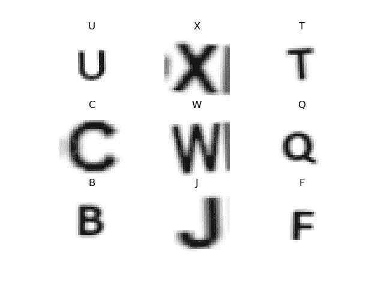

# 光学字符识别和文字搜索求解人工智能

> 原文：<https://towardsdatascience.com/ocr-and-the-wordsearch-solver-ai-515aeb816bdf?source=collection_archive---------22----------------------->

## 实践教程

## 使用自定义 OCR 模型、Pytesseract 和数组操作来自动解决单词搜索

作者原创。单词搜索解决程序在运行

## 介绍

最近看到很多关于数独求解器的帖子。它的算法非常简单，通常是一个回溯递归算法，只有几行 Python 代码。我最喜欢的[视频](https://www.youtube.com/watch?v=G_UYXzGuqvM)来自计算机爱好者和 Thorsten Altenkirch 教授，我可以看他一整天。如果使用计算机视觉方法，你只需要一个已经在 MNIST 上训练过的简单模型，或者类似的东西。解释所有步骤的非常棒的视频可以在[这里](https://www.youtube.com/watch?v=cOC-ad0BsY0)找到。

那么，这给我们留下了文字搜索。嗯，我已经厌倦了看到数独解谜的多种版本和视频。所以我想看看是否有人做过文字搜索解决方案。令我惊讶的是，并没有我想要的东西。现在，这并不是说人们没有这样做，但我觉得这将是一个很好的实践项目，所以决定不深入研究，因为我想自己解决这个问题。为此我使用了 WordSearch.com 的

> 完成这个项目后，我偶然发现了马丁查尔斯的一个不错的帖子，这是我见过的大多数需要手工输入文本的地方的典型。

这是一个很好的项目，因为它涉及以下主题:

*定制 OCR —在处理少量不平衡数据时进行培训(包括获取图像)，测试，部署
*图像处理—查找网格等。
*寻路——大脑。这让我走上了一条漫长而有趣的道路，尽管我最终坚持使用我最初的简单解决方案
*自动控制——让计算机解决这个难题

为了简洁起见，我将不再讨论 OCR、路径寻找和自动控制。毕竟，找到网格很容易，Sodoku 解算器中使用的相同条件也可以使用，Sodoku 解算器有很多。这是图像处理的结果，它找到了网格框(红色轮廓)、单词框(黄色轮廓)和绿色轮廓的每个字母边框。

图像处理后的结果，显示网格、字符和单词搜索边界框的轮廓

## 眼睛

源图像

在训练我自己的模型之前，第一个选择是使用 Pytesseract。然而，不幸的是，即使在裁剪了网格之后，也没有立即找到可用的字母。如果我改为裁剪每个字母，它仍然不是超级准确，而且非常慢。但是，我确实使用 Pytesseract 通过传递单词框(上面用黄色标出)来获取要搜索的单词。这给我留下了一个相对简单的任务，即进行单个字母的 OCR。

我首先通过收集单个字母的图像来创建数据集，并手动创建我的数据集。我使用了一个简单的脚本来收集每个字母包围盒，显示在屏幕上，并输入一个字母来标记我的训练数据。因为我使用了特定的字体和从截图中获得的图像，所以我可以用少量的训练数据就可以了。然而，这是令人难以置信的不平衡。在浏览了大约 5 个格子，也就是大约 1000 个字母之后，我只看到了大约 3 个 Q，3 个 Z，3 个 F，以及令人惊讶的其他一些少量的字母。另一方面，我有相当多的 a，e，o 等。以至于我开始跳过它们。

词搜索中字母的训练数据分布

为了解决这个问题，在应用数据扩充时，我使用了一个平衡的数据生成器，这样每个字母就总是有相同数量的例子。这使用了 ***imblearn*** 来生成随机过采样器，并结合 Tensorflow Keras 中的增强。这是我从另一个中帖[这里](https://medium.com/analytics-vidhya/how-to-apply-data-augmentation-to-deal-with-unbalanced-datasets-in-20-lines-of-code-ada8521320c9)找到的。这意味着，将对 Q/N 应用更多的增量，以平衡数据。这些扩充很简单；轻微的旋转，移动，缩放，最终获得了高精度的验证数据，基本上完美的测试数据，这是每一个新的搜索。当然，这只在我的电脑上测试过。但目前它确实有用。

来自生成器的示例扩充和训练数据

对于模型本身，我只使用了一个简单的 LeNet 架构。这被证明是准确和充分的，所以嘿，不要修复没有坏的东西。在我的 GTX 1060 GPU 上，这并不是实时快速的，它花了大约 10 秒钟来分类所有 196 个字母。我不确定瓶颈是什么；如果是图像处理得到每个字母或分类本身。我确实对经典的 28x28 图像进行了尺寸调整。我也许可以用一个小一点的图像，也许会更快。我不太关心时间，但如果你想把它作为一个实时应用程序，这可能是一个考虑因素。这是一个最终的结果，显示了使用 OpenCV 的字母边界框和作为字符串写在图像上的代表字母。

对单词搜索网格中的每个字母进行分类的结果

然后，网格被表示为 2D 数字字母数组，就像您自己输入一样。此外，要查找的每个单词都被保存为一个列表。现在我们知道要找什么了，我们只需要找到它。

## 大脑

源图像

正如我提到的，这让我走上了一条有趣的研究道路，我可能在这里学到了最多。我开始使用网络来查找每个单词的第一个和最后一个字母的起点和终点。然后，我将这些结果解析成有效的移动(向上/向下、对角线、水平)。然而，当我进行全尺寸测试时，从许多许多可能的组合来看，速度非常慢。我后退一步，取而代之的是一个非常简单的解决方案，简单地检查每个单词第一个字母的每个位置的邻居。然后是下一个字母的相邻字母，然后检查该方向的每个字母的单词长度。如果它符合这个词，我们有一个解决方案，如果不是，我们继续寻找。我发现一种更通用的方法是再次使用递归，只保留单词中后续字母的相邻字母。这也允许无效移动，是一个更通用的路径查找器。正如我所说的，我坚持使用我的第一个可用的解决方案。这是我使用的算法的示意图。它既简单又快捷。

在字母网格中查找单词的简单算法

如果你有兴趣看到一个非常好的通用解决方案，我在 reddit 上发起了一个讨论，有人在里面发布了一个非常棒的解决方案。这是到它的[链接](https://www.reddit.com/r/learnpython/comments/j2u6ea/return_paths_in_2d_array_from_list_of_sequences/)。

我还添加了一些解析器来删除像“.”这样的东西或'-'有时出现在单词中。

## 身体

源图像

为此，我们可以感谢我们的好朋友 PyAutoGui。“困难的部分”只是从我们用来定义网格的 numpy 字母数组中获取屏幕像素坐标。我创建了另一个数组，在对每个字母进行 OCR 之前，当我们第一次定义边界框时，它存储了字母的质心位置。我还保留了截图中的网格位置偏移。在考虑了 OpenCV 坐标和 numpy 数组位置之间的差异后，简单的数学将告诉我们位置。单个字典可以用于每个字母和相应的像素位置，而不是两个单独的数组，但我的意思是，无论哪种方式……为了简化 wordsearch.com 的自动化，你可以选择“拖动”动作来查找单词，或者你可以在单词的开头和结尾使用“点击”。这更简单，尽管事实上是一样的。所以，如果你想自己尝试一下，我确实实现了‘敲击’单词选择方法。这是在文字搜索页面的设置中。我故意在每个单词之间增加了 1 秒的延迟和 0.2 秒的睡眠时间，以确保任何互联网连接延迟或其他不会导致它变得疯狂。

单词搜索游戏中使用的设置

## 结论

总而言之，看到所有的单词都被找到，这是一个非常令人满意的结果。我确实学到了很多东西，并练习了一些有用的技术。我对表演很满意。

我最近在 neptune.ai 上找到了另一篇关于 OCR 的文章，这篇文章更加详细地介绍了如何构建自己的 OCR 引擎以及这个过程的每一步。如果你有兴趣了解更多，我鼓励你去看看。

如果这篇文章的任何部分提供了一些有用的信息或一点灵感，请关注我。

你可以在我的 [github](https://github.com/robintwhite) 上找到源代码。

您可能还喜欢:

*   [终极乒乓 AI](/computer-vision-and-the-ultimate-pong-ai-e6d70153fc45)——玩乒乓的计算机视觉
*   [《我的世界》测绘仪](https://medium.com/analytics-vidhya/minecraft-mapper-ab4478e98297) —计算机视觉和光学字符识别从截图和绘图中抓取位置

网络图中可视化的所有字母相邻连接