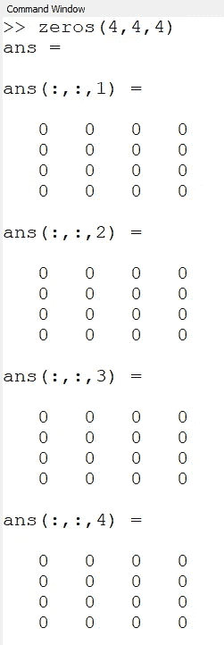
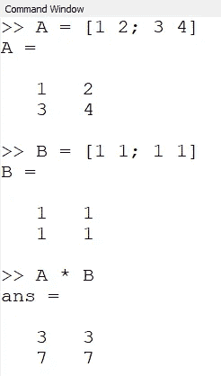

# octave——科学编程语言速成班

> 原文：<https://towardsdatascience.com/octave-scientific-programming-language-crash-course-2ab8d864a01d?source=collection_archive---------17----------------------->

## 免费 Matlab 替代品

八度(作者截图)。

GNU Octave 是一种免费的科学编程语言。它提供了丰富的*数学工具*、*简洁的语法、*以及*内置的可视化工具* [1]。整套真的是得心应手。它有图形用户界面(GUI)和命令行界面版本。感觉像是 Java 或 Python 的标准*集成开发环境* (IDE)。

Octave 可用于解决各种数学问题、构建模拟或从事数据科学项目。如果你熟悉**Matlab**【2】，或者你正在寻找一种快速原型化你的科学相关想法的方法，你绝对应该试试 Octave。让我们来看一些实际的例子，这些例子将帮助你用这个工具开始你的旅程。

# 装置

在 **Debian** 操作系统(例如 Ubuntu)上，你可以使用内置的包管理器来安装 Octave:

Debian 系统上的 Octave 安装。

如果系统提示您缺少软件包，请检查[此处的](https://wiki.octave.org/Octave_for_Debian_systems) [3】命令，其中包含您的操作系统版本所需软件包的完整列表。对于 ubuntu 20.4，它看起来是这样的:

Ubuntu 20.4 需要的 Octave 包(作者要点)。

如果你使用的是 Windows 系统，只需下载安装程序的可执行文件或压缩文件，然后解压。当前版本 5.2，以及 macOS 和 BSD 系统的说明，可从[这里](https://www.gnu.org/software/octave/download.html)【4】获得。

# GUI 指南

八度 GUI(作者截图)。

Octave GUI 由 4 个主要部分组成。最重要的是右边覆盖面积最大的面板。默认情况下，它是一个 ***命令窗口*** 。在这里，你可以在交互模式下输入任何 Octave 命令，它们会立即执行，并显示结果。

在*命令窗口的底部，*你可以找到另外 3 个选项卡。第二个是 ***文档*** 。这是 Octave docs 的一个非常方便的离线版本。它由主题部分组成，您可以在主题部分阅读数据类型或语句等主题。它还包含一个单独的 ***函数索引*** 与示例:

Octave 内置文档(作者截图)。

右侧主区域下的最后两个选项卡是 ***编辑器*** 和 ***变量编辑器*** 。编辑器选项卡只是一个文本编辑器，您可以在其中键入您的 Octave 代码。它有一个语法补全特性，但是一般来说，非常简单。在*变量编辑器*中，您可以选择一个变量并更改其值。它在处理多维变量时很有用，所以当您需要手动编辑它们时不会感到困惑。根据我的经验，这是很少使用的功能。

在主窗口的左侧，有 3 个面板。在顶部，有一个 ***文件浏览器*** ，在这里你可以选择你的项目目录并可以操作它的文件。下面你会发现一个 ***工作区*** ，其中包含所有活动变量及其简短描述(类型、尺寸、值、属性)。最后一个面板包含 ***命令历史*** 。它允许您搜索和过滤您过去使用过的命令:

Octave 命令历史面板(作者截图)。

# 使用数据

数据和变量是任何计算机程序的核心部分。看看如何在 Octave 中定义不同类型的变量和加载文件。

Octave 中的变量定义(作者截图)。

在截图中，你可以看到定义变量是非常直观的。您需要提供一个变量名，使用赋值运算符" **=** *"* ，并输入一个您想要放在变量下的值。您可以使用标量值，如整数、浮点数、文本(用引号定义，如“我是一个示例文本”)。如果你只是输入一个没有名字的值，Octave 会创建一个 ***ans*** 变量，并保存你在命令窗口中直接输入的最后一个值。您可以将*和*用作任何其他变量。

如果你仔细看了截图，你会注意到一个**的诡计。**当你用分号“**”*结束你的一行；****该命令不打印任何输出。但是，**命令末尾没有分号**会将结果打印到控制台。*

## *定义向量*

*向量是由多个值组成的变量。你可以把它想象成一个元素数组。要在 Octave 中定义一个向量，你需要提供一个向量名和用空格分隔的向量值。所有语句都应该用方括号括起来:*

**

*Octave 中的矢量定义(作者截图)。*

*要定义列向量，应该用分号分隔向量值。*

## *定义矩阵*

*矩阵定义和向量定义一样简单。主要规则是:*

1.  *用空格分隔矩阵行值。*
2.  *用分号分隔矩阵列。*

*看一下图片:*

**

*Octave 中的矩阵定义(作者截图)。*

## *定义变量时有用的函数*

*如果你想生成一个由 0 或 1 组成的变量，有两个方便的函数可以使用。 ***零点(m，n，k，..)*** 生成全零变量， *m，n，k* 是定义尺寸大小的整数。以此类推，你可以使用 ***个 1(m，n，k，…)*** 来获得一个填充有 1 的变量:*

**

*zeros 函数示例(作者截图)。*

*另一种生成值的有用方法是使用给定的 ***离散步长*** 生成矢量。假设你需要一个从 0 到 10 的向量，步长等于 0.5。在 Octave 中，您可以这样定义它:*

**

*使用离散步骤生成的向量(作者截图)。*

*你只需要从向量的初值，步长值，最后一个值开始。这三个值应该用冒号分隔。在我们的例子中，vector 有 21 个元素。*

## *访问元素*

*访问变量时要记住的最重要的事情之一是 Octave 从 ***1 开始索引，而不是像我们大多数人习惯的那样从 0*** 开始。要获取特定元素，您需要在括号内指定其索引:*

**

*访问 Octave 中的变量元素(作者截图)。*

## *加载数据*

*加载数据最简单的方法是使用 ***【加载(filename . m)】***功能。它需要一个包含逗号分隔的值和列的文件。看一下这个例子:*

**

*样本数据文件(作者截图)。*

*有了这样一个文件，姑且称之为 *myData.m* ，你只需选择一个变量来赋值数据，并像这样调用 load 函数:*

**

*加载数据示例(作者截图)。*

*在图中，你可以看到我们加载了一个矩阵变量，它有 63 行，每行 2 个值。使用 ***尺寸(变量)*** 功能检查变量尺寸。加载后，我们检查第一行的第一个元素，它等于 2000。*

*Octave 还支持更高级的加载功能，如二进制文件或在文件中定义分隔符。要了解更多信息，请查看文档中的加载函数描述。*

# ***基本线性代数运算***

*Octave 最强大的部分是一个内置的数学仪器。简单方便的语法使它变得更好。*

## *加法和减法矩阵*

*加减矩阵需要使用 ***"+"*** 或者 ***"-"*** 减运算符。当您添加两个相同大小的矩阵时，将使用相应单元格中的值进行运算(例如，矩阵 A 中第一行和第一列的值加上矩阵 B 中第一行和第一列的值)。*

**

*加减矩阵示例(作者截图)。*

*然而，你需要小心。也可以加上或减去一个矢量。为了清楚起见，我们来看几个不同的例子:*

**

*矩阵和向量的运算(作者截图)。*

## *矩阵乘法*

*让我们回忆一下矩阵相乘的先决条件。*

**

*矩阵乘法法则(图片由作者提供)。*

*要将大小为 *m x n* 的矩阵 *A* 乘以矩阵 *B* ，矩阵 *B* 中的行数必须等于矩阵 *A* 中的列数。假设矩阵 B 的大小为 *n x k，*乘法运算的结果是矩阵 *C* 的大小为 *m x k.* 使用 ***"*"*** 运算符来乘矩阵。*

*让我们来看看这个例子:*

**

*矩阵乘法示例(作者截图)。*

*为什么我们会得到这样的结果？检查每个矩阵单元是如何根据矩阵乘法规则计算的:*

**

*矩阵乘法示例详情(图片由作者提供)。*

*我们可以将相同的规则应用于向量，因为它们是矩阵的一种特殊情况(大小为 *1 x n* ，或者列向量的大小为 n x 1)。如果我们对以下大小的多个向量进行乘法运算，我们将得到一个值:*

**

*产生单一值的特殊情况(图片由作者提供)。*

*为了形象化这种情况，让我们定义向量 *A* 和列向量 *B* 并将它们相乘:*

**

*向量乘法示例(图片由作者提供)。*

*两个向量都由 1，2，3，4 组成。将它们相乘等于将来自 *A* 和 *B* 的第一个元素相乘，并将它们的第二个元素相乘的结果相加，依此类推，直到我们得到所有的元素。这意味着我们得到了:*

**

*向量一步一步相乘(图片由作者提供)。*

## *标量矩阵乘法*

*有时候你需要把矩阵的对应元素相乘。当然不是按线性代数定义的矩阵乘法，所以不能用*“*”*运算符。相反，Octave 有一个额外的 ***点“.”*** 乘法运算符前的运算符。让我们看看使用它时会发生什么:*

**

*标量矩阵乘法示例(作者截图)。*

## *矩阵转置*

*转置一个矩阵，意味着我们把行改成列，把列改成行。因此，矩阵的大小根据以下公式变化:*

**

*矩阵换位公式(图片由作者提供)。*

*在 Octave 中，您可以使用“*”*”运算符转置一个矩阵:*

**

*矩阵转置的例子(作者截图)。*

## *解线性方程组*

*最后，让我们解一个简单的线性方程组:*

**

*线性方程组(图片作者提供)。*

*这样的系统可以用两个矩阵来表示，这两个矩阵在变量之前映射系数。第一个代表系统的左侧:*

**

*方程组的左侧—矩阵表示(图片由作者提供)。*

*右边看起来像这样:*

**

*方程组右侧—矩阵表示(图片由作者提供)。*

*整个系统用以下公式表示，其中**矩阵 x** 由变量 x 和 y 组成:*

**

*线性方程组(图片作者提供)。*

*为了解决这个问题，我们可以对矩阵 A 求逆，并将其乘以矩阵 b。在 Octave 中，这相当于使用**左侧除法运算符“\”**【5】。结果 x = A \ b:*

**

*线性方程组求解(作者截图)。*

*最后，我们得到变量 x 等于 2，变量 y 等于 3。这是正确答案，太好了！*

# *可视化工具*

*我们知道图像胜过千言万语，它有助于理解我们试图解决的问题。幸运的是，绘图也是 Octave 的内置功能。*

## *绘图点*

*要绘制 2D 数据点可以使用*功能绘制。它将点的 *x* 和 *y* 坐标作为自变量和附加的样式相关参数。**

**让我们假设你有一个文件，其中每一行包含一个点。下面的代码将文件加载到数据变量中，提取每个点的 *x* 和 *y* 坐标(使用“ ***:*** ”运算符)，并绘制蓝色点( ***b.*** )、大小为 30 的点(***marker size“***参数):**

**代码绘制 2D 点(作者要点)。**

**结果，我们得到一个网格点:**

****

**剧情结果(作者截图)。**

**要更改颜色和样式，您可以尝试不同的字母，例如，***【g】***代表绿色，**【r】**代表红色，点样式字符如“ ***+*** ”或“ ******* ”。例如"***" plot(x，y，' r+'，' markersize '，30)；*** “看起来是这样的:**

****

**使用 r+风格的剧情(作者截图)。**

## **绘图功能**

**可以用同样的作图方法画出函数图。首先，你需要准备离散坐标向量，然后准备每个坐标的函数值向量。重要的是这些向量应该大小相等。**

**作为一个例子，让我们画一个下列函数的图:**

****

**样本线性函数(图片由作者提供)。**

**看一下代码片段:**

**功能图代码(作者要点)。**

**在第一行中，向量 *x* 从-10 开始填充，直到值达到 10(步长等于 0.1)。所以包含了-10，-9.9，-9，8 … 10。那么向量 *y* 包含每个 *x* 坐标的函数值。最后，我们绘制我们的函数，并将其线宽设置为 10:**

****

**线性函数图(作者截图)。**

## **更多奇特的功能**

**当然，也可以画出更复杂的函数。Octave 提供了非常好的文档，所以我鼓励您检查并使用 ***plot3*** ， ***meshgrid*** ， ***surf*** ， ***sombrero*** 函数。这是很好的锻炼。**

**对于上面提到的一些函数，Octave 也提供了一些测试 plot 函数，你可以不用任何参数调用它们就可以很快看到结果。以下是一些例子:**

********

**峰值和 surf 函数(作者截图)。**

# **有用的诡计**

**在这个速成课程的最后一点，我将分享在过滤您的数据时非常有用的功能。您可以将它用于来自机器学习分类器的预测向量或矩阵，并决定给定对象的标签。另一个例子是对数据应用给定的阈值，或者移除和提取异常。**

**假设我们有一个包含 0 和 1 的预测向量，作为不同对象的标签。要查找给定标签的索引，您可以使用 ***查找*** 功能，并定义一个条件作为其参数。为了更好地理解它，让我们来看看下面的例子:**

****

**find 函数示例(作者截图)。**

**它是如何工作的？传递给 find 函数的条件用于返回所有大于 0 的元素索引。然后，我们可以使用这些索引从预测向量中提取元素。就是这样！**

# **摘要**

**在完成这个简短的教程后，你已经掌握了一些知识，这些知识会让你对 Octave 环境有一个良好的开端。您知道如何定义和加载数据，如何对向量和矩阵执行操作，以及如何可视化您的工作。**

**我鼓励您在有想法时使用 Octave，并且您需要一个丰富而简单的环境来实现它，而您的成熟 Python 设置是遥不可及的。**

****参考书目:****

1.  **[https://www.gnu.org/software/octave/](https://www.gnu.org/software/octave/)**
2.  **https://en.wikipedia.org/wiki/MATLAB**
3.  **【https://wiki.octave.org/Octave_for_Debian_systems **
4.  **[https://www.gnu.org/software/octave/download.html](https://www.gnu.org/software/octave/download.html)**
5.  **[https://octave.org/doc/v4.0.1/Simple-Examples.html](https://octave.org/doc/v4.0.1/Simple-Examples.html)**