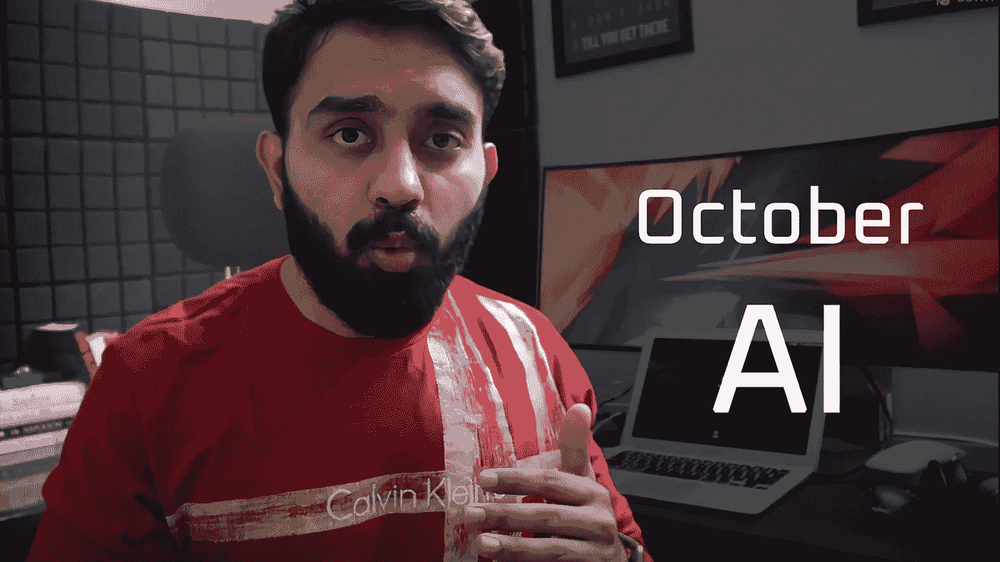
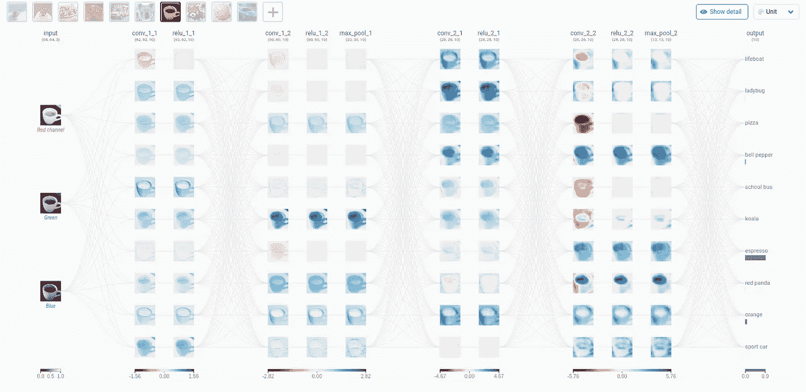
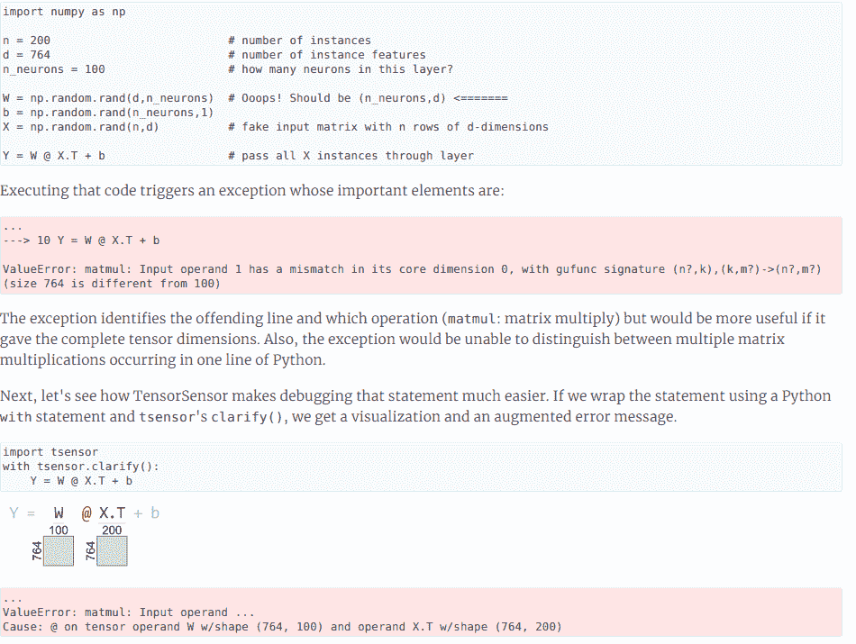
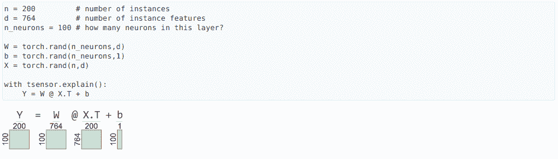
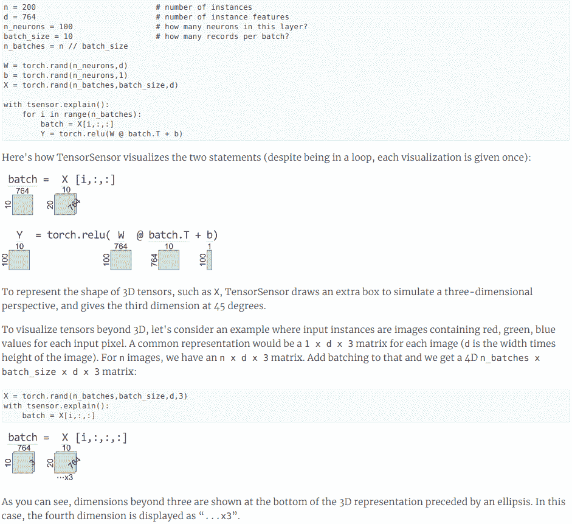
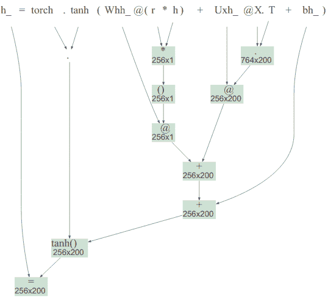
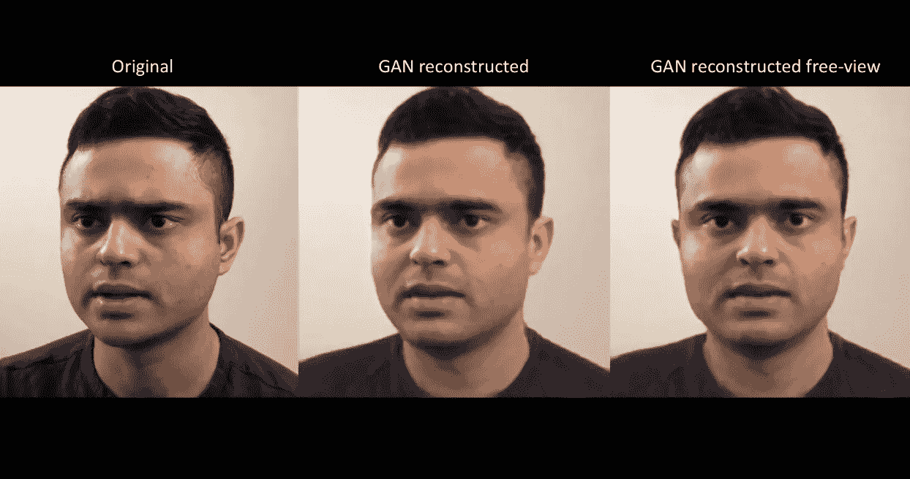

# 十月 AI——值得一试的五个项目

> 原文：<https://towardsdatascience.com/october-ai-five-projects-worth-checking-out-99a00d2c7c19?source=collection_archive---------40----------------------->

## 每月一次的网络广播，在这里我分享了五个值得花时间去做的很酷的项目！

人工智能和数据科学的世界正在以惊人的速度加速发展。对于人工智能爱好者和学习者来说，跟上该领域有意义的进展变得非常困难。应用、研发、单个项目、专有软件——每个部门都在以自己独特的方式应用 DS 和 AI。

我开始这个**每月一次的人工智能网络研讨会**有两个主要原因:

1.  这种方法帮助我发现了这个广阔的人工智能领域的趋势，这让我对自己前进的方向感到放心。所以，为什么不和别人分享呢！
2.  这让我充满活力和感激，因为我是这个社区的一部分。这也意味着我对那些努力向更广泛的观众展示他们的才华和努力的人负有责任。

但是**为什么只有五个项目**，你会问…

嗯，我想保持它的简洁、有用和多样化，这样我们就可以涵盖所有重要的领域，而不会被一大堆项目淹没。

**这些有什么用？鉴于该项目是公开的而非专有的，我将尽力给你列表中每个项目的行动项目。**

所以，这里列出了我认为值得一试的五个很酷的项目:

# [Python 3.9 的稳定发布](/python-3-9-hands-on-with-the-latest-updates-8137e2246119)

在过去的一年里，来自世界各地的开源爱好者一直致力于开发新的、增强的和不推荐的特性。尽管测试版已经推出了很长时间，Python 3.9.0 的正式发布是在 2020 年 10 月 5 日。

[官方文档](https://www.python.org/downloads/release/python-390/)包含了最新特性和变更日志的所有细节。下面列出了可能对我们的日常编程任务有用的功能:

*   **类型提示泛型以及灵活的函数和变量注释——**Python 3.9 增加了 [**PEP 593**](https://www.python.org/dev/peps/pep-0593) 引入了一种机制，扩展了**[**PEP 484**](https://www.python.org/dev/peps/pep-0484)的类型注释，提供了注释的标准语义，并建议将注释用于类型提示。**
*   ****字典中的联合操作符—**Python 3.9 最酷、最有用的特性之一是添加到内置`dict`类中的合并(|)和更新(|=)操作符。
    [**PEP 584**](https://www.python.org/dev/peps/pep-0584) 为字典引入了两个新的运算符:
    **(|) union —** 合并两个字典。它保留了原始词典。
    **(|=)更新—** 这是用于字典的就地合并。**
*   **`**zoneinfo**` **—访问和计算时区—** 到目前为止，我们已经有了像`dateutil`这样的第三方库来实现这种时区特定的规则，但是现在 Python 3.9 让 Paul Ganssle 加入核心团队来添加一个新的`**zoneinfo**`模块，该模块提供整个互联网数字地址分配机构(IANA)时区数据库供访问和使用。**
*   ****去除前缀和后缀的字符串方法——**[**PEP 616**](https://www.python.org/dev/peps/pep-0616)推出了从字符串中去除前缀和后缀的新方法。新方法有:
    1。 **removeprefix()** 2。 **removesuffix()****

**围绕`lstrip()`和`rstrip()`方法，所有主要论坛(如 StackOverflow)都有许多重复出现的问题。**

*   ****其他发布亮点—** 1。CPython 现在使用一个基于 PEG
    2 的新解析器。CPython 现在采用新的年度发布周期。 [PEP 614](https://www.python.org/dev/peps/pep-0614) ，放松了对装饰者的语法限制，提供了更灵活的语法。**

**我还在我的博客中详细介绍了所有重大更新:**

** [## Python 3.9 —最新更新的实际操作

### 浏览新发布的 Python 3.9 中的最新更新

towardsdatascience.com](/python-3-9-hands-on-with-the-latest-updates-8137e2246119) 

# [CNN 解说](https://poloclub.github.io/cnn-explainer/)

图片来源:[https://poloclub.github.io/cnn-explainer/](https://poloclub.github.io/cnn-explainer/)

CNN Explainer 是一个基于浏览器的卷积神经网络的可视化说明。令人感兴趣的是，我们如何使用 Keras 或 fastai 等库，在几行代码中创建一个对对象进行分类的最先进的 CNN，但理解 CNN 如何处理图像以获得最终输出的机制是至关重要的。这就是 CNN 解释者的用武之地。如果你曾经努力完全理解 CNN 发生了什么，或者如果你只是需要一个更清晰的复习，从数学和视觉的角度来看，这个工具对你来说是完美的。

该项目使用浏览器内 GPU 加速的深度学习库 [*TensorFlow.js*](https://js.tensorflow.org/) 加载预先训练好的模型进行可视化。整个交互系统是用 Javascript 编写的，使用*作为框架，使用 [*D3.js*](https://d3js.org/) 进行可视化。你只需要一个网络浏览器就可以开始学习 CNN 了！*

*这是由[王杰](https://zijie.wang/)，[罗伯特·图尔科](https://www.linkedin.com/in/robert-turko/)，[奥马尔·谢赫](http://oshaikh.com/)，[海丘公园](https://haekyu.com/)，[尼拉克什·达斯](http://nilakshdas.com/)，[弗雷德·霍曼](https://fredhohman.com/)，[明苏克·康](http://minsuk.com/)和[波罗洲](https://www.cc.gatech.edu/~dchau/)创造的，是佐治亚理工学院和俄勒冈州立大学合作研究的成果。*

***先决条件**要完全理解这个工具:*

1.  *对 CNN 理论的基本了解或*
2.  *一定是用深度学习框架编写了 CNN*

*如果以上两种你都没有做过，建议在使用工具之前先学习一下神经网络和卷积神经网络的基础知识。*

*CNN Explainer 使用一个非常简单的 CNN 称为 TinyVGG，它只包含三个卷积层，两个 max-pool 层和一个 flatten 层，将图像分为 10 个类别——救生艇，瓢虫，披萨和 7 个其他类别。*

*您可以使用他们的一个图像或上传您自己的图像来查看图像如何穿过神经网络，以及神经网络如何捕捉图像的某些特征。*

*但是可视化图像如何出现在不同的层只是冰山一角。通过使用该工具，您还可以了解以下内容在 CNN 中的作用:*

*   ***卷积层的核权重**和**偏差***
*   *需要**最大池**层和**展平**层*
*   ***超参数** ( **输入大小、填充、内核大小**和**步距**)如何影响卷积运算*
*   ***ReLU** 激活功能的需要和工作*
*   ***Softmax** 激活功能的需要和工作*

## *行动/学习项目:*

*试着回答这些问题来测试你对项目中演示的 CNN 的理解*

1.  *对于给定的卷积层，存在多少个核权重和偏置权重(或者需要在训练阶段进行训练)？*
2.  *最大池层的需求是什么，为什么它没有任何内核/偏差权重？*
3.  *如果你上传的图片不属于这 10 类中的任何一类，会发生什么？*

# *[张量传感器](https://explained.ai/tensor-sensor/index.html)*

*它是一个 python 库(`pip install tensor-sensor`)，创建的目的是在使用 **NumPy** 、 **Tensorflow** 或 **PyTorch** 构建神经网络(甚至只是简单的基于矩阵的计算，如点积)时处理异常。通常当使用这三个库时，如果我们在计算矩阵乘法时犯了一个错误，比如说矩阵的维数，解释器会抛出一个错误，而没有说明更多的细节，这使得调试更加困难——通常导致编码者编写一些显式的打印语句来查看哪里出错了。TensorSenor 的目标是通过做两件事来解决这个问题*

1.  *提供更好的异常消息。*
2.  *提供与异常消息相关的张量(或矩阵)的可视化表示，以了解哪里出错了。*

*在 TensorSensor 中，主要使用两种类型的**上下文管理器**:*

1.  *`**with tsensor.clarify():**`*

*这仅用于处理异常。它可以用于预构建的 Keras 对象，甚至用于我们自己定制的定义。*

***例如:***

**

*图片来源:[https://explained.ai/tensor-sensor/index.html](https://explained.ai/tensor-sensor/index.html)*

1.  *`**with tsensor.explain():**`*

*为了更清楚地理解，我们可能只想观察矩阵的维数，而不是处理异常。*

***举例:***

**

*图片来源:【https://explained.ai/tensor-sensor/index.html *

*我们还可以为 3D 张量扩展这些上下文管理器，其中第一维可以是批量甚至是 4D 张量。*

**

*图片来源:【https://explained.ai/tensor-sensor/index.html *

*还有一个函数 tsensor.astviz()，用于创建抽象树语法，如下所示:*

*T sensor . astviz(" h _ = torch . tanh(Whh _ @(r * h)+Uxh _ @ X . T+BH _)")*

**

*图片来源:[https://explained.ai/tensor-sensor/index.html](https://explained.ai/tensor-sensor/index.html)*

# *[Nvidia Maxine 视频通话](https://blogs.nvidia.com/blog/2020/10/05/gan-video-conferencing-maxine/)*

**

*图片来源:[https://blogs . NVIDIA . com/blog/2020/10/05/gan-video-conferencing-Maxine/](https://blogs.nvidia.com/blog/2020/10/05/gan-video-conferencing-maxine/)*

*这是清单上的专有项目。因此，Nvidia 最近宣布，他们的人工智能专家正在研究这个云人工智能视频流平台，该平台将使用 **GANs** 来提高带宽性能。*

*该平台使用神经网络代替称为视频编解码器的标准软件，视频编解码器通常用于压缩和解压缩视频，以便在互联网上传输。*

*他们的工作使得视频通话只需要用户通常所需网络带宽的十分之一。*

## *它是如何工作的*

*发送者首先发送呼叫者的参考图像。然后，它发送用户眼睛、鼻子和嘴巴周围几个关键点的位置数据，而不是发送大量像素打包的图像。*

*接收方的生成对抗网络使用初始图像和面部关键点在本地 GPU 上重建后续图像。因此，通过网络发送的数据要少得多*

*即使打电话的人戴着帽子、眼镜、耳机或口罩，这项技术仍然有效。*

*这项工作中更重要的功能是使用神经网络来调整用户面部的位置，以获得更自然的体验。来电者观看他们的视频，但他们似乎直接看着他们的摄像机，增强了面对面交流的感觉。*

# *[洋红色调转印](https://magenta.tensorflow.org/tone-transfer)*

**

*[https://sites.research.google/tonetransfer](https://sites.research.google/tonetransfer)*

*Tone Transfer 是谷歌的一个研究项目，将日常声音转化为乐器。*

*Tone Transfer 诞生于 Google Research 的两个团队之间的合作:Magenta 和 AIUX*

*色调转换是建立在今年早些时候一项名为可微分数字信号处理或 [DDSP](https://magenta.tensorflow.org/ddsp) 的 Magenta 开源技术之上的。*

*在这个项目的开始，团队使用[这个 Colab 笔记本](https://colab.research.google.com/github/magenta/ddsp/blob/master/ddsp/colab/demos/timbre_transfer.ipynb)来展示他们的工作。经过多次反复的设计探索和用户研究，AIUX 团队开发出了这个平台,使得在应用程序层面上使用 DDSP 模型变得非常有趣。*

*他们通过训练机器学习模型来提取是什么让一种乐器听起来像那种特定的乐器。它拾取音高、八度、响度以及许多其他特征，并将日常声音重塑为乐器。*

*为了从音频中提取音高，使用了 Google Research 开发的另一个模型 [SPICE](https://ai.googleblog.com/2019/11/spice-self-supervised-pitch-estimation.html) 。*

*即将发布的版本将使您能够轻松训练自己的 DDSP 模型，并将其部署在任何地方:手机、音频插件或网站。*** 

***如果你想看我回顾所有这些项目，这里是这个博客的视频版本，有演练和编码截屏。***

# ***[数据科学与 Harshit](https://www.youtube.com/c/DataSciencewithHarshit?sub_confirmation=1)***

***通过这个渠道，我计划推出几个涵盖整个数据科学领域的[系列](/hitchhikers-guide-to-learning-data-science-2cc3d963b1a2?source=---------8------------------)。以下是你应该订阅[频道](https://www.youtube.com/channel/UCH-xwLTKQaABNs2QmGxK2bQ)的原因:***

*   ***这些系列将涵盖每个主题和子主题的所有必需/要求的高质量教程，如[数据科学的 Python 基础](/python-fundamentals-for-data-science-6c7f9901e1c8?source=---------5------------------)。***
*   ***解释了为什么我们在 ML 和深度学习中这样做的数学和推导。***
*   ***[与谷歌、微软、亚马逊等公司的数据科学家和工程师](https://www.youtube.com/watch?v=a2pkZCleJwM&t=2s)以及大数据驱动型公司的首席执行官的播客。***
*   ***[项目和说明](/building-covid-19-analysis-dashboard-using-python-and-voila-ee091f65dcbb?source=---------2------------------)实施到目前为止所学的主题。了解新的认证、训练营以及破解这些认证的资源，例如 Google 举办的 [**TensorFlow 开发者证书考试。**](https://youtu.be/yapSsspJzAw)***

***请随时在 [Twitter](https://twitter.com/tyagi_harshit24) 或 [LinkedIn](https://www.linkedin.com/in/tyagiharshit/) 上与我联系。***