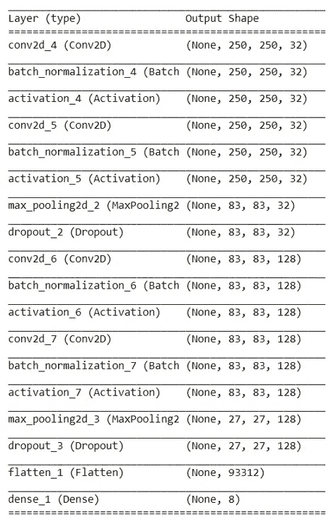

# 基于卷积神经网络的眼部疾病识别

> 原文：<https://towardsdatascience.com/ocular-disease-recognition-using-convolutional-neural-networks-c04d63a7a2da?source=collection_archive---------9----------------------->

## [变更数据](https://towardsdatascience.com/tagged/data-for-change)

## 为眼疾识别构建深度学习模型。

在 [Unsplash](https://unsplash.com?utm_source=medium&utm_medium=referral) 上[卡莉娅·杰丽勒](https://unsplash.com/@kaleajerielle?utm_source=medium&utm_medium=referral)的照片

# 关于这个项目

这个项目是米兰大学组织的海量数据算法课程的一部分，我最近有机会参加了这个课程。任务是开发能够使用 TensorFlow 库从眼底图像识别眼病的深度学习模型。一个重要的要求是使训练过程可伸缩，因此创建一个能够处理大量数据点的数据管道。在本文中，我总结了我在卷积神经网络和使用 Tensorflow dataset 对象构建高效数据管道的方法方面的发现。在我的 Github 库上有完整的可重复实验代码:[https://github.com/GrzegorzMeller/AlgorithmsForMassiveData](https://github.com/GrzegorzMeller/AlgorithmsForMassiveData)

# 介绍

早期眼部疾病检测是预防由糖尿病、青光眼、白内障、年龄相关性黄斑变性(AMD)和许多其他疾病引起的失明的经济有效的方法。据世界卫生组织(世卫组织)统计，目前全球至少有 22 亿人有视力障碍，其中至少有 10 亿人的视力障碍是可以预防的[1]。疾病的快速和自动检测在减少眼科医生的工作量和防止患者视力损伤方面是关键和迫切的。计算机视觉和深度学习可以在提供高质量的医学眼底图像后，自动检测眼部疾病。在本文中，我展示了使用 TensorFlow 库编写的卷积神经网络构建高级分类模型的不同实验和方法。

# 资料组

眼部疾病智能识别(ODIR)是一个结构化的眼科数据库，包含 5000 名患者的年龄、左眼和右眼的彩色眼底照片以及来自医生的医生诊断关键词。该数据集旨在代表上工医疗科技有限公司从中国不同医院/医疗中心收集的“真实生活”患者信息集。在这些机构中，眼底图像由市场上的各种相机拍摄，例如佳能、蔡司和 Kowa，导致图像分辨率各不相同。注释由受过质量控制管理训练的人类读者进行标记[2]。他们将患者分为八个标签，包括正常(N)、糖尿病(D)、青光眼(G)、白内障(C)、AMD (A)、高血压(H)、近视(M)和其他疾病/异常(O)。

经过初步的数据探索，我发现 ODIR 数据集面临以下主要挑战:

高度不平衡的数据。大多数图像被分类为正常(1140 个实例)，而特定疾病，例如高血压，在数据集中仅出现 100 次。

数据集包含多标签疾病，因为每只眼睛可能不仅患有一种疾病，还可能患有多种疾病的组合。

标记为“其他疾病/异常”(O)的图像包含与超过 10 种不同疾病相关的图像，将可变性扩展到更大程度。

非常大和不同的图像分辨率。大多数图像的大小约为 2976x2976 或 2592x1728 像素。

所有这些问题都会对准确性和其他指标产生重大影响。

# 数据预处理

首先，调整所有图像的大小。一开始，我想使用 TensorFlow 数据集对象“动态”调整图像大小。训练模型时调整了图像的大小。我认为它可以防止耗时的图像尺寸调整一次。不幸的是，这不是一个好的决定，一个历元的执行甚至可能需要 15 分钟，所以我在创建 TensorFlow dataset 对象之前创建了另一个函数来调整图像的大小。因此，数据只需调整一次大小，并保存到不同的目录中，这样我就可以使用更快的训练执行来试验不同的训练方法。最初，所有图像的大小都被调整为 32x32 像素，但我很快意识到，压缩到如此低的大小，即使它大大加快了训练过程，也会丢失许多重要的图像信息，因此准确性非常低。经过几次实验后，我发现 250x250 像素的大小在折衷训练速度和准确性指标方面是最好的，因此我在所有进一步的实验中在所有图像上都保持这个大小。

其次，图像被标记。data.csv 文件中的图像注释存在问题，因为标签同时与两只眼睛(左眼和右眼)相关，而每只眼睛可能患有不同的疾病。例如，如果左眼患有白内障而右眼眼底正常，则标签将是白内障，而不是指示右眼的诊断。幸运的是，诊断关键字与一只眼睛相关。创建数据集的方式是将左眼和右眼图像作为输入提供给模型，并返回总体(对于双眼)累积诊断，忽略了一只眼睛可能是健康的这一事实。在我看来，从这种模型的最终用户的角度来看，这是没有意义的，最好是对每只眼睛分别进行预测，以了解例如应该治疗哪只眼睛。因此，我通过创建诊断关键词与疾病标签之间的映射来丰富数据集。这样，每只眼睛都被分配到一个适当的标签。该映射的片段以字典的形式呈现在图 1 中。通过重命名图像名称，更具体地说，通过向图像文件名添加对应于特定疾病的一个或多个字母来添加标签信息。我应用了这个解决方案，因为这样我不需要存储任何带有所有标签的额外数据帧。重命名文件是一个非常快速的操作，在正式的 TensorFlow 文档中，TensorFlow 数据集是简单地从文件中创建的，标签信息是从文件名中检索的[3]。此外，一些图像的注释与特定疾病本身无关，而是与图像的低质量有关，如“镜头灰尘”或“照片上不可见的视盘”,这些图像被从数据集中删除，因为它们在确定患者的疾病中不起决定性作用。

图 1:用疾病标签映射特定诊断关键词的字典片段

第三，通过随机选择所有可用图像的 30%来创建验证集。我选择 30%是因为这个数据集相对较小(总共只有 7000 个图像)，但是我想使我的验证足够有代表性，而不是在评估模型时有偏见，因为事实上许多图像变体或类在验证集中没有它们的表示。ODIR 数据集提供了测试图像，但不幸的是，data.csv 文件中没有为它们提供标注信息，因此我无法使用可用的测试图像来评估模型。

接下来，在训练集上应用少数类的数据扩充以平衡数据集。应用了随机缩放、随机旋转、左右翻转、上下翻转。一开始，我使用 TensorFlow dataset 对象在训练模型[4]时“动态地”应用数据扩充，以尽可能保持我的解决方案的可伸缩性。不幸的是，它缺乏许多功能，如随机旋转，因此我在创建 TensorFlow 数据集对象之前，使用 OpenCV 等其他图像处理库进行了数据扩充。一开始，我还考虑过通过应用对比度受限的自适应直方图均衡化(CLAHE)来增强所有图像，以增加图像局部细节的可见性，但由于这给图像增加了许多额外的噪声(尤其是背景，最初是黑色的)，我决定不遵循这个方向。使用 PIL 和 OpenCV 库编写的 my 函数进行数据扩充的例子如图 2 所示。

图 2:示例性数据扩充结果

最后，创建 TensorFlow 数据集对象。它的开发与 TensorFlow 官方文档中用于加载图像的开发非常相似[5]。由于这个库很复杂，对于 TensorFlow 初学者来说不容易使用，所以我想在这里分享一下我在构建可伸缩的快速输入管道方面的发现。 *tf.data* API 使您能够从简单的、可重用的部分构建复杂的输入管道。例如，图像模型的管道可能从分布式文件系统中的文件聚合数据。 *tf.data* API 引入了一个 *tf.data.Dataset* 抽象，表示一系列元素，其中每个元素由一个或多个组件组成。例如，在我的图像管道中，一个元素是一个单一的训练示例，用一对张量分量表示图像及其标签[6]。TensorFlow 引入了所谓的迭代学习过程，即向模型输入一部分数据(而非整个数据集)，训练并重复另一部分数据(称为批次)。批量大小定义了在每个训练步骤中要抽取多少个样本。在每一步之后，权重被更新。我选择的批量大小等于 32，以避免过度拟合的问题。由于批量较小，权重会定期频繁更新。小批量的缺点是训练时间比大批量长得多。tf.data 的一个重要元素是混洗数据集的能力。在混洗中，数据集用元素填充缓冲区，然后从该缓冲区随机采样元素，用新元素替换所选元素[7]。它防止了将相同类别的图像重复填充到批中的情况，这不利于训练模型。

# 构建卷积神经网络

在深度学习中，卷积神经网络(CNN)是一类深度神经网络，最常用于分析视觉图像[8]。输入图层采用 250x250 RGB 图像。第一 2D 卷积层使用大小为 5×5 像素的窗口在输入图像上移动，以提取特征并将它们保存在多维阵列上，在我的示例中，第一层的滤波器数量等于 32，因此为(250，250，32)大小的立方体。

在每个卷积层之后，应用校正的线性激活函数(ReLU)。激活具有决定神经元是否需要被激活或者不测量加权和的权力。ReLU 直接返回作为输入提供的值，如果输入等于或小于 0.0，则返回值 0.0。由于校正后的线性单元几乎是线性的，因此它们保留了许多使线性模型易于使用基于梯度的方法进行优化的属性。它们还保留了许多使线性模型能够很好地推广的特性[9]。

为了逐步减小输入表示的空间大小并最大限度地减少网络中的参数和计算数量，添加了最大池层。简而言之，对于由特定大小的过滤器表示的每个区域，在我的示例中是(5，5)，它将获取该区域的最大值并创建新的输出矩阵，其中每个元素都是原始输入中该区域的最大值。

为了避免过度拟合问题，增加了两个 45%层的漏失。模型中添加了几个批量标准化图层。批处理规范化是一种提高人工神经网络的速度、性能和稳定性的技术[10]。它改变了神经元输出的分布，所以它更适合激活函数。

最后，将“立方体”展平。没有实现完全连接的层，以保持网络的简单性和快速训练。最后一层的密度为 8，因为 8 是数据集中存在的标签(疾病)的数量。由于我们面临多标签分类(数据样本可以属于多个实例)，sigmoid 激活函数被应用于最后一层。sigmoid 函数将每个分数转换为 0 到 1 之间的最终节点，与其他分数无关(与 softmax 等其他函数相反)，这就是 sigmoid 最适合多标签分类问题的原因。由于我们使用的是 sigmoid 激活函数，我们必须使用二进制交叉熵损失。所选的优化器是 Adam，学习率很低，为 0.0001，因为我在培训期间面临过拟合问题。我的 CNN 的整个架构如图 3 所示

图 3:模型总结

# 实验和结果

为了简单起见，我想从简单的概念验证实验开始我的研究，在挑战性较小的数据集上，测试之前的假设是否正确。因此，我开始训练一个简单的模型来检测一只眼睛是否有正常的眼底或白内障，只对标记为 N(正常)或 C(白内障)的图像进行训练。结果非常令人满意，使用一个相对简单的网络在 12 个时期内我的模型得到了 93%的验证准确率。这已经表明，使用 CNN 可以自动检测眼睛白内障！在接下来的每个实验中，我都向数据集添加另一个类的图像。第四个实验是在整个 ODIR 数据集上进行的，达到了几乎 50%的验证准确率。实验结果列于表 1。我们可以清楚地看到，整个模型的结果很低，因为很难训练它正确地检测糖尿病，因为患有糖尿病的眼睛看起来几乎与眼底正常的眼睛一样。检测近视或白内障是一项容易得多的任务，因为这些图像彼此之间以及与正常眼底之间有很大差异。图 4 显示了不同的选定疾病。

表 1:实验结果。图例:N-正常，C-白内障，M-近视，A-AMD，D-糖尿病，所有-在整个 ODIR 数据集上训练的模型

图 4:不同眼病的图示。显然，糖尿病似乎是最难检测的，而白内障是最容易检测的，因为它与正常眼底变化最大。

对于所有实验，使用相同的神经网络结构。唯一的区别是每个实验达到所呈现的结果所需的时期数(有些需要提前停止，有些需要更多的时期来学习)。此外，对于不包括整个数据集的实验，使用 softmax 激活函数和分类交叉熵损失，因为它们是多类而不是多标签分类问题。

# 关于模型可伸缩性的最后考虑

如今，在大数据世界中，根据可扩展性和可重复性评估每个 it 项目至关重要。从这个项目实施的一开始，我就非常强调这个想法，即使这是一个研究项目，也许在未来随着更多眼部疾病的数据点，模型可以被重新训练，并且肯定会取得更好的结果，有更多的图像来训练。因此，主要目标是建立一个通用的数据管道，能够处理更多的数据点。这个目标主要是通过使用高级 TensorFlow 库实现的，特别是 dataset 对象，它支持大型数据集上的 ETL 过程(提取、转换、加载)。不幸的是，在创建 TensorFlow 数据集对象之前需要进行一些转换，包括调整图像大小和扩充少数类。也许在未来，可以更快地“动态”调整图像大小，并且会添加更多的增强功能，如之前已经提到的随机旋转。但是，如果我们考虑将来有更多的数据点，可能就没有必要进行任何扩充，因为将提供足够多的图像变化。从深度学习项目中使用的其他流行数据集的角度来看，ODIR 将被视为一个小数据集。这就是为什么必须增加和过采样数据点以获得合理结果的原因。

# 摘要

在这个项目中，我证明了使用卷积神经网络检测各种眼部疾病是可能的。最令人满意的结果是以 93%的准确率检测白内障。一次性检查所有疾病，结果明显偏低**。**ODIR 数据集为训练模型提供特定疾病的所有重要变化并不总是可能的，这会影响最终指标。尽管如此，我确信拥有一个更大的数据集将会提高预测的准确性，并最终使检测眼部疾病的过程自动化。

# 参考

[1]世卫组织:世界视力报告。世界卫生组织(2019):[https://www . who . int/publications-detail/world-report-on-vision](https://www.who.int/publications-detail/world-report-on-vision)

[2] Kaggle 眼病识别数据集描述:[https://www . ka ggle . com/Andrew MVD/Ocular-Disease-Recognition-odir5k](https://www.kaggle.com/andrewmvd/ocular-disease-recognition-odir5k)

[3]将图像加载到 TensorFlow 数据集对象:[https://www.tensorflow.org/tutorials/load_data/images](https://www.tensorflow.org/tutorials/load_data/images)

[4]tensor flow 中的数据增强:[https://www . tensor flow . org/tutorials/images/Data _ augmentation](https://www.tensorflow.org/tutorials/images/data_augmentation)

[5]将图像加载到 TensorFlow 数据集对象:【https://www.tensorflow.org/tutorials/load_data/images 

[6]https://www.tensorflow.org/guide/data

[7][https://www . tensor flow . org/API _ docs/python/TF/data/Dataset # shuffle](https://www.tensorflow.org/api_docs/python/tf/data/Dataset#shuffle)

[https://en.wikipedia.org/wiki/Convolutional_neural_network](https://en.wikipedia.org/wiki/Convolutional_neural_network)

[9]深度学习，伊恩·古德菲勒，约舒阿·本吉奥，亚伦·库维尔。

[https://en.wikipedia.org/wiki/Batch_normalization](https://en.wikipedia.org/wiki/Batch_normalization)

[11]使用神经网络从眼底图像进行独立于源和相机的眼科疾病识别。医学博士塔里克·伊斯兰，谢赫阿西夫伊姆兰，阿西夫阿雷费恩，马哈茂德哈桑，西莉亚沙赫纳兹。孟加拉工程技术大学。

[12]用于视网膜图像分析的完全连接的层和类的数量之间的关系。阿贾纳·拉姆和康斯坦丁诺·卡洛斯·雷耶斯-阿尔达索罗。伦敦大学