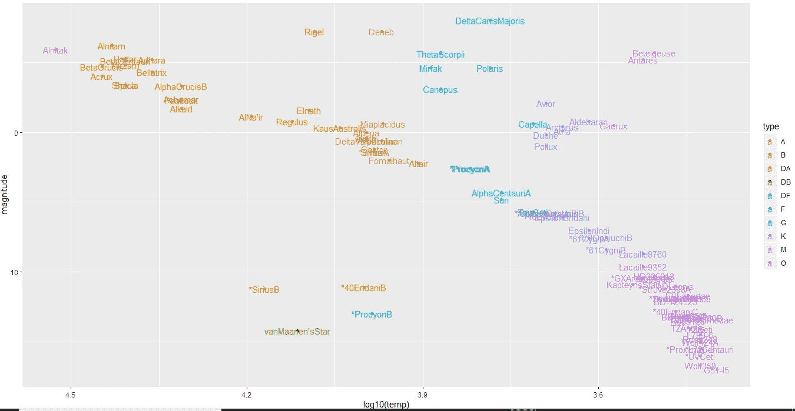
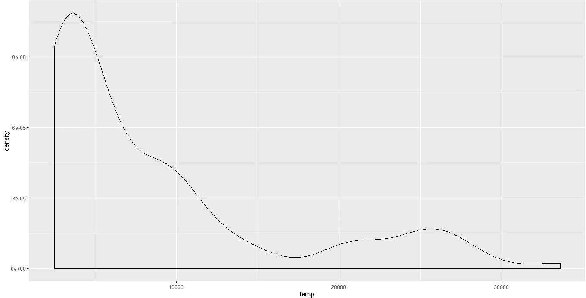
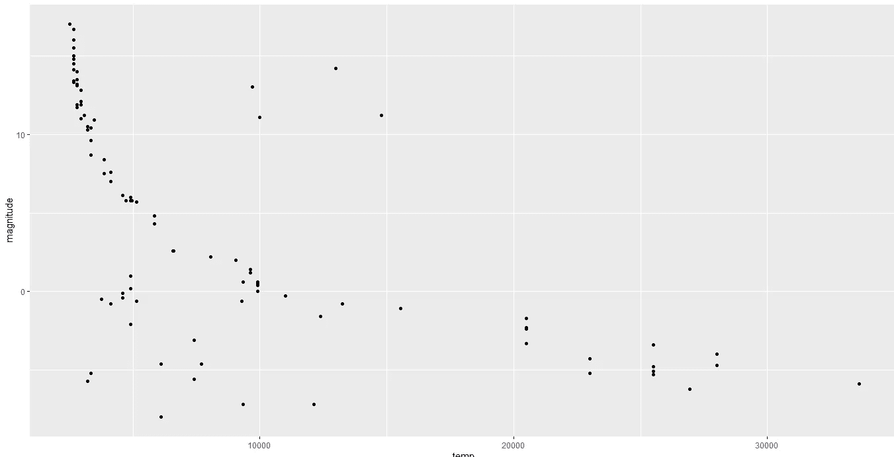
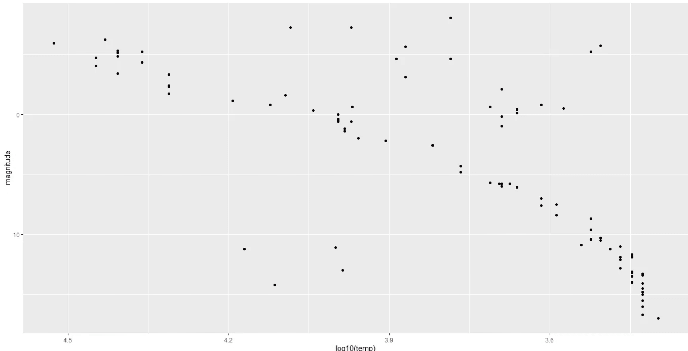
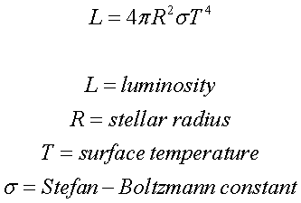
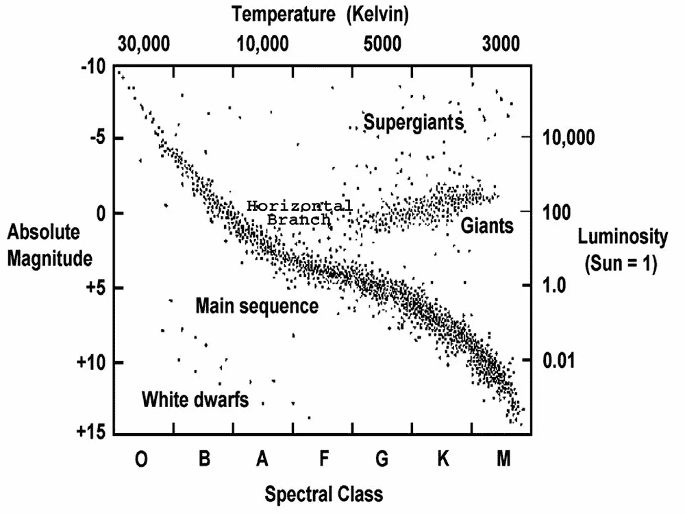
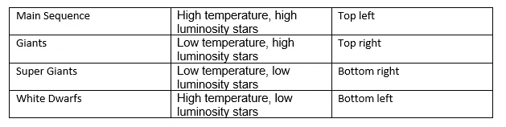
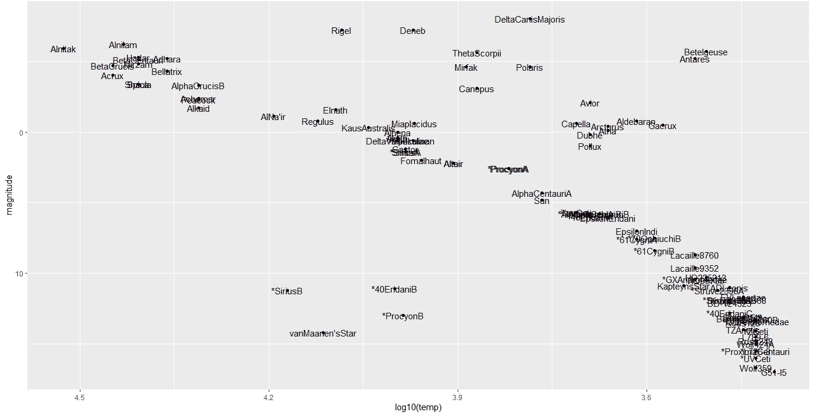

# 天文学，恒星和数据

> 原文：<https://towardsdatascience.com/of-astronomy-stars-and-data-6fb347045a4a?source=collection_archive---------32----------------------->

## H-R 图上恒星分布的数据驱动解释

# **女性电脑**

天文学是最古老的、数据驱动的科学之一。19 世纪后期出现了“天体照相术”，这是一种用来捕捉和创建天体、天体事件和夜空区域的照相底片数据库的摄影技术。

早在 1875 年，哈佛大学天文台就开始雇佣越来越多的女性助手(尽管这一决定更多的是从经济角度而非伦理角度)来研究玻璃盘子。这些女性每周工作六天，对这些盘子上的数据进行分类、计算和解释，从而绘制出宇宙地图。


来源:[https://commons . wikimedia . org/wiki/File:天文学家 _ Edward _ Charles _ Pickering % 27s _ 哈佛 _ 计算机. jpg](https://commons.wikimedia.org/wiki/File:Astronomer_Edward_Charles_Pickering%27s_Harvard_computers.jpg)

随着使用现代仪器产生大量数据，天文学变得比以往任何时候都更受数据驱动。在处理来自 R 的“dslabs”包的“恒星”数据集时，我遇到了一个有趣的练习，分析一组真实的天文数据，以检查恒星的属性，它们所属的不同类别，它们的表观和绝对星等，光谱类型和表面温度。

一点恒星演化的背景知识和对恒星进行研究和分类的基本属性将进一步帮助理解这项工作。

# **视在和绝对星等(亮度)**

考虑两种光源——手里的手电筒和远处某个点的街灯。从表面上看，人们会得出这样的结论:我们手中的手电筒比远处的路灯更亮。本质上，这个问题转化为恒星亮度。随意看一眼星星并不能帮助揭示这颗星星是附近发光的灰烬还是远处的大灯塔。为了区分一颗恒星看起来有多亮和它实际上有多亮，天文学家使用了表观星等和绝对星等的测量方法。

顾名思义，视亮度是地球上的观测者看到的一颗恒星的相对亮度，而绝对亮度是所有恒星都神奇地放置在相同的标准距离时观测者看到的亮度。

测量表观亮度的一种方法是以每秒的照片数为单位。一个更方便的方法是用一颗突出的亮星与实际恒星的比率来表示。天狼星是最亮的恒星，视星等为-1.46，而肉眼可见的最暗的恒星的星等约为 6。

恒星的表观亮度主要取决于两个因素:

1.实际亮度

2.离地球的距离

另一方面，绝对星等反映了恒星发出的真实光量。因此，我们把这个值表示为恒星的光度。

# **光谱等级和表面温度**

亨利·德雷珀在 1872 年第一个拍摄了恒星光谱。哈佛大学的“女性电脑”随后实现了他拍摄并记录天空中所有明亮星星的梦想。光谱等级很快就根据温度进行了排列，并按照从热到冷的顺序用字母命名——O、B、A、F、G、K 和 M。O 型恒星的最高表面温度可高达 30，000 开尔文，M 型恒星的温度可高达 3，000 开尔文。

让我们用星形来给数据集中的点着色。这种分类描述了恒星光谱的特性，即不同波长产生的光量。

```
stars %>%
    ggplot(aes(log10(temp), magnitude, col=type)) +
    geom_point() +
    geom_text(aes(label = star)) +
    scale_x_reverse() +
    scale_y_reverse()
```



温度的密度图显示大多数恒星的温度都很低。

```
stars %>%
    ggplot(aes(temp)) +
    geom_density()
```



下面给出的是数据的散点图，x 轴是温度，y 轴是幅度。大多数恒星都遵循递减的指数趋势。这些也被称为主序星，我们稍后会谈到。

```
stars %>%
    ggplot(aes(temp, magnitude)) +
    geom_point()
```



由于各种原因，科学家在绘图时并不总是遵循直接的约定，天文学家通常在绘图前转换恒星光度和温度的值。我们将翻转 y 轴，使较低的量值向轴的顶部移动。

```
stars %>%
    ggplot(aes(log10(temp), magnitude)) +
    geom_point() +
    scale_x_reverse() +
    scale_y_reverse()
```



# **赫兹普朗-罗素图**

从斯蒂芬-玻尔兹曼定律，我们知道:



像黑体一样，恒星也发出辐射。因此，我们可以利用上述三个性质(光度、半径和温度)来比较和分类恒星。埃希纳·赫茨普龙和亨利·罗素绘制了现在著名的 H-R 图，它成为现代天文学的基本工具。根据绝对星等绘制光谱分类图，他们发现大多数恒星位于图表中的特定区域。



来源:[https://Chandra . Harvard . edu/edu/formal/variable _ stars/BG _ info . html](https://chandra.harvard.edu/edu/formal/variable_stars/bg_info.html)

明显的空白区域引发了一个问题:恒星是一定会出现在整个图表中，还是只有在特定的温度和光度组合下才会出现？事实证明，除了上面突出显示的四个区域之外，其他区域的恒星很少或根本不存在。

四个主要的起始序列如下:



**主程序**

从左上角到左下角的狭窄的恒星带形成了主序。这些恒星反映了太阳内核中的聚变反应。这个序列中较大的恒星(高光度、高温)经历了快速的聚变反应。因此，恒星在这个序列中的位置越高，它的寿命就越短。而且位置越低，寿命越长。

**巨人**

位于主星序列右上角的星团被称为巨行星。这些恒星大多呈现红色，因为它们的半径大，表面温度低。将所有的氢燃烧成氦后，这些恒星进入了它们生命的最后阶段。

**超级巨人**

超级巨星的半径比红巨星的半径大，散布在主序和巨星的上方。由于它们的质量，氦碳融合过程在这些恒星中发生得更快，因此它们永远不会成为巨星。超级巨星可以把碳融合成氧，氧融合成氖，氖融合成镁，镁融合成硅，最后，硅融合成铁。有了铁核，超级巨星最终会死于超新星爆炸。根据恒星的原始质量，结果可能是中子星或黑洞。

**白矮星**

在主序星左下角发现的几颗星星。这些恒星的聚变反应随着碳停止，核心最终开始收缩。外层消散了，剩下的只是恒星的小而冷的核心。白矮星的温度导致黄白色到蓝白色。

由于我们现在可以识别特定的恒星是主序星、红巨星还是白矮星，现在让我们标记我们数据集中的所有恒星，以定位一些特定的恒星。

```
stars %>%
    ggplot(aes(log10(temp), magnitude)) +
    geom_point() +
    geom_text(aes(label = star)) +
    scale_x_reverse() +
    scale_y_reverse()
```



我们知道，超级巨星是温度最低、光度最高的恒星。看上面的图，我们看到参宿四和心宿二是这个数据集中的超级巨星。而范玛宁是样本中最不亮的恒星。

如果你仔细观察这幅图，你会看到太阳出现在主恒星序列中。半人马座阿尔法星也是。

# **恒星演化**

在 H-R 图中有一个地方，恒星正在耗尽它们的核燃料。这被天文学家称为“主序关闭”区域。这组星不包含主序列 O 型星。星团越老，越多的主序星会消失。它们会变成巨人、白矮星或超级巨人。这里可以得出的一个重要结论是

> H-R 图可以作为测定一起形成的恒星群的工具。

这是一个极其重要的应用，使天文学家能够进一步探测星系中恒星的年龄。