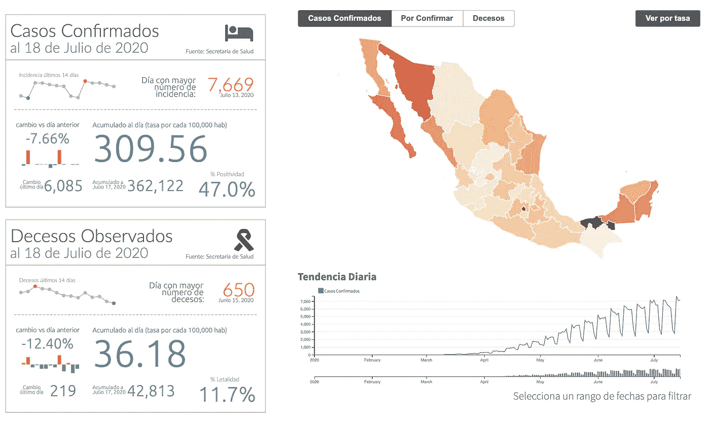

# 仪表板和深入地图

> 原文：<https://towardsdatascience.com/of-dashcards-and-drill-down-maps-d892d145b10d?source=collection_archive---------56----------------------->

## 语境为王

## 为什么，在数据可视化的世界里，上下文才是王道。

几个月来，我们都接触到不断更新的可怕记录，疫情冠状病毒已经并继续在世界各地传播。病例数上升，死亡率上升，感染率上升，一些曲线达到峰值，另一些曲线变平。无论你如何分割，或者如何呈现，这幅画面都相当严峻。然而，在建立我们对新型冠状病毒在世界各个角落的影响的理解时，重要的是要记住，在数据可视化的世界中，上下文是王道。上下文有助于建立理解。

我第一次读到“*语境为王*”这句话是在[的博客文章](http://qlikdork.com/2019/02/actionable-intelligence/)中，作者是[道尔顿·二如](https://twitter.com/qlikdork)，又名*qlikkodor*。然后找到了[其他](https://www.linkedin.com/pulse/context-king-data-visualization-effendi-baba) [消息来源](https://www.yellowfinbi.com/blog/2017/03/spoonful-of-context-helps-data-visualization-go-down)详细阐述了这个想法。在任何情况下，它都是仪表板设计的重要组成部分，但今天我打算展示一个例子，说明在视觉效果中添加上下文如何有助于更准确地描述被测绩效。了解我们每天关注的数字背后的含义，无论是在社会问题上还是在商业领域，是什么推动了特定的绩效指标，以及它如何随着时间的推移而发展，将有助于我们做出更好的决策。

我们可以围绕绩效指标提供的上下文类型通常是以下一种或多种:

*   **时间背景**。与之前的可比期间相比如何(即周与周、月与月、工作日与前一周的同一天等)。有时，为了理解当前的数字，了解结果的趋势也很重要。这种趋势可以基于绝对数字，也可以基于一段时间内的变化率。或者两者都有。
*   **可能通过因果关系或相关性与主要 KPI 相关的绩效驱动因素和/或衍生指标**。通常，我们正在监控的指标可能是多个事件发生的结果。例如，由于较高的客流量，商店位置的销售额可能会增加，或者由于高点击率的广告活动，网站流量可能会增加，这又会导致更高的在线销售额。或者，由于更积极的检测，确诊的冠状病毒病例增加，但同时阳性率更高。
*   **位置上下文**。有时，性能也可能与地理位置相关，因此让用户能够在地理环境中探索数据可能有助于更好地理解结果。这是通过使用地图可视化来实现的。
*   **比例语境**。在许多情况下，清楚地了解一个指标相对于另一个指标的比例，可以使其更容易理解，并提供一种方法来执行跨分类维度的比较，如果没有比例性，这些维度可能无法直接进行比较。一个明显的例子是人均国内生产总值*，它允许不同国家的国内生产总值进行比较，否则可能会提供一个误导性的数据。*

*将上述所有内容添加到一个仪表板中似乎是一项令人生畏的任务，但事实并非如此。我们不必将所有类型的上下文提示添加到我们正在监控的所有指标中，只需添加与我们试图传达的内容最相关的信息，这将帮助用户建立对数据的理解，而不会弄乱仪表板和分散对其主要目的的注意力。当有效使用时，上下文将帮助用户避免心算来理解屏幕上的数字，并防止他们对呈现的数据得出错误的结论。*

# *上下文仪表板示例*

*在过去的几周里，我一直致力于构建一个 *Dashcard* 可视化对象，以便于可视化某个 KPI 的上下文，并且是一个易于理解的精简视图。为了建立一个概念证明，我决定使用墨西哥卫生部提供的与冠状病毒疫情相关的数据，这导致了下图所示的交互式仪表板。*

*下面显示的仪表板显示了两个仪表板，一个显示了*确诊病例的数量*，另一个显示了*观察到的死亡人数*。除了显示主要指标(总数)之外，每个仪表板还提供以下上下文提示:*

*   *指标在过去 14 天内的趋势，包括所述时间段内的最高点和最低点*
*   *单日最高纪录，以及该纪录出现的日期*
*   *与前一天相比的变化百分比*
*   *过去 14 天内某一天到下一天的变化率的历史视图(红/绿条)*
*   *前一天发生的事故数量*
*   *到前一天为止累积的事件总数*
*   *衍生指标(分别为阳性率和死亡率)*

*仪表盘还有一个向下钻取的 choropleth 地图，用于显示*位置环境*，并直观地显示各个区域之间的比较情况。当点击一个州时，地图会提供特定于该州的更细粒度的上下文，显示按自治市的细分，以及它们的地理上下文。*

*地图顶部的按钮允许用户通过更改用于比较地图上各区域的测量值(左侧的按钮组)与仪表板进行交互，还可以通过切换视图在绝对数字和以人口(每 10 万人的发病率)显示的数字之间切换，以及由标记为*“Ver por Tasa”*的按钮控制的*比例环境*。您可以看到打开和关闭这种上下文如何描绘出一幅非常不同的画面，从而产生对数据的更好理解。这种切换也会影响显示在两个*仪表板*对象上的主要 KPI。*

*最后，底部有一个趋势视图，允许用户查看所选度量的总体趋势，同时还允许他们放大到特定的时间段。*

*我已经将下面的仪表板作为截图包含在内。如果你喜欢观看互动版本，你可以在这里打开这个演示的主视图[。](https://aftersync.com/covid-19-dashboard-mexico)*

**

# *附加上下文提示*

*上面的概念验证可能仍然受益于我没有机会实现的额外功能，至少现在是这样。例如，我们可能需要在地图上添加一个图例来显示计算区域颜色的比例。此外，地图上的工具提示也可能受益于重新设计，仪表盘中的迷你图也可能受益于一些工具提示。这些功能将很快添加。*

# *关于仪表板*

**

**Dashcard* 对象是我创建的定制设计，使用 [D3.js](https://d3js.org/) 库在服务器端预先呈现，并在用户导航仪表板时在客户端更新。它可通过使用描述可视化元素的[声明性语言](https://en.wikipedia.org/wiki/Declarative_programming)进行配置，类似于 [Vega-Lite](https://vega.github.io/vega-lite/) ，并且元素基于此配置自动对齐，以创建数据的像素完美视图。*

*它的优点是可以适应任何屏幕大小，以保持元素位置和大小的几何精度，还可以动态地重新调整它们，以适应用户与数据交互时显示的新值。*

*希望你已经发现这信息。欢迎在下面发表评论，并在 [Twitter](https://twitter.com/GarciaMMiguel) 或 [LinkedIn](https://www.linkedin.com/in/mikegm) 上与我联系。*

**原载于 2020 年 7 月 23 日 https://aftersync.com***。***