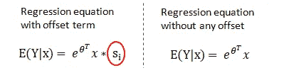
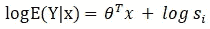
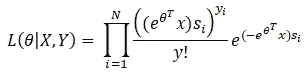
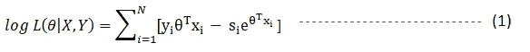
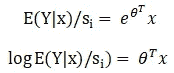
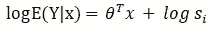
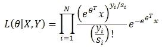
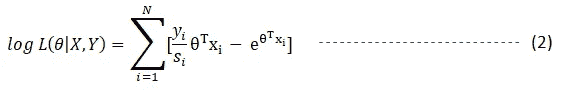
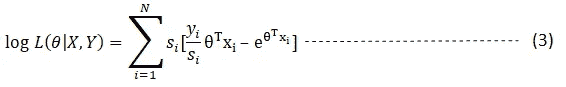

# 模型偏移—实现的逻辑

> 原文：<https://towardsdatascience.com/offsetting-the-model-logic-to-implementation-7e333bc25798?source=collection_archive---------4----------------------->

## 偏移项对 GLMs 和机器学习中建模速率和提升其他模型的重要性


# 背景

在我们的财产和意外险领域，我们经常使用一个称为“补偿”的术语，它广泛用于建模费率(计数/风险),如每个风险单位的索赔数量。这有助于模型通过使用简单的代数将响应变量从速率转换为计数保持系数为 1。

## 但是，我们需要偏移来做这个转换吗？

这个术语可能会让初学者感到困惑，当我第一次介绍这种方法时，我就有这个问题。为什么我们不能通过简单地将计数除以其各自的暴露量来手动导出新的响应变量，而不是使用偏移项？

# 这两种方法的区别是什么？

我将带您浏览两个版本的对数似然函数，有和没有偏移以显示差异，并突出该方法中遵循的任何差异。

需要注意的重要一点是，偏移应包含在与线性预测值相同的“标度”中。在对数链接模型的情况下，这要求在将偏移变量包括在模型中之前记录偏移变量。

## 使用偏移项的模型

这是原始形式的回归模型，其中偏移变量(Si)、响应变量 Y、xi 作为独立变量，一组参数θ可通过最大似然法进行估计。这是通过将曝光变量乘以原始形式来实现的。



此外，我们可以通过对两边取自然对数来简化这个方程



现在，这个等式可以改写为θ的似然函数，如下所示



最后，我们得到第一个版本的对数似然方程(有偏移)，只有依赖于θ的项将保留在方程中，其他项在微分过程中被忽略:



## 无补偿项的模型(使用转换的响应变量)

让我们看看另一种情况，当我们将速率(Yi */si* )建模为响应变量时，这是我们的新模型方程。



同样，我们得出了与第一种情况相同的等式。



那么，有什么区别呢？两个方程看起来一样。

> 在第一种情况下，我们假设 yi(计数响应)遵循泊松分布，而在第二种情况下，我们假设(yi/si)具有泊松分布，**这第二种假设不合适，这使得我们的模型不正确。**

让我们来看看新的可能性函数:



微分时只保留θ相关项后的新方程



现在，我们可以比较对数似然函数(1)和(2)，并观察其差异，这两种方法将产生不同的结果。同样，我们已经看到，第二个方程是基于一个关于泊松分布的错误假设，数据不再是整数。 ***因此，我们可以得出结论，使用一个转换后的速率变量作为响应而没有一个偏移量是不正确的方法*** 。

然而，我们仍然可以通过对每个观察值应用相当于暴露量(si)的权重来修正后一种方法。我们可以看到下面的等式与等式(1)等价。



下面我们通过下面的 R 代码例子来了解一下实现上的区别。类似地，这些也可以在其他建模包中实现，两种方法将给出相同的输出。

```
#Implementation of equation (1) in R
poi_r <- glm(numclaims ~ x1+x2+x3,data=train, family = "poisson", offset=log(exposure))#Implementation of equation (3) in R
poi_r <- glm(numclaims/exposure ~ x1+x2+x3,data=train, family = "poisson", weight = exposure)
```

# offset 的另一种用法

有些情况下，我们已经知道解释变量的影响，与其估计该变量的参数β，不如利用现有信息。

另一种情况是，使用现有的模型输出来提升新模型，例如，您为一个模型训练了 200 次迭代，后来想要从那里重新开始以完成另一个 300 次迭代，而不是从零开始重新开始该过程，您可以提供以前的模型输出作为基本余量或偏移量。

# 各种统计和机器学习包中的偏移实现

这种实现在 R、SAS、徽记(Willis Tower Watson 的特定于保险行业的 GLM 软件)和 stats models(python 中 sci-kit learn 的统计建模对应物)中非常简单和直接，而在机器学习模型中则不太受欢迎。相反，他们在训练新模型之前使用一些函数来设置基础分数，这个基础分数可以从现有模型或任何已知的变量效应中使用。

或者，ML 算法的这一功能可以帮助我们在建模速率时实现偏移。*这种实现在所有情况下都是可能的，其中泊松、伽马和特威迪损失函数已经与 log-link 一起使用。*

# 各种算法中的实现示例

对于 R 中的 GLM，可以使用 Offset()函数来实现偏移，对于 pscl、GBM 和 glmnet 封装，类似的实现也是可能的。

```
poi_r <- glm(numclaims ~ x1+x2+x3,data=train, family = "poisson", offset=log(exposure))
```

Python 中 GLM(stats models)的偏移可以使用 exposure()函数实现，这里需要注意的一点是，这不需要记录变量，函数本身会处理并记录变量。

```
poi_py = sm.GLM(y_train, X_train, exposure = df_train.exposure, family=sm.families.Poisson()).fit()
```

Python 中 XGBOOST 的偏移可以使用 set_base_margin()函数来实现，这需要一个日志变量。在 lightgbm 中，我们可以在训练前使用`set_init_score`()。

```
#Convert training data into DMatrix
dtrain_offset = xgb.DMatrix(data=X_train.iloc[:,2:29],label=y_train)#Before training the model set a base margin into DMatrix  
dtrain_offset.set_base_margin(np.log(X_train['exposure']))
```

# 结论

我们讨论了如何使用偏移变量将泊松回归用于速率建模，以及如何在机器学习模型中实现该功能。这里给出的算法示例并不是一个详尽的列表，读者可以探索其他算法，如基于模型的决策树和神经网络。

感谢阅读！我希望这篇文章对你有所帮助。

# 参考

 [## [1] XGBoost 文档—XGBoost 1 . 1 . 0—快照文档

### XGBoost 是一个优化的分布式梯度增强库，旨在高效、灵活和可移植…

xgboost.readthedocs.io](https://xgboost.readthedocs.io/en/latest/)  [## [2]欢迎阅读 LightGBM 的文档！— LightGBM 2.3.2 文档

### LightGBM 是一个梯度推进框架，使用基于树的学习算法。它被设计成分布式的…

lightgbm.readthedocs.io](https://lightgbm.readthedocs.io/en/latest/) 

[3]邓肯·安德森及其团队，2007 年，广义线性模型实践指南

[4][https://www.statsmodels.org/](https://www.statsmodels.org/)

【https://en.wikipedia.org/wiki/Poisson_regression 